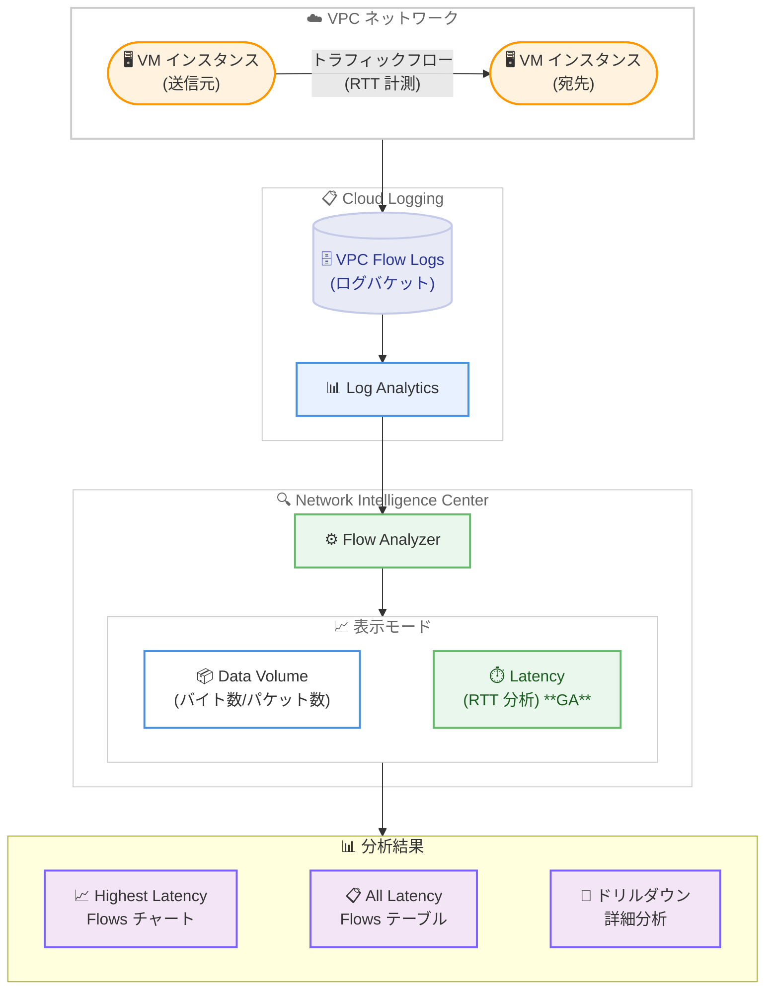

# Network Intelligence Center: Flow Analyzer レイテンシモード GA

**リリース日**: 2026-02-13
**サービス**: Network Intelligence Center
**機能**: Flow Analyzer レイテンシモード
**ステータス**: GA (Generally Available)

[このアップデートのインフォグラフィックを見る](https://takech9203.github.io/google-cloud-news-summary/20260213-network-intelligence-center-flow-analyzer-latency.html)

## 概要

Network Intelligence Center の Flow Analyzer にレイテンシモードが追加され、GA (Generally Available) となった。この機能により、VPC トラフィックフローのラウンドトリップタイム (RTT) を分析できるようになり、ネットワークパフォーマンスの可視化と問題の特定が大幅に容易になる。

Flow Analyzer は VPC Flow Logs のデータを Log Analytics と BigQuery を活用して分析するツールであり、複雑な SQL クエリを記述することなく、5 タプル (送信元 IP、宛先 IP、送信元ポート、宛先ポート、プロトコル) の粒度でトラフィック分析を実行できる。今回のレイテンシモードの GA により、従来のデータボリューム (バイト数・パケット数) 分析に加え、RTT ベースのレイテンシ分析が本番環境で利用可能となった。

この機能は、ネットワーク管理者、クラウドアーキテクト、SRE チームなど、ネットワークパフォーマンスの監視とトラブルシューティングを担当するユーザーを主な対象としている。

**アップデート前の課題**

レイテンシモードが GA になる以前は、以下の課題が存在していた。

- VPC トラフィックフローのレイテンシを分析するには、VPC Flow Logs に対して複雑な SQL クエリを手動で記述する必要があった
- RTT の統計情報 (中央値、P95、P99 など) を体系的に比較・可視化する標準的な手段がなかった
- レイテンシが高いフローの特定とドリルダウン分析を効率的に行う方法が限られていた
- レイテンシモードは Preview 段階であり、本番環境での利用には SLA の保証がなかった

**アップデート後の改善**

今回のアップデートにより、以下の改善が実現した。

- Flow Analyzer のコンソールから表示モードを「Latency」に切り替えるだけで、RTT ベースのレイテンシ分析が可能になった
- Average、Max、Median、P95、P99、Standard deviation の 6 つのランキングメトリクスでフローを並べ替え、レイテンシの高いフローを迅速に特定できるようになった
- GA となったことで SLA の対象となり、本番ワークロードでの利用が公式にサポートされた
- ドリルダウン機能や過去のトラフィックとの比較機能をレイテンシモードでも利用可能になった

## アーキテクチャ図



Flow Analyzer のレイテンシモードは、VPC Flow Logs のデータを Log Analytics 経由で取得し、RTT ベースのレイテンシ分析を提供する。ユーザーは Google Cloud コンソールの Flow Analyzer ページで表示モードを「Latency」に切り替えることで利用できる。

## サービスアップデートの詳細

### 主要機能

1. **RTT ベースのレイテンシ分析**
   - トラフィックフローのラウンドトリップタイム (RTT) を表示・分析する機能
   - メトリクスタイプとして「Round-trip time (median)」を選択して利用
   - 従来のデータボリュームモード (バイト数/パケット数) と切り替えて使用可能

2. **6 種類のランキングメトリクス**
   - Average: 平均レイテンシ (レイテンシスパイクを含む) でフローをソート
   - Max: 最大レイテンシスパイクでフローをソート
   - Median: 中央値レイテンシ (レイテンシスパイクを除外) でフローをソート
   - P95: 95 パーセンタイルレイテンシでフローをソート
   - P99: 99 パーセンタイルレイテンシでフローをソート
   - Standard deviation: レイテンシの変動 (一貫性のなさ) でフローをソート

3. **チャート集約オプション**
   - Highest Latency Flows チャートの計算方法を選択可能
   - Average latency、Max latency、Median latency、P95 latency、P99 latency の 5 つの計算方法を提供
   - ランキングメトリクスに基づいて選択されたデータに適用

4. **サンプリングポイント設定**
   - レポートエンドポイントとして送信元 (Source) または宛先 (Destination) を選択可能
   - レイテンシモードでは送信元・宛先のいずれかを選択する方式

5. **低ボリュームフロー除外オプション**
   - クエリ結果から低ボリュームフローを除外する機能
   - 例: クエリが 1,000 件のログをフィルタリングした場合、1% に設定すると 10 件未満のログしか寄与しないフローを非表示にする
   - 0% に設定するとフィルタリングなしですべてのフローを表示

## 技術仕様

### レイテンシモードのメトリクス

以下の表は、レイテンシモードで利用可能なメトリクスの一覧である。

| 項目 | 詳細 |
|------|------|
| メトリクスタイプ | Round-trip time (median) |
| ランキングメトリクス | Average、Max、Median、P95、P99、Standard deviation |
| チャート集約方法 | Average latency、Max latency、Median latency、P95 latency、P99 latency |
| サンプリングポイント | Source または Destination |
| データソース | VPC Flow Logs (ログバケット内) |
| 分析エンジン | Log Analytics (BigQuery ベース) |

### 必要な IAM ロールと権限

Flow Analyzer はユーザーに代わってデータを読み取るため、ログバケットへの適切な読み取り権限が必要である。

| ロール | 説明 |
|--------|------|
| `roles/logging.viewer` | `_Default` バケットの `_Default` ビューへのアクセス |
| `roles/logging.privateLogViewer` | `_Default` ログバケット内のすべてのログ (データアクセスログを含む) へのアクセス |
| `roles/logging.viewAccessor` | ユーザー定義バケットに保存されたログの読み取り |

カスタムロールを使用する場合は、以下の権限が必要である。

```
logging.buckets.get
logging.buckets.list
logging.logEntries.list
logging.logs.list
resourcemanager.projects.get
```

## 設定方法

### 前提条件

1. Google Cloud プロジェクトが存在し、VPC Flow Logs が有効化されていること
2. VPC Flow Logs を含むログバケットが Log Analytics を使用するようにアップグレードされていること
3. Flow Analyzer ページへのアクセスに必要な IAM ロールが付与されていること

### 手順

#### ステップ 1: VPC Flow Logs の有効化

VPC Flow Logs がまだ有効化されていない場合は、対象のサブネット、VPC ネットワーク、または組織レベルで有効化する。

```bash
# VPC Flow Logs 設定の作成 (VPC ネットワーク単位)
curl -X POST \
  "https://networkmanagement.googleapis.com/v1/projects/PROJECT_ID/locations/global/vpcFlowLogsConfigs?vpc_flow_logs_config_id=CONFIG_NAME" \
  -H "Authorization: Bearer $(gcloud auth print-access-token)" \
  -H "Content-Type: application/json" \
  -d '{
    "network": "projects/PROJECT_ID/global/networks/NETWORK_NAME"
  }'
```

#### ステップ 2: ログバケットの Log Analytics アップグレード

Google Cloud コンソールで Flow Analyzer ページ (https://console.cloud.google.com/net-intelligence/flow-analyzer) にアクセスし、Log Analytics が有効でない場合は「Upgrade」をクリックしてアップグレードする。公式ドキュメントによると、ログバケットのアップグレードと Log Analytics の使用、および Flow Analyzer でのクエリ実行に追加費用は発生しない。

#### ステップ 3: レイテンシモードでの分析実行

1. Google Cloud コンソールで Flow Analyzer ページにアクセスする
2. ソースバケット、時間範囲、トラフィック集約方法を設定してクエリを実行する
3. Display options パネルで表示モードを「Latency」に切り替える
4. Metric type で「Round-trip time (median)」を選択する
5. Rank flows by でランキングメトリクスを選択する
6. 必要に応じて Advanced settings でサンプリングポイントやチャート集約方法を調整する
7. 「Run new query」をクリックして結果を確認する

## メリット

### ビジネス面

- **ネットワーク問題の迅速な特定と解決**: レイテンシが高いフローを即座に特定し、影響を受けるサービスやユーザーへの対応時間を短縮できる
- **SLA 準拠の監視**: GA リリースにより本番環境での利用が公式サポートされ、ネットワークパフォーマンスの SLA 管理に組み込める
- **運用コストの削減**: 複雑な SQL クエリの作成やカスタム監視ツールの構築が不要となり、運用工数を削減できる

### 技術面

- **多角的なレイテンシ分析**: P95、P99、標準偏差など複数の統計指標でレイテンシを評価でき、スパイクの検出やトレンド分析が容易になる
- **SQL 不要の直感的操作**: Google Cloud コンソールの GUI で表示モードを切り替えるだけでレイテンシ分析を実行でき、BigQuery の SQL 知識がなくても利用可能
- **ドリルダウン分析**: レイテンシが高いフローを特定した後、VPC Flow Logs の追加フィールドでさらに詳細な分析が可能
- **過去トラフィックとの比較**: Compare to past 機能により、過去のトラフィックパターンとの比較でレイテンシの変化を把握できる

## デメリット・制約事項

### 制限事項

- VPC Flow Logs が有効化されたサブネットのトラフィックのみが分析対象であり、VPC Flow Logs が無効のサブネットは対象外
- ログバケットが Log Analytics を使用するようにアップグレードされている必要がある
- VPC Flow Logs はサンプリングベースであるため、すべてのフローが記録されるわけではない

### 考慮すべき点

- レイテンシモードのサンプリングポイントは送信元または宛先のいずれかの選択であり、データボリュームモードのように両方の合計や平均を選択するオプションはない
- アライメント期間を短くするとパフォーマンスが低下する可能性があり、長期間のデータに対して短いアライメント期間を設定すると一部のオプションが無効になる
- VPC Flow Logs の生成にはコストが発生する (ログバケットのアップグレードとクエリ実行自体は無料)

## ユースケース

### ユースケース 1: マイクロサービス間のレイテンシ監視

**シナリオ**: GKE 上で稼働するマイクロサービスアーキテクチャにおいて、サービス間通信のレイテンシが増加しているという報告を受けた場合。

Flow Analyzer のレイテンシモードを使用し、Rank flows by を「P95」に設定してクエリを実行する。これにより P95 レイテンシが最も高いフローが上位に表示され、問題のあるサービス間通信を迅速に特定できる。さらにドリルダウン機能で送信元 IP やポートごとの詳細を確認し、特定の Pod やサービスに問題を絞り込む。

**効果**: 従来は VPC Flow Logs に対して複雑な SQL クエリを記述して分析していた作業が、コンソールの操作のみで完結し、トラブルシューティングの所要時間を大幅に短縮できる。

### ユースケース 2: リージョン間通信のパフォーマンス評価

**シナリオ**: マルチリージョン構成のアプリケーションにおいて、リージョン間の通信レイテンシを定期的に監視し、パフォーマンスベースラインを確立したい場合。

Flow Analyzer でフィルタにリージョン情報を設定し、レイテンシモードで Rank flows by を「Median」に設定してクエリを実行する。Standard deviation ランキングを使用してレイテンシの変動が大きいフローも併せて確認する。Compare to past 機能で過去のトラフィックと比較し、レイテンシの変化傾向を把握する。

**効果**: リージョン間通信のレイテンシベースラインを把握し、異常検知の基準値を設定できる。パフォーマンス劣化の早期発見と対応が可能になる。

## 料金

Flow Analyzer でのクエリ実行およびログバケットの Log Analytics アップグレードには追加費用は発生しない (公式ドキュメントに「There are no associated costs or charges to upgrade the log bucket and use Log Analytics and run queries in Flow Analyzer.」と記載)。

ただし、VPC Flow Logs の生成自体には Network Telemetry の料金が適用される。詳細は以下のリンクを参照のこと。

- [Network Telemetry pricing](https://cloud.google.com/vpc/pricing#network-telemetry)
- [Cloud Logging pricing](https://cloud.google.com/stackdriver/pricing#logging-pricing-summary)

### 料金の構成要素

| 項目 | 費用 |
|------|------|
| Flow Analyzer クエリ実行 | 無料 |
| ログバケットの Log Analytics アップグレード | 無料 |
| VPC Flow Logs 生成 | Network Telemetry pricing に基づく |
| Cloud Logging ログ取り込み (50 GiB/月を超過した場合) | $0.50/GiB |
| Cloud Logging ログ保持 (デフォルト保持期間超過後) | $0.01/GiB |

## 利用可能リージョン

Flow Analyzer は VPC Flow Logs が利用可能なすべてのリージョンで使用できる。VPC Flow Logs は Google Cloud のすべての VPC ネットワーク対応リージョンでサポートされている。利用可能リージョンの最新情報は [VPC Flow Logs ドキュメント](https://cloud.google.com/vpc/docs/flow-logs) を参照のこと。

## 関連サービス・機能

- **VPC Flow Logs**: Flow Analyzer のデータソースであり、VPC リソースから送受信されるネットワークフローのサンプルを記録する。Flow Analyzer を利用するには VPC Flow Logs の有効化が前提条件となる
- **Cloud Logging / Log Analytics**: Flow Analyzer は Log Analytics を基盤として構築されており、VPC Flow Logs データに対するクエリを実行する
- **BigQuery**: Log Analytics の基盤エンジンとして機能し、大規模なログデータに対する高速なクエリ処理を提供する。「Explore in Log Analytics」機能で生の SQL クエリを確認・カスタマイズすることも可能
- **Performance Dashboard**: Network Intelligence Center の別モジュールで、ゾーン間のパケットロスとレイテンシを表示する。Flow Analyzer のレイテンシモードとは分析の粒度とアプローチが異なる
- **Connectivity Tests**: Network Intelligence Center の別モジュールで、VPC ネットワークへの接続テストを実行する。Flow Analyzer からも Connectivity Tests を直接実行可能
- **Network Analyzer**: Network Intelligence Center の別モジュールで、VPC ネットワーク構成の自動監視とミスコンフィグレーションの検出を行う
- **Cloud Monitoring**: ネットワークメトリクスのアラート設定と長期的な監視ダッシュボードの構築に使用

## 参考リンク

- [インフォグラフィック](https://takech9203.github.io/google-cloud-news-summary/20260213-network-intelligence-center-flow-analyzer-latency.html)
- [公式リリースノート](https://docs.cloud.google.com/release-notes#February_13_2026)
- [Flow Analyzer 概要ドキュメント](https://cloud.google.com/network-intelligence-center/docs/flow-analyzer/overview)
- [トラフィックフローの分析方法](https://cloud.google.com/network-intelligence-center/docs/flow-analyzer/analyze-traffic-flows)
- [Log Analytics の有効化 (Flow Analyzer)](https://cloud.google.com/network-intelligence-center/docs/flow-analyzer/enable-log-analytics)
- [VPC Flow Logs の設定](https://cloud.google.com/vpc/docs/using-flow-logs)
- [Network Telemetry 料金](https://cloud.google.com/vpc/pricing#network-telemetry)
- [Network Intelligence Center 概要](https://cloud.google.com/network-intelligence-center/docs/overview)

## まとめ

Flow Analyzer のレイテンシモード GA は、Google Cloud のネットワークパフォーマンス監視能力を大幅に強化するアップデートである。VPC トラフィックフローの RTT を GUI ベースで分析でき、P95/P99 などの統計指標やドリルダウン機能を活用した詳細なトラブルシューティングが可能になった。VPC Flow Logs を有効化済みの環境では、追加コストなく Flow Analyzer のレイテンシモードを利用できるため、ネットワークパフォーマンスの可視化・監視の強化を検討しているユーザーは早期に導入を評価することを推奨する。

---

**タグ**: Network Intelligence Center, Flow Analyzer, Latency, RTT, VPC Flow Logs, Network Monitoring, GA
