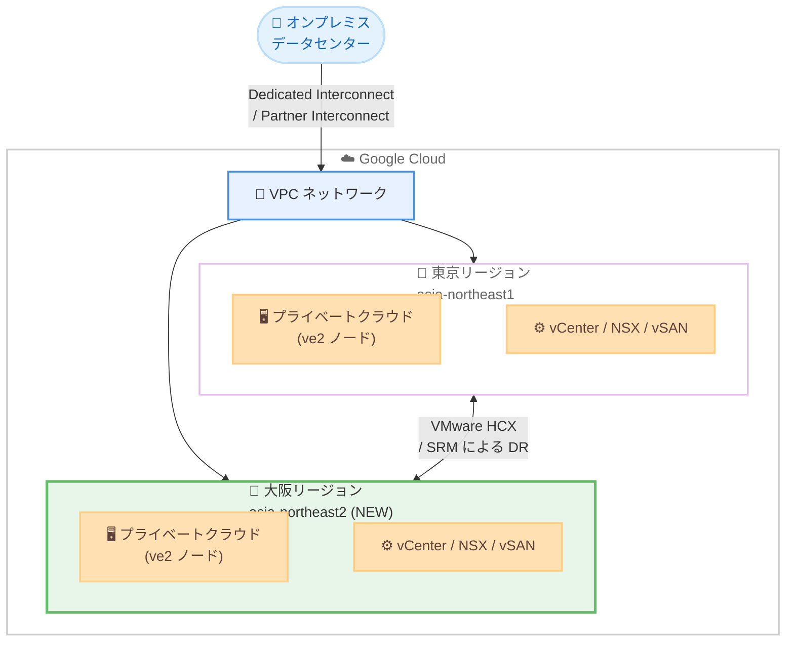

# Google Cloud VMware Engine: ve2 ノードタイプが大阪リージョンで利用可能に

**リリース日**: 2026-02-13
**サービス**: Google Cloud VMware Engine
**機能**: ve2 ノードタイプの大阪リージョン (asia-northeast2) 対応
**ステータス**: Available (リージョン拡張)

[このアップデートのインフォグラフィックを見る](infographic/20260213-vmware-engine-ve2-osaka.html)

## 概要

Google Cloud VMware Engine の ve2 ノードタイプが、大阪リージョン (asia-northeast2) で利用可能になりました。これにより、日本国内では東京リージョン (asia-northeast1) に続き 2 拠点目の ve2 ノード対応リージョンが誕生し、VMware ワークロードを国内の複数リージョンで最新世代のハードウェア上に展開できるようになります。

ve2 ノードファミリーは、ve1 と比較してノードあたり最大 128 vCPU、2,048 GiB メモリ、最大 51.2 TB のストレージを提供する次世代ノードタイプです。ストレージ容量に応じて mega、large、standard、small の 4 つのサブタイプが用意されており、ワークロードの要件に応じた柔軟なサイジングが可能です。

このアップデートは、日本国内でディザスタリカバリ (DR) 構成を構築したい企業や、大阪リージョンに近いユーザーに低レイテンシでサービスを提供したい企業にとって特に重要です。

**アップデート前の課題**

日本国内で ve2 ノードタイプを利用する場合、以下の制約がありました。

- ve2 ノードタイプは東京リージョン (asia-northeast1) でのみ利用可能であり、大阪リージョンでは使用できなかった
- 日本国内で ve2 ノードを用いた DR 構成やマルチリージョン構成を組むことができなかった
- 大阪リージョンで VMware Engine を利用する場合、旧世代の ve1 ノードタイプ (72 vCPU、768 GiB メモリ) に限定されていた

**アップデート後の改善**

今回のアップデートにより、以下の改善が実現しました。

- 大阪リージョン (asia-northeast2) で ve2 ノードタイプが利用可能になり、最大 128 vCPU、2,048 GiB メモリのノードを使用可能
- 東京・大阪の 2 リージョンで ve2 ノードを使用した DR 構成が構築可能に
- 大阪リージョンのユーザーに対して、最新世代ハードウェアによる高性能な VMware 環境を提供可能に

## アーキテクチャ図



東京・大阪の 2 リージョンで ve2 ノードを使用した VMware Engine プライベートクラウドを構成し、VMware HCX や SRM (Site Recovery Manager) による DR 構成を実現できるアーキテクチャを示しています。

## サービスアップデートの詳細

### 主要機能

1. **ve2 ノードファミリーの大阪リージョン対応**
   - 大阪リージョン (asia-northeast2) で ve2 ノードタイプが利用可能に
   - HCI (Hyperconverged Infrastructure) ノードおよびストレージ専用ノードの両方が対象

2. **豊富なノードタイプバリエーション**
   - ve2 ノードファミリーには、ストレージ容量に応じた 4 つのサブタイプ (mega、large、standard、small) が存在
   - 各サブタイプで vCPU 数を 64、80、96、112、128 から選択可能
   - ストレージ専用ノード (ve2-*-so) も利用可能で、ストレージのみの拡張に対応

3. **HCI とストレージ専用ノードの混在クラスタ**
   - 同一ノードファミリー内であれば、HCI ノードとストレージ専用ノードを混在させたクラスタを構成可能
   - 例: ve2-standard-128 と ve2-standard-so を同一クラスタに配置可能

## 技術仕様

### ve2 HCI ノードタイプ一覧

ve2 ファミリーの HCI ノードタイプの仕様は以下の通りです。

| ノードタイプ | vCPU/ノード | メモリ/ノード (GiB) | ストレージ/ノード (TB) |
|-------------|------------|--------------------|--------------------|
| ve2-mega-* | 64 - 128 | 2,048 | 51.2 |
| ve2-large-* | 64 - 128 | 2,048 | 38.4 |
| ve2-standard-* | 64 - 128 | 2,048 | 25.5 |
| ve2-small-* | 64 - 128 | 2,048 | 12.8 |

### ve2 ストレージ専用ノードタイプ一覧

ストレージ専用ノードの仕様は以下の通りです。

| ノードタイプ | ストレージ/ノード (TB) |
|-------------|---------------------|
| ve2-mega-so | 51.2 |
| ve2-large-so | 38.4 |
| ve2-standard-so | 25.5 |
| ve2-small-so | 12.8 |

### ve1 との比較

旧世代の ve1 ノードタイプとの主な違いは以下の通りです。

| 項目 | ve1-standard-72 | ve2-standard-128 |
|------|----------------|------------------|
| vCPU/ノード | 72 | 128 |
| メモリ/ノード (GiB) | 768 | 2,048 |
| ストレージ/ノード (TB) | 19.2 | 25.5 |
| vCPU 選択肢 | 固定 (72) | 64 / 80 / 96 / 112 / 128 |
| ストレージバリエーション | 1 種類 | 4 種類 (mega / large / standard / small) |

**注**: vCPU は論理スレッドを指し、物理コアあたり 2 スレッドです。ストレージはキャッシュを除く Raw ストレージ容量です。

## 設定方法

### 前提条件

1. Google Cloud VMware Engine への API アクセスとノードクォータの取得
2. VMware Engine Service Admin IAM ロールの付与
3. VMware 管理アプライアンスおよび HCX デプロイメントネットワーク用のアドレス範囲の準備

### 手順

#### ステップ 1: 大阪リージョンでプライベートクラウドを作成

```bash
gcloud vmware private-clouds create my-osaka-private-cloud \
  --location=asia-northeast2-a \
  --cluster=my-primary-cluster \
  --node-type-config=type=ve2-standard-128,count=3 \
  --management-range=192.168.0.0/24 \
  --vmware-engine-network=my-vmware-network
```

Google Cloud コンソールからも作成可能です。Private clouds ページで [Create] をクリックし、ロケーションとして大阪リージョンを選択します。

#### ステップ 2: プライベートクラウドへの接続

```bash
# vCenter 認証情報の取得
gcloud vmware private-clouds vcenter credentials describe \
  --private-cloud=my-osaka-private-cloud \
  --location=asia-northeast2-a

# NSX 認証情報の取得
gcloud vmware private-clouds nsx credentials describe \
  --private-cloud=my-osaka-private-cloud \
  --location=asia-northeast2-a
```

Dedicated Interconnect、Partner Interconnect、またはポイントツーサイト VPN を使用して、オンプレミスネットワークからプライベートクラウドに接続します。

## メリット

### ビジネス面

- **日本国内での DR 構成の実現**: 東京・大阪の 2 リージョンで ve2 ノードを使用した DR 構成が可能となり、事業継続性が向上
- **データレジデンシー要件への対応**: 日本国内にデータを保持しながら、複数リージョンでの冗長構成を構築可能
- **低レイテンシなサービス提供**: 西日本地域のユーザーに対して、大阪リージョンから低レイテンシでサービスを提供可能

### 技術面

- **次世代ハードウェアの活用**: ve2 ノードにより、ノードあたり最大 128 vCPU、2,048 GiB メモリの高性能環境を大阪リージョンで利用可能
- **柔軟なサイジング**: 4 つのストレージサブタイプと 5 つの vCPU オプションにより、ワークロードに最適な構成を選択可能
- **ストレージの独立スケーリング**: ストレージ専用ノード (ve2-*-so) を活用することで、コンピュートとストレージを独立にスケール可能

## デメリット・制約事項

### 制限事項

- 同一クラスタ内で異なる HCI ノードタイプを混在させることはできない (例: ve2-standard-128 と ve2-large-128 は同一クラスタに配置不可)
- 異なるノードファミリー (ve1 と ve2) を同一クラスタ内に混在させることはできない
- 大阪リージョンでの Stretched Private Cloud の対応状況は、公式ドキュメントで確認が必要

### 考慮すべき点

- ve2 ノードの料金は ve1 と異なる可能性があるため、料金ページで最新情報を確認すること
- 2025 年 10 月以降、VMware Cloud Foundation (VCF) ライセンスは Broadcom から直接購入する BYOL (Bring Your Own License) モデルに移行しており、新規購入時はライセンス形態に注意が必要
- 大阪リージョンで利用可能な具体的な ve2 ノードタイプのバリエーションについては、Google Cloud の営業チームまたはドキュメントで確認を推奨

## ユースケース

### ユースケース 1: 東京・大阪間の DR 構成

**シナリオ**: 東京リージョンで本番環境の VMware ワークロードを稼働させている企業が、大阪リージョンに DR サイトを構築する。

**実装例**:

```bash
# 東京リージョンのプライベートクラウド (本番)
gcloud vmware private-clouds create prod-tokyo \
  --location=asia-northeast1-a \
  --cluster=prod-cluster \
  --node-type-config=type=ve2-standard-128,count=6 \
  --management-range=10.0.0.0/24 \
  --vmware-engine-network=prod-network

# 大阪リージョンのプライベートクラウド (DR)
gcloud vmware private-clouds create dr-osaka \
  --location=asia-northeast2-a \
  --cluster=dr-cluster \
  --node-type-config=type=ve2-standard-128,count=3 \
  --management-range=10.1.0.0/24 \
  --vmware-engine-network=dr-network
```

**効果**: VMware HCX や SRM を使用して、東京・大阪間でのライブマイグレーションやフェイルオーバーを実現し、RPO/RTO を最小化できる。

### ユースケース 2: 西日本向けのワークロード配置

**シナリオ**: 西日本地域に多くのエンドユーザーを持つ企業が、大阪リージョンに VMware ワークロードを配置してレイテンシを低減する。

**効果**: エンドユーザーに近いリージョンで ve2 ノードの高性能環境を活用することで、ネットワークレイテンシの低減とアプリケーションパフォーマンスの向上が期待できる。

## 料金

VMware Engine の料金はノード単位の時間課金制 (オンデマンド) と、1 年または 3 年の確約利用割引 (CUD) の 2 つのオプションがあります。

### 確約利用割引 (CUD) の概要

CUD はリージョン単位で適用され、VMware Engine ノードの使用量に対して自動的に割引が適用されます。

| コミットメント種別 | 割引率 |
|------------------|--------|
| 1 年 (前払い) | 30% |
| 1 年 (月払い) | 24.4% |
| 3 年 (前払い) | 50% |
| 3 年 (月払い) | 42.5% |

**注意**: 2025 年 10 月以降、新規の CUD 購入は Portable License コミットメントのみ利用可能です。Fully Licensed コミットメントおよび Fully Licensed Convertible コミットメントは販売終了しています。また、ve1 SKU の 3 年 CUD はすべてのリージョンで販売終了しています。

大阪リージョンにおける ve2 ノードの具体的な料金については、[VMware Engine 料金ページ](https://cloud.google.com/vmware-engine/pricing)を参照してください。

## 利用可能リージョン

今回のアップデートにより、ve2 ノードタイプが利用可能な日本国内のリージョンは以下の通りです。

| リージョン | リージョンコード | ve1 対応 | ve2 対応 |
|-----------|----------------|---------|---------|
| 東京 | asia-northeast1 | 対応 | 対応 (2025 年 11 月〜) |
| 大阪 | asia-northeast2 | 確認が必要 | 対応 (2026 年 2 月〜, NEW) |

ve2 ノードが利用可能なリージョンの完全なリストについては、[VMware Engine ノードタイプのドキュメント](https://cloud.google.com/vmware-engine/docs/concepts-node-types)を参照してください。

## 関連サービス・機能

- **VMware HCX**: VMware 環境間でのワークロード移行およびライブマイグレーションを実現するサービス。東京・大阪間の移行に活用可能
- **VMware SRM (Site Recovery Manager)**: DR サイト間のレプリケーションとフェイルオーバーを自動化するサービス
- **Cloud Interconnect**: オンプレミスデータセンターと Google Cloud を専用接続で結ぶサービス。VMware Engine プライベートクラウドへの低レイテンシ接続を実現
- **VPC Service Controls**: VMware Engine で GA サポートされているセキュリティ機能。データ流出と不正アクセスを防止する追加のセキュリティレイヤーを提供
- **外部 NFS データストア**: Filestore や Google Cloud NetApp Volumes を外部 NFS データストアとして使用し、コンピュートとストレージを独立にスケール可能 (2026 年 1 月の機能強化)

## 参考リンク

- [インフォグラフィック](infographic/20260213-vmware-engine-ve2-osaka.html)
- [公式リリースノート](https://cloud.google.com/vmware-engine/docs/release-notes)
- [VMware Engine ノードタイプ ドキュメント](https://cloud.google.com/vmware-engine/docs/concepts-node-types)
- [VMware Engine プライベートクラウド](https://cloud.google.com/vmware-engine/docs/concepts-private-cloud)
- [VMware Engine 料金ページ](https://cloud.google.com/vmware-engine/pricing)
- [VMware Engine 確約利用割引 (CUD)](https://cloud.google.com/vmware-engine/docs/cud)
- [コンピュートのベストプラクティス](https://cloud.google.com/vmware-engine/docs/best-practices-compute)
- [プライベートクラウドの作成](https://cloud.google.com/vmware-engine/docs/create-private-cloud)

## まとめ

Google Cloud VMware Engine の ve2 ノードタイプが大阪リージョン (asia-northeast2) で利用可能になったことで、日本国内で 2 つのリージョンにまたがる高性能な VMware 環境の構築が可能になりました。特に、東京・大阪間での DR 構成や、西日本地域向けの低レイテンシサービス提供を検討している企業にとって重要なアップデートです。VMware Engine を利用中のお客様は、大阪リージョンでの ve2 ノード活用を検討し、[VMware Engine 料金ページ](https://cloud.google.com/vmware-engine/pricing)で最新の料金情報を確認することを推奨します。

---

**タグ**: VMware Engine, ve2, リージョン拡張, 大阪, asia-northeast2, Japan, プライベートクラウド, DR
