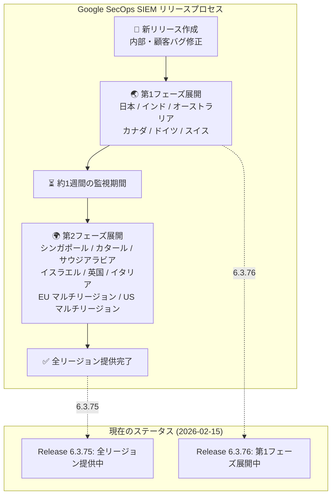

# Google SecOps SIEM: Release 6.3.75 / 6.3.76

**リリース日**: 2026-02-14 / 2026-02-15
**サービス**: Google SecOps SIEM (旧 Chronicle SIEM)
**機能**: メンテナンスリリース 6.3.75 / 6.3.76
**ステータス**: 6.3.75 全リージョン提供開始 / 6.3.76 第1フェーズ展開中

📊 [このアップデートのインフォグラフィックを見る](https://takech9203.github.io/google-cloud-news-summary/20260214-google-secops-siem-release-6-3-75-76.html)

## 概要

Google SecOps SIEM (旧 Chronicle SIEM) の連続メンテナンスリリースが発表された。Release 6.3.75 は 2026 年 2 月 14 日に全リージョンで利用可能となり、Release 6.3.76 は 2026 年 2 月 15 日より第 1 フェーズのリージョンへの展開が開始された。

いずれのリリースも内部バグ修正および顧客報告のバグ修正を含むメンテナンスリリースであり、新機能の追加は含まれていない。Google SecOps SIEM のリリースは段階的なリージョン展開プロセスに従い、まず第 1 フェーズのリージョン (日本、インド、オーストラリア、カナダ、ドイツ、スイス) に展開された後、約 1 週間後に第 2 フェーズのリージョン (シンガポール、カタール、サウジアラビア、イスラエル、英国、イタリア、EU マルチリージョン、US マルチリージョン) に展開される。

セキュリティ運用プラットフォームの安定性と信頼性を維持するための定期的なメンテナンスサイクルの一環であり、Google SecOps を利用する全てのセキュリティチームに影響する。

## アーキテクチャ図

Google SecOps SIEM のリリースは 2 段階のリージョン展開プロセスに従い、第 1 フェーズのリージョンで問題がないことを確認した後、第 2 フェーズのリージョンに展開される。

## サービスアップデートの詳細

### Release 6.3.75 (2026-02-14)

- **ステータス**: 全リージョンで利用可能
- **内容**: 内部バグ修正および顧客報告のバグ修正
- **展開状況**: 第 1 フェーズのリージョンへの展開後、全リージョンへの展開が完了

### Release 6.3.76 (2026-02-15)

- **ステータス**: 第 1 フェーズのリージョンへ展開中
- **内容**: 内部バグ修正および顧客報告のバグ修正
- **展開状況**: 第 1 フェーズのリージョン (日本、インド、オーストラリア、カナダ、ドイツ、スイス) への展開が開始。第 2 フェーズのリージョンへの展開は約 1 週間後を予定

### リリースの連続性

直近のリリース履歴を見ると、Google SecOps SIEM は概ね週次でメンテナンスリリースを行っている。

| リリース | 第1フェーズ展開 | 全リージョン展開 |
|---------|----------------|----------------|
| 6.3.74 | 2026-02-01 頃 | 2026-02-07 |
| 6.3.75 | 2026-02-08 | 2026-02-14 |
| 6.3.76 | 2026-02-15 | 2026-02-22 (予定) |

## 利用可能リージョン

Google SecOps SIEM のリリースは以下の 2 段階で展開される。リリースは通常日曜日に実施され、第 2 フェーズは第 1 フェーズの約 1 週間後にアップグレードされる。

### 第 1 フェーズ (先行展開)

- 日本
- インド
- オーストラリア
- カナダ
- ドイツ
- スイス

### 第 2 フェーズ (後続展開)

- シンガポール
- カタール
- サウジアラビア
- イスラエル
- 英国 (ロンドン)
- イタリア
- EU (マルチリージョン)
- US (マルチリージョン)

自身のインスタンスがどのリージョンに割り当てられているか不明な場合は、Google SecOps の担当者に問い合わせが必要である。

## デメリット・制約事項

### 段階的展開に伴う留意点

- 第 1 フェーズと第 2 フェーズの間で約 1 週間のバージョン差が生じるため、複数リージョンにまたがる運用を行っている場合はバージョンの不一致に注意が必要
- メンテナンスリリースのため、具体的なバグ修正内容の詳細は公開されていない。個別の修正内容については Google SecOps の担当者に確認が必要

## 関連サービス・機能

- **Google SecOps SOAR**: SIEM と同時にリリースされる SOAR (Security Orchestration, Automation, and Response) コンポーネント。同一のリリース番号体系と段階的展開プロセスに従う
- **Google SecOps Response Integrations**: サードパーティ製品との連携を提供するマーケットプレイス統合機能。SOAR プラットフォームのリリースとは別のリリースサイクルで更新される
- **Curated Detections**: Google SecOps に組み込まれたマネージド検出ルールセット。SIEM プラットフォームのリリースとは独立して更新される

## 参考リンク

- 📊 [インフォグラフィック](https://takech9203.github.io/google-cloud-news-summary/20260214-google-secops-siem-release-6-3-75-76.html)
- [Google Cloud Release Notes](https://docs.cloud.google.com/release-notes#February_14_2026)
- [Google SecOps SIEM 概要ドキュメント](https://docs.cloud.google.com/chronicle/docs/overview)
- [Google SecOps リリース展開計画](https://docs.cloud.google.com/chronicle/docs/soar/overview-and-introduction/soar-gradual-release)
- [Google SecOps SOAR リリースノート](https://docs.cloud.google.com/chronicle/docs/soar/release-notes)
- [Google SecOps プラットフォームの理解](https://docs.cloud.google.com/chronicle/docs/secops/understand-the-secops-platform)
- [Google SecOps 料金に関する問い合わせ](https://chronicle.security/contact)

## まとめ

Google SecOps SIEM の Release 6.3.75 および 6.3.76 は、プラットフォームの安定性向上を目的とした定期的なメンテナンスリリースである。新機能の追加は含まれていないが、内部および顧客報告のバグ修正が含まれており、セキュリティ運用の信頼性維持に寄与する。日本リージョンは第 1 フェーズに含まれるため、Release 6.3.76 は既に展開が開始されている。特別な対応は不要だが、展開後にプラットフォームの動作に問題がないことを確認することを推奨する。

---

**タグ**: Google SecOps, SIEM, Security, Chronicle, メンテナンスリリース, バグ修正, 段階的展開
