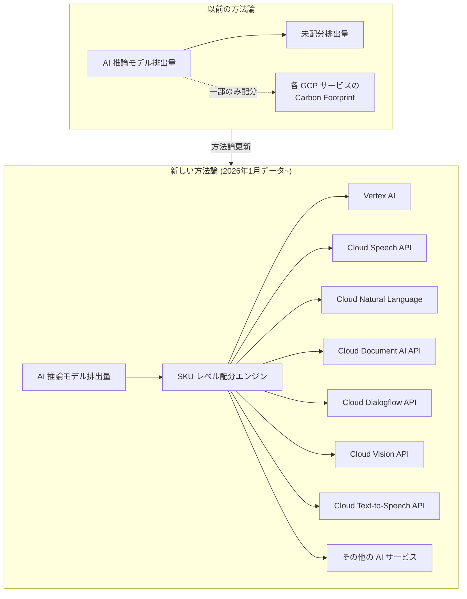

# Carbon Footprint: AI 排出量算定方法論のアップデート

**リリース日**: 2026-02-15
**サービス**: Carbon Footprint
**機能**: AI 推論モデル排出量の SKU レベル配分
**ステータス**: Feature (方法論アップデート)

[このアップデートのインフォグラフィックを見る](https://takech9203.github.io/google-cloud-news-summary/20260215-carbon-footprint-ai-emissions-methodology.html)

## 概要

Google Cloud は、Carbon Footprint の排出量算定モデルを更新し、2026 年 1 月データから AI 推論モデルの排出量を関連する Google Cloud サービスに SKU レベルで配分する方式に移行した。この変更は、2025 年 9 月に発表された技術論文「Measuring the Environmental Impact of Delivering AI at Google Scale」(arXiv: 2508.15734) で提示された包括的な AI エネルギー/排出量フレームワークに基づくものである。

従来、AI 推論モデルに起因する排出量の一部はいずれのサービスにも配分されていなかったが、今回のアップデートにより、これらの排出量が実際に AI 推論を利用している Google Cloud サービスの各 SKU に適切に配分されるようになった。これは実際の排出量が増加したことを意味するのではなく、レポート上の透明性と精度が向上したことを意味する。

主な影響を受けるサービスは Vertex AI であり、その他に Video Stitcher API、Notebooks、Cloud Natural Language、Cloud Speech API、Cloud Document AI API、Cloud Dialogflow API、Cloud Machine Learning Engine、Cloud Text-to-Speech API、Cloud Vision API が対象となる。

**アップデート前の課題**

- AI 推論モデルに起因する排出量の一部が、いずれの Google Cloud サービスにも配分されておらず「未配分」の状態であった
- Carbon Footprint レポートに表示される AI サービスの排出量が、実際のエネルギー消費を正確に反映していなかった
- 顧客が AI ワークロードの環境負荷を正確に把握し、最適化を判断するためのデータが不十分であった

**アップデート後の改善**

- AI 推論モデルの排出量が、SKU レベルの配分方法論に従って関連サービスに適切に配分されるようになった
- Carbon Footprint レポートが AI サービスの実際の環境負荷をより正確に反映するようになった
- 顧客が AI ワークロードの排出量を正確に把握し、サステナビリティ最適化の意思決定に活用できるようになった

## アーキテクチャ図

この図は、従来の方法論では AI 推論モデル排出量の一部が未配分であった状態から、新しい方法論により SKU レベルで各 AI サービスに適切に配分されるようになった変更を示している。

## サービスアップデートの詳細

### 主要機能

1. **AI 推論排出量の SKU レベル配分**
   - 従来未配分だった AI 推論モデルの排出量を、関連する Google Cloud サービスの SKU に配分
   - 配分は Carbon Footprint レポート方法論に記載された SKU レベル配分方式に準拠
   - SKU の使用量 (購入量) とリスト価格に比例した配分方式を採用

2. **包括的な AI エネルギー/排出量フレームワークへの準拠**
   - 技術論文「Measuring the Environmental Impact of Delivering AI at Google Scale」で確立された方法論に基づく
   - ライブプロダクション環境における AI 推論のエネルギー、排出量、水消費量を測定するための包括的なフレームワーク
   - 業界全体でより標準化された測定フレームワークの採用を促進する取り組みの一環

3. **対象サービスへの影響**
   - **主要な影響**: Vertex AI
   - **その他の影響サービス**: Video Stitcher API、Notebooks、Cloud Natural Language、Cloud Speech API、Cloud Document AI API、Cloud Dialogflow API、Cloud Machine Learning Engine、Cloud Text-to-Speech API、Cloud Vision API
   - 排出量の増加はすべての SKU にわたって分散配分される

## 技術仕様

### SKU レベル配分方式

Carbon Footprint の SKU レベル配分は以下の原則に基づいて行われる。

| 項目 | 詳細 |
|------|------|
| 配分の基準 | SKU の使用量 (購入量) とリスト価格 (USD) に比例 |
| 地域差の考慮 | 同一 SKU でもデプロイ先のグリッドカーボン強度に比例して排出量が異なる |
| 整合性の検証 | 全 SKU の合算が内部サービスの総排出量と一致することを確認 |
| 適用開始データ | 2026 年 1 月データ (2026 年 2 月中旬公開) |
| カーボンモデル | 半年ごとの方法論リフレッシュサイクルで更新 |

### 影響を受けるサービスの一覧

| サービス名 | 影響の程度 |
|------------|-----------|
| Vertex AI | 主要な影響 |
| Video Stitcher API | 影響あり |
| Notebooks | 影響あり |
| Cloud Natural Language | 影響あり |
| Cloud Speech API | 影響あり |
| Cloud Document AI API | 影響あり |
| Cloud Dialogflow API | 影響あり |
| Cloud Machine Learning Engine | 影響あり |
| Cloud Text-to-Speech API | 影響あり |
| Cloud Vision API | 影響あり |

### 排出量算定の仕組み

Carbon Footprint は以下の 3 つのスコープで排出量を算定し、今回のアップデートはこの配分方式を AI 推論にも拡大適用するものである。

| スコープ | 対象 |
|----------|------|
| Scope 1 | データセンター内のバックアップ電力用ディーゼル、暖房用天然ガス、HVAC 冷媒からの漏洩 |
| Scope 2 | Google Cloud サービスの電力消費 (ロケーションベースおよびマーケットベース) |
| Scope 3 | データセンター機器のライフサイクル排出量、建物、出張、送配電ロス、燃料の上流排出量 |

## メリット

### ビジネス面

- **ESG レポートの精度向上**: AI サービスの排出量がより正確にレポートされることで、企業のサステナビリティレポート (Scope 3 排出量) の信頼性が向上する
- **サステナビリティ目標の管理改善**: AI ワークロードの環境負荷を正確に把握することで、排出量削減目標の設定と進捗管理がより効果的に行える
- **意思決定の改善**: どの AI サービスがどの程度の排出量を生んでいるかが明確になり、ワークロード最適化の判断材料が充実する

### 技術面

- **排出量データの透明性向上**: 未配分だった AI 推論排出量が適切にサービスごとに可視化される
- **粒度の高い排出量トラッキング**: SKU レベルで排出量が配分されるため、より詳細な分析が可能になる
- **BigQuery エクスポートとの連携**: Carbon Footprint データを BigQuery にエクスポートし、課金データと結合することで、コスト当たりの排出量分析が可能

## デメリット・制約事項

### 制限事項

- 今回の変更により、AI 推論を利用するサービスのレポート上の排出量が増加して表示される (実際の排出量の増加ではなく、レポートの精度向上による)
- 過去データとの単純比較が困難になる可能性がある (方法論の変更による不連続が発生)
- Google Cloud の Carbon Footprint レポートは第三者による検証・保証を受けていない

### 考慮すべき点

- 排出量の増加は報告上の変更であり、実際の環境負荷が増加したわけではないことを、社内のステークホルダーやサステナビリティレポートの読者に適切に説明する必要がある
- BigQuery にエクスポートしている場合、2026 年 1 月データ以降で排出量の傾向に変化が見られるため、ダッシュボードやアラートの閾値の見直しが必要になる可能性がある
- 半年ごとの方法論リフレッシュサイクルに合わせて、今後もデータソースや配分方式が変更される可能性がある

## ユースケース

### ユースケース 1: ESG レポートにおける Scope 3 排出量の報告

**シナリオ**: 企業が年次サステナビリティレポートを作成する際、Google Cloud の利用に伴う Scope 3 排出量を報告する必要がある。

**対応方法**:
1. Carbon Footprint ダッシュボード (Google Cloud Console) でマーケットベースの排出量データを確認
2. BigQuery エクスポートを活用して、プロジェクト別・サービス別・リージョン別の詳細な排出量データを取得
3. 方法論の変更による排出量の増加について、報告書内で適切な注記を付す

**効果**: AI サービスの排出量がより正確に反映されたデータに基づいて、信頼性の高い ESG レポートを作成できる

### ユースケース 2: AI ワークロードの排出量最適化

**シナリオ**: Vertex AI を大規模に利用している組織が、AI 推論ワークロードの環境負荷を削減したい。

**対応方法**:
1. Carbon Footprint データを BigQuery にエクスポートし、Vertex AI の SKU ごとの排出量を分析
2. リージョン別の排出量を比較し、カーボンフリーエネルギー (CFE) の比率が高いリージョンへのワークロード移行を検討
3. モデルの効率化 (量子化、蒸留、プルーニング) による推論コスト削減を通じて排出量を削減

**効果**: 排出量データに基づいた最適化により、環境負荷とコストの両方を削減できる

## 料金

Carbon Footprint 自体は無料で利用できる。ただし、Carbon Footprint データを BigQuery にエクスポートする場合は、BigQuery のストレージおよびクエリに対する標準料金が発生する。

- [Carbon Footprint ドキュメント](https://cloud.google.com/carbon-footprint/docs)
- [BigQuery 料金](https://cloud.google.com/bigquery/pricing)

## 関連サービス・機能

- **[Vertex AI](https://cloud.google.com/vertex-ai)**: 今回の方法論変更で最も大きな影響を受ける AI/ML プラットフォーム
- **[BigQuery Data Transfer Service](https://cloud.google.com/bigquery/docs/dts-introduction)**: Carbon Footprint データの BigQuery エクスポートに使用
- **[Cloud Billing](https://cloud.google.com/billing)**: 課金データと Carbon Footprint データを結合することで、コスト当たりの排出量分析が可能
- **[FinOps Hub](https://cloud.google.com/billing/docs/how-to/finops-hub)**: Carbon Footprint ダッシュボードを統合して表示可能
- **[Cloud Monitoring](https://cloud.google.com/monitoring)**: AI ワークロードのパフォーマンスメトリクスと排出量データを組み合わせた最適化に活用

## 参考リンク

- [インフォグラフィック](https://takech9203.github.io/google-cloud-news-summary/20260215-carbon-footprint-ai-emissions-methodology.html)
- [公式リリースノート](https://cloud.google.com/release-notes#February_15_2026)
- [Carbon Footprint レポート方法論](https://cloud.google.com/carbon-footprint/docs/methodology)
- [Carbon Footprint リリースノート](https://cloud.google.com/carbon-footprint/docs/release-notes)
- [Carbon Footprint 対象サービス一覧](https://cloud.google.com/carbon-footprint/docs/covered-services)
- [Carbon Footprint データの BigQuery エクスポート](https://cloud.google.com/carbon-footprint/docs/export)
- [技術論文: Measuring the Environmental Impact of Delivering AI at Google Scale (arXiv: 2508.15734)](https://arxiv.org/abs/2508.15734)
- [Google Cloud Blog: AI 推論の環境影響測定](https://cloud.google.com/blog/products/infrastructure/measuring-the-environmental-impact-of-ai-inference)
- [Well-Architected Framework: サステナビリティ](https://cloud.google.com/architecture/framework/sustainability)

## まとめ

今回の Carbon Footprint の方法論アップデートは、AI 推論のエネルギー消費と排出量をより正確にレポートするための重要な一歩である。レポート上の排出量数値は増加するが、これは実際の排出量の増加ではなく、より透明性の高い測定方法への移行を反映している。Vertex AI をはじめとする AI サービスを利用している組織は、BigQuery エクスポートデータの分析やダッシュボードの閾値見直しを行い、社内ステークホルダーへの適切な説明を準備することを推奨する。

---

**タグ**: Carbon Footprint, Sustainability, AI, Vertex AI, Emissions, SKU Allocation, ESG, Climate
