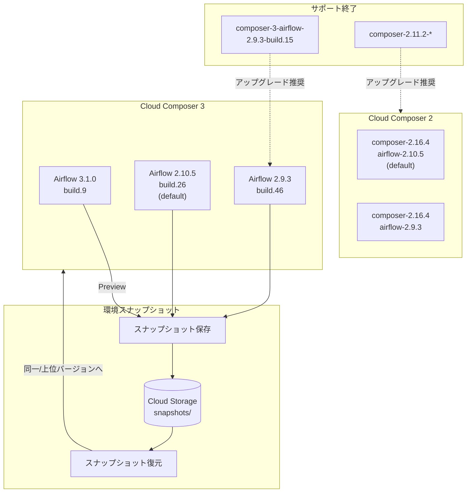

# Cloud Composer: 新ビルドリリースと Airflow 3 環境スナップショット対応

**リリース日**: 2026-02-16
**サービス**: Cloud Composer
**機能**: 新 Airflow ビルド、Airflow 3 環境スナップショット (Preview)
**ステータス**: GA (ビルド) / Preview (Airflow 3 スナップショット)

[このアップデートのインフォグラフィックを見る](https://takech9203.github.io/google-cloud-news-summary/20260216-cloud-composer-airflow3-snapshots.html)

## 概要

2026 年 2 月 16 日、Cloud Composer に複数の重要なアップデートが提供された。Cloud Composer 3 では Airflow 3.1.0 の新ビルド (build.9) を含む 3 つの新ビルドが利用可能になり、Cloud Composer 2 でも 2 つの新イメージがリリースされた。特に注目すべきは、Airflow 3 (Preview) 環境での環境スナップショット機能が Cloud Composer 3 がサポートする全リージョンに展開された点である。

Airflow 3 は Apache Airflow プロジェクトにおけるメジャーバージョンアップグレードであり、Cloud Composer 3 上での Airflow 3.1.0 サポートは、ワークフローオーケストレーションの次世代機能を Google Cloud のマネージド環境で利用できることを意味する。環境スナップショットの Airflow 3 対応により、Airflow 3 環境のバックアップ・リストアやサイドバイサイドの移行が可能になった。

また、composer-3-airflow-2.9.3-build.15 および composer-2.11.2-* がサポート終了 (End of Support) に達しており、これらのバージョンを使用しているユーザーは新しいバージョンへのアップグレードが推奨される。

**アップデート前の課題**

- Airflow 3 (Preview) 環境では環境スナップショットの保存・復元ができなかった (一部リージョンのみ対応)
- Cloud Composer 3 で利用可能な Airflow 3.1.0 のビルドが build.8 までに限られていた
- サポート終了が近いバージョン (composer-3-airflow-2.9.3-build.15、composer-2.11.2-*) の利用者はセキュリティ修正やバグ修正を受けられなくなるリスクがあった

**アップデート後の改善**

- Airflow 3 環境での環境スナップショットが Cloud Composer 3 の全対応リージョンで利用可能になった (Preview)
- 最新のセキュリティ修正とバグ修正を含む新しい Airflow ビルドが利用可能になった
- Cloud Composer 3 ではデフォルトビルドが composer-3-airflow-2.10.5-build.26 に更新され、最新の安定ビルドが自動的に適用される

## アーキテクチャ図



Cloud Composer 3 と Cloud Composer 2 のバージョン構成、環境スナップショットのワークフロー、およびサポート終了バージョンからのアップグレードパスを示す図。

## サービスアップデートの詳細

### 主要機能

1. **Cloud Composer 3 の新 Airflow ビルド**
   - `composer-3-airflow-3.1.0-build.9`: Airflow 3.1.0 の最新ビルド
   - `composer-3-airflow-2.10.5-build.26`: Airflow 2.10.5 の最新ビルド (デフォルト)
   - `composer-3-airflow-2.9.3-build.46`: Airflow 2.9.3 の最新ビルド
   - 各ビルドは Python 3.11.8 を使用

2. **Cloud Composer 2 の新イメージ**
   - `composer-2.16.4-airflow-2.10.5`: デフォルトイメージ
   - `composer-2.16.4-airflow-2.9.3`: Airflow 2.9.3 イメージ

3. **Airflow 3 環境スナップショット (Preview)**
   - Airflow 3 (Preview) を使用する環境で環境スナップショットの保存・復元が可能に
   - Cloud Composer 3 がサポートする全リージョンに展開完了
   - 環境のバックアップ、復元、サイドバイサイド移行に活用可能

4. **バージョン非推奨化・サポート終了**
   - `composer-3-airflow-2.9.3-build.15` がサポート終了
   - `composer-2.11.2-*` の全イメージがサポート終了
   - サポート終了後も環境は動作するが、セキュリティ修正は提供されない

## 技術仕様

### Cloud Composer 3 バージョン一覧 (2026-02-16 リリース)

| ビルド名 | Airflow バージョン | Python | 備考 |
|----------|-------------------|--------|------|
| composer-3-airflow-3.1.0-build.9 | 3.1.0 | 3.11.8 | 最新ビルド |
| composer-3-airflow-2.10.5-build.26 | 2.10.5 | 3.11.8 | 最新ビルド、デフォルト |
| composer-3-airflow-2.9.3-build.46 | 2.9.3 | 3.11.8 | 最新ビルド |

### Cloud Composer 2 イメージ一覧 (2026-02-16 リリース)

| イメージ名 | Airflow バージョン | 備考 |
|-----------|-------------------|------|
| composer-2.16.4-airflow-2.10.5 | 2.10.5 | デフォルト |
| composer-2.16.4-airflow-2.9.3 | 2.9.3 | - |

### 環境スナップショットの仕様

| 項目 | 詳細 |
|------|------|
| 対応バージョン | Cloud Composer 3 (Airflow 3 Preview 含む)、Cloud Composer 2 (2.0.9 以降) |
| 保存データ | Airflow 構成オーバーライド、環境変数、PyPI パッケージリスト、Airflow DB バックアップ、DAGs/data/plugins フォルダ、Fernet キー |
| 保存先 (デフォルト) | 環境バケット内の `snapshots/` フォルダ |
| DB サイズ上限 | 20 GB |
| オブジェクト数上限 | /dags、/plugins、/data フォルダ合計で 100,000 未満 |
| オブジェクト名長制限 | 1,024 文字以内 |
| 復元制約 | 同一または上位バージョンの Airflow にのみ復元可能 |

### バージョンサポートポリシー

| Cloud Composer バージョン | サポート期間 |
|--------------------------|-------------|
| Cloud Composer 3 ビルド | リリース日から 12 ヶ月間 |
| Cloud Composer 2 イメージ | リリース日から 12 ヶ月間 |

### スナップショットの保存コマンド

```bash
# Cloud Composer 3 環境のスナップショットを保存
gcloud composer environments snapshots save \
  ENVIRONMENT_NAME \
  --location LOCATION
```

### スナップショットの復元コマンド

```bash
# スナップショットを Cloud Composer 3 環境に復元
gcloud composer environments snapshots load \
  ENVIRONMENT_NAME \
  --location LOCATION \
  --snapshot-path "SNAPSHOT_PATH"
```

## 設定方法

### 前提条件

1. Cloud Composer API が有効化されたプロジェクト
2. Airflow 3 環境を使用する場合は Cloud Composer 3 環境が必要
3. スナップショットをカスタムバケットに保存する場合、環境のサービスアカウントに Storage Object Admin ロールが必要

### 手順

#### ステップ 1: 新しいビルドで環境を作成

```bash
# Airflow 3.1.0 の最新ビルドで Cloud Composer 3 環境を作成
gcloud composer environments create my-environment \
  --location us-central1 \
  --image-version composer-3-airflow-3.1.0-build.9
```

#### ステップ 2: 既存環境をアップグレード

```bash
# 既存の Cloud Composer 3 環境を最新ビルドにアップグレード
gcloud composer environments update my-environment \
  --location us-central1 \
  --airflow-version 2.10.5-build.26
```

#### ステップ 3: 環境スナップショットの保存

```bash
# 環境のスナップショットを保存
gcloud composer environments snapshots save my-environment \
  --location us-central1

# カスタムロケーションに保存する場合
gcloud composer environments snapshots save my-environment \
  --location us-central1 \
  --snapshot-location gs://my-bucket/snapshots/
```

#### ステップ 4: 環境スナップショットの復元

```bash
# スナップショットを環境に復元
gcloud composer environments snapshots load my-environment \
  --location us-central1 \
  --snapshot-path "gs://us-central1-my-env-bucket/snapshots/2026-02-16T12-00-00"
```

## メリット

### ビジネス面

- **事業継続性の向上**: Airflow 3 環境でもスナップショットによるバックアップ・リストアが可能になり、ワークフロー管理のリスクが低減される
- **移行の柔軟性**: スナップショットを活用した Airflow 2 から Airflow 3 へのサイドバイサイド移行が可能になり、ダウンタイムを最小限に抑えた移行計画を立てられる
- **最新機能の迅速な導入**: 定期的なビルドリリースにより、セキュリティ修正やバグ修正が迅速に提供される

### 技術面

- **Airflow 3 の新機能**: Airflow 3 はメジャーバージョンアップグレードであり、改善されたスケジューラ、新しい UI、より良いタスク管理などの恩恵を受けられる
- **CeleryKubernetes Executor**: Cloud Composer 3 では CeleryKubernetes Executor が使用可能で、Airflow 3 との組み合わせでより効率的なタスク実行が可能
- **自動スケーリング**: Cloud Composer 3 のワーカーは自動スケーリングに対応しており、需要に応じたリソース最適化が行われる

## デメリット・制約事項

### 制限事項

- Airflow 3 サポートは Preview ステータスであり、本番環境での利用は推奨されない場合がある
- スナップショットは同一または上位バージョンの Airflow にのみ復元可能 (例: Airflow 3.1.0 のスナップショットを Airflow 2.10.5 に復元することはできない)
- Airflow データベースのサイズが 20 GB を超える場合、スナップショットを作成できない
- /dags、/plugins、/data フォルダ内のオブジェクト合計数が 100,000 以上の場合、スナップショットを作成できない

### 考慮すべき点

- スナップショットには Fernet キーが含まれるため、Airflow 接続のパスワードなどの機密情報が復号可能になる。Secret Manager の使用が推奨される
- サポート終了バージョン (composer-3-airflow-2.9.3-build.15、composer-2.11.2-*) を使用中の環境は、セキュリティ脆弱性への対応が提供されないため、早急なアップグレードが必要
- Airflow 2 から Airflow 3 への移行には DAG の互換性確認が必要 (Airflow 3 での破壊的変更の確認)

## ユースケース

### ユースケース 1: Airflow 3 への段階的移行

**シナリオ**: 大規模な Airflow 2 環境を運用しており、Airflow 3 の新機能を検証しつつ段階的に移行したい

**実装例**:
```bash
# 1. 現在の Airflow 2 環境のスナップショットを保存
gcloud composer environments snapshots save prod-env \
  --location us-central1

# 2. Airflow 3 の新しい環境を作成
gcloud composer environments create staging-airflow3 \
  --location us-central1 \
  --image-version composer-3-airflow-3.1.0-build.9

# 3. DAG の互換性を確認後、必要な DAG を移行
# (Airflow 2 のスナップショットを Airflow 3 に直接復元する場合は
#  DAG の互換性を事前に確認すること)
```

**効果**: 本番環境に影響を与えずに Airflow 3 の検証が可能。問題が発生した場合もスナップショットから Airflow 2 環境を即座に復元できる

### ユースケース 2: 災害復旧 (DR) とバックアップ戦略

**シナリオ**: Airflow 3 環境のワークフローを定期的にバックアップし、障害発生時に迅速に復旧したい

**実装例**:
```bash
# スケジュールされたスナップショットの設定
# (Cloud Composer 3 ではスケジュールスナップショットの設定も可能)
gcloud composer environments update my-airflow3-env \
  --location us-central1 \
  --cloud-sql-preferred-maintenance-window-day SUNDAY \
  --cloud-sql-preferred-maintenance-window-hour 2
```

**効果**: 定期的なバックアップにより、環境の設定変更やパッケージ更新の失敗時に迅速なロールバックが可能

## 料金

Cloud Composer の料金はバージョンごとに異なる料金モデルが適用される。スナップショットの作成・保存に関連する追加コストは Cloud Storage の料金に準じる。

詳細は [Cloud Composer 料金ページ](https://cloud.google.com/composer/pricing) を参照。

### スナップショット関連コスト

| 項目 | 料金体系 |
|------|----------|
| スナップショット保存 | Cloud Storage の標準料金 (保存容量分) |
| スナップショット操作 (API) | Cloud Composer API クォータ内で無料 |

### API クォータ

| 操作 | クォータ |
|------|---------|
| Save snapshot (プロジェクトあたり) | 5,000 クォータユニット/日、250 クォータユニット/分 |
| Save snapshot (環境あたり) | 2,600 クォータユニット/日 |
| Load snapshot (プロジェクトあたり) | 2,500 クォータユニット/日、150 クォータユニット/分 |
| Load snapshot (環境あたり) | 700 クォータユニット/日 |

## 利用可能リージョン

Airflow 3 環境スナップショットは、Cloud Composer 3 がサポートする全リージョンで利用可能 (2026 年 2 月 16 日時点)。

Cloud Composer 3 の新ビルドは、2026 年 2 月 16 日から開始された新リリースとして全リージョンに段階的にロールアウトされる。

## 関連サービス・機能

- **Cloud Storage**: 環境スナップショットの保存先として使用される。デフォルトでは環境バケット内の `snapshots/` フォルダに保存
- **Secret Manager**: スナップショットにはFernet キーが含まれるため、機密情報の管理には Secret Manager の使用が推奨される
- **Cloud Monitoring**: Cloud Composer 環境の健全性やパフォーマンスの監視に使用
- **Cloud Logging**: Airflow のタスクログ、スケジューラログの管理に使用
- **Apache Airflow 3**: Cloud Composer 3 で Preview サポートされるオープンソースのワークフローオーケストレーションプラットフォーム

## 参考リンク

- [インフォグラフィック](https://takech9203.github.io/google-cloud-news-summary/20260216-cloud-composer-airflow3-snapshots.html)
- [公式リリースノート](https://cloud.google.com/release-notes#February_16_2026)
- [Cloud Composer バージョン一覧](https://cloud.google.com/composer/docs/composer-versions)
- [環境スナップショットの保存と復元 (Composer 3)](https://cloud.google.com/composer/docs/composer-3/save-load-snapshots)
- [Cloud Composer バージョニング概要](https://cloud.google.com/composer/docs/composer-versioning-overview)
- [Cloud Composer 2 から 3 への移行ガイド (スナップショット)](https://cloud.google.com/composer/docs/composer-2/migrate-composer-3)
- [Cloud Composer 料金](https://cloud.google.com/composer/pricing)

## まとめ

今回のアップデートは、Cloud Composer における Airflow 3 エコシステムの成熟を示す重要なリリースである。Airflow 3 環境でのスナップショット機能が全リージョンに展開されたことで、Airflow 3 の Preview 評価がより安全かつ実践的に行えるようになった。Airflow 2 を使用中のユーザーは、サポート終了バージョンからのアップグレードを優先しつつ、Airflow 3 への移行計画を検討することが推奨される。

---

**タグ**: #CloudComposer #Airflow3 #EnvironmentSnapshots #GCP #WorkflowOrchestration #Preview #VersionUpdate
