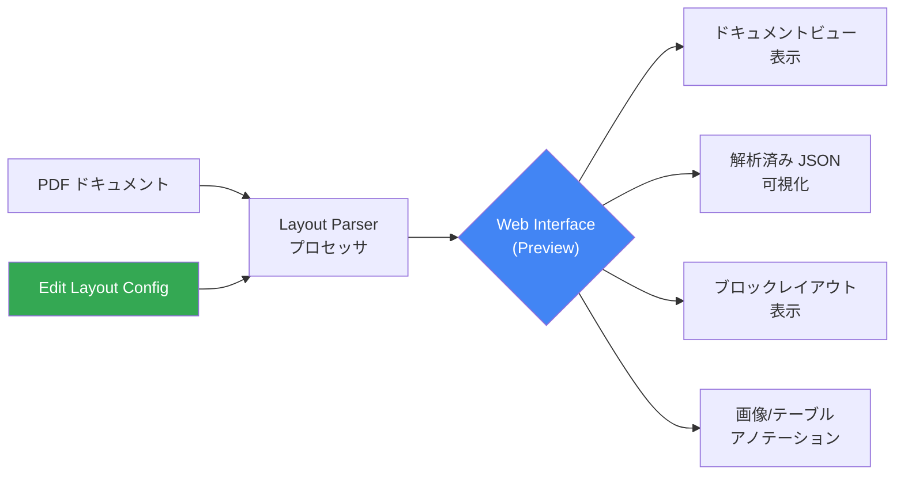

# Document AI: Layout Parser Web Interface (Preview)

**リリース日**: 2026-02-16
**サービス**: Document AI
**機能**: Layout Parser Web Interface
**ステータス**: Preview

[このアップデートのインフォグラフィックを見る](https://takech9203.github.io/google-cloud-news-summary/20260216-document-ai-layout-parser-web-interface.html)

## 概要

Google Cloud Document AI の Layout Parser に、新しい Web インターフェースが Preview として提供開始された。この Web インターフェースにより、処理済み PDF ファイルのドキュメントビュー表示、解析済み JSON の可視化、ブロックレイアウトの確認、画像やテーブルのアノテーションデータの視覚的な確認が、ユーザーフレンドリーなインターフェース上で可能になる。

Layout Parser は、PDF をはじめとするドキュメントからテキスト、テーブル、リストなどの構造要素を抽出し、コンテキストを考慮したチャンクを生成する高度なパーシングサービスである。今回の Web インターフェースの追加により、パース結果の確認作業が大幅に効率化される。特に、検出されたブロックやチャンクを種別ごとに整理して表示する機能や、レイアウト設定をインターフェースから直接編集できる機能が、開発者やドキュメント処理エンジニアの生産性向上に寄与する。

対象ユーザーは、Document AI を利用してドキュメント解析パイプラインを構築している開発者、RAG (Retrieval Augmented Generation) アプリケーションの構築者、及びドキュメント処理の品質確認を行う運用担当者である。

**アップデート前の課題**

Layout Parser の処理結果を確認する際に、開発者は生の JSON 出力を直接解析する必要があり、ドキュメントの構造や解析品質を直感的に把握することが困難だった。

- Layout Parser の出力結果が JSON 形式のみであり、ブロックレイアウトやアノテーションの位置関係を視覚的に確認できなかった
- テーブルや画像のアノテーション機能を有効化する際に、API リクエストのレイアウト設定を手動で構成する必要があった
- 解析結果の品質確認やデバッグ作業に時間がかかり、反復的な調整プロセスが非効率だった

**アップデート後の改善**

Web インターフェースの導入により、Layout Parser の処理結果を直感的に確認・調整できるようになった。

- 処理済み PDF のドキュメントビュー表示により、解析されたブロックやチャンクを種別ごとに整理して視覚的に確認可能になった
- 「Edit Layout Config」機能により、テーブルや画像のアノテーション機能をインターフェースから直接設定できるようになった
- バウンディングボックスの表示により、解析結果の位置精度を視覚的に検証できるようになった (プロセッサバージョン pretrained-layout-parser-v1.0-2024-06-03 のみ対応)

## アーキテクチャ図



Layout Parser Web Interface は、PDF ドキュメントをプロセッサで処理した結果を複数のビューで可視化し、レイアウト設定の編集もインターフェースから直接実行できるワークフローを提供する。

## サービスアップデートの詳細

### 主要機能

1. **ドキュメントビュー表示**
   - 処理済み PDF ファイルのドキュメントビューをインターフェース上で表示
   - 解析されたブロックやチャンクを検出された種別ごとに整理して表示
   - ドキュメントビューは PDF ファイルタイプのみで利用可能

2. **解析結果の可視化**
   - 解析済み JSON データの視覚的な表示
   - ブロックレイアウトの構造表示
   - 画像およびテーブルのアノテーションデータの視覚化

3. **バウンディングボックス表示**
   - 解析結果の位置情報をバウンディングボックスとして表示
   - プロセッサバージョン `pretrained-layout-parser-v1.0-2024-06-03` のみで利用可能
   - 解析精度の視覚的な検証に有用

4. **レイアウト設定のインターフェース編集**
   - 「Edit Layout Config」機能でレイアウト設定を直接編集可能
   - テーブルアノテーション機能の有効化/無効化
   - 画像アノテーション機能の有効化/無効化
   - API リクエストを手動で構成せずにインターフェースから設定変更が可能

## 技術仕様

### プロセッサバージョンと対応機能

| 項目 | 詳細 |
|------|------|
| バウンディングボックス対応バージョン | `pretrained-layout-parser-v1.0-2024-06-03` |
| ドキュメントビュー対応ファイル形式 | PDF のみ |
| 画像/テーブルアノテーション | Edit Layout Config から有効化 |
| ステータス | Preview |

### Layout Parser のプロセッサバージョン一覧

| バージョン | 特徴 |
|-----------|------|
| `pretrained-layout-parser-v1.0-2024-06-03` | バウンディングボックス対応、Web Interface での位置表示に対応 |
| `pretrained-layout-parser-v1.4-2024-08-25` | Gemini layout parser、テーブル認識・読み順精度の向上 |
| `pretrained-layout-parser-v1.5-2025-08-25` | Gemini layout parser、最新のテキスト認識性能 |
| `pretrained-layout-parser-v1.5-pro-2025-08-25` | Gemini layout parser Pro バージョン |

### コンテンツ制限

| 制限事項 | 値 |
|---------|-----|
| 最大画像解像度 (PDF 以外) | 40 メガピクセル (ページ単位) |
| オンライン処理の最大ファイルサイズ | 40 MB |
| バッチ処理の最大ファイルサイズ | 1 GB |
| バッチ処理あたりの最大ファイル数 | 5,000 ファイル |

### Layout Parser の出力構造

```json
{
  "documentLayout": {
    "blocks": [
      {
        "textBlock": {
          "type": "heading",
          "text": "セクションタイトル"
        }
      },
      {
        "tableBlock": {
          "headerRows": [...],
          "bodyRows": [...]
        }
      },
      {
        "textBlock": {
          "type": "paragraph",
          "text": "本文テキスト..."
        }
      }
    ]
  }
}
```

## 設定方法

### 前提条件

1. Google Cloud プロジェクトが作成済みであること
2. Document AI API と Cloud Storage API が有効化されていること
3. 課金が有効化されていること

### 手順

#### ステップ 1: Layout Parser プロセッサの作成

1. Google Cloud コンソールの Document AI セクションで「Processor Gallery」を選択
2. 「Layout parser」を検索し「Create」を選択
3. プロセッサ名を入力 (例: `my-layout-parser`)
4. 最寄りのリージョンを選択
5. 「Create」をクリック

#### ステップ 2: Web Interface でのテスト

1. プロセッサ詳細ページで「Upload Test Document」ボタンをクリック
2. PDF ファイルをアップロード
3. Layout Parser 解析ページに遷移し、検出されたブロックやチャンクを種別ごとに確認
4. (任意) 「Edit Layout Config」を選択して画像やテーブルのアノテーションデータを有効化

#### ステップ 3: バウンディングボックスの確認

バウンディングボックスを表示する場合は、プロセッサバージョンとして `pretrained-layout-parser-v1.0-2024-06-03` を選択する必要がある。

1. 「Manage versions」をクリック
2. Versions テーブルから `pretrained-layout-parser-v1.0-2024-06-03` を選択
3. 「Mark as default」をクリックしてデフォルトバージョンに設定
4. テストドキュメントをアップロードしてバウンディングボックスを確認

## メリット

### ビジネス面

- **ドキュメント処理の品質管理効率化**: 解析結果を視覚的に確認できるため、品質チェックの時間を大幅に短縮できる
- **導入・評価の迅速化**: 技術的な知識が少ないビジネスユーザーでも Layout Parser の解析品質を直感的に評価できる
- **反復的な改善サイクルの高速化**: レイアウト設定をインターフェースから直接変更できるため、設定の試行錯誤が容易になる

### 技術面

- **デバッグ効率の向上**: JSON 出力を手動で解析する必要がなくなり、ブロックレイアウトや位置情報を視覚的に確認できる
- **設定管理の簡素化**: API リクエストのレイアウト設定をコードで管理せずに、インターフェースから直接テーブル・画像アノテーションを設定できる
- **バウンディングボックスによる精度検証**: 解析結果の位置精度をピクセル単位で視覚的に検証できる

## デメリット・制約事項

### 制限事項

- バウンディングボックス表示はプロセッサバージョン `pretrained-layout-parser-v1.0-2024-06-03` のみで利用可能。最新の Gemini layout parser バージョン (v1.4, v1.5) ではバウンディングボックスは表示されない
- ドキュメントビュー表示は PDF ファイルタイプのみに対応。DOCX、PPTX、XLSX、XLSM などの対応ファイルタイプではドキュメントビューは利用不可
- Preview ステータスのため、SLA の対象外であり、本番環境での利用には注意が必要

### 考慮すべき点

- バウンディングボックスを利用したい場合は v1.0 を使用する必要があるが、最新の Gemini layout parser (v1.4/v1.5) の方がテーブル認識や読み順の精度が高い。用途に応じたバージョン選択が必要
- Preview 機能のため、インターフェースの仕様や機能が今後変更される可能性がある

## ユースケース

### ユースケース 1: RAG パイプラインの品質検証

**シナリオ**: 大量の PDF ドキュメントを Layout Parser で処理し、RAG (Retrieval Augmented Generation) パイプラインに投入する前に、解析品質を検証する必要がある。

**効果**: Web Interface のドキュメントビューでブロック単位の解析結果を確認し、テーブルや画像のアノテーション品質を視覚的に検証できる。問題があればレイアウト設定を直接調整し、再処理の前に設定を最適化できる。

### ユースケース 2: ドキュメント解析設定の最適化

**シナリオ**: 金融レポートや契約書など、テーブルや図表を多く含む PDF ドキュメントの解析設定を最適化したい。

**効果**: Edit Layout Config 機能を使用して、テーブルアノテーションや画像アノテーションの有効/無効を切り替えながら、最適な設定を対話的に見つけることができる。JSON 出力の構造を視覚的に確認しながら、チャンクの品質を評価できる。

### ユースケース 3: ドキュメント処理パイプラインのデバッグ

**シナリオ**: BigQuery との連携パイプラインで Document AI Layout Parser を使用しているが、特定のドキュメントタイプで期待通りの結果が得られない。

**効果**: 問題のある PDF を Web Interface にアップロードし、バウンディングボックスやブロックレイアウトを確認することで、解析エラーの原因を特定できる。プロセッサバージョンを `pretrained-layout-parser-v1.0-2024-06-03` に設定すれば、各要素の位置精度をバウンディングボックスで視覚的に検証可能。

## 料金

Document AI の料金はプロセッサの種類と処理ページ数に基づく従量課金制である。Layout Parser の Web Interface 自体に追加料金は発生しないが、ドキュメントの処理にはページ単位の課金が発生する。

詳細な料金体系については [Document AI 料金ページ](https://cloud.google.com/document-ai/pricing) を参照。

## 利用可能リージョン

Document AI Layout Parser は US および EU リージョンで利用可能。プロセッサ作成時に最寄りのリージョンを選択する。詳細は [Document AI のロケーション](https://cloud.google.com/document-ai/docs/regions) を参照。

## 関連サービス・機能

- **Vertex AI RAG Engine**: Layout Parser はドキュメントの解析・チャンク生成に使用され、RAG Engine のベクターデータベースに投入するデータの前処理として重要な役割を果たす
- **BigQuery**: ML.PROCESS_DOCUMENT 関数を通じて Layout Parser と統合し、PDF ドキュメントからの構造化データ抽出と SQL による分析が可能
- **Cloud Storage**: ドキュメントの保存と Layout Parser へのバッチ処理入力に使用される
- **Gemini Layout Parser**: v1.4 以降のプロセッサバージョンでは Gemini の生成 AI 機能を活用し、テーブル認識・読み順・テキスト認識の精度が向上
- **Document AI Monitoring Dashboard**: プロジェクトおよびプロセッサレベルでの処理メトリクス監視が可能 (Preview)

## 参考リンク

- [インフォグラフィック](https://takech9203.github.io/google-cloud-news-summary/20260216-document-ai-layout-parser-web-interface.html)
- [公式リリースノート](https://cloud.google.com/release-notes#February_16_2026)
- [Layout Parser クイックスタート](https://cloud.google.com/document-ai/docs/layout-parse-quickstart)
- [Gemini Layout Parser ドキュメント](https://cloud.google.com/document-ai/docs/layout-parse-chunk)
- [Document AI レスポンスの処理](https://cloud.google.com/document-ai/docs/handle-response)
- [Document AI と BigQuery の連携](https://cloud.google.com/document-ai/docs/big-query-integration)
- [料金ページ](https://cloud.google.com/document-ai/pricing)

## まとめ

Document AI Layout Parser の Web Interface (Preview) は、ドキュメント解析結果の視覚的な確認と設定の対話的な調整を可能にする重要なアップデートである。従来は JSON 出力を手動で解析する必要があった作業が、直感的なインターフェースで完結するようになり、開発者の生産性が大幅に向上する。バウンディングボックス対応が v1.0 バージョンに限定されている点には注意が必要だが、RAG パイプラインやドキュメント処理ワークフローの品質検証・デバッグ用途として早期に活用することを推奨する。

---

**タグ**: #DocumentAI #LayoutParser #WebInterface #Preview #ドキュメント処理 #RAG #PDF解析
