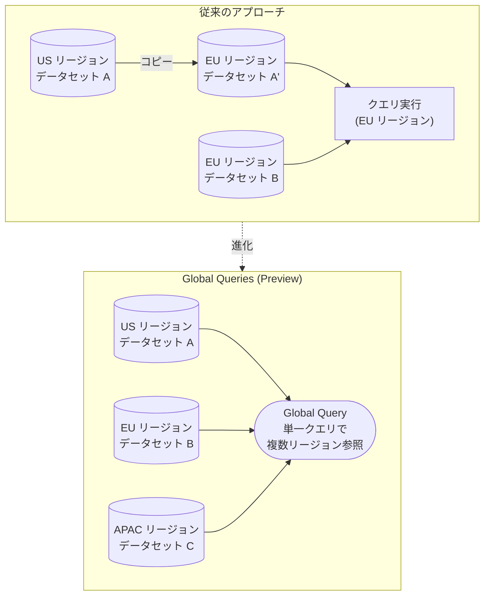

# BigQuery: Global Queries (Preview)

**リリース日**: 2026-02-17
**サービス**: BigQuery
**機能**: Global Queries
**ステータス**: Preview

[このアップデートのインフォグラフィックを見る](https://takech9203.github.io/google-cloud-news-summary/20260217-bigquery-global-queries.html)

## 概要

BigQuery に新たに「Global Queries (グローバルクエリ)」機能が Preview として追加された。この機能により、複数のリージョンに分散して格納されているデータを、単一のクエリで参照できるようになる。従来の BigQuery では、クエリに含まれるすべてのデータセットが同一ロケーション (リージョンまたはマルチリージョン) に存在する必要があったが、この制約が緩和される。

Global Queries は、グローバルに展開する企業にとって大きな価値を持つ機能である。複数の国や地域にデータを分散配置している組織が、リージョン横断的な分析を実行する際に、データのコピーや移動を行うことなく、直接クエリを実行できるようになる。これにより、データパイプラインの簡素化、運用コストの削減、分析のリアルタイム性向上が期待できる。

対象ユーザーは、マルチリージョン環境でデータウェアハウスを運用するデータエンジニア、データアナリスト、Solutions Architect であり、特にデータレジデンシー要件によりデータを特定リージョンに保持しつつグローバルな分析を行いたい組織に最適である。

**アップデート前の課題**

従来の BigQuery では、リージョンとロケーションに関して厳密な制約が存在していた。

- クエリに含まれるすべてのデータセット (読み取り元・書き込み先) が同一ロケーションに存在する必要があり、異なるリージョンのデータセットを JOIN するとエラーが発生した
- シングルリージョンとマルチリージョンの混在も許可されておらず、例えば `US` マルチリージョンのデータセットと `us-central1` のデータセットを同一クエリで参照することもできなかった
- リージョン横断の分析を行うには、BigQuery Data Transfer Service を使用してデータセットを別リージョンにコピーする必要があり、データの重複、コピー遅延、追加のストレージコストが発生していた
- マルチリージョン構成では、データカタログ内で各リージョンごとにカラムポリシーを個別に作成・管理する必要があった

**アップデート後の改善**

- 複数リージョンに格納されたデータを単一のクエリで直接参照可能になり、リージョン間の JOIN やユニオンが実行できるようになった
- データコピーが不要になることで、ストレージの重複コスト、コピージョブの管理オーバーヘッド、データ同期の遅延が解消された
- グローバルな分析クエリをリアルタイムに実行でき、データの鮮度が向上した

## アーキテクチャ図



上図は従来のアプローチと Global Queries の比較を示している。従来はリージョン間でデータをコピーしてからクエリを実行する必要があったが、Global Queries により複数リージョンのデータを直接参照できるようになる。

## サービスアップデートの詳細

### 主要機能

1. **クロスリージョンクエリ実行**
   - 異なるリージョンに格納されたデータセットやテーブルを、単一の SQL クエリで参照可能
   - リージョン間の JOIN、UNION、サブクエリなどの標準的な SQL 操作をサポート

2. **データコピー不要のアーキテクチャ**
   - BigQuery Data Transfer Service によるリージョン間コピーが不要になるケースが増加
   - データの一元管理が可能になり、データガバナンスが簡素化される

3. **グローバル分析の統合**
   - 地理的に分散したデータに対する統合的な分析ビューの構築が容易になる
   - ビジネスインテリジェンスツールからの単一接続でグローバルデータにアクセス可能

## 技術仕様

### ロケーション制約の変更

| 項目 | 従来 | Global Queries (Preview) |
|------|------|--------------------------|
| 同一クエリ内のデータセットロケーション | 全て同一ロケーション必須 | 複数リージョンにまたがるデータセットを参照可能 |
| シングルリージョンとマルチリージョンの混在 | 不可 (エラー) | 参照可能 (Preview) |
| リージョン間データ参照 | BigQuery Data Transfer Service でコピーが必要 | 直接クエリで参照可能 |

### 従来のロケーション制約 (参考)

従来の BigQuery では、以下のようなケースでエラーが発生していた。

```sql
-- 従来: 異なるリージョンのテーブルを JOIN するとエラー
SELECT a.*, b.*
FROM `project.dataset_us.table_a` AS a  -- US リージョン
JOIN `project.dataset_eu.table_b` AS b  -- EU リージョン
ON a.id = b.id;
-- エラー: ロケーションの不一致
```

Global Queries (Preview) では、上記のようなクロスリージョンクエリが実行可能になる。

## 設定方法

### 前提条件

1. Google Cloud プロジェクトで BigQuery API が有効化されていること
2. Preview 機能へのアクセスが許可されていること (Preview の利用条件を確認)
3. クエリ対象のデータセットに対する適切な IAM 権限を保持していること

### 手順

#### ステップ 1: Preview 機能の有効化

```bash
# Preview 機能の利用については、Google Cloud の公式ドキュメントを確認してください
# 通常、Preview 機能はプロジェクト単位で有効化が必要です
```

Preview 機能の詳細な有効化手順については、公式ドキュメントの更新を確認すること。

#### ステップ 2: グローバルクエリの実行

```sql
-- 異なるリージョンのデータセットを単一クエリで参照
SELECT
  us_data.customer_id,
  us_data.order_total,
  eu_data.customer_name,
  eu_data.region
FROM `project.us_dataset.orders` AS us_data
JOIN `project.eu_dataset.customers` AS eu_data
ON us_data.customer_id = eu_data.customer_id;
```

## メリット

### ビジネス面

- **グローバル分析の迅速化**: データコピーの待ち時間なしにリージョン横断分析が可能になり、ビジネス意思決定のスピードが向上する
- **運用コストの削減**: データの重複保持が不要になり、ストレージコストとデータ同期の運用負荷が軽減される
- **コンプライアンスとの両立**: データレジデンシー要件を満たしつつ (データは各リージョンに保持したまま)、グローバルな分析を実行できる

### 技術面

- **アーキテクチャの簡素化**: BigQuery Data Transfer Service によるリージョン間コピーパイプラインの構築・維持が不要になるケースが増える
- **データ鮮度の向上**: コピー遅延がないため、常に最新データに対してクエリを実行できる
- **SQL の標準的な記法**: 特別な構文やツールを使わず、通常の SQL で異なるリージョンのデータを参照可能

## デメリット・制約事項

### 制限事項

- 現在 Preview 段階であり、本番環境での利用には注意が必要 (SLA 対象外の可能性)
- Preview 機能のため、GA までに仕様変更が行われる可能性がある

### 考慮すべき点

- **レイテンシ**: リージョン間のデータ転送が発生するため、同一リージョン内のクエリと比較してレイテンシが増加する可能性がある。特に地理的に離れたリージョン間 (例: US と APAC) ではパフォーマンスへの影響が大きくなる可能性がある
- **料金への影響**: リージョン間のデータ転送料金 (Egress) が発生する可能性がある。従来から BigQuery では、異なるロケーション間の Cloud Storage データ読み取り時にデータ転送料金が課されていたため、同様の料金体系が適用される可能性がある
- **データレジデンシー**: グローバルクエリ実行時にデータが一時的に別のリージョンに転送される可能性があるため、厳密なデータレジデンシー要件がある場合は、データの処理場所について確認が必要
- **スケジュールクエリ**: 従来のスケジュールクエリではクロスリージョンクエリがサポートされていなかったため、Global Queries との互換性について確認が必要

## ユースケース

### ユースケース 1: グローバル EC サイトの売上分析

**シナリオ**: 日本 (asia-northeast1)、ヨーロッパ (europe-west1)、アメリカ (us-central1) にそれぞれリージョンごとの売上データを保持している EC サイトが、グローバルな売上レポートを作成したい場合。

**実装例**:
```sql
-- グローバル売上サマリー (Global Queries)
SELECT
  'Japan' AS region,
  SUM(amount) AS total_sales,
  COUNT(*) AS order_count
FROM `project.asia_dataset.orders`
WHERE order_date = CURRENT_DATE()

UNION ALL

SELECT
  'Europe' AS region,
  SUM(amount) AS total_sales,
  COUNT(*) AS order_count
FROM `project.eu_dataset.orders`
WHERE order_date = CURRENT_DATE()

UNION ALL

SELECT
  'Americas' AS region,
  SUM(amount) AS total_sales,
  COUNT(*) AS order_count
FROM `project.us_dataset.orders`
WHERE order_date = CURRENT_DATE();
```

**効果**: データコピーなしでリアルタイムのグローバル売上レポートが生成可能になり、日次のデータ同期パイプラインが不要になる。

### ユースケース 2: マルチリージョン顧客データの統合分析

**シナリオ**: GDPR 要件により EU の顧客データを EU リージョンに、その他の顧客データを US リージョンに保持しているが、全顧客の行動傾向を横断的に分析したい場合。

**効果**: データレジデンシー要件を維持しつつ、匿名化・集計レベルでのグローバル顧客分析が可能になる。各リージョンにデータを保持したまま、統合的なインサイトを得ることができる。

## 料金

Global Queries (Preview) の具体的な料金体系は、本レポート作成時点では公式に発表されていない。ただし、以下の点に留意する必要がある。

- BigQuery のオンデマンドクエリ料金は、処理されたデータ量 (TiB) に基づいて課金される
- 容量ベース (Editions) の場合は、使用するスロットに基づいて課金される
- リージョン間のデータ転送に伴う追加料金が発生する可能性がある
- 従来の BigQuery Data Transfer Service でのリージョン間コピーでは、標準のストレージ料金とデータ転送料金が適用されていた

料金の詳細は、[BigQuery 料金ページ](https://cloud.google.com/bigquery/pricing)を参照すること。

## 利用可能リージョン

Global Queries (Preview) の対象リージョンに関する詳細は、公式ドキュメントの更新を確認すること。BigQuery 自体は、Americas、Asia Pacific、Europe、Middle East、Africa の各地域で 30 以上のリージョンと US / EU のマルチリージョンで利用可能である。

詳細は [BigQuery ロケーション](https://cloud.google.com/bigquery/docs/locations)を参照。

## 関連サービス・機能

- **BigQuery Data Transfer Service**: 従来のリージョン間データコピー手段。Global Queries によりコピーが不要になるケースが増えるが、データの物理的なレプリケーションが必要な場合は引き続き有用
- **BigQuery Cross-region Dataset Replication**: 災害復旧や高可用性のためのデータセットレプリケーション機能。Global Queries とは目的が異なり、データの冗長性確保に使用
- **BigQuery Omni**: AWS や Azure 上のデータに対して BigQuery からクエリを実行する機能。Global Queries はGoogle Cloud 内のリージョン間、Omni はマルチクラウド間のデータアクセスという位置づけ
- **BigQuery Sharing (旧 Analytics Hub)**: リージョン間でのデータ共有・交換プラットフォーム。Global Queries と組み合わせて使用することで、組織間のデータコラボレーションが強化される

## 参考リンク

- [インフォグラフィック](https://takech9203.github.io/google-cloud-news-summary/20260217-bigquery-global-queries.html)
- [公式リリースノート](https://cloud.google.com/release-notes#February_17_2026)
- [BigQuery ロケーション ドキュメント](https://cloud.google.com/bigquery/docs/locations)
- [BigQuery Data Transfer Service](https://cloud.google.com/bigquery/docs/dts-introduction)
- [BigQuery Cross-region Dataset Replication](https://cloud.google.com/bigquery/docs/data-replication)
- [BigQuery 料金ページ](https://cloud.google.com/bigquery/pricing)

## まとめ

BigQuery Global Queries (Preview) は、BigQuery における長年のリージョン制約を解消する重要な機能アップデートである。従来は同一ロケーション内のデータセットしか参照できなかったクエリが、複数リージョンにまたがるデータを直接参照できるようになり、グローバル企業のデータ分析アーキテクチャを大幅に簡素化する可能性がある。現在 Preview 段階のため本番環境での利用には慎重な評価が必要だが、GA に向けてデータレジデンシー要件、レイテンシ特性、料金体系を把握し、既存のリージョン間データコピーパイプラインの見直しを計画することを推奨する。

---

**タグ**: #BigQuery #GlobalQueries #CrossRegion #Preview #DataAnalytics #MultiRegion
