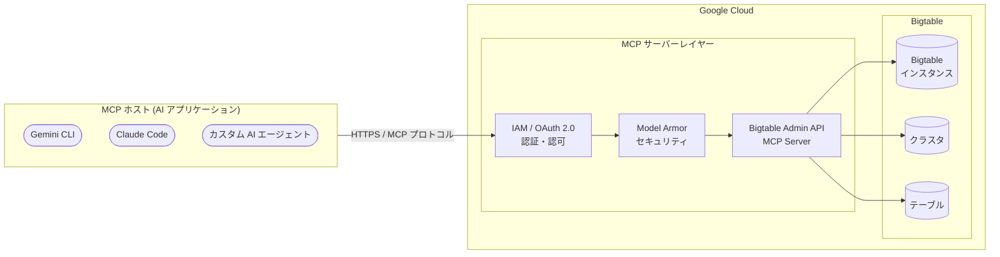

# Bigtable: Admin API MCP Server (Preview)

**リリース日**: 2026-02-17
**サービス**: Bigtable
**機能**: Admin API MCP Server
**ステータス**: Preview

[このアップデートのインフォグラフィックを見る](https://takech9203.github.io/google-cloud-news-summary/20260217-bigtable-admin-api-mcp-server.html)

## 概要

Google Cloud は 2026 年 2 月 17 日に、Bigtable Admin API の MCP (Model Context Protocol) サーバーを Preview としてリリースした。この MCP サーバーにより、AI エージェントや AI アプリケーションが Bigtable に対してインスタンス管理、クラスタ管理、テーブル管理などの幅広いデータ関連の管理タスクを、MCP プロトコルを通じて実行できるようになる。

MCP は Anthropic が開発したオープンソースプロトコルで、LLM (大規模言語モデル) や AI アプリケーションが外部データソースに接続する方法を標準化するものである。Google Cloud は BigQuery、Cloud SQL、Firestore、Compute Engine、GKE、Cloud Logging、Cloud Monitoring などのサービスで既にリモート MCP サーバーを提供しており、今回の Bigtable 対応によって NoSQL データベース管理領域への MCP エコシステムの拡大が実現した。

対象となるのは、Bigtable を運用しているデータベース管理者、AI エージェントを活用した運用自動化を検討しているプラットフォームエンジニア、および Gemini CLI、Claude Code、Gemini Code Assist などの AI ツールから Bigtable インフラストラクチャを管理したい開発者である。

**アップデート前の課題**

このアップデート以前に存在していた課題を以下に示す。

- Bigtable のインスタンスやクラスタを管理するには、Google Cloud Console、gcloud CLI、または Admin API のクライアントライブラリを直接使用してコードを記述する必要があった
- AI エージェントから Bigtable の管理操作を実行するには、Admin API に対するカスタム統合コードの開発が必要であり、MCP のような標準化されたプロトコルは利用できなかった
- 自然言語による Bigtable インフラストラクチャの管理は、各 AI ツールごとに個別のプラグインやアダプターを構築しなければ実現できなかった

**アップデート後の改善**

今回のアップデートにより可能になったことを以下に示す。

- AI エージェントが MCP プロトコルを通じて Bigtable Admin API の機能に直接アクセスし、インスタンスの作成・取得・一覧表示・更新・削除などの管理操作を実行できるようになった
- Gemini CLI、Claude Code、Gemini Code Assist のエージェントモードなど、MCP 対応の AI アプリケーションから標準化されたインターフェースで Bigtable を管理できるようになった
- Google Cloud のリモート MCP サーバー共通の機能である IAM によるきめ細かい認可制御、OAuth 2.0 認証、Model Armor によるセキュリティ保護、監査ログが Bigtable 管理においても利用可能になった

## アーキテクチャ図



AI アプリケーション (MCP ホスト) からのリクエストは、IAM / OAuth 2.0 による認証・認可を経て、オプションの Model Armor セキュリティスキャンを通過した後、Bigtable Admin API MCP サーバーに到達する。MCP サーバーは受信したリクエストを Bigtable Admin API の操作に変換し、インスタンス、クラスタ、テーブルに対する管理操作を実行する。

## サービスアップデートの詳細

### 主要機能

1. **Bigtable Admin API のリモート MCP サーバー**
   - Bigtable Admin API (`bigtableadmin.googleapis.com`) の管理機能を MCP プロトコルで公開
   - Google Cloud インフラストラクチャ上で動作するリモート MCP サーバーとして提供され、HTTPS エンドポイント経由でアクセス可能
   - AI アプリケーションは `tools/list` メソッドでサーバーが提供するツールを自動検出できる

2. **インスタンス・クラスタ管理のエージェント操作**
   - Bigtable Admin API の BigtableInstanceAdmin サービスが提供する管理操作を AI エージェントから実行可能
   - インスタンスの作成 (CreateInstance)、取得 (GetInstance)、一覧 (ListInstances)、更新 (UpdateInstance, PartialUpdateInstance)、削除 (DeleteInstance)
   - クラスタの作成 (CreateCluster)、取得 (GetCluster)、一覧 (ListClusters)、更新 (UpdateCluster, PartialUpdateCluster)、削除 (DeleteCluster)
   - アプリプロファイルの管理 (CreateAppProfile, GetAppProfile, ListAppProfiles, UpdateAppProfile, DeleteAppProfile)

3. **テーブル・ビュー管理のエージェント操作**
   - テーブルスキーマの管理やビューの作成・更新が可能
   - 論理ビュー (LogicalView) およびマテリアライズドビュー (MaterializedView) の作成・取得・更新・削除
   - ホットタブレット (ListHotTablets) の一覧取得によるパフォーマンス調査

4. **エンタープライズ向けセキュリティ・ガバナンス**
   - IAM による細粒度のアクセス制御 (MCP Tool User ロール `roles/mcp.toolUser` による MCP ツール呼び出し権限の管理)
   - OAuth 2.0 認証 (Bigtable Admin 用のスコープ: `https://www.googleapis.com/auth/bigtable.admin` 等)
   - Model Armor によるプロンプトとレスポンスのセキュリティスキャン (オプション)
   - Cloud Audit Logs による一元的な監査ログ記録

## 技術仕様

### MCP サーバーエンドポイント

| 項目 | 詳細 |
|------|------|
| サービス名 | `bigtableadmin.googleapis.com` |
| MCP エンドポイント (推定) | `https://bigtableadmin.googleapis.com/mcp` |
| トランスポート | HTTPS (リモート MCP サーバー) |
| 認証方式 | OAuth 2.0 + IAM |
| ステータス | Preview |

### Bigtable Admin API の主要メソッド

| カテゴリ | メソッド |
|----------|----------|
| インスタンス管理 | CreateInstance, GetInstance, ListInstances, UpdateInstance, PartialUpdateInstance, DeleteInstance |
| クラスタ管理 | CreateCluster, GetCluster, ListClusters, UpdateCluster, PartialUpdateCluster, DeleteCluster |
| アプリプロファイル | CreateAppProfile, GetAppProfile, ListAppProfiles, UpdateAppProfile, DeleteAppProfile |
| テーブル管理 | CreateTable, GetTable, ListTables, ModifyColumnFamilies, DeleteTable |
| ビュー管理 | CreateLogicalView, GetLogicalView, ListLogicalViews, UpdateLogicalView, DeleteLogicalView |
| IAM 管理 | GetIamPolicy, SetIamPolicy, TestIamPermissions |

### 必要な IAM ロール

```json
{
  "required_roles": [
    {
      "role": "roles/serviceusage.serviceUsageAdmin",
      "purpose": "MCP サーバーの有効化"
    },
    {
      "role": "roles/mcp.toolUser",
      "purpose": "MCP ツール呼び出しの実行"
    },
    {
      "role": "roles/bigtable.admin",
      "purpose": "Bigtable リソースへの管理アクセス"
    }
  ],
  "required_permissions": [
    "serviceusage.mcppolicy.get",
    "serviceusage.mcppolicy.update",
    "mcp.tools.call",
    "bigtable.instances.*",
    "bigtable.clusters.*",
    "bigtable.tables.*"
  ]
}
```

## 設定方法

### 前提条件

1. Google Cloud プロジェクトが作成済みであること
2. Bigtable API (`bigtable.googleapis.com`) が有効化されていること
3. 必要な IAM ロール (Service Usage Admin, MCP Tool User, Bigtable Admin) が付与されていること

### 手順

#### ステップ 1: Bigtable Admin API MCP サーバーの有効化

```bash
# Bigtable Admin API の MCP サーバーを有効化
gcloud beta services mcp enable bigtableadmin.googleapis.com \
  --project=PROJECT_ID
```

Bigtable サービスがまだ有効化されていない場合は、先にサービスを有効化するよう促される。

#### ステップ 2: MCP クライアントの設定 (Gemini CLI の例)

```bash
# Gemini CLI 用の拡張機能設定ファイルを作成
mkdir -p ~/.gemini/extensions/bigtable-admin/
```

以下の内容で `~/.gemini/extensions/bigtable-admin/gemini-extension.json` を作成する。

```json
{
  "name": "bigtable-admin",
  "version": "1.0.0",
  "mcpServers": {
    "bigtable-admin": {
      "httpUrl": "https://bigtableadmin.googleapis.com/mcp",
      "authProviderType": "google_credentials",
      "oauth": {
        "scopes": ["https://www.googleapis.com/auth/bigtable.admin"]
      },
      "timeout": 30000,
      "headers": {
        "x-goog-user-project": "PROJECT_ID"
      }
    }
  }
}
```

#### ステップ 3: Claude Code での設定例

```json
{
  "mcpServers": {
    "bigtable-admin": {
      "url": "https://bigtableadmin.googleapis.com/mcp",
      "transport": "http",
      "auth": {
        "type": "google_credentials",
        "scopes": ["https://www.googleapis.com/auth/bigtable.admin"]
      }
    }
  }
}
```

## メリット

### ビジネス面

- **運用効率の向上**: AI エージェントが自然言語の指示に基づいて Bigtable の管理操作を実行できるため、データベース管理の自動化と効率化が加速する
- **スキルギャップの解消**: Bigtable の詳細な API 仕様を熟知していなくても、AI エージェントを通じて管理操作を実行でき、運用チームの対応範囲が拡大する
- **インシデント対応の迅速化**: AI エージェントがリアルタイムでクラスタの状態確認やスケーリング操作を支援することで、障害対応時間の短縮が期待できる

### 技術面

- **標準化されたインターフェース**: MCP プロトコルにより、複数の AI アプリケーションから統一されたインターフェースで Bigtable を管理できる
- **エンタープライズセキュリティ**: IAM、OAuth 2.0、Model Armor、監査ログによる包括的なセキュリティ・ガバナンス基盤が標準で提供される
- **MCP エコシステムとの統合**: BigQuery、Cloud SQL、Firestore、GKE など、他の Google Cloud MCP サーバーと組み合わせたマルチサービスのエージェントワークフローを構築できる

## デメリット・制約事項

### 制限事項

- Preview 機能であるため、本番環境での使用は推奨されない。Pre-GA Offerings Terms が適用され、サポートが限定的である可能性がある
- リモート MCP サーバーのツール、パラメータ、説明、出力は予告なく変更・追加・削除される可能性がある (Google Cloud MCP stability commitment に基づく)
- MCP ツールの出力は非決定的であり、同一の呼び出しでも内容やフォーマットが変わる可能性がある

### 考慮すべき点

- Admin API MCP サーバーは管理操作 (コントロールプレーン) に焦点を当てており、データの読み書き (データプレーン) 操作については別途確認が必要である
- AI エージェントがインスタンスの削除やクラスタの縮小など破壊的な操作を実行する可能性があるため、Human-in-the-Middle (HitM) モードでの運用や IAM による最小権限の原則の適用が重要である
- Agent-Only (AO) モードでの運用はプロンプトインジェクションや意図しないツールチェーンのリスクがあるため、Model Armor の有効化を推奨する

## ユースケース

### ユースケース 1: AI エージェントによる Bigtable クラスタのスケーリング管理

**シナリオ**: トラフィックの急増を検知した場合に、AI エージェントが自動的にクラスタのノード数を調整する。運用チームは自然言語で「us-central1 クラスタのノードを 10 に増やして」と指示するだけで、AI エージェントが適切な API 呼び出しを実行する。

**実装例**:
```
ユーザー: "my-instance の us-central1 クラスタのノード数を確認して、
           必要であれば 10 ノードにスケールアップして"

AI エージェント:
  1. GetCluster でクラスタ情報を取得
  2. 現在のノード数を確認 (例: 5 ノード)
  3. PartialUpdateCluster でノード数を 10 に変更
  4. 変更結果を報告
```

**効果**: 運用担当者が gcloud コマンドや Console の操作手順を把握していなくても、自然言語でインフラストラクチャの変更を安全に実行できる。

### ユースケース 2: マルチサービス AI ワークフローによるデータパイプライン構築支援

**シナリオ**: AI エージェントが Bigtable Admin API MCP サーバーと BigQuery MCP サーバーを組み合わせて、Bigtable インスタンスの構成確認、テーブルスキーマの調査、BigQuery との連携設定の提案を一括で実施する。

**効果**: 複数の Google Cloud サービスにまたがるデータアーキテクチャの設計・構築作業を、AI エージェントが横断的に支援することで、開発者の生産性が向上する。

## 料金

Bigtable Admin API MCP サーバー自体の追加料金についての公式情報は確認できていない。他の Google Cloud MCP サーバー (BigQuery 等) と同様に、MCP サーバーの利用自体は追加料金なしで、基盤となる Bigtable の利用料金が適用されるものと考えられる。

Bigtable の主な料金体系は以下の通りである。

| 項目 | 料金 (概算) |
|------|-------------|
| ノード (SSD) | $0.65/ノード/時間 (オンデマンド、us-central1) |
| SSD ストレージ | $0.17/GB/月 |
| HDD ストレージ | $0.026/GB/月 |
| 1 年 CUD 割引 | ノード料金 20% 割引 |
| 3 年 CUD 割引 | ノード料金 40% 割引 |

詳細は [Bigtable 料金ページ](https://cloud.google.com/bigtable/pricing) を参照。

## 関連サービス・機能

- **Google Cloud MCP サーバーエコシステム**: BigQuery、Cloud SQL、Firestore、Compute Engine、GKE、Cloud Logging、Cloud Monitoring、Resource Manager、Google SecOps など、Google Cloud の多数のサービスがリモート MCP サーバーを提供しており、Bigtable はこのエコシステムに新たに追加された
- **Bigtable Admin API**: MCP サーバーの基盤となる管理 API。インスタンス、クラスタ、テーブル、アプリプロファイルなどのリソース管理を提供する (`bigtableadmin.googleapis.com`)
- **Model Armor**: MCP ツール呼び出しとレスポンスに対するセキュリティスキャンを提供し、プロンプトインジェクションや機密データの漏洩を防止する
- **IAM / MCP Tool User ロール**: `roles/mcp.toolUser` ロールにより、MCP ツールの呼び出し権限 (`mcp.tools.call`) をきめ細かく制御できる
- **MCP Toolbox for Databases**: データベース接続用のオープンソース MCP サーバー。ローカル MCP サーバーとして動作し、リモート MCP サーバーと補完的に使用できる

## 参考リンク

- [このアップデートのインフォグラフィック](https://takech9203.github.io/google-cloud-news-summary/20260217-bigtable-admin-api-mcp-server.html)
- [公式リリースノート](https://cloud.google.com/release-notes#February_17_2026)
- [Bigtable Admin API リファレンス (REST)](https://cloud.google.com/bigtable/docs/reference/admin/rest)
- [Bigtable Admin API リファレンス (RPC)](https://cloud.google.com/bigtable/docs/reference/admin/rpc)
- [Google Cloud MCP サーバー概要](https://cloud.google.com/mcp/overview)
- [Google Cloud MCP サポート対象プロダクト](https://cloud.google.com/mcp/supported-products)
- [MCP サーバーの有効化・無効化](https://cloud.google.com/mcp/enable-disable-mcp-servers)
- [MCP サーバーへの認証](https://cloud.google.com/mcp/authenticate-mcp)
- [AI セキュリティとセーフティ (MCP)](https://cloud.google.com/mcp/ai-security-safety)
- [Bigtable 料金ページ](https://cloud.google.com/bigtable/pricing)

## まとめ

Bigtable Admin API MCP サーバーの Preview リリースは、Google Cloud の MCP エコシステムに NoSQL データベース管理の領域を加える重要なアップデートである。AI エージェントが Bigtable のインスタンス、クラスタ、テーブルを標準化された MCP プロトコルを通じて管理できるようになることで、データベース運用の自動化と効率化が大幅に進展する。Preview 段階であるため、まずは非本番環境で AI エージェントを通じた Bigtable 管理操作を試験的に実施し、IAM による最小権限の設定と Model Armor の有効化を組み合わせた安全な運用パターンの確立を推奨する。

---

**タグ**: #Bigtable #MCP #ModelContextProtocol #AIAgent #AdminAPI #Preview #GoogleCloud #NoSQL #DatabaseManagement
