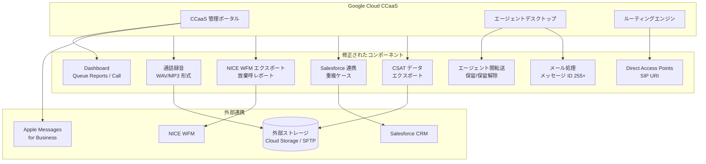

# Google Cloud Contact Center as a Service (CCaaS): 2026年2月バグ修正リリース

**リリース日**: 2026-02-17
**サービス**: Google Cloud Contact Center as a Service (CCaaS)
**機能**: 複数のバグ修正 (ダッシュボード、通話録音、エージェント転送、CRM 連携等)
**ステータス**: Fixed

[このアップデートのインフォグラフィックを見る](https://takech9203.github.io/google-cloud-news-summary/20260217-ccaas-bug-fixes-february.html)

## 概要

Google Cloud Contact Center as a Service (CCaaS) の 2026 年 2 月リリースでは、15 件のバグ修正が含まれている。CCaaS は Google Cloud にネイティブに構築された AI 駆動のコンタクトセンタープラットフォームであり、Gemini Enterprise for CX の一部として、オムニチャネルルーティング、インテリジェント仮想エージェント、Agent Assist、Insights 機能を提供している。

今回の修正は、ダッシュボードの表示不具合、通話録音のファイル形式問題、エージェント間転送時の音声障害、WFM (Workforce Management) エクスポートの精度、Salesforce 連携の重複ケース作成、CSAT データのエクスポート欠落など、コンタクトセンターの運用品質に直接影響する重要な問題を対象としている。

特に、エージェント間転送時の音声途絶、外部ストレージへの録音ファイル形式の不整合、Salesforce 連携での重複ケース作成は、顧客体験とデータの整合性に大きな影響を与える問題であり、CCaaS を本番運用している組織にとって重要なアップデートである。

**アップデート前の課題**

- Dashboard の Queue Reports でテーブルヘッダーが壊れており、キューパフォーマンスの正確な確認が困難だった
- Dashboard の Call ダッシュボードにある LOGGED IN AGENT タイルで指標ラベルが欠落しており、リアルタイム監視に支障をきたしていた
- 通話録音が WAV 形式ではなく MP3 形式で外部ストレージに保存され、設定と異なるファイル形式が生成されていた
- エージェント間転送時に保留/保留解除を行うと、転送先エージェントとエンドユーザー間の音声が途絶していた
- NICE WFM エクスポートでキュー放棄呼が不正確に報告され、ワークフォース管理の判断に誤りが生じる可能性があった
- キューの「Assign Human Agents」ページが空白で表示され、管理者がエージェント割り当てを管理できなかった
- メッセージ ID が 255 文字を超えるメールがメール処理全体をブロックしていた
- In-email ステータスのエージェントが通話やチャットを受信できなかった
- CSAT 評価がメタデータファイルおよびローデータエクスポートから欠落していた
- Salesforce 連携で 1 件のアウトバウンドコールに対して重複ケースが作成されていた
- Apple Messages for Business キューにサポートされていない設定 (Cascade Conditions、Wrap-up settings) が表示されていた
- チャット監視中にバージイン操作で「You are already in Chat」エラーが返されていた
- 写真を確認後にタブを切り替えると「New photo received」バナーが再表示されていた
- スペースや非標準形式の SIP URI で Direct Access Points が正しくルーティングできなかった
- エージェントの個人連絡先名が他のエージェントへの発信者 ID として誤って表示されていた

**アップデート後の改善**

- ダッシュボードの Queue Reports テーブルヘッダーが正常に表示され、キューパフォーマンスを正確に確認できるようになった
- Call ダッシュボードの LOGGED IN AGENT タイルに指標ラベルが正しく表示されるようになった
- 通話録音が設定通りの WAV 形式で外部ストレージに保存されるようになった
- エージェント間転送時の保留/保留解除後も音声が正常に維持されるようになった
- NICE WFM エクスポートでキュー放棄呼が正確に報告されるようになった
- キューの「Assign Human Agents」ページが正常に表示され、エージェント割り当て管理が可能になった
- 255 文字を超えるメッセージ ID のメールでも正常に処理され、他のメール処理がブロックされなくなった
- In-email ステータスのエージェントが通話やチャットを正常に受信できるようになった
- CSAT 評価がメタデータおよびローデータエクスポートに正しく含まれるようになった
- Salesforce 連携でアウトバウンドコール時の重複ケース作成が解消された
- Apple Messages for Business キューにサポートされていない設定が表示されなくなった
- チャット監視中のバージイン操作が正常に完了するようになった
- 写真確認後の「New photo received」バナーの不要な再表示が解消された
- スペースや非標準形式の SIP URI でも Direct Access Points が正しくルーティングされるようになった
- エージェントの個人連絡先名が他のエージェントへの発信者 ID として表示されなくなった

## アーキテクチャ図

この図は、今回のバグ修正が影響する CCaaS プラットフォームの主要コンポーネントと外部連携先を示している。ダッシュボード表示、通話録音、エージェント転送、WFM エクスポート、CRM 連携、メール処理、CSAT データエクスポート、SIP ルーティングの各領域にわたる広範な修正が行われた。

## サービスアップデートの詳細

### 主要機能 (修正カテゴリ別)

1. **通話品質に関する修正**
   - エージェント間転送時に保留/保留解除操作を行った後、転送先エージェントとエンドユーザー間で音声が途絶する問題を修正。コンタクトセンターにおけるエスカレーション処理の信頼性が向上した
   - 通話録音が設定で WAV を指定しているにもかかわらず MP3 形式で外部ストレージに保存されていた問題を修正。CCaaS の通話録音はステレオデュアルチャネル (エンドユーザーがチャネル 1、エージェントがチャネル 2) でサンプルレート 8kHz、16 ビット精度で記録される
   - スペースや非標準形式を含む SIP URI で Direct Access Points (DAP) が通話を正しくルーティングできなかった問題を修正。SIP URI 形式 (`sip:[number]@[domain]`) での DAP 設定が安定した

2. **データエクスポート・レポーティングに関する修正**
   - NICE WFM エクスポートでキュー放棄呼数が不正確に報告されていた問題を修正。WFM システムとの連携で、正確なスタッフィング計画と SLA 分析が可能になった
   - CSAT (顧客満足度) 評価がメタデータファイルおよびローデータエクスポートから欠落していた問題を修正。品質管理レポーティングの完全性が回復した
   - Dashboard の Queue Reports でテーブルヘッダーが壊れていた問題と、Call ダッシュボードの LOGGED IN AGENT タイルで指標ラベルが欠落していた問題を修正

3. **CRM 連携に関する修正**
   - Salesforce 連携で 1 件のアウトバウンドコールに対して重複ケースが作成される問題を修正。CCaaS の Salesforce 連携では、IVR コールの着信時に新しい電話番号の場合は Salesforce にコンタクトを作成し、同一電話番号の複数コンタクトが存在する場合はエージェントウィジェットでコンタクト選択画面を表示する仕組みとなっている
   - Apple Messages for Business キューの設定メニューに、Cascade Conditions や Wrap-up settings などサポートされていない設定が表示されていた問題を修正

4. **エージェントデスクトップ・メール処理に関する修正**
   - メッセージ ID が 255 文字を超えるメールがメール処理全体をブロックしていた問題を修正。メール処理パイプラインの堅牢性が向上した
   - In-email ステータスのエージェントが着信通話やチャットを受信できなかった問題を修正。マルチチャネル対応時のエージェントステータス管理が改善された
   - キューの「Assign Human Agents」ページが空白で表示されていた問題を修正。管理者がエージェント割り当てを正常に管理できるようになった
   - チャット監視中にバージイン操作を行うと「You are already in Chat」エラーが返される問題を修正。スーパーバイザーのリアルタイム介入が正常に機能するようになった
   - 写真を確認後にアクティブなチャットタブ間を切り替えると「New photo received」バナーが再表示される問題を修正
   - エージェントの個人連絡先名が他のエージェントへの通話時に発信者 ID として誤表示される問題を修正

## 技術仕様

### 修正対象のコンポーネント一覧

| カテゴリ | 対象コンポーネント | 影響度 |
|----------|-------------------|--------|
| 通話品質 | エージェント間転送 (保留/保留解除) | 高 - 顧客体験に直接影響 |
| 通話品質 | 通話録音ファイル形式 (MP3/WAV) | 高 - コンプライアンスに影響 |
| 通話品質 | Direct Access Points (SIP URI) | 高 - 通話ルーティングに影響 |
| データ精度 | NICE WFM エクスポート (放棄呼) | 高 - WFM 計画に影響 |
| データ精度 | CSAT 評価エクスポート | 高 - 品質管理に影響 |
| CRM 連携 | Salesforce 重複ケース作成 | 中 - データ整合性に影響 |
| ダッシュボード | Queue Reports テーブルヘッダー | 中 - 監視業務に影響 |
| ダッシュボード | LOGGED IN AGENT 指標ラベル | 中 - 監視業務に影響 |
| メール処理 | メッセージ ID 255 文字超 | 中 - メール処理全体に影響 |
| エージェント状態 | In-email ステータスでの着信 | 中 - マルチチャネル対応に影響 |
| 管理画面 | Assign Human Agents ページ | 中 - エージェント管理に影響 |
| チャット監視 | バージイン操作エラー | 中 - スーパーバイザー機能に影響 |
| UI | New photo received バナー | 低 - エージェント体験に影響 |
| 設定表示 | Apple Messages for Business キュー設定 | 低 - 設定画面の正確性に影響 |
| 表示 | 個人連絡先名の発信者 ID 表示 | 低 - エージェント間通話の表示に影響 |

### 通話録音の仕様

| 項目 | 詳細 |
|------|------|
| 形式 | MP3 または WAV (設定により選択) |
| チャネル | ステレオデュアルチャネル (CH1: エンドユーザー、CH2: エージェント) |
| サンプルレート | 8kHz |
| ビット深度 | 16-bit |
| ビットレート (MP3) | 32 kbps |
| 保存先 | 外部ストレージ (Cloud Storage または SFTP) |
| ファイル名形式 | `call-{id}.mp3` または `call-{id}.wav` |

## メリット

### ビジネス面

- **コンプライアンス対応の強化**: 通話録音が設定通りの WAV 形式で保存されるようになり、規制要件に準拠した録音データの管理が確実になった。業界によっては特定のファイル形式での録音保存が求められるため、この修正は重要である
- **WFM 計画の精度向上**: NICE WFM エクスポートの放棄呼データが正確になることで、スタッフィング計画やキュー構成の最適化判断がより信頼できるものになった
- **顧客満足度分析の改善**: CSAT 評価がエクスポートに正しく含まれるようになり、顧客満足度のトレンド分析や改善施策の効果測定が可能になった
- **CRM データの整合性**: Salesforce 連携での重複ケース作成が解消され、顧客対応履歴の正確性が向上した

### 技術面

- **通話品質の安定化**: エージェント間転送時の音声途絶問題と SIP URI ルーティングの修正により、コールフローの信頼性が向上した
- **メール処理パイプラインの堅牢化**: メッセージ ID 長の制限によるブロッキング問題が解消され、大量メール処理環境での安定性が改善された
- **マルチチャネル対応の改善**: In-email ステータスでの着信受信問題が修正され、オムニチャネル運用時のエージェント稼働率が向上した
- **ダッシュボードの正確性**: リアルタイム監視ダッシュボードの表示問題が解消され、運用監視の信頼性が回復した

## デメリット・制約事項

### 制限事項

- 本リリースはバグ修正のみであり、新機能の追加は含まれていない
- CCaaS のデプロイメントスケジュールに応じて、インスタンスへの反映タイミングが異なる。詳細は [Deployment schedules](https://cloud.google.com/contact-center/ccai-platform/docs/deployment-schedules) を参照
- Advanced Reporting ダッシュボードは us-east1、us-central1、us-west1、europe-west2、asia-northeast1、northamerica-northeast1、australia-southeast1 リージョンでのみ利用可能

### 考慮すべき点

- 通話録音形式の修正後、過去に MP3 で誤保存された録音ファイルは自動的に WAV に変換されない。必要に応じて手動での対応が必要となる可能性がある
- NICE WFM エクスポートの修正により、過去の放棄呼レポートデータとの不一致が生じる可能性がある。WFM システム側でのデータ整合性確認を推奨する
- Salesforce 連携の重複ケース修正後、既存の重複ケースは自動的にマージされない。必要に応じて Salesforce 側でのデータクリーンアップを検討すること

## ユースケース

### ユースケース 1: 大規模コールセンターでの WFM 最適化

**シナリオ**: 数百名規模のエージェントを擁するコールセンターで NICE WFM を使用してスタッフィング計画を行っている。放棄呼データの不正確さにより、必要以上のエージェントを配置していた、あるいは不足が生じていた。

**効果**: 修正後は放棄呼数が正確にレポートされるため、30 分間隔の Queue Interval ダッシュボードと組み合わせて、各時間帯の適正人員配置を精密に計算できる。SLA 達成率の向上とコスト最適化の両立が期待できる。

### ユースケース 2: Salesforce 連携でのアウトバウンドキャンペーン運用

**シナリオ**: 営業チームが CCaaS の Salesforce 連携を使用してアウトバウンドコールキャンペーンを実施している。1 件の通話に対して複数のケースが Salesforce に作成され、データの整理に工数がかかっていた。

**効果**: 重複ケース作成が解消されたことで、アウトバウンドコールごとに正確に 1 つのケースが作成される。営業チームの後処理工数が削減され、CRM データの信頼性が向上する。

### ユースケース 3: コンプライアンス要件のある金融機関での通話録音

**シナリオ**: 金融機関のコンタクトセンターでは規制要件により通話録音を WAV 形式で外部ストレージに保存する必要がある。設定では WAV を指定しているにもかかわらず、実際には MP3 形式で保存されていた。

**効果**: 修正後は設定通り WAV 形式で保存されるため、監査要件を確実に満たすことができる。ステレオデュアルチャネル (エンドユーザーとエージェントを分離) での録音により、品質管理やトレーニングでの活用も容易になる。

## 料金

CCaaS の料金はインスタンスごとの月額課金であり、以下の課金モデルから選択される。

| 課金モデル | 説明 |
|-----------|------|
| 同時接続エージェント | 月間の最大同時ログインエージェント数に基づく課金 |
| 指定エージェント | エージェントロールを持つ最大ユーザー数に基づく課金 |
| 利用時間 | エージェントロールのユーザーがログインしている合計分数に基づく課金 |

テレフォニー料金は利用量に応じて別途課金される。今回のバグ修正リリースによる追加料金は発生しない。

詳細な料金については Google Cloud アカウントチームまたは認定パートナーに問い合わせること。

## 利用可能リージョン

CCaaS は以下の Google Cloud リージョンで利用可能。

| 地域 | リージョン | CCaaS | Advanced Reporting | WFM |
|------|-----------|-------|-------------------|-----|
| Americas | northamerica-northeast1 (Montreal) | 対応 | 対応 | 対応 |
| Americas | northamerica-northeast2 (Toronto) | 対応 | - | 対応 |
| Americas | us-central1 (Iowa) | 対応 | 対応 | 対応 |
| Americas | us-east1 (South Carolina) | 対応 | 対応 | 対応 |
| Americas | us-east4 (Virginia) | 対応 | - | 対応 |
| Americas | us-west1 (Oregon) | 対応 | 対応 | 対応 |
| Americas | southamerica-east1 (Sao Paulo) | 対応 | - | 対応 |
| Europe | europe-west1 (Belgium) | 対応 | - | 対応 |
| Europe | europe-west2 (London) | 対応 | 対応 | 対応 |
| Europe | europe-west3 (Frankfurt) | 対応 | - | 対応 |
| Europe | europe-west4 (Eemshaven) | 対応 | - | 対応 |
| Europe | europe-west6 (Zurich) | 対応 | - | 対応 |
| Middle East | me-west1 (Tel Aviv) | 対応 | - | 対応 |
| Asia Pacific | asia-northeast1 (Tokyo) | 対応 | 対応 | 対応 |
| Asia Pacific | asia-northeast3 (Seoul) | 対応 | - | 対応 |
| Asia Pacific | asia-south1 (Mumbai) | 対応 | - | 対応 |
| Asia Pacific | asia-southeast1 (Singapore) | 対応 | - | 対応 |
| Asia Pacific | asia-southeast2 (Jakarta) | 対応 | - | 対応 |
| Asia Pacific | australia-southeast1 (Sydney) | 対応 | 対応 | 対応 |

テレフォニーは Google Cloud マネージドおよび BYOC (Bring Your Own Carrier) の 2 種類で、23 か国以上で利用可能。

## 関連サービス・機能

- **Dialogflow CX**: CCaaS と統合される高度な仮想エージェント構築サービス。ルーティングインタラクションの自動化やウェイトタイム仮想エージェントの実装に使用される
- **Agent Assist**: 通話やチャット中にリアルタイムでエージェントを支援するサービス。今回の修正でエージェント転送時の音声品質が改善されたことで、Agent Assist との連携もより安定する
- **Customer Experience Insights**: 自然言語処理を使用してコールドライバー、センチメント、人気のある質問を特定するサービス。CSAT データエクスポートの修正により、インサイト分析のデータ品質が向上する
- **Cloud Logging**: CCaaS のログデータとイベントをキャプチャするために使用。`contactcenteraiplatform.googleapis.com/ContactCenter` リソースタイプでフィルタリング可能
- **Cloud Storage / SFTP**: 通話録音、チャットトランスクリプト、メタデータの外部ストレージ先。今回の録音形式修正は外部ストレージへの書き込みに影響する
- **NICE WFM**: ワークフォース管理アプリケーション。CCaaS からセッションデータをエクスポートし、スタッフィング計画の最適化に活用する
- **Salesforce CRM**: CCaaS と統合される CRM。コンタクト管理、ケース作成、Direct Access Point ルーティングなどで連携する

## 参考リンク

- [インフォグラフィック](https://takech9203.github.io/google-cloud-news-summary/20260217-ccaas-bug-fixes-february.html)
- [公式リリースノート](https://cloud.google.com/release-notes#February_17_2026)
- [CCaaS リリースノート](https://cloud.google.com/contact-center/ccai-platform/docs/release-notes)
- [CCAI Platform ドキュメント](https://cloud.google.com/contact-center/ccai-platform/docs)
- [外部ストレージ設定](https://cloud.google.com/contact-center/ccai-platform/docs/external-storage)
- [通話録音ドキュメント](https://cloud.google.com/contact-center/ccai-platform/docs/call-recording)
- [Salesforce 連携ガイド](https://cloud.google.com/contact-center/ccai-platform/docs/salesforce-integration-guide)
- [ダッシュボード概要](https://cloud.google.com/contact-center/ccai-platform/docs/dashboards-overview)
- [WFM ドキュメント](https://cloud.google.com/contact-center/ccai-platform/docs/wfm)
- [NICE WFM エクスポート設定](https://cloud.google.com/contact-center/ccai-platform/docs/qm-siprec-integration)
- [Direct Access Points](https://cloud.google.com/contact-center/ccai-platform/docs/dap)
- [利用可能リージョン](https://cloud.google.com/contact-center/ccai-platform/docs/localities)

## まとめ

今回の CCaaS 2026 年 2 月バグ修正リリースは、コンタクトセンター運用の信頼性と品質に直接影響する 15 件の問題を解消するものである。特に、エージェント間転送時の音声途絶、通話録音ファイル形式の不整合、NICE WFM エクスポートの精度、Salesforce 連携の重複ケース作成は、運用品質とコンプライアンスに重大な影響を与えていた問題であり、速やかな適用が推奨される。CCaaS を運用している組織は、デプロイメントスケジュールを確認し、修正適用後に外部ストレージの録音形式や WFM レポートデータの整合性を検証することを推奨する。

---

**タグ**: #GoogleCloud #CCaaS #ContactCenter #BugFix #CCAI #Salesforce #WFM #NICE #CallRecording #CSAT #Dashboard #AgentDesktop #SIP #AppleMessages #OmniChannel
