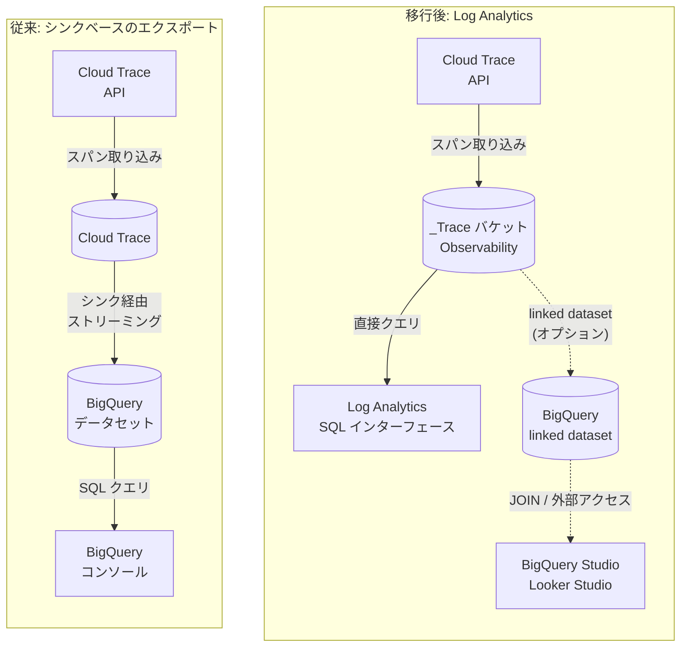

# Cloud Trace: トレースシンク機能の非推奨化

**リリース日**: 2026-02-17
**サービス**: Cloud Trace
**機能**: トレースシンク (Trace Sinks) の非推奨化
**ステータス**: Deprecated

[このアップデートのインフォグラフィックを見る](https://takech9203.github.io/google-cloud-news-summary/20260217-cloud-trace-sinks-deprecated.html)

## 概要

2026 年 2 月 18 日より、Cloud Trace のトレースシンク (Trace Sinks) 機能が非推奨 (Deprecated) となった。トレースシンクは、Cloud Trace に取り込まれたトレーススパンを BigQuery データセットにエクスポートするための機能で、Cloud Trace API (v2beta1) または Google Cloud CLI を使用してシンクを作成・管理していた。この機能はこれまで Beta ステータスのまま提供されていた。

Google Cloud は、トレースシンクに代わる移行先として Log Analytics ページの利用を推奨している。Log Analytics は SQL ベースのクエリインターフェースを提供し、トレースデータとログデータの両方を統合的にクエリ・分析できる。BigQuery と同じ SQL クエリ言語をサポートしており、従来のシンクベースのエクスポートで実現していた分析機能をより統合された環境で利用可能となる。

この変更は、Cloud Trace を使用してトレースデータを BigQuery にエクスポートしているすべてのユーザーに影響する。特に、トレースシンクを設定してトレーススパンを BigQuery にストリーミングエクスポートしているプロジェクトでは、早急に Log Analytics への移行を計画する必要がある。

**アップデート前の課題**

- トレースシンクは Beta ステータスのまま提供されており、限定的なサポートしか受けられなかった
- トレースデータを BigQuery で分析するには、専用のシンクの作成、宛先データセットの設定、サービスアカウントへの権限付与など複雑な構成が必要だった
- シンクベースのエクスポートではリトライ機構やスロットリング機構が実装されておらず、BigQuery のクォータを超過した場合にスパンがエクスポートされない可能性があった
- Cloud Trace API で取り込まれたトレーススパンのみがエクスポート対象で、Google Cloud サービスが出力したスパンや Telemetry API 経由のスパンはサポートされていなかった
- トレースデータとログデータを統合的に分析する手段が限られていた

**アップデート後の改善**

- Log Analytics を使用することで、シンクの作成・管理が不要になり、設定の簡素化が実現される
- SQL ベースの統一されたインターフェースで、トレースデータとログデータの両方をクエリ可能になる
- linked BigQuery dataset を作成することで、BigQuery Studio や Looker Studio からのクエリ、他のビジネスデータとの JOIN 操作が可能になる
- Query Builder インターフェースにより、メニュー選択だけでクエリを構築可能で、技術的な敷居が低下する
- クエリ結果をチャートとして可視化し、カスタムダッシュボードに保存できるようになる

## アーキテクチャ図



上の図は、従来のシンクベースのエクスポート方式と、移行後の Log Analytics を使用した方式の比較を示している。移行後は Observability バケットに格納されたトレースデータを Log Analytics から直接クエリでき、必要に応じて linked BigQuery dataset を作成して外部サービスからアクセスすることも可能。

## サービスアップデートの詳細

### 主要機能

1. **トレースシンクの非推奨化**
   - 2026 年 2 月 18 日以降、トレースシンクは非推奨となる
   - 既存のシンクは引き続き動作するが、新規作成は推奨されない
   - Cloud Trace API v2beta1 の `TracingConfigService` (CreateTraceSink, DeleteTraceSink, GetTraceSink, ListTraceSinks, UpdateTraceSink) が対象

2. **Log Analytics への移行パス**
   - Log Analytics ページの `_Trace.Spans._AllSpans` ビューを使用してトレースデータをクエリ可能
   - SQL クエリ言語 (BigQuery Standard SQL) をそのまま利用できる
   - Query Builder インターフェースによるメニュー選択でのクエリ構築にも対応
   - クエリ結果はテーブルまたはチャートで表示でき、カスタムダッシュボードに保存可能

3. **linked BigQuery dataset によるクエリ**
   - Log Analytics から直接クエリする場合は linked dataset は不要
   - BigQuery Studio や Looker Studio からトレースデータをクエリする場合に linked dataset が必要
   - 他のビジネスデータとトレースデータを JOIN する場合にも linked dataset を使用
   - BigQuery reserved slots で Log Analytics のクエリパフォーマンスを向上させる場合にも必要

## 技術仕様

### スキーマの比較 (レガシーシンク vs Log Analytics)

| 項目 | Log Analytics | レガシーシンク |
|------|--------------|---------------|
| Trace ID | `trace_id` | `extendedFields.traceId` |
| Span ID | `span_id` | `span.spanId` |
| Parent span ID | `parent_span_id` | `span.parentSpanId` |
| Span name | `name` | `span.displayName.value` |
| Span kind | `kind` (OpenTelemetry SpanKind) | `span.spanKind` (Cloud Trace API SpanKind) |
| Span start time | `start_time` | `span.startTime` |
| Span end time | `end_time` | `span.endTime` |
| Attributes | `attributes["key"]`, `resource.attributes["key"]` (JSON 型) | `span.attributes.attributeMap.KEY` |

### 必要な IAM ロール

Log Analytics への移行およびクエリ実行には以下のロールが必要となる。

| ロール | 用途 |
|--------|------|
| `roles/cloudtrace.admin` | Cloud Trace の管理権限 |
| `roles/observability.editor` | Observability リソースの編集権限 |
| `roles/bigquery.user` | BigQuery ジョブの実行権限 |
| `roles/observability.viewAccessor` | Observability ビューへのアクセス権限 |
| `roles/observability.analyticsUser` | クエリの保存・実行権限 |
| `roles/logging.viewer` | ログの閲覧権限 |

## 設定方法

### 前提条件

1. Google Cloud プロジェクトで課金が有効であること
2. Observability API が有効化されていること
3. 上記の IAM ロールが付与されていること

### 手順

#### ステップ 1: Log Analytics でトレースデータへのアクセスを確認

Google Cloud コンソールで **Log Analytics** ページに移動し、**Views** メニューの **Traces** セクションから `_Trace.Spans._AllSpans` を選択する。

```sql
-- Log Analytics でのクエリ例: FROM 句のフォーマット
SELECT *
FROM `PROJECT_ID.us._Trace.Spans._AllSpans`
LIMIT 100
```

#### ステップ 2: 既存のトレースシンクを確認・削除

```bash
# 既存のトレースシンクを一覧表示
gcloud alpha trace sinks list

# トレースシンクを削除
gcloud alpha trace sinks delete SINK_NAME
```

#### ステップ 3: (オプション) linked BigQuery dataset を作成

BigQuery Studio や Looker Studio からトレースデータをクエリする場合、または他のデータセットと JOIN する場合は、linked BigQuery dataset を作成する。詳細は[公式ドキュメント](https://cloud.google.com/trace/docs/analytics-query-linked-dataset)を参照。

#### ステップ 4: 不要な BigQuery データセットを削除

シンクによって作成された BigQuery データセットが不要になった場合は削除する。

```bash
# BigQuery データセットの削除
bq rm -r -d PROJECT_ID:DATASET_ID
```

## メリット

### ビジネス面

- **運用コストの削減**: シンクの管理・監視が不要になり、運用負荷が軽減される。シンクベースのエクスポートでは BigQuery Streaming API の料金が発生していたが、Log Analytics からの直接クエリではその料金が不要になる
- **統合的な可視化**: トレースデータとログデータを同一の SQL インターフェースで分析でき、インシデント対応やパフォーマンス分析の効率が向上する

### 技術面

- **シンプルなアーキテクチャ**: 中間的なエクスポートパイプラインが不要になり、システム構成がシンプルになる
- **OpenTelemetry 準拠のスキーマ**: Log Analytics のスキーマは OpenTelemetry の SpanKind に準拠しており、業界標準との整合性が向上する
- **柔軟なクエリオプション**: Query Builder によるメニューベースのクエリ構築、SQL エディタによるカスタムクエリ、システム定義クエリのロードなど多様な方法でデータにアクセス可能

## デメリット・制約事項

### 制限事項

- Log Analytics のトレースクエリ機能は現在 Preview ステータスであり、GA ではない
- Log Analytics ではログエントリの重複排除が行われないため、クエリの書き方に影響する場合がある
- linked BigQuery dataset を作成するとセキュリティ境界が拡大し、BigQuery サービスからもトレースデータにアクセス可能になる

### 考慮すべき点

- 既存のシンクベースのクエリは新しいスキーマに合わせて書き換えが必要 (例: `span.spanId` を `span_id` に変更)
- 既存の BigQuery データセットに蓄積された履歴データは Log Analytics からは直接アクセスできないため、履歴データの保持計画を検討する必要がある
- トレースシンクで使用していた自動化スクリプトや CI/CD パイプラインの更新が必要になる場合がある

## ユースケース

### ユースケース 1: マイクロサービスのレイテンシ分析

**シナリオ**: マイクロサービスアーキテクチャで、サービス間のレイテンシをトレースデータから集計・分析したい

**実装例**:
```sql
-- Log Analytics でのレイテンシ分析クエリ
SELECT
  name AS span_name,
  COUNT(*) AS span_count,
  AVG(duration_nano) / 1e6 AS avg_duration_ms,
  APPROX_QUANTILES(duration_nano / 1e6, 100)[OFFSET(50)] AS p50_ms,
  APPROX_QUANTILES(duration_nano / 1e6, 100)[OFFSET(95)] AS p95_ms,
  APPROX_QUANTILES(duration_nano / 1e6, 100)[OFFSET(99)] AS p99_ms
FROM `PROJECT_ID.us._Trace.Spans._AllSpans`
WHERE parent_span_id IS NULL
GROUP BY name
ORDER BY span_count DESC
LIMIT 100
```

**効果**: シンクの設定やデータセットの管理なしに、Log Analytics から直接 SQL でレイテンシ分布を分析できる

### ユースケース 2: トレースデータとログデータの統合分析

**シナリオ**: エラーが発生したトレースに関連するログエントリを同時に確認し、根本原因を特定したい

**効果**: Log Analytics の統合 SQL インターフェースを使用して、トレーススパンとログエントリを同一のクエリ環境で横断的に分析でき、インシデント対応時間を短縮できる

## 料金

Cloud Trace 自体の料金体系はトレースシンクの非推奨化によって変更されない。Cloud Trace の料金は [Google Cloud Observability の料金ページ](https://cloud.google.com/products/observability/pricing)を参照。

移行による料金への影響は以下の通り:

| 項目 | シンクベース (従来) | Log Analytics (移行後) |
|------|-------------------|----------------------|
| トレースエクスポート | Cloud Trace の課金なし | N/A (エクスポート不要) |
| BigQuery ストリーミング | BigQuery Streaming API の料金が発生 | N/A (ストリーミング不要) |
| BigQuery ストレージ | エクスポート先データセットのストレージ料金 | Observability バケットに含まれる |
| クエリ実行 | BigQuery オンデマンドクエリ料金 | Log Analytics のデフォルトエンジンは追加料金なし |
| linked dataset クエリ | N/A | BigQuery reserved slots を使用する場合は追加料金 |

## 関連サービス・機能

- **Cloud Logging / Log Analytics**: トレースデータの移行先となる SQL クエリインターフェース。トレースとログの統合分析基盤
- **BigQuery**: linked BigQuery dataset を通じてトレースデータにアクセス可能。他のビジネスデータとの JOIN や Looker Studio での可視化に使用
- **Cloud Monitoring**: トレースデータと連携してアラートポリシーの設定やダッシュボードの作成が可能
- **OpenTelemetry**: Cloud Trace のトレーシングクライアントとして推奨。Log Analytics のスキーマは OpenTelemetry の仕様に準拠
- **Trace Explorer**: 個別のトレースやスパンの閲覧・探索に使用。Log Analytics とは異なり、集計分析ではなく詳細な調査に適している

## 参考リンク

- [このアップデートのインフォグラフィック](https://takech9203.github.io/google-cloud-news-summary/20260217-cloud-trace-sinks-deprecated.html)
- [公式リリースノート](https://cloud.google.com/release-notes#February_17_2026)
- [シンクベースエクスポートからの移行ガイド](https://cloud.google.com/trace/docs/analytics-migrate)
- [Log Analytics でのトレースクエリ](https://cloud.google.com/trace/docs/analytics)
- [linked BigQuery dataset でのクエリ](https://cloud.google.com/trace/docs/analytics-query-linked-dataset)
- [トレースシンクの概要 (非推奨)](https://cloud.google.com/trace/docs/trace-export-overview)
- [トレースシンクの設定 (非推奨)](https://cloud.google.com/trace/docs/trace-export-configure)
- [Cloud Trace 料金](https://cloud.google.com/products/observability/pricing)

## まとめ

Cloud Trace のトレースシンク機能は 2026 年 2 月 18 日から非推奨となり、Log Analytics への移行が推奨される。既存のシンクベースエクスポートを使用しているユーザーは、Log Analytics での `_Trace.Spans._AllSpans` ビューへのアクセスを確認し、既存のクエリをスキーマの違いに合わせて書き換えた上で、トレースシンクを削除する移行手順を計画・実行すべきである。Log Analytics は SQL ベースの統合クエリ環境を提供し、トレースとログの横断的な分析を可能にするため、Observability の運用基盤として長期的にはより優れた選択肢となる。

---

**タグ**: #CloudTrace #Observability #CloudLogging #BigQuery #LogAnalytics #Deprecation #Migration
