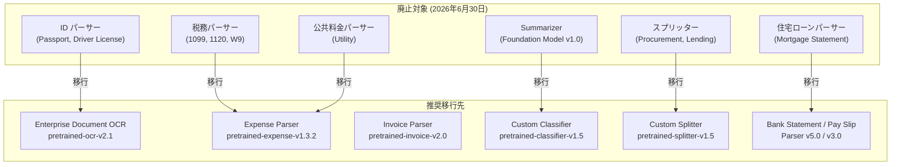

# Document AI: レガシープロセッサの廃止予定 (2026年6月30日)

**リリース日**: 2026-02-17
**サービス**: Document AI
**機能**: レガシープロセッサの廃止と移行ガイダンス
**ステータス**: Deprecated

[このアップデートのインフォグラフィックを見る](https://takech9203.github.io/google-cloud-news-summary/20260217-document-ai-legacy-processors-deprecated.html)

## 概要

Google Cloud は、Document AI のレガシープロセッサを 2026 年 6 月 30 日に廃止することを発表した。対象となるのは、ID パーサー、税務・財務パーサー、住宅ローン・銀行パーサー、調達パーサー、ドキュメント分割パーサー、要約パーサーなど、幅広いカテゴリにわたる旧バージョンのプロセッサである。サービス障害のリスクを未然に防ぐため、より安定した高品質なプロセッサへの移行が推奨されている。

今回の廃止対象は、Identity パーサー (パスポート、運転免許証)、税務関連パーサー (1099 シリーズ、1120、W9)、住宅ローン明細書パーサー、公共料金パーサー、調達・融資ドキュメントスプリッター、および Foundation Model ベースの Summarizer を含む。移行先として、Enterprise Document OCR v2.1、Expense Parser v1.3.2、Custom Classifier v1.5、Custom Splitter v1.5、Invoice Parser v2.0、Pay Slip Parser v3.0、Bank Statement Parser v5.0 が推奨されている。

この変更は、Document AI が生成 AI を活用した新しい基盤モデルに移行する過程の一環であり、Google はプロセッサバージョンのライフサイクルポリシーに基づき、新バージョンのリリースから 6 か月後に旧バージョンを廃止する方針を取っている。影響を受けるユーザーは、2026 年 6 月 30 日までに対応する新バージョンへの移行を完了する必要がある。

**アップデート前の課題**

- レガシープロセッサは旧世代のビジョンモデルや OCR エンジンに基づいており、最新のドキュメント処理品質に比べて精度が劣る場合があった
- 旧バージョンのプロセッサではセキュリティパッチや品質改善が限定的であり、長期的な安定性に懸念があった
- 多数のレガシーバージョンが並存しており、バージョン管理が複雑化していた
- 一部の特殊用途パーサー (ID パーサー、税務パーサー等) は汎用的な新バージョンへの置き換えが必要だが、移行パスが明確でなかった

**アップデート後の改善**

- 廃止スケジュールが明確化され、2026 年 6 月 30 日までの移行猶予期間が設定された
- 各レガシープロセッサに対する具体的な移行先プロセッサバージョンが推奨されている
- 新バージョンのプロセッサは最新の生成 AI 基盤モデル (Gemini 2.5 Flash 等) を活用しており、抽出精度が向上している
- Custom Extractor や Custom Classifier など、より柔軟なプロセッサタイプへの移行により、ユーザー固有のドキュメントへのカスタマイズが容易になる

## アーキテクチャ図



レガシープロセッサから推奨される新バージョンへの移行パスを示す。各カテゴリのレガシープロセッサは、対応する最新の安定バージョンに移行する必要がある。

## サービスアップデートの詳細

### 主要機能

1. **廃止対象プロセッサの明確化**
   - 2026 年 6 月 30 日を期限として、6 カテゴリにわたる約 20 のレガシープロセッサバージョンが廃止される
   - 廃止後はこれらのバージョンを指定した API リクエストがエラーを返すようになる
   - デフォルトバージョンとして設定されている場合は、自動的に最新の安定バージョンに更新される

2. **移行先プロセッサの推奨**
   - 各レガシープロセッサに対して具体的な移行先バージョンが推奨されている
   - 新バージョンは最新の生成 AI モデルを活用しており、抽出品質が向上している
   - Custom Extractor/Classifier/Splitter など、より柔軟なカスタマイズ機能を持つプロセッサへの移行も選択肢として提供されている

3. **バージョン管理とライフサイクルポリシー**
   - Google は安定バージョンをリリース後 6 か月で旧バージョンを廃止するポリシーを適用している
   - プロセッサバージョンを指定せずにエンドポイントを呼び出す場合、デフォルトバージョンが自動的に使用される
   - Google は本番環境ではバージョン ID を指定せず、デフォルトバージョンに依存することを推奨している

## 技術仕様

### 廃止対象プロセッサと移行先の対応表

| カテゴリ | 廃止対象プロセッサ | 推奨移行先 |
|---------|-------------------|-----------|
| ID パーサー | pretrained-us-passport-v1.0 | pretrained-ocr-v2.1-2024-08-07 (Enterprise Document OCR) |
| ID パーサー | pretrained-fr-driver-license-v1.0 | pretrained-ocr-v2.1-2024-08-07 (Enterprise Document OCR) |
| 税務パーサー | pretrained-1099misc-v1.1 | pretrained-expense-v1.3.2-2024-09-11 (Expense Parser) |
| 税務パーサー | pretrained-1099nec-v1.0 | pretrained-expense-v1.3.2-2024-09-11 (Expense Parser) |
| 税務パーサー | pretrained-1099r-v2.0 | pretrained-expense-v1.3.2-2024-09-11 (Expense Parser) |
| 税務パーサー | pretrained-1099int-v1.1 | pretrained-expense-v1.3.2-2024-09-11 (Expense Parser) |
| 税務パーサー | pretrained-ssa1099-v1.0 | pretrained-expense-v1.3.2-2024-09-11 (Expense Parser) |
| 税務パーサー | pretrained-1099g-v1.0 / v1.1 | pretrained-expense-v1.3.2-2024-09-11 (Expense Parser) |
| 税務パーサー | pretrained-1120-v3.0 | pretrained-expense-v1.3.2-2024-09-11 (Expense Parser) |
| 税務パーサー | pretrained-w9-v1.0 / v1.1 / v1.2 / v2.0 | pretrained-expense-v1.3.2-2024-09-11 (Expense Parser) |
| 住宅ローン | pretrained-mortgage-statement-v1.0 | pretrained-bankstatement-v5.0-2023-12-06 (Bank Statement Parser) |
| 公共料金 | pretrained-utility-v1.1 / v1.2 | pretrained-expense-v1.3.2-2024-09-11 (Expense Parser) |
| 調達スプリッター | pretrained-procurement-splitter-v1.1 / v1.2 | pretrained-splitter-v1.5-2025-07-14 (Custom Splitter) |
| 融資スプリッター | pretrained-lending-document-split-v1.0 / v2.0 | pretrained-splitter-v1.5-2025-07-14 (Custom Splitter) |
| Summarizer | pretrained-foundation-model-v1.0 | pretrained-classifier-v1.5-2025-08-05 (Custom Classifier) |

### 推奨移行先プロセッサバージョンの詳細

| 移行先プロセッサ | バージョン ID | 特徴 |
|----------------|-------------|------|
| Enterprise Document OCR | pretrained-ocr-v2.1-2024-08-07 | 最新 OCR エンジン、チェックボックス抽出、数式 OCR、フォントスタイル検出に対応 |
| Expense Parser | pretrained-expense-v1.3.2-2024-09-11 | 拡張ビジョンモデル搭載、経費・領収書の抽出精度向上 |
| Custom Classifier | pretrained-classifier-v1.5-2025-08-05 | Gemini 2.5 Flash LLM ベース、高度な OCR 機能搭載 |
| Custom Splitter | pretrained-splitter-v1.5-2025-07-14 | ドキュメント分割の柔軟なカスタマイズが可能 |
| Invoice Parser | pretrained-invoice-v2.0-2023-12-06 | 請求書データ抽出の安定バージョン |
| Pay Slip Parser | pretrained-paystub-v3.0-2023-12-06 | 給与明細解析の安定バージョン |
| Bank Statement Parser | pretrained-bankstatement-v5.0-2023-12-06 | 銀行取引明細書解析の安定バージョン |

### プロセッサバージョンの指定方法

```python
# 推奨: バージョンを指定せずデフォルトバージョンを使用
# (廃止時に自動的に最新バージョンに更新される)
name = f"projects/{project_id}/locations/{location}/processors/{processor_id}:process"

# バージョンを明示的に指定する場合 (廃止後はエラーになる)
name = f"projects/{project_id}/locations/{location}/processors/{processor_id}/processorVersions/pretrained-ocr-v2.1-2024-08-07:process"

# チャネルを指定する場合 (常に最新の安定バージョンを使用)
name = f"projects/{project_id}/locations/{location}/processors/{processor_id}/processorVersions/stable:process"
```

## 設定方法

### 前提条件

1. Google Cloud プロジェクトで Document AI API が有効化されていること
2. 既存のレガシープロセッサの使用状況を把握していること
3. 適切な IAM 権限 (Document AI Editor ロール) を保有していること

### 手順

#### ステップ 1: 現在のプロセッサバージョンの確認

```bash
# 現在使用中のプロセッサ一覧を取得
gcloud ai document-processors list \
  --project=PROJECT_ID \
  --location=LOCATION

# 特定のプロセッサのバージョン情報を取得
gcloud ai document-processors versions list \
  --processor=PROCESSOR_ID \
  --project=PROJECT_ID \
  --location=LOCATION
```

Cloud Console の Document AI セクションの「Processors」ページからも確認可能。各プロセッサの「Manage Versions」タブで現在のデフォルトバージョンと利用可能なバージョンを確認できる。

#### ステップ 2: 新バージョンでのテスト

```bash
# 新バージョンを指定してドキュメントを処理 (テスト)
curl -X POST \
  -H "Authorization: Bearer $(gcloud auth print-access-token)" \
  -H "Content-Type: application/json; charset=utf-8" \
  -d '{"rawDocument": {"content": "BASE64_ENCODED_CONTENT", "mimeType": "application/pdf"}}' \
  "https://LOCATION-documentai.googleapis.com/v1/projects/PROJECT_ID/locations/LOCATION/processors/PROCESSOR_ID/processorVersions/NEW_VERSION_ID:process"
```

新バージョンで処理結果を検証し、抽出精度やフィールドマッピングに問題がないことを確認する。

#### ステップ 3: デフォルトバージョンの変更

```bash
# REST API でデフォルトバージョンを変更
curl -X POST \
  -H "Authorization: Bearer $(gcloud auth print-access-token)" \
  -H "Content-Type: application/json; charset=utf-8" \
  -d '{"defaultProcessorVersion": "projects/PROJECT_ID/locations/LOCATION/processors/PROCESSOR_ID/processorVersions/NEW_VERSION_ID"}' \
  "https://LOCATION-documentai.googleapis.com/v1/projects/PROJECT_ID/locations/LOCATION/processors/PROCESSOR_ID:setDefaultProcessorVersion"
```

Cloud Console では、プロセッサの「Manage Versions」タブの「Default version」ドロップダウンメニューから変更可能。

## メリット

### ビジネス面

- **処理品質の向上**: 新バージョンのプロセッサは最新の生成 AI 基盤モデルを活用しており、ドキュメントからのデータ抽出精度が向上する
- **長期的な安定性の確保**: 最新のサポート対象バージョンに移行することで、セキュリティパッチやバグ修正を継続的に受けられる
- **サービス中断リスクの回避**: 期限前に移行を完了することで、突然のサービス障害を防止できる

### 技術面

- **最新 OCR エンジンの活用**: Enterprise Document OCR v2.1 はチェックボックス抽出、数式 OCR、フォントスタイル検出などの高度な機能を提供する
- **生成 AI によるカスタマイズ**: Custom Extractor/Classifier/Splitter は Gemini ベースの基盤モデルを使用しており、少数のサンプルからファインチューニングが可能
- **柔軟なバージョン管理**: stable チャネルを指定することで、常に最新の安定バージョンを自動的に使用できる

## デメリット・制約事項

### 制限事項

- 廃止後にレガシーバージョンを指定した API リクエストはエラーを返すため、ハードコードされたバージョン ID を使用しているシステムは必ず更新が必要
- 一部の特殊用途パーサー (税務フォーム固有のフィールド抽出等) は、汎用プロセッサへの移行により、ドキュメント固有のフィールドマッピングの再構成が必要になる場合がある
- ファインチューニング済みのカスタマイズバージョンを使用している場合、新しい基盤バージョンで再トレーニングが必要

### 考慮すべき点

- 移行期間中は新旧バージョンの並行テストを実施し、抽出結果の品質差異を検証することが推奨される
- カスタマイズバージョンを使用している場合、基盤バージョンの廃止に伴い、ユーザーバージョンも予測を返さなくなるため、新しい基盤バージョンでの再作成が必要
- プロセッサバージョンを明示的に指定している API 呼び出しは、すべて見直しが必要。Google はデフォルトバージョンへの依存を推奨している

## ユースケース

### ユースケース 1: 税務書類処理パイプラインの移行

**シナリオ**: 会計事務所が Document AI の 1099 シリーズパーサー (pretrained-1099misc-v1.1、pretrained-1099nec-v1.0 等) を使用して年間数万件の税務書類を自動処理している。

**実装例**:
```python
from google.cloud import documentai_v1 as documentai

# 移行前: レガシーバージョンを指定 (廃止予定)
# version = "pretrained-1099misc-v1.1"

# 移行後: Expense Parser の最新バージョンを使用
client = documentai.DocumentProcessorServiceClient()
name = f"projects/{project_id}/locations/us/processors/{expense_processor_id}/processorVersions/pretrained-expense-v1.3.2-2024-09-11:process"

# または、バージョンを指定せずデフォルトに依存 (推奨)
name = f"projects/{project_id}/locations/us/processors/{expense_processor_id}:process"

request = documentai.ProcessRequest(
    name=name,
    raw_document=documentai.RawDocument(
        content=document_content,
        mime_type="application/pdf"
    )
)
result = client.process_document(request=request)
```

**効果**: 最新の拡張ビジョンモデルにより抽出精度が向上し、かつ廃止によるサービス中断を回避できる。

### ユースケース 2: 融資書類分割ワークフローの移行

**シナリオ**: 金融機関が融資審査プロセスで pretrained-lending-document-split を使用し、複数種類の書類が混在する PDF を自動分割している。

**効果**: Custom Splitter v1.5 への移行により、Gemini ベースの基盤モデルを活用したより正確なドキュメント分割が可能になる。独自のドキュメントタイプに合わせたファインチューニングも実施でき、分類精度をさらに向上させることができる。

## 料金

Document AI の料金は処理するページ数に基づいて課金される。トレーニングやアップトレーニングには費用は発生しない。

詳細な料金情報は [Document AI 料金ページ](https://cloud.google.com/document-ai/pricing) を参照。

## 利用可能リージョン

Document AI プロセッサは以下の主要リージョンで利用可能:

- US (米国マルチリージョン)
- EU (欧州マルチリージョン)
- asia-south1 (ムンバイ)
- asia-southeast1 (シンガポール)
- australia-southeast1 (シドニー)
- europe-west2 (ロンドン)
- europe-west3 (フランクフルト)
- northamerica-northeast1 (モントリオール)

一部のプロセッサバージョンはリージョンにより利用可否が異なる。詳細は [プロセッサ一覧](https://cloud.google.com/document-ai/docs/processors-list) を参照。

## 関連サービス・機能

- **Enterprise Document OCR**: テキスト抽出の基盤となる OCR プロセッサ。今回の移行先の 1 つであり、v2.1 が最新安定バージョン
- **Custom Extractor**: 生成 AI を活用したカスタムデータ抽出プロセッサ。ファインチューニングにより特定のドキュメントタイプに最適化可能
- **BigQuery**: Document AI で抽出したデータを ML.PROCESS_DOCUMENT 関数で BigQuery と統合し、SQL ベースの分析が可能
- **Cloud Storage**: Document AI で処理するドキュメントの保管先。バッチ処理のソースおよび出力先として使用
- **Vertex AI**: Document AI の基盤モデルの一部は Vertex AI の生成 AI モデル (Gemini) を活用している

## 参考リンク

- [インフォグラフィック](https://takech9203.github.io/google-cloud-news-summary/20260217-document-ai-legacy-processors-deprecated.html)
- [公式リリースノート](https://cloud.google.com/release-notes#February_17_2026)
- [Document AI 廃止一覧](https://cloud.google.com/document-ai/docs/deprecation)
- [プロセッサバージョンの管理](https://cloud.google.com/document-ai/docs/manage-processor-versions)
- [プロセッサ一覧 (全タイプ)](https://cloud.google.com/document-ai/docs/processors-list)
- [料金ページ](https://cloud.google.com/document-ai/pricing)

## まとめ

Document AI のレガシープロセッサ廃止は、2026 年 6 月 30 日という明確な期限が設定されており、影響を受ける全てのユーザーは計画的な移行が必要である。特に、税務書類処理や ID 認証、融資書類分割などのワークフローでレガシーパーサーを使用している場合は、早期に新バージョンでのテストを開始し、抽出結果の品質を検証することが推奨される。移行先のプロセッサは最新の生成 AI 基盤モデルを活用しており、精度向上と柔軟なカスタマイズ性の両方を享受できる。

---

**タグ**: Document AI, Deprecation, Migration, Processor Versions, OCR, Expense Parser, Custom Classifier, Custom Splitter, Invoice Parser
