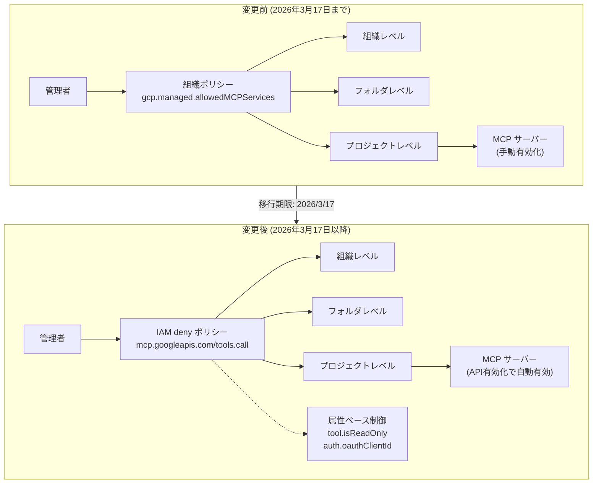

# Google Cloud MCP サーバー: 組織ポリシー非推奨化と IAM deny ポリシーへの移行

**リリース日**: 2026-02-17 / 2026-02-18
**サービス**: Cloud SQL, Compute Engine, GKE, Google SecOps, BigQuery, Firestore, Spanner, AlloyDB for PostgreSQL (クロスサービスアップデート)
**機能**: MCP 組織ポリシー非推奨化、IAM deny ポリシーへの移行、MCP サーバー自動有効化、データベース MCP セキュリティベストプラクティス
**ステータス**: Deprecated / Changed

[このアップデートのインフォグラフィックを見る](https://takech9203.github.io/google-cloud-news-summary/20260217-google-cloud-mcp-policy-migration.html)

## 概要

Google Cloud は 2026 年 2 月 17 日から 18 日にかけて、Model Context Protocol (MCP) サーバーのガバナンスモデルに関する重要なアップデートを発表した。これは複数のサービスにまたがるクロスサービスアップデートであり、MCP の利用制御方法が組織ポリシー (`gcp.managed.allowedMCPServices` 制約) から IAM deny ポリシーへと移行される。**2026 年 3 月 17 日以降**、組織ポリシーによる MCP 制御は機能しなくなるため、既存の設定を IAM deny ポリシーに移行する必要がある。

また、同日付で MCP サーバーの自動有効化も発表された。2026 年 3 月 17 日以降、対象サービスの API を有効化すると、対応する MCP サーバーも自動的に有効になる。さらに、データベースサービス (Cloud SQL、Firestore、Spanner、AlloyDB for PostgreSQL) における MCP 利用時のセキュリティベストプラクティスも公開された。

このアップデートは、Google Cloud 組織の管理者、セキュリティチーム、MCP を活用した AI エージェント開発者、およびガバナンスポリシーの運用担当者に直接影響する。

**アップデート前の課題**

- MCP サーバーの利用制御は `gcp.managed.allowedMCPServices` 組織ポリシー制約を使用して、組織・フォルダ・プロジェクトレベルで許可するサービスを制御していた
- 組織ポリシーでは MCP ツールの読み取り専用/読み書き区別や、OAuth クライアント ID に基づくきめ細かいアクセス制御ができなかった
- MCP サーバーを使用するにはサービス API の有効化とは別に、MCP エンドポイントを明示的に有効化する必要があった
- データベースサービスで MCP を活用する際の包括的なセキュリティガイダンスが不足していた

**アップデート後の改善**

- IAM deny ポリシーにより、プリンシパル単位、ツールの読み取り専用属性 (`tool.isReadOnly`)、OAuth クライアント ID (`auth.oauthClientId`) に基づくきめ細かい MCP アクセス制御が可能になった
- 2026 年 3 月 17 日以降は対象サービスの API 有効化時に MCP サーバーが自動的に有効になり、別途有効化する手間が不要になった
- IAM deny ポリシーは組織、フォルダ、プロジェクトの各レベルに適用可能で、従来の組織ポリシーと同等の階層的制御を維持できる
- データベース MCP セキュリティベストプラクティスにより、最小権限の原則、ネイティブデータベース制御、安全なエージェント設計に関する具体的なガイダンスが提供された

## アーキテクチャ図



この図は、MCP ガバナンスモデルの変更前後を示している。変更前は `gcp.managed.allowedMCPServices` 組織ポリシーによるサービス単位の許可リスト制御だったが、変更後は IAM deny ポリシーによる属性ベースのきめ細かいアクセス制御に移行される。

## サービスアップデートの詳細

### 主要機能

1. **MCP 組織ポリシーの非推奨化**
   - `gcp.managed.allowedMCPServices` 制約を使用した組織ポリシーによる MCP 制御が非推奨となった
   - **2026 年 3 月 17 日以降**、この制約を使用した組織ポリシーは機能しなくなる
   - 移行先として IAM deny ポリシーが推奨される

2. **MCP サーバーの自動有効化**
   - 2026 年 3 月 17 日以降、対象サービスの API を有効化すると、MCP サーバーエンドポイントが自動的に有効になる
   - これまで必要だった MCP エンドポイントの個別有効化手順が不要になる
   - MCP を使用しない場合は、IAM deny ポリシーでツール呼び出しを制限する必要がある

3. **IAM deny ポリシーによる MCP 制御**
   - `mcp.googleapis.com/tools.call` 権限を deny ポリシーで制御
   - `tool.isReadOnly` 属性: ツールが読み取り専用かどうかを判定
   - `auth.oauthClientId` 属性: 呼び出し元の OAuth クライアント ID を判定
   - 組織、フォルダ、プロジェクトレベルで適用可能

4. **データベース MCP セキュリティベストプラクティス**
   - Cloud SQL (MySQL / PostgreSQL / SQL Server)、Firestore、Spanner、AlloyDB for PostgreSQL が対象
   - 最小権限の原則に基づくエージェント ID の設計指針
   - ネイティブデータベースセキュリティ制御の活用方法
   - プロンプトインジェクション対策を含む安全なエージェント設計

### 影響を受けるサービス

| サービス | 組織ポリシー非推奨 | MCP 自動有効化 | セキュリティベストプラクティス |
|----------|:------------------:|:--------------:|:----------------------------:|
| Cloud SQL for MySQL | 対象 | 対象 | 対象 |
| Cloud SQL for PostgreSQL | 対象 | 対象 | 対象 |
| Cloud SQL for SQL Server | 対象 | 対象 | 対象 |
| Compute Engine | 対象 | 対象 | - |
| Google Kubernetes Engine | 対象 | 対象 | - |
| Google SecOps | 対象 | 対象 | - |
| Google SecOps SIEM | 対象 | 対象 | - |
| BigQuery | 対象 | - | - |
| Firestore | - | - | 対象 |
| Spanner | - | - | 対象 |
| AlloyDB for PostgreSQL | - | - | 対象 |

## 技術仕様

### IAM deny ポリシーの属性

| 属性 | 説明 | 用途 |
|------|------|------|
| `tool.isReadOnly` | ツールが読み取り専用かどうかを示すリソース属性 | 読み書きツールのみ拒否し、読み取り専用ツールは許可する |
| `auth.oauthClientId` | OAuth クライアント ID | 特定のアプリケーションのみ MCP ツール利用を許可/拒否する |

### 制限事項

- `tool.isReadOnly` と `auth.oauthClientId` は IAM **deny** ポリシーでのみサポートされ、allow ポリシーでは使用できない
- IAM deny 属性は `tools.call` 権限に対してのみチェック・適用される
- これらの属性は deny ポリシー内で他の権限と組み合わせることはできない
- `tools/list` の呼び出しは deny ポリシーの影響を受けず、すべてのツールが返される

### 全ての MCP ツール利用を拒否する deny ポリシー

```json
{
  "displayName": "Deny access to MCP tools for all users",
  "rules": [
    {
      "denyRule": {
        "deniedPrincipals": [
          "principalSet://goog/public:all"
        ],
        "deniedPermissions": [
          "mcp.googleapis.com/tools.call"
        ]
      }
    }
  ]
}
```

### 読み書きツールのみ拒否する deny ポリシー

```json
{
  "rules": [
    {
      "denyRule": {
        "deniedPrincipals": [
          "principalSet://goog/public:all"
        ],
        "deniedPermissions": [
          "mcp.googleapis.com/tools.call"
        ],
        "denialCondition": {
          "title": "Deny read-write tools",
          "expression": "api.getAttribute('mcp.googleapis.com/tool.isReadOnly', false) == false"
        }
      }
    }
  ]
}
```

## 設定方法

### 前提条件

1. Google Cloud プロジェクトまたは組織に対する適切な IAM 権限 (IAM Admin ロールなど)
2. `gcloud` CLI がインストールされ、認証済みであること
3. 現在 `gcp.managed.allowedMCPServices` 組織ポリシーを使用している場合は、その設定内容を確認しておくこと

### 手順

#### ステップ 1: 既存の組織ポリシーの確認

```bash
# 現在の組織ポリシーを確認
gcloud org-policies describe gcp.managed.allowedMCPServices \
  --organization=ORGANIZATION_ID
```

現在の許可リストに含まれるサービスと、適用されている階層レベル (組織/フォルダ/プロジェクト) を記録する。

#### ステップ 2: IAM deny ポリシーの作成

```bash
# deny ポリシーファイルを作成 (policy.json)
# 組織の要件に応じてポリシー内容を調整

# deny ポリシーをプロジェクトに適用
gcloud iam policies create mcp-deny-policy \
  --attachment-point=cloudresourcemanager.googleapis.com/projects/PROJECT_ID \
  --kind=denypolicies \
  --policy-file=policy.json
```

組織またはフォルダレベルに適用する場合は、`--attachment-point` を適切に変更する。

#### ステップ 3: deny ポリシーの動作確認

```bash
# 適用されたポリシーの確認
gcloud iam policies list \
  --attachment-point=cloudresourcemanager.googleapis.com/projects/PROJECT_ID \
  --kind=denypolicies
```

AI アプリケーションから MCP ツールを呼び出し、deny ポリシーが意図どおりに機能することを確認する。

#### ステップ 4: 組織ポリシーの削除 (任意)

2026 年 3 月 17 日以降は自動的に無効となるが、混乱を避けるため事前に削除しておくことを推奨する。

```bash
# 組織ポリシーの削除
gcloud org-policies delete gcp.managed.allowedMCPServices \
  --organization=ORGANIZATION_ID
```

## メリット

### ビジネス面

- **ガバナンスの強化**: IAM deny ポリシーにより、プリンシパル単位・アプリケーション単位・操作種別でのきめ細かい MCP アクセス制御が可能になり、組織のセキュリティポリシーへの適合性が向上する
- **運用の簡素化**: MCP サーバーの自動有効化により、サービス導入時の初期設定手順が削減される
- **コンプライアンス対応**: 読み取り専用/読み書きの区別により、本番環境での AI エージェント利用に関するコンプライアンス要件への対応が容易になる

### 技術面

- **属性ベース制御**: `tool.isReadOnly` や `auth.oauthClientId` による条件付き deny ポリシーにより、従来のサービス単位の許可リストよりも柔軟な制御が実現する
- **階層的適用**: IAM deny ポリシーは組織ポリシーと同様に、組織・フォルダ・プロジェクトの各レベルに適用可能であり、既存の階層構造を活用できる
- **IAM エコシステムとの統合**: 既存の IAM ワークフロー、監査ログ、Policy Simulator と統合して一元的に管理できる

## デメリット・制約事項

### 制限事項

- IAM deny ポリシーの `tool.isReadOnly` および `auth.oauthClientId` 属性は deny ポリシーでのみ利用可能であり、allow ポリシーでは使用できない
- deny 属性は `tools.call` 権限に対してのみ適用され、他の権限との組み合わせは不可
- `tools/list` は deny ポリシーの対象外であり、ツール一覧は常に返される (ツールの存在自体は隠蔽できない)
- 移行期限が 2026 年 3 月 17 日と約 1 ヶ月であり、大規模な組織では移行作業の時間が限られる

### 考慮すべき点

- 組織ポリシーから IAM deny ポリシーへの移行にあたり、既存のポリシー設定を正確にマッピングする必要がある (サービス単位の許可リスト -> 権限ベースの deny ルール)
- MCP サーバーの自動有効化により、API を有効化するだけで MCP エンドポイントが利用可能になるため、意図しない MCP アクセスを防ぐために deny ポリシーの事前設定が重要
- `tools/list` がブロックされないため、情報漏洩の観点からツール一覧の可視性について評価が必要

## ユースケース

### ユースケース 1: 本番環境での読み取り専用 MCP アクセスの強制

**シナリオ**: ある企業では、AI エージェントが Cloud SQL や BigQuery の本番データベースにアクセスして情報を取得するが、データの変更は許可しない方針を採用している。

**実装例**:
```json
{
  "displayName": "Production - Read-only MCP access only",
  "rules": [
    {
      "denyRule": {
        "deniedPrincipals": [
          "principalSet://goog/public:all"
        ],
        "deniedPermissions": [
          "mcp.googleapis.com/tools.call"
        ],
        "denialCondition": {
          "title": "Deny read-write tools in production",
          "expression": "api.getAttribute('mcp.googleapis.com/tool.isReadOnly', false) == false"
        }
      }
    }
  ]
}
```

**効果**: 本番環境のリソースが AI エージェントによる意図しない変更から保護され、読み取り操作のみが許可される。

### ユースケース 2: 特定の AI アプリケーションのみ MCP アクセスを許可

**シナリオ**: 組織内で承認された AI アプリケーション (特定の OAuth クライアント ID) のみが MCP ツールを使用でき、未承認のアプリケーションからのアクセスをブロックする。

**実装例**:
```json
{
  "displayName": "Allow only approved AI applications",
  "rules": [
    {
      "denyRule": {
        "deniedPrincipals": [
          "principalSet://goog/public:all"
        ],
        "deniedPermissions": [
          "mcp.googleapis.com/tools.call"
        ],
        "denialCondition": {
          "title": "Block unapproved OAuth clients",
          "expression": "api.getAttribute('mcp.googleapis.com/auth.oauthClientId', '') != 'APPROVED_CLIENT_ID'"
        }
      }
    }
  ]
}
```

**効果**: セキュリティチームが承認した AI アプリケーションのみが MCP ツールにアクセスでき、シャドー AI の利用を防止できる。

## データベース MCP セキュリティベストプラクティス

今回のアップデートに合わせて、データベースサービスにおける MCP 利用時のセキュリティベストプラクティスが公開された。対象サービスは Cloud SQL (MySQL / PostgreSQL / SQL Server)、Firestore、Spanner、AlloyDB for PostgreSQL である。

### 主要な推奨事項

1. **最小権限の原則**
   - AI エージェント用に専用のサービスアカウントを作成し、必要最小限の IAM ロールのみを付与する
   - Vertex AI Agent Engine を使用する場合は、エージェント ID を作成してアクセスを管理する
   - API キーを使用する場合は、アプリケーション制限と API 制限を設定して利用範囲を限定する

2. **ネイティブデータベース制御の活用**
   - 各データベースサービスが提供する行レベル・列レベルのアクセス制御を活用する
   - VPC Service Controls でサービス境界を設定し、データ漏洩リスクを軽減する
   - 暗号化 (CMEK を含む) を有効化してデータ保護を強化する

3. **安全なエージェント設計**
   - データと命令を分離し、ユーザー入力やデータベースから取得したデータをシステムプロンプトと同じコンテキストに配置しない
   - Model Armor を有効化して、プロンプトインジェクション、機密データ漏洩、ツールポイズニングのリスクを軽減する
   - ユーザー/テナント/エージェント間でメモリと状態を分離する

### Model Armor 推奨設定

```bash
gcloud model-armor floorsettings update \
  --full-uri='projects/PROJECT_ID/locations/global/floorSetting' \
  --mcp-sanitization=ENABLED \
  --malicious-uri-filter-settings-enforcement=ENABLED \
  --pi-and-jailbreak-filter-settings-enforcement=ENABLED \
  --pi-and-jailbreak-filter-settings-confidence-level=MEDIUM_AND_ABOVE
```

## 関連サービス・機能

- **[IAM deny ポリシー](https://cloud.google.com/iam/docs/deny-overview)**: MCP 制御の移行先となる IAM deny ポリシーの基盤機能。組織、フォルダ、プロジェクトレベルでのアタッチメントポイントをサポート
- **[Model Armor](https://cloud.google.com/model-armor/overview)**: MCP サーバーのプロンプト・レスポンスをスキャンし、セキュリティリスク (プロンプトインジェクション、データ漏洩) から保護するサービス
- **[Organization Policy Service](https://cloud.google.com/resource-manager/docs/organization-policy/overview)**: 今回非推奨となる MCP 制御の従来メカニズム。他の制約については引き続き利用可能
- **[MCP Toolbox for Databases](https://googleapis.github.io/genai-toolbox/getting-started/introduction/)**: データベースツールの集中管理と安全な接続プーリング・認証を提供するツールキット
- **[Sensitive Data Protection](https://cloud.google.com/sensitive-data-protection/docs/overview)**: MCP 経由でやり取りされるデータ内の PII を検出・マスキングする de-identify テンプレートとの連携

## 参考リンク

- [このアップデートのインフォグラフィック](https://takech9203.github.io/google-cloud-news-summary/20260217-google-cloud-mcp-policy-migration.html)
- [公式リリースノート](https://cloud.google.com/release-notes#February_17_2026)
- [IAM deny ポリシーによる MCP 制御](https://cloud.google.com/mcp/control-mcp-use-iam)
- [組織ポリシーによる MCP 制御 (非推奨)](https://cloud.google.com/mcp/control-mcp-use-organization)
- [MCP サーバー概要](https://cloud.google.com/mcp/overview)
- [サポート対象プロダクト一覧](https://cloud.google.com/mcp/supported-products)
- [MCP アクセス制御 (IAM)](https://cloud.google.com/mcp/access-control)
- [MCP セキュリティとセーフティのベストプラクティス](https://cloud.google.com/mcp/ai-security-safety)
- [読み書きツール利用の制限](https://cloud.google.com/mcp/prevent-read-write-tool-use)

## まとめ

Google Cloud MCP サーバーのガバナンスモデルが組織ポリシーから IAM deny ポリシーへと移行されることは、MCP のアクセス制御をより柔軟かつきめ細かくする重要な変更である。**2026 年 3 月 17 日の期限までに**、`gcp.managed.allowedMCPServices` 組織ポリシーを使用しているすべての組織は IAM deny ポリシーへの移行を完了する必要がある。また、MCP サーバーの自動有効化に伴い、意図しない MCP アクセスを防止するための deny ポリシーの事前設定を推奨する。データベースサービスを利用する場合は、新たに公開されたセキュリティベストプラクティスを参照し、最小権限の原則、プロンプトインジェクション対策、Model Armor の有効化を実施すべきである。

---

**タグ**: #MCP #IAM #OrganizationPolicy #DenyPolicy #Security #Governance #CloudSQL #ComputeEngine #GKE #SecOps #BigQuery #Firestore #Spanner #AlloyDB #DatabaseSecurity #ModelContextProtocol
