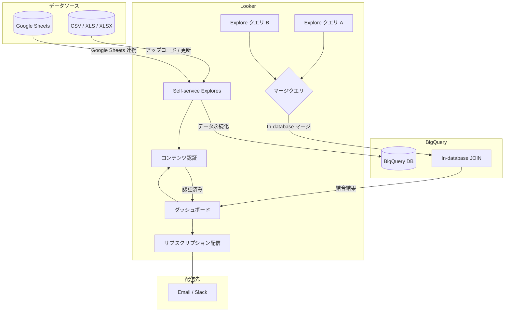

# Looker: Self-service Explores 強化・Google Sheets 連携・In-database マージクエリ・コンテンツ認証

**リリース日**: 2026-02-17
**サービス**: Looker
**機能**: Self-service Explores データ更新、Google Sheets アップロード、In-database マージクエリ、コンテンツ認証強化、ダッシュボードサブスクリプション
**ステータス**: Feature (Preview)

[このアップデートのインフォグラフィックを見る](https://takech9203.github.io/google-cloud-news-summary/20260217-looker-self-service-explores-enhancements.html)

## 概要

2026 年 2 月 17 日より、Looker において複数の新機能が Preview として段階的にロールアウトされている。Self-service Explores のデータ更新機能と Google Sheets からのデータアップロード、BigQuery データベース内で直接実行される In-database マージクエリ、コンテンツ認証機能の強化、そしてダッシュボードサブスクリプションの 5 つの機能が含まれる。

これらの機能は、BI プラットフォームとしての Looker のセルフサービス分析能力を大幅に向上させるものである。特に In-database マージクエリは、従来 Looker メモリ内で 5,000 行の制限付きで実行されていた結合処理を BigQuery データベース側で実行することにより、パフォーマンスと処理可能なデータ量の両面で大きな改善をもたらす。

対象ユーザーは、Looker を利用するデータアナリスト、BI エンジニア、データガバナンス担当者、および Looker 管理者である。LookML モデルの設定や Git バージョン管理の知識がないビジネスユーザーにとっても、Self-service Explores の強化によりデータ分析へのアクセスが容易になる。

**アップデート前の課題**

- Self-service Explores で作成したデータは、元ファイルが更新されても Explore 側のデータを更新する手段がなかった
- Self-service Explores へのデータアップロードは CSV、XLS、XLSX ファイルのみに対応しており、Google Sheets からの直接取り込みができなかった
- マージクエリは Looker メモリ内で実行されるため、各クエリにつき 5,000 行のデータ制限があり、大規模データセットの結合には不向きだった
- コンテンツ認証機能は管理者による細かな制御（有効化/無効化、認証取り消しの挙動設定など）ができず、LookML ダッシュボードの認証にも対応していなかった
- ダッシュボードの定期配信にはスケジュール設定が必要で、サブスクリプション形式での配信はできなかった

**アップデート後の改善**

- Self-service Explores のオーナーが、元ファイルの最新バージョンのデータで Explore を更新できるようになった
- Google Sheets からのデータアップロードが可能になり、Google Workspace との連携が強化された
- 同一 BigQuery 接続上の 2 つのクエリを BigQuery データベース内で直接結合できるようになり、行数制限なしでより高速な処理が可能になった
- コンテンツ認証の有効化/無効化、カスタム URL の設定、編集時の認証取り消し制御が可能になり、LookML ダッシュボードの認証にも対応した
- ダッシュボードサブスクリプションが Preview として利用可能になった

## アーキテクチャ図



この図は、Self-service Explores のデータフローと、今回のアップデートで強化された各機能の連携を示している。データソースからのアップロード、BigQuery での永続化、In-database マージクエリによるデータベース内結合、コンテンツ認証、およびダッシュボードサブスクリプションによる配信までの一連の流れを表現している。

## サービスアップデートの詳細

### 主要機能

1. **Self-service Explores データ更新**
   - Self-service Explore のオーナーが、Explore の作成に使用したファイルの最新バージョンのデータで Explore を更新できる
   - データの鮮度を維持しながら、既存の Explore 設定（ディメンション、メジャー、アクセス権限など）をそのまま保持できる
   - 更新はオーナーのみが実行可能

2. **Self-service Explores - Google Sheets アップロード**
   - Google Sheets からのデータアップロードをサポート
   - 従来の CSV、XLS、XLSX ファイルに加え、Google Sheets が新たなデータソースとして利用可能
   - Looker 管理者が、BigQuery データベースをホストする Google Cloud プロジェクトで必要な API を有効化する必要がある
   - Google Workspace との連携により、スプレッドシートベースのワークフローからシームレスに BI 分析へ移行できる

3. **In-database マージクエリ**
   - 同一の BigQuery 接続上にある 2 つのクエリの結果を BigQuery データベース内で直接マージ（結合）できる
   - 従来は Looker メモリ内で LEFT JOIN が実行されており、各クエリにつき 5,000 行の制限があった
   - In-database マージにより、結合処理が BigQuery 側で実行されるため、行数制限がなくなり、大幅なパフォーマンス向上が期待できる
   - 同一 BigQuery 接続上の 2 つのクエリに対してサポートされる

4. **コンテンツ認証の強化**
   - 管理者がコンテンツ認証機能の有効化/無効化を制御可能
   - 認証プロセス用のカスタム URL を設定可能
   - コンテンツ編集時に認証を自動的に取り消すかどうかを制御可能
   - LookML ダッシュボードが認証対象として新たにサポートされた
   - 未認証の Self-service Explore に基づく Look やダッシュボードに「ungoverned」バッジが表示される
   - 検索結果を認証ステータスでソート可能

5. **ダッシュボードサブスクリプション**
   - Preview として段階的にロールアウト中
   - ダッシュボードの定期配信をサブスクリプション形式で管理できる

## 技術仕様

### Self-service Explores の前提条件

| 項目 | 詳細 |
|------|------|
| Looker バージョン | 25.20 以降（Self-service Explores 基本機能） |
| データベース接続 | BigQuery データベースへの接続が必要 |
| 接続スコープ | All projects スコープで構成されていること |
| PDT（永続化派生テーブル） | BigQuery 接続で PDT が有効であること |
| 必要な権限 | `upload_data` 権限（`explore` 権限を含むロールに自動付与） |
| ファイルサイズ上限 | 100 MB 以下 |
| 対応ファイル形式 | CSV、XLS、XLSX、Google Sheets |

### In-database マージクエリの比較

| 項目 | 従来（メモリ内マージ） | 新機能（In-database マージ） |
|------|----------------------|---------------------------|
| 実行場所 | Looker メモリ | BigQuery データベース |
| 行数制限 | 各クエリ 5,000 行 | 制限なし |
| パフォーマンス | 大規模データで低下 | BigQuery のスケーラビリティを活用 |
| 対応接続 | 全接続 | 同一 BigQuery 接続のみ |
| 結合タイプ | LEFT JOIN 相当 | LEFT JOIN 相当 |
| 結合対象 | 複数クエリ | 2 つのクエリ |

### コンテンツ認証の信頼レベル

| レベル | バッジ | 説明 |
|--------|--------|------|
| Ungoverned（非信頼） | 黄色の「ungoverned」バッジ | Self-service Explores および Self-service Explores ベースのダッシュボードのデフォルト |
| 標準（バッジなし） | バッジなし | LookML Explore ベースの未認証ダッシュボード・Look のデフォルト |
| Certified（高信頼） | 緑色の「Certified」バッジ | 手動レビューと認証を経たコンテンツ |

### 認証に必要な権限

```
certify_content 権限
- Looker 管理者、または
- certify_content 権限を含むカスタムロールのユーザー
```

## 設定方法

### 前提条件

1. Looker 25.20 以降のインスタンスが稼働していること
2. BigQuery データベースへの接続が構成済みであること（PDT 有効、All projects スコープ）
3. Google Sheets アップロードを利用する場合は、BigQuery をホストする Google Cloud プロジェクトで必要な API が有効化されていること

### 手順

#### ステップ 1: Self-service Explores の有効化

Looker 管理者が Self-service Explores を有効化する。

1. Looker Admin メニューの General セクションから **Self-service Explores** 管理ページを選択
2. **Default BigQuery connection** ドロップダウンから、データ保存に使用する BigQuery 接続を選択
3. **Test connection** ボタンで接続の有効性と PDT の有効化を確認
4. **Enable data uploads** ボタンをクリック

#### ステップ 2: Google Sheets アップロードの設定

Google Sheets からのデータアップロードを有効にする場合、Looker 管理者が BigQuery データベースをホストする Google Cloud プロジェクトで必要な API を有効化する。

#### ステップ 3: コンテンツ認証の設定

- Looker (original) インスタンスの場合: **Access Content Certification** Labs トグルを有効化
- Looker (Google Cloud core) インスタンスの場合: デフォルトで有効

管理者はカスタム URL の設定や、編集時の認証取り消し動作を管理パネルから構成できる。

## メリット

### ビジネス面

- **セルフサービス分析の拡充**: 技術的な知識がないビジネスユーザーでも、Google Sheets や各種ファイルから直接データをアップロードし、Looker で分析・可視化できる
- **データガバナンスの強化**: コンテンツ認証機能により、組織内で信頼できるデータとコンテンツを明確に区別でき、意思決定の信頼性が向上する
- **大規模データ分析の実現**: In-database マージにより、従来の 5,000 行制限を超える大規模データの統合分析が可能になる

### 技術面

- **パフォーマンス向上**: マージクエリが BigQuery 側で実行されるため、Looker インスタンスのメモリ負荷が軽減され、大規模データの結合処理が高速化される
- **Google Workspace 連携の深化**: Google Sheets との直接連携により、既存のスプレッドシートワークフローと BI 分析のシームレスな統合が実現する
- **柔軟なデータ管理**: Self-service Explore のデータ更新機能により、元データの変更を反映しつつ、Explore の設定を維持できる

## デメリット・制約事項

### 制限事項

- 全機能が Preview ステータスであり、限定的なサポートが提供される
- In-database マージクエリは同一の BigQuery 接続上にある 2 つのクエリのみに対応（3 つ以上のクエリや異なる接続間のマージは非対応）
- Self-service Explores のデータは BigQuery に永続化されるため、BigQuery 管理者がアップロードデータを閲覧可能
- Self-service Explores はインスタンスの移行やシステムバックアップ・リカバリの際にデータが失われる可能性がある
- アップロードファイルは 100 MB 以下に制限される

### 考慮すべき点

- Self-service Explores を無効化すると、既存の Explore へのアクセスや、それに依存する Look・ダッシュボードに影響する
- BigQuery 接続を変更すると、既存の Self-service Explores とそれに依存するコンテンツに影響する可能性がある
- コンテンツ認証の「ungoverned」バッジは、Self-service Explore ベースのコンテンツに自動的に表示されるため、ユーザーへの周知が必要
- Google Sheets アップロードを利用するには、Looker 管理者が Google Cloud プロジェクトで追加の API を有効化する必要がある

## ユースケース

### ユースケース 1: マーケティングチームのキャンペーン分析

**シナリオ**: マーケティング担当者が Google Sheets で管理しているキャンペーンデータを、BigQuery に格納された売上データと結合して分析したい。

**実装例**:
1. マーケティング担当者が Google Sheets のキャンペーンデータを Self-service Explores にアップロード
2. BigQuery の売上データと In-database マージクエリで結合
3. キャンペーン別の売上貢献度をダッシュボードで可視化
4. 分析結果を認証して、チーム全体で信頼できるデータとして共有

**効果**: LookML モデルの作成やデータエンジニアへの依頼なしに、マーケティングチームが自律的にデータ分析を実施でき、分析のリードタイムが大幅に短縮される。

### ユースケース 2: データガバナンス強化による信頼性向上

**シナリオ**: データチームが組織内の Looker コンテンツの品質管理を強化し、ユーザーが信頼できるダッシュボードを容易に識別できるようにしたい。

**効果**: コンテンツ認証機能と「ungoverned」バッジにより、認証済みの信頼できるコンテンツと未認証のコンテンツが視覚的に区別され、意思決定に利用するデータの信頼性が向上する。認証ステータスでの検索ソートにより、ユーザーは認証済みコンテンツを優先的に利用できる。

## 料金

Looker の料金体系は、利用するプラットフォーム（Looker (original) または Looker (Google Cloud core)）やユーザー数に基づく。今回の Preview 機能は追加料金なしで利用可能だが、Self-service Explores のデータは BigQuery に永続化されるため、BigQuery のストレージおよびクエリ処理にかかる費用が別途発生する。In-database マージクエリも BigQuery 側でクエリが実行されるため、BigQuery の利用料金が適用される。

詳細は [Looker 料金ページ](https://cloud.google.com/looker/pricing) を参照。

## 関連サービス・機能

- **BigQuery**: Self-service Explores のデータ永続化先であり、In-database マージクエリの実行基盤。BigQuery の接続設定（PDT 有効化、All projects スコープ）が前提条件となる
- **Google Sheets**: 新たにデータアップロード元として対応。Google Workspace のスプレッドシートから直接 Looker にデータを取り込める
- **Looker Studio Pro**: Looker (original) および Looker (Google Cloud core) ユーザーは無料で Looker Studio Pro ライセンスを利用可能。レポート配信やコラボレーション機能を補完する
- **LookML**: Self-service Explores は LookML モデルの設定を不要とする機能だが、より高度なデータモデリングが必要な場合は LookML での定義を推奨
- **Cloud Monitoring / Cloud Logging**: Looker インスタンスのパフォーマンス監視やログ分析に活用可能

## 参考リンク

- [このアップデートのインフォグラフィック](https://takech9203.github.io/google-cloud-news-summary/20260217-looker-self-service-explores-enhancements.html)
- [公式リリースノート](https://cloud.google.com/release-notes#February_17_2026)
- [Self-service Explores ドキュメント](https://cloud.google.com/looker/docs/exploring-self-service)
- [Self-service Explores 管理者設定](https://cloud.google.com/looker/docs/admin-panel-self-service-explore)
- [マージクエリ（Merged Results）ドキュメント](https://cloud.google.com/looker/docs/merged-results)
- [コンテンツ認証ドキュメント](https://cloud.google.com/looker/docs/content-certification)
- [ダッシュボードのスケジュール配信](https://cloud.google.com/looker/docs/scheduling-and-sending-dashboards)
- [Looker 料金ページ](https://cloud.google.com/looker/pricing)

## まとめ

今回の Looker アップデートは、セルフサービス分析、データ統合パフォーマンス、データガバナンスの 3 つの領域を包括的に強化するものである。特に In-database マージクエリによる 5,000 行制限の撤廃と BigQuery ネイティブな結合処理への移行は、大規模データ分析を行う組織にとって大きな改善となる。すべての機能が Preview ステータスであるため、本番環境への導入前に検証環境でのテストを推奨する。

---

**タグ**: Looker, BI, Analytics, BigQuery, Data Governance, Self-service Explores, Merged Results, Content Certification, Google Sheets, Dashboard Subscriptions
