# Generative AI on Vertex AI: 画像生成プレビューエンドポイント非推奨化 & Claude Sonnet 4.6 提供開始

**リリース日**: 2026-02-17
**サービス**: Generative AI on Vertex AI
**機能**: 画像生成プレビューモデル非推奨化 / Claude Sonnet 4.6 提供開始
**ステータス**: Deprecated / Feature

[このアップデートのインフォグラフィックを見る](https://takech9203.github.io/google-cloud-news-summary/20260217-vertex-ai-image-gen-deprecation-claude-sonnet.html)

## 概要

Vertex AI の Generative AI において、2 つの重要なアップデートが発表された。1 つ目は、画像生成関連の複数のプレビューエンドポイントが非推奨 (Deprecated) となり、GA (一般提供) 版のエンドポイントへの移行が求められること。2 つ目は、Anthropic の Claude Sonnet 4.6 が Vertex AI Model Garden で利用可能になったことである。

画像生成プレビューエンドポイントの非推奨化は、Gemini 2.0 Flash / 2.5 Flash Image Generation Preview、Imagen 4.0 の各プレビューバリエーション、Imagen Product Recontext Preview、Imagen 2.0 Edit Preview、Virtual Try-On Preview、Imagen 4.0 Ingredients Preview の合計 10 エンドポイントが対象となる。サービス中断を避けるため、2026 年 3 月 19 日までに推奨される後継エンドポイントへ移行する必要がある。

Claude Sonnet 4.6 の提供開始により、Vertex AI Model Garden を通じて Anthropic の最新モデルラインナップがさらに拡充された。Vertex AI 上でマネージド API として利用でき、インフラストラクチャのプロビジョニングや管理は不要である。

**アップデート前の課題**

- プレビューエンドポイントは SLA の保証がなく、予告なく変更される可能性があった
- 複数のプレビューモデルバージョンが並行して存在し、どれを使用すべきか判断が難しかった
- プレビュー版を本番環境で使用している場合、突然のサービス停止リスクがあった
- Vertex AI Model Garden での Anthropic モデルの選択肢が限定されていた

**アップデート後の改善**

- GA 版エンドポイント (imagen-4.0-generate-001、gemini-2.5-flash-image、virtual-try-on-001) に統合されることで、安定した SLA が保証される
- モデル選択がシンプルになり、Imagen 4.0 GA または Gemini 2.5 Flash Image のいずれかを選択すればよくなった
- Claude Sonnet 4.6 が利用可能になり、コーディング、リサーチ、エージェント用途での選択肢が広がった

## アーキテクチャ図

```mermaid
flowchart TD
    subgraph deprecated["非推奨エンドポイント (2026-03-19 まで)"]
        A1["gemini-2.0-flash-image-generation-preview"]
        A2["gemini-2.5-flash-image-generation-preview"]
        A3["imagen-4.0-generate-preview-05-20"]
        A4["imagen-4.0-generate-preview-06-06"]
        A5["imagen-4.0-ultra-generate-preview-06-06"]
        A6["imagen-4.0-fast-generate-preview-05-20"]
        A7["imagen-product-recontext-preview-06-30"]
        A8["imagen-2.0-edit-preview-0627"]
        A9["virtual-try-on-preview-08-04"]
        A10["imagen-4.0-ingredients-preview"]
    end

    subgraph ga["GA エンドポイント (推奨移行先)"]
        B1["gemini-2.5-flash-image"]
        B2["imagen-4.0-generate-001"]
        B3["virtual-try-on-001"]
    end

    A1 --> B1
    A2 --> B1
    A2 --> B2
    A3 --> B2
    A3 --> B1
    A4 --> B2
    A4 --> B1
    A5 --> B2
    A5 --> B1
    A6 --> B2
    A6 --> B1
    A7 --> B1
    A8 --> B1
    A9 --> B3
    A10 --> B1
```



10 個のプレビューエンドポイントが 3 つの GA エンドポイントに統合される移行パスを示す。大半のエンドポイントは gemini-2.5-flash-image または imagen-4.0-generate-001 に移行し、Virtual Try-On は専用の GA エンドポイントに移行する。

## サービスアップデートの詳細

### 主要機能

1. **画像生成プレビューエンドポイントの非推奨化**
   - 10 個のプレビューエンドポイントが非推奨 (Deprecated) となった
   - 移行期限は 2026 年 3 月 19 日
   - 期限までに移行しない場合、サービス中断が発生する可能性がある
   - 各プレビューエンドポイントに対して具体的な移行先が指定されている

2. **GA エンドポイントへの統合**
   - `imagen-4.0-generate-001`: Imagen 4.0 の GA 版。最大 4 枚の画像を同時生成可能、1024x1024 から 2816x1536 までの解像度をサポート
   - `gemini-2.5-flash-image`: テキストと画像のインターリーブ生成、会話型マルチターン画像編集、マスクフリー編集に対応。生成画像 1 枚あたり 1290 トークンを消費
   - `virtual-try-on-001`: Virtual Try-On の GA 版。人物画像と衣類製品画像から仮想試着画像を生成

3. **Claude Sonnet 4.6 の Vertex AI Model Garden での提供開始**
   - Anthropic の Claude Sonnet 4.6 が Vertex AI Model Garden で利用可能に
   - マネージド API として提供され、インフラ管理不要
   - 言語 (Language) およびビジョン (Vision) モダリティをサポート
   - Pay-as-you-go またはプロビジョンドスループットでの課金が可能

## 技術仕様

### 非推奨エンドポイントと移行先の対応表

| 非推奨エンドポイント | 推奨移行先 | 移行期限 |
|------|------|------|
| `gemini-2.0-flash-image-generation-preview` | `gemini-2.5-flash-image` | 2026-03-19 |
| `gemini-2.5-flash-image-generation-preview` | `imagen-4.0-generate-001` or `gemini-2.5-flash-image` | 2026-03-19 |
| `imagen-4.0-generate-preview-05-20` | `imagen-4.0-generate-001` or `gemini-2.5-flash-image` | 2026-03-19 |
| `imagen-4.0-generate-preview-06-06` | `imagen-4.0-generate-001` or `gemini-2.5-flash-image` | 2026-03-19 |
| `imagen-4.0-ultra-generate-preview-06-06` | `imagen-4.0-generate-001` or `gemini-2.5-flash-image` | 2026-03-19 |
| `imagen-4.0-fast-generate-preview-05-20` | `imagen-4.0-generate-001` or `gemini-2.5-flash-image` | 2026-03-19 |
| `imagen-product-recontext-preview-06-30` | `gemini-2.5-flash-image` | 2026-03-19 |
| `imagen-2.0-edit-preview-0627` | `gemini-2.5-flash-image` | 2026-03-19 |
| `virtual-try-on-preview-08-04` | `virtual-try-on-001` | 2026-03-19 |
| `imagen-4.0-ingredients-preview` | `gemini-2.5-flash-image` | 2026-03-19 |

### GA モデルの技術仕様比較

| 項目 | imagen-4.0-generate-001 | gemini-2.5-flash-image | virtual-try-on-001 |
|------|------|------|------|
| 入力 | テキスト | テキスト、画像 | 画像 |
| 出力 | 画像 | テキスト + 画像 | 画像 |
| 最大出力画像数/プロンプト | 4 | 10 | 4 |
| 最大画像サイズ | 10MB | 7MB (インライン) / 30MB (GCS) | 10MB |
| デジタル透かし (SynthID) | 対応 | 対応 | 対応 |
| 人物生成 | 対応 | 対応 | 対応 |
| マルチターン編集 | 非対応 | 対応 | 非対応 |
| QPM クォータ | 75 | Standard PayGo | 50 |

### Gemini Image と Imagen の使い分け

| 属性 | Gemini Image (gemini-2.5-flash-image) | Imagen 4 (imagen-4.0-generate-001) |
|------|------|------|
| 強み | 柔軟性、コンテキスト理解、マスクフリー編集、会話型マルチターン編集 | 最高品質・低レイテンシ |
| レイテンシ | 高め (高度な機能のため計算量が多い) | 低い (リアルタイムに近いパフォーマンス) |
| コスト | トークンベース課金 | 専門タスクに対してコスト効率的 |
| 推奨用途 | テキストと画像のインターリーブ生成、反復的画像編集、スタイル転送 | フォトリアリズム、芸術的スタイル、ブランディング、タイポグラフィ |

### Claude Sonnet 4.6 の利用方法

```python
# Anthropic SDK を使用した Claude Sonnet 4.6 の呼び出し例
import anthropic

client = anthropic.AnthropicVertex(
    region="us-east5",
    project_id="your-project-id",
)

message = client.messages.create(
    model="claude-sonnet-4-6",
    max_tokens=1024,
    messages=[
        {"role": "user", "content": "Hello, Claude Sonnet 4.6!"}
    ],
)
print(message.content)
```

```bash
# curl を使用した呼び出し例
curl -X POST \
  -H "Authorization: Bearer $(gcloud auth print-access-token)" \
  -H "Content-Type: application/json" \
  "https://us-east5-aiplatform.googleapis.com/v1/projects/PROJECT_ID/locations/us-east5/publishers/anthropic/models/claude-sonnet-4-6:rawPredict" \
  -d '{
    "anthropic_version": "vertex-2023-10-16",
    "max_tokens": 1024,
    "messages": [
      {"role": "user", "content": "Hello, Claude Sonnet 4.6!"}
    ]
  }'
```

## 設定方法

### 前提条件

1. Google Cloud プロジェクトが作成済みであること
2. Vertex AI API が有効化されていること
3. 適切な IAM ロール (Vertex AI ユーザーなど) が付与されていること
4. Claude モデルを使用する場合は Model Garden でモデルが有効化されていること

### 手順

#### ステップ 1: 現在使用中のプレビューエンドポイントを特定する

```bash
# プロジェクト内で使用されているモデルを確認
# Cloud Logging でリクエストログを検索
gcloud logging read 'resource.type="aiplatform.googleapis.com/Endpoint" AND
  (jsonPayload.model="gemini-2.0-flash-image-generation-preview" OR
   jsonPayload.model="imagen-4.0-generate-preview-05-20" OR
   jsonPayload.model="imagen-4.0-generate-preview-06-06")' \
  --limit=10 --format=json
```

影響を受けるワークフローを特定し、移行計画を策定する。

#### ステップ 2: GA エンドポイントへの移行 (Imagen の場合)

```python
# 移行前: プレビューエンドポイント
# model="imagen-4.0-generate-preview-06-06"

# 移行後: GA エンドポイント
from google import genai
from google.genai.types import GenerateImagesConfig

client = genai.Client()

image = client.models.generate_images(
    model="imagen-4.0-generate-001",  # GA モデルに変更
    prompt="A dog reading a newspaper",
    config=GenerateImagesConfig(
        image_size="2K",
    ),
)
image.generated_images[0].image.save("output-image.png")
```

#### ステップ 3: GA エンドポイントへの移行 (Gemini Image の場合)

```python
# Gemini 2.5 Flash Image を使用した画像生成
from google import genai
from google.genai.types import GenerateContentConfig, Modality

client = genai.Client()

response = client.models.generate_content(
    model="gemini-2.5-flash-image",  # GA モデル
    contents=["Generate an image of a sunset over mountains"],
    config=GenerateContentConfig(
        response_modalities=[Modality.TEXT, Modality.IMAGE]
    ),
)
```

## メリット

### ビジネス面

- **安定した SLA の確保**: GA エンドポイントへの移行により、プレビュー版にはない SLA が適用され、本番ワークロードの信頼性が向上する
- **モデル選択の簡素化**: 10 個のプレビューモデルが 3 つの GA エンドポイントに統合され、意思決定が容易になる
- **Claude Sonnet 4.6 による AI 活用の幅の拡大**: コーディング、リサーチ、エージェント用途で高性能な Anthropic モデルを Vertex AI 上で直接利用可能

### 技術面

- **API の安定性向上**: GA エンドポイントは後方互換性が保証され、予期しない Breaking Change のリスクが低減する
- **Gemini Image のマルチモーダル機能**: gemini-2.5-flash-image はテキストと画像のインターリーブ生成、マルチターン画像編集など、プレビュー版にはなかった高度な機能を提供する
- **マネージド API としての Claude**: インフラ管理不要でサーバーレスに Claude Sonnet 4.6 を利用でき、ストリーミングレスポンスもサポートされる

## デメリット・制約事項

### 制限事項

- 移行期限 (2026 年 3 月 19 日) を過ぎるとプレビューエンドポイントが利用不可となり、サービスが中断する
- imagen-4.0-fast-generate-001 は複雑なプロンプトで enhancedPrompt を使用すると望ましくない結果を生成する場合がある
- gemini-2.5-flash-image の最大入力トークンは 32,768 で、コンテキストキャッシュやコード実行などの一部機能はサポートされない
- Virtual Try-On は英語プロンプトのみをサポート

### 考慮すべき点

- プレビューエンドポイントと GA エンドポイントでは API のリクエスト/レスポンス形式が異なる場合があるため、移行時にテストが必要
- imagen-product-recontext-preview-06-30 の機能は gemini-2.5-flash-image に統合されるが、完全に同一の機能が提供されるとは限らない
- Claude Sonnet 4.6 のリージョン制限に注意が必要 (利用可能リージョンについては公式ドキュメントを参照)

## ユースケース

### ユースケース 1: E コマースの商品画像生成パイプラインの移行

**シナリオ**: E コマース企業が imagen-4.0-generate-preview-06-06 を使用して商品画像を自動生成するパイプラインを運用している。

**実装例**:
```python
# 移行前
image = client.models.generate_images(
    model="imagen-4.0-generate-preview-06-06",
    prompt="Professional product photo of a white sneaker on a clean background",
    config=GenerateImagesConfig(image_size="2K"),
)

# 移行後
image = client.models.generate_images(
    model="imagen-4.0-generate-001",  # GA エンドポイントに変更
    prompt="Professional product photo of a white sneaker on a clean background",
    config=GenerateImagesConfig(image_size="2K"),
)
```

**効果**: SLA が保証され、本番環境での安定した画像生成が実現する。QPM クォータも 75 リクエスト/分と十分に確保されている。

### ユースケース 2: マルチターン画像編集ワークフローへの移行

**シナリオ**: マーケティングチームが画像編集プレビュー (imagen-2.0-edit-preview-0627) を使用していたが、Gemini 2.5 Flash Image の会話型マルチターン編集に移行する。

**実装例**:
```python
from google import genai
from google.genai.types import GenerateContentConfig, Modality
from PIL import Image

client = genai.Client()

# 1ターン目: 画像の編集
image = Image.open("product-photo.png")
response = client.models.generate_content(
    model="gemini-2.5-flash-image",
    contents=[image, "Edit this image to change the background to a beach scene"],
    config=GenerateContentConfig(
        response_modalities=[Modality.TEXT, Modality.IMAGE]
    ),
)

# 2ターン目: さらに編集を重ねる
# response の画像を使って追加の編集が可能
```

**効果**: マスクフリーの自然言語による編集指示が可能になり、マルチターンで反復的に画像を改善できるため、クリエイティブワークフローが大幅に効率化される。

## 料金

### 画像生成モデル

料金の詳細は [Vertex AI Generative AI 料金ページ](https://cloud.google.com/vertex-ai/generative-ai/pricing) を参照。

- **Imagen 4.0 (imagen-4.0-generate-001)**: 画像生成ごとの課金。Standard PayGo および Provisioned Throughput をサポート
- **Gemini 2.5 Flash Image (gemini-2.5-flash-image)**: トークンベースの課金。生成画像 1 枚あたり 1290 トークンを消費。Standard PayGo、Provisioned Throughput、バッチ予測をサポート
- **Virtual Try-On (virtual-try-on-001)**: 画像生成ごとの課金。Standard PayGo および Provisioned Throughput をサポート

### Claude Sonnet 4.6

- Pay-as-you-go (従量課金): 使用した分だけ課金
- Provisioned Throughput: 固定料金
- 詳細は [Vertex AI パートナーモデル料金ページ](https://cloud.google.com/vertex-ai/generative-ai/pricing#partner-models) を参照

## 利用可能リージョン

### Gemini 2.5 Flash Image

| リージョン種別 | 利用可能リージョン |
|--------|-----------------|
| グローバル | global |
| 米国 | us-central1, us-east1, us-east4, us-east5, us-south1, us-west1, us-west4 |
| ヨーロッパ | europe-central2, europe-north1, europe-southwest1, europe-west1, europe-west4, europe-west8 |

### Claude モデル (Vertex AI)

| リージョン | 備考 |
|--------|-----------------|
| us-east5 | 米国リージョン |
| europe-west1 | ヨーロッパリージョン |
| asia-east1 | アジア太平洋リージョン |
| asia-southeast1 | アジア太平洋リージョン |
| us-central1 | 米国リージョン |
| europe-west4 | ヨーロッパリージョン |
| global | グローバルエンドポイント |

## 関連サービス・機能

- **Vertex AI Model Garden**: サードパーティモデル (Claude、Mistral、Llama など) をマネージド API として提供するサービス。Claude Sonnet 4.6 はここから利用する
- **Vertex AI Studio / Media Studio**: ブラウザ上で画像生成・編集を試せるインタラクティブ環境。Imagen および Gemini Image モデルを直接テスト可能
- **Gemini 3 Pro Image (Preview)**: gemini-3-pro-image-preview として提供されている、最大 4096px の高解像度画像生成が可能なプレビューモデル
- **Imagen 4.0 Ultra Generate 001**: 最高品質の画像生成を求める場合の上位モデル (QPM: 30)
- **Cloud Monitoring / Cloud Logging**: 移行対象のエンドポイント使用状況をモニタリングし、移行漏れを防止するために活用

## 参考リンク

- [インフォグラフィック](https://takech9203.github.io/google-cloud-news-summary/20260217-vertex-ai-image-gen-deprecation-claude-sonnet.html)
- [公式リリースノート](https://cloud.google.com/release-notes#February_17_2026)
- [Imagen API リファレンス](https://cloud.google.com/vertex-ai/generative-ai/docs/model-reference/imagen-api)
- [Gemini を使用した画像生成](https://cloud.google.com/vertex-ai/generative-ai/docs/multimodal/image-generation)
- [Imagen モデル一覧](https://cloud.google.com/vertex-ai/generative-ai/docs/models#imagen-models)
- [Imagen 4.0 Generate モデル詳細](https://cloud.google.com/vertex-ai/generative-ai/docs/models/imagen/4-0-generate)
- [Gemini 2.5 Flash Image モデル詳細](https://cloud.google.com/vertex-ai/generative-ai/docs/models/gemini/2-5-flash-image)
- [Virtual Try-On](https://cloud.google.com/vertex-ai/generative-ai/docs/image/generate-virtual-try-on-images)
- [Claude on Vertex AI ドキュメント](https://cloud.google.com/vertex-ai/generative-ai/docs/partner-models/claude)
- [Claude モデルの使用方法](https://cloud.google.com/vertex-ai/generative-ai/docs/partner-models/claude/use-claude)
- [Vertex AI Generative AI 料金](https://cloud.google.com/vertex-ai/generative-ai/pricing)

## まとめ

今回のアップデートは、Vertex AI の画像生成エコシステムの成熟と、パートナーモデルの拡充という 2 つの重要な方向性を示している。画像生成プレビューエンドポイントを使用している場合は、2026 年 3 月 19 日までに GA エンドポイント (imagen-4.0-generate-001、gemini-2.5-flash-image、virtual-try-on-001) への移行を完了することが強く推奨される。移行先の選定にあたっては、フォトリアリズムやレイテンシ重視なら Imagen 4.0、マルチターン編集やテキスト+画像のインターリーブ生成なら Gemini 2.5 Flash Image を選択するとよい。

---

**タグ**: #VertexAI #GenerativeAI #ImageGeneration #Imagen #Gemini #Claude #ModelGarden #Deprecated #Migration
