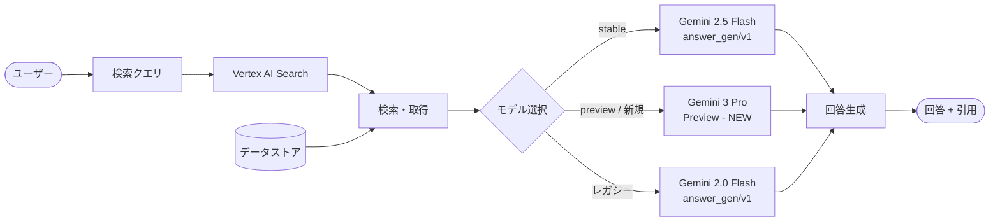

# Vertex AI Search: Gemini 3 Pro による回答生成 (Preview)

**リリース日**: 2026-02-17
**サービス**: Vertex AI Search
**機能**: Gemini 3 Pro による回答生成
**ステータス**: Feature (Preview)

[このアップデートのインフォグラフィックを見る](https://takech9203.github.io/google-cloud-news-summary/20260217-vertex-ai-search-gemini-3-pro.html)

## 概要

Vertex AI Search において、回答生成 (Answer Generation) に Gemini 3 Pro モデルが新たに利用可能になった。これは Preview 段階でのリリースであり、Vertex AI Search の answer メソッドおよび search summaries で Gemini 3 Pro を指定して回答を生成できるようになる。

Vertex AI Search は、エンタープライズ検索と RAG (Retrieval-Augmented Generation) を組み合わせた質問応答システムを提供しており、回答生成に使用する LLM モデルをユーザーが選択できる。今回の Gemini 3 Pro の追加により、従来の Gemini 2.5 Flash や Gemini 2.0 Flash ベースのモデルに加え、より高性能な Pro クラスのモデルを回答生成に活用できるようになった。

対象ユーザーは、Vertex AI Search を利用してカスタム検索アプリケーションや社内ナレッジベースの構築を行っている開発者、および高品質な回答生成を求めるエンタープライズユーザーである。

**アップデート前の課題**

- 回答生成に利用可能なモデルは Gemini 2.5 Flash ベース (stable/preview) および Gemini 2.0 Flash ベースに限定されていた
- Pro クラスのモデルによる高精度な回答生成を Vertex AI Search のネイティブ機能として利用する手段がなかった
- 複雑なクエリや高度な推論が必要な質問応答タスクにおいて、Flash モデルの能力が不足するケースがあった

**アップデート後の改善**

- Gemini 3 Pro モデルを回答生成に指定できるようになり、より高精度な回答が期待できる
- Pro クラスモデルの推論能力により、複雑な質問や多段階の推論を必要とするクエリへの対応が強化された
- Flash モデルと Pro モデルをユースケースに応じて使い分けることで、品質とコストのバランスを最適化できるようになった

## アーキテクチャ図



Vertex AI Search の回答生成パイプラインを示す。ユーザーのクエリに対してデータストアから関連ドキュメントを検索・取得した後、指定されたモデル (Gemini 3 Pro を含む) を使用して回答を生成する。

## サービスアップデートの詳細

### 主要機能

1. **Gemini 3 Pro モデルによる回答生成**
   - Vertex AI Search の answer メソッドおよび search summaries で Gemini 3 Pro を指定可能
   - Pro クラスモデルによる高精度な質問応答が実現
   - Preview 段階のため、モデルは予告なく変更される可能性がある

2. **モデルバージョン指定による柔軟な運用**
   - API リクエスト時に `modelSpec` パラメータで使用するモデルを指定可能
   - `stable` (安定版)、`preview` (プレビュー版)、特定のモデルバージョンから選択
   - ユースケースに応じて品質重視 (Pro) またはレイテンシ・コスト重視 (Flash) を使い分け可能

3. **既存の回答生成機能との互換性**
   - answer メソッドの既存機能 (複雑なクエリ分解、マルチターン会話、ストリーミング応答) はそのまま利用可能
   - フォローアップ質問、チャート生成、画像返却などの拡張機能との組み合わせも対応
   - データストア (構造化、非構造化、ウェブサイト) の種類を問わず利用可能

## 技術仕様

### 回答生成モデルバージョン一覧

Vertex AI Search で利用可能なモデルバージョンの一覧 (Gemini 3 Pro 追加後)。

| モデルバージョン | 説明 | コンテキストウィンドウ | 廃止予定日 |
|---|---|---|---|
| `stable` | デフォルトモデル。現在は `gemini-2.5-flash/answer_gen/v1` を指す | 128K | N/A |
| `preview` | プレビューモデル。Gemini 3 Pro を含む最新モデルを指す。予告なく変更の可能性あり | 128K | N/A |
| `gemini-2.5-flash/answer_gen/v1` | Gemini 2.5 Flash ベースの QA チューニング済みモデル | 128K | 2026-06-17 |
| `gemini-2.0-flash-001/answer_gen/v1` | Gemini 2.0 Flash ベースの QA チューニング済みモデル | 128K | 2026-03-31 |

### モデルの種類

Vertex AI Search は回答生成に 2 種類のモデルを使用する。

| 種類 | 説明 |
|---|---|
| Vertex AI LLM モデル | 質問応答タスクでテスト済みの Vertex AI LLM モデルをそのまま使用 |
| Vertex AI Search チューニング済みモデル | Vertex AI LLM モデルをベースに、質問応答タスク向けに追加チューニングされたモデル |

### API リクエスト例

```json
{
  "query": {
    "text": "Vertex AI Search の料金体系を教えてください"
  },
  "answerGenerationSpec": {
    "modelSpec": {
      "modelVersion": "preview"
    }
  }
}
```

## 設定方法

### 前提条件

1. Google Cloud プロジェクトが作成済みであること
2. Vertex AI Search (AI Applications) API が有効化されていること
3. Vertex AI Search のデータストアおよびアプリが作成済みであること

### 手順

#### ステップ 1: データストアの準備

Vertex AI Search のデータストアにドキュメントをインポートする。構造化データ、非構造化データ、ウェブサイトデータのいずれかを使用可能。

```bash
# gcloud CLI でデータストアの確認
gcloud alpha discovery-engine data-stores list \
  --project=PROJECT_ID \
  --location=global
```

#### ステップ 2: Answer メソッドで Gemini 3 Pro を指定

REST API で answer メソッドを呼び出す際に、`modelSpec.modelVersion` に `preview` を指定する。

```bash
curl -X POST \
  -H "Authorization: Bearer $(gcloud auth print-access-token)" \
  -H "Content-Type: application/json" \
  "https://discoveryengine.googleapis.com/v1/projects/PROJECT_ID/locations/global/collections/default_collection/engines/ENGINE_ID/servingConfigs/default_search:answer" \
  -d '{
    "query": {
      "text": "検索クエリ"
    },
    "answerGenerationSpec": {
      "modelSpec": {
        "modelVersion": "preview"
      }
    }
  }'
```

Preview モデルは現在 Gemini 3 Pro を指すが、将来変更される可能性がある。一貫した応答が必要な場合は、特定のモデルバージョンを指定することを推奨する。

## メリット

### ビジネス面

- **回答品質の向上**: Pro クラスモデルの高い推論能力により、複雑な質問に対してもより正確で包括的な回答を生成でき、ユーザー満足度の向上が期待できる
- **ユースケースの拡大**: 金融、医療、法務など、高精度な回答が求められる専門分野での活用範囲が広がる

### 技術面

- **柔軟なモデル選択**: Flash モデルと Pro モデルをワークロードに応じて切り替えることで、レイテンシ・コスト・品質の最適なバランスを実現できる
- **シームレスな統合**: 既存の Vertex AI Search の answer API のモデルバージョン指定パラメータを変更するだけで利用可能であり、アプリケーションの大幅な改修は不要

## デメリット・制約事項

### 制限事項

- Preview 段階であるため、本番環境での利用は推奨されない
- Preview モデルは予告なく変更される可能性があり、応答の一貫性が保証されない
- Pro モデルは Flash モデルと比較してレイテンシが長く、コストが高くなる可能性がある
- answer メソッドおよび follow-ups 機能はメディアデータストアおよびヘルスケアデータストアには適用できない

### 考慮すべき点

- Preview から GA に移行する際にモデルバージョンの変更が必要になる場合がある
- Gemini 2.0 Flash の廃止予定日 (2026-03-31) が迫っているため、該当モデルを使用中の場合は早めの移行計画を策定すべき
- Pro モデルの利用に伴う料金増加を事前に見積もる必要がある

## ユースケース

### ユースケース 1: 社内ナレッジベースの高精度検索

**シナリオ**: 大規模な社内ドキュメント (技術仕様書、手順書、FAQ) を Vertex AI Search に取り込み、従業員からの複雑な質問に対して正確な回答を生成する。

**実装例**:
```json
{
  "query": {
    "text": "プロジェクト A のセキュリティ要件と、それに対応するネットワーク構成のベストプラクティスを教えてください"
  },
  "answerGenerationSpec": {
    "modelSpec": {
      "modelVersion": "preview"
    },
    "ignoreAdversarialQuery": true,
    "ignoreNonAnswerSeekingQuery": true
  }
}
```

**効果**: Gemini 3 Pro の高い推論能力により、複数のドキュメントにまたがる情報を統合した包括的な回答を生成。複合的な質問の分解と多段階推論により、従来の Flash モデルでは難しかった複雑なクエリにも対応可能。

### ユースケース 2: カスタマーサポートの自動応答

**シナリオ**: 製品ドキュメントやサポート記事をデータストアに格納し、顧客からの問い合わせに対して自動的に正確な回答を生成する。ストリーミング応答を利用してリアルタイムに回答を表示する。

**効果**: Pro モデルの高品質な回答により、エスカレーション率の低減と顧客満足度の向上が期待できる。マルチターン会話機能により、フォローアップ質問にも対応可能。

## 料金

Vertex AI Search の料金は、利用する料金モデル (General または Configurable) によって異なる。

- **General (従量課金)**: 検索クエリ数に基づく従量課金
- **Configurable (サブスクリプション)**: ストレージとクエリの月額サブスクリプション (ストレージ最小 50 GiB/月、クエリ最小 1,000 QPM/プロジェクト)

Gemini 3 Pro (Preview) の利用に伴う追加料金の詳細は、公式料金ページを参照のこと。Preview 段階では料金体系が変更される可能性がある。

詳細は [Vertex AI Search 料金ページ](https://cloud.google.com/generative-ai-app-builder/pricing) を参照。

## 利用可能リージョン

Vertex AI Search は `global` ロケーション、US マルチリージョン、EU マルチリージョンで利用可能。Gemini 3 Pro (Preview) の利用可能リージョンについては、公式ドキュメントを参照。

## 関連サービス・機能

- **Vertex AI (Gemini API)**: Gemini 3 Pro は Vertex AI のジェネレーティブ AI サービスとしても利用可能。直接 API 呼び出しやグラウンディング機能との組み合わせが可能
- **Vertex AI Search ストリーミング応答**: answer メソッドのストリーミング版により、回答を逐次的に返却してレイテンシを低減 (GA)
- **Vertex AI Search MCP サーバー**: Model Context Protocol (MCP) サーバーを介した Vertex AI Search の利用 (Public Preview)
- **Vertex AI RAG Engine**: Vertex AI Search のデータストアを利用したグラウンディングの代替・補完手段

## 参考リンク

- [インフォグラフィック](https://takech9203.github.io/google-cloud-news-summary/20260217-vertex-ai-search-gemini-3-pro.html)
- [公式リリースノート](https://cloud.google.com/release-notes#February_17_2026)
- [回答生成モデルバージョンとライフサイクル](https://cloud.google.com/generative-ai-app-builder/docs/answer-generation-models)
- [回答とフォローアップの取得](https://cloud.google.com/generative-ai-app-builder/docs/answer)
- [検索サマリーの取得](https://cloud.google.com/generative-ai-app-builder/docs/get-search-summaries)
- [Vertex AI モデルライフサイクルポリシー](https://cloud.google.com/vertex-ai/generative-ai/docs/learn/model-versioning)
- [料金ページ](https://cloud.google.com/generative-ai-app-builder/pricing)

## まとめ

Vertex AI Search に Gemini 3 Pro モデルが Preview として追加されたことで、回答生成の品質が大幅に向上する可能性がある。特に複雑な質問や高度な推論を必要とするエンタープライズ検索ユースケースにおいて、Pro クラスモデルの恩恵が大きい。現在は Preview 段階であるため、本番適用前に十分な検証を行い、GA リリースに備えてモデル移行計画を策定することを推奨する。また、Gemini 2.0 Flash の廃止予定日 (2026-03-31) が近づいているため、該当モデルを使用している場合は早期の移行を検討すべきである。

---

**タグ**: #VertexAISearch #Gemini3Pro #GenerativeAI #AnswerGeneration #RAG #EnterpriseSearch #Preview
