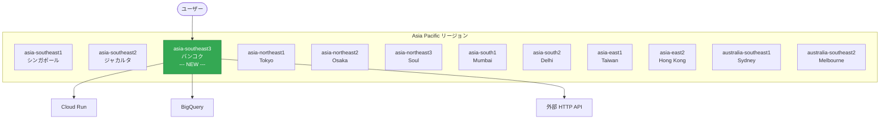

# Workflows: asia-southeast3 (Bangkok, Thailand) リージョン対応

**リリース日**: 2026-02-17
**サービス**: Workflows
**機能**: asia-southeast3 リージョンサポート追加
**ステータス**: Changed (GA)

[このアップデートのインフォグラフィックを見る](https://takech9203.github.io/google-cloud-news-summary/20260217-workflows-asia-southeast3.html)

## 概要

Google Cloud Workflows が新たに asia-southeast3 (バンコク, タイ) リージョンで利用可能になった。Workflows はフルマネージドのサーバーレスオーケストレーションプラットフォームであり、Cloud Run、Cloud Run functions、BigQuery、Cloud Vision AI などの Google Cloud サービスや任意の HTTP ベース API を定義した順序で実行できる。

今回のリージョン拡張により、タイおよび東南アジア地域のユーザーは、データレジデンシー要件を満たしながらワークフローをデプロイ・実行できるようになる。asia-southeast3 リージョンは 2026 年 1 月に Google Cloud で一般提供が開始された比較的新しいリージョンであり、Compute Engine、Cloud Storage、GKE、Cloud Build などのサービスが順次対応を進めている中での Workflows の対応となる。

**アップデート前の課題**

- 東南アジアで Workflows を利用する場合、最寄りのリージョンは asia-southeast1 (シンガポール) または asia-southeast2 (ジャカルタ) に限られていた
- タイ国内のデータレジデンシー要件がある場合、Workflows をタイ国内で実行する手段がなかった
- バンコク近郊からワークフローを実行する際、シンガポールやジャカルタへのネットワークレイテンシが発生していた

**アップデート後の改善**

- asia-southeast3 (バンコク) リージョンで Workflows のデプロイと実行が可能になった
- タイ国内のデータレジデンシー要件に対応したワークフローオーケストレーションが実現可能になった
- バンコク近郊のサービスとの連携において、同一リージョン内での通信によりレイテンシが低減される

## アーキテクチャ図



Workflows の Asia Pacific リージョン展開図。asia-southeast3 (バンコク) が新たに追加され、同リージョン内の Cloud Run や BigQuery などのサービスとオーケストレーションが可能になった。

## サービスアップデートの詳細

### 主要機能

1. **asia-southeast3 リージョンでのワークフローデプロイ**
   - バンコクリージョンでワークフロー定義のデプロイが可能
   - デプロイされたワークフローはそのリージョン内で実行される

2. **リソースロケーション制約への対応**
   - Workflows はリージョナルサービスであり、リソースロケーション制約 (組織ポリシー) に従う
   - asia-southeast3 を許可ロケーションに設定することで、タイ国内でのデータ処理を保証可能

3. **既存機能のフルサポート**
   - HTTP リクエスト、コネクタ、並列ステップ、コールバック、サブワークフローなど全機能が利用可能
   - Cloud Scheduler との連携によるスケジュール実行にも対応

## 技術仕様

### Workflows サービス概要

| 項目 | 詳細 |
|------|------|
| サービスタイプ | フルマネージド・サーバーレス |
| ワークフロー定義 | YAML または JSON |
| 最大実行時間 | 最大 1 年間 |
| スケーリング | 自動 (ゼロスケール対応) |
| 変数サイズ上限 | 512 KB |
| 認証 | IAM ベース (OAuth 2.0 / OIDC) |

### asia-southeast3 リージョン情報

| 項目 | 詳細 |
|------|------|
| リージョン名 | asia-southeast3 |
| ロケーション | バンコク, タイ |
| ゾーン | asia-southeast3-a, asia-southeast3-b, asia-southeast3-c |

## 設定方法

### 前提条件

1. Google Cloud プロジェクトが有効であること
2. Workflows API が有効化されていること
3. 適切な IAM 権限 (workflows.workflows.create) が付与されていること

### 手順

#### ステップ 1: Workflows API の有効化

```bash
gcloud services enable workflows.googleapis.com \
    --project=PROJECT_ID
```

#### ステップ 2: ワークフローを asia-southeast3 リージョンにデプロイ

```bash
gcloud workflows deploy my-workflow \
    --source=workflow.yaml \
    --location=asia-southeast3 \
    --project=PROJECT_ID
```

#### ステップ 3: ワークフローの実行

```bash
gcloud workflows run my-workflow \
    --location=asia-southeast3 \
    --project=PROJECT_ID
```

## メリット

### ビジネス面

- **データレジデンシーの遵守**: タイ国内のデータ保護規制 (PDPA: Personal Data Protection Act) に対応するワークフロー処理が可能
- **東南アジア市場への展開強化**: タイを拠点とするビジネスやタイ市場向けアプリケーションにおいて、低レイテンシのオーケストレーションが実現

### 技術面

- **レイテンシの低減**: バンコク近郊からのワークフロー実行において、シンガポールやジャカルタへの通信が不要
- **同一リージョン内のサービス連携**: asia-southeast3 で稼働する Cloud Run、Cloud Storage、BigQuery などとの連携で最適なパフォーマンスを発揮

## デメリット・制約事項

### 制限事項

- ワークフローから HTTP リクエストやコネクタを使用する場合、HTTP コールの発信元はデプロイリージョンと異なる可能性がある (Workflows の仕様)
- asia-southeast3 は比較的新しいリージョンのため、一部の Google Cloud サービスがまだ対応していない可能性がある

### 考慮すべき点

- 既存のワークフローを別リージョンから asia-southeast3 に移行する場合、再デプロイが必要
- 組織ポリシーでリソースロケーション制約を使用している場合、asia-southeast3 を許可リストに追加する必要がある

## ユースケース

### ユースケース 1: タイ国内 EC サイトの注文処理オーケストレーション

**シナリオ**: タイ国内の EC プラットフォームで、注文受付から在庫確認、決済処理、配送手配までのプロセスを Workflows で自動化する。

**実装例**:
```yaml
main:
  steps:
    - receive_order:
        call: http.post
        args:
          url: https://order-service-xxxxx-as.a.run.app/validate
          body:
            order_id: ${args.order_id}
        result: order_details
    - check_inventory:
        call: http.get
        args:
          url: https://inventory-service-xxxxx-as.a.run.app/check
          query:
            item_id: ${order_details.body.item_id}
        result: inventory_status
    - process_payment:
        switch:
          - condition: ${inventory_status.body.available}
            call: http.post
            args:
              url: https://payment-service-xxxxx-as.a.run.app/charge
              body:
                order_id: ${args.order_id}
                amount: ${order_details.body.total}
            result: payment_result
```

**効果**: タイ国内のデータレジデンシー要件を満たしながら、低レイテンシでビジネスプロセスを自動化できる。

### ユースケース 2: タイ拠点の IoT データパイプライン

**シナリオ**: タイの製造工場に設置された IoT センサーからのデータを収集し、BigQuery に格納してレポートを生成する。

**効果**: asia-southeast3 リージョン内でデータの収集から分析までを完結させることで、データの越境転送を回避し、処理速度を向上させる。

## 料金

Workflows の料金はリージョンに関係なく、実行されたステップ数に基づく従量課金制である。

- 無料枠: 毎月最初の 5,000 ステップは無料
- 有料枠: 5,000 ステップ超過分は実行ステップ数に応じて課金

詳細な料金については [Workflows 料金ページ](https://cloud.google.com/workflows/pricing) を参照。

## 利用可能リージョン

今回の追加により、Workflows は以下のリージョンで利用可能となった (Asia Pacific のみ抜粋)。

| リージョン名 | ロケーション |
|-------------|-------------|
| asia-east1 | 彰化県, 台湾 |
| asia-east2 | 香港, 中国 |
| asia-northeast1 | 東京, 日本 |
| asia-northeast2 | 大阪, 日本 |
| asia-northeast3 | ソウル, 韓国 |
| asia-south1 | ムンバイ, インド |
| asia-south2 | デリー, インド |
| asia-southeast1 | シンガポール |
| asia-southeast2 | ジャカルタ, インドネシア |
| **asia-southeast3** | **バンコク, タイ (NEW)** |
| australia-southeast1 | シドニー, オーストラリア |
| australia-southeast2 | メルボルン, オーストラリア |

上記に加え、Americas (14 リージョン)、Europe (13 リージョン)、Middle East (3 リージョン)、Africa (1 リージョン) でも利用可能。合計 44 以上のリージョンで Workflows が利用できる。

## 関連サービス・機能

- **Cloud Run**: Workflows から HTTP リクエストやコネクタを通じて呼び出し可能なサーバーレスコンピューティングサービス
- **Cloud Scheduler**: Workflows のスケジュール実行に使用。cron 形式でワークフロー実行をスケジューリング可能
- **Eventarc**: イベントドリブンなワークフロー実行トリガーとして連携
- **Cloud Logging**: ワークフロー実行ログの自動記録先。カスタムログにも対応
- **Cloud Composer**: より複雑なデータパイプラインオーケストレーション向けの代替サービス (Apache Airflow ベース)

## 参考リンク

- [インフォグラフィック](https://takech9203.github.io/google-cloud-news-summary/20260217-workflows-asia-southeast3.html)
- [公式リリースノート](https://cloud.google.com/release-notes#February_17_2026)
- [Workflows ドキュメント](https://cloud.google.com/workflows/docs/overview)
- [Workflows ロケーション](https://cloud.google.com/workflows/docs/locations)
- [料金ページ](https://cloud.google.com/workflows/pricing)

## まとめ

Workflows の asia-southeast3 (バンコク) リージョン対応により、タイおよび周辺地域のユーザーはデータレジデンシー要件を満たしつつ、低レイテンシでサーバーレスオーケストレーションを利用可能になった。タイ市場向けのアプリケーションや、タイ国内のデータ処理規制 (PDPA) への対応が求められるワークロードにおいて、asia-southeast3 リージョンへの Workflows デプロイを検討することを推奨する。

---

**タグ**: #Workflows #asia-southeast3 #Bangkok #RegionExpansion #Serverless #Orchestration #AsiaPacific #GoogleCloud
