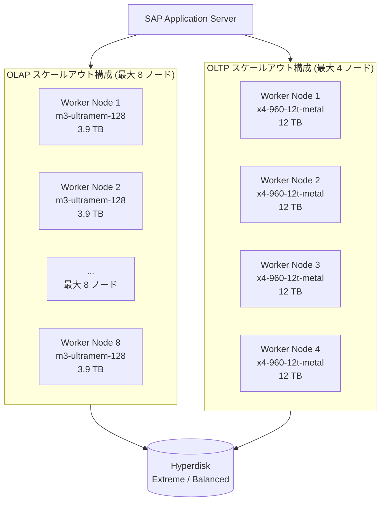

# SAP on Google Cloud: 新しい SAP HANA マシンタイプ認定 (OLAP/OLTP)

**リリース日**: 2026-02-18
**サービス**: SAP on Google Cloud
**機能**: SAP HANA スケールアウト構成向け新マシンタイプ認定
**ステータス**: Announcement (GA)

[このアップデートのインフォグラフィックを見る](https://takech9203.github.io/google-cloud-news-summary/20260218-sap-hana-new-machine-type-certifications.html)

## 概要

SAP は、Google Cloud 上の SAP HANA ワークロード向けに、新たなマシンタイプのスケールアウト構成認定を発表した。今回の認定により、M3、M4、X4 シリーズの複数のマシンタイプが、OLAP および OLTP ワークロードのスケールアウト構成で公式にサポートされるようになった。

具体的には、OLAP ワークロード向けに m3-ultramem-128、m4-hypermem-64、x4-480-6t-metal、x4-480-8t-metal、x4-960-12t-metal の 5 つのマシンタイプが最大 8 ノードのスケールアウト構成で認定された。また、OLTP ワークロード向けには x4-480-8t-metal と x4-960-12t-metal の 2 つのマシンタイプが最大 4 ノードのスケールアウト構成で認定された。

この認定は、大規模な SAP HANA データベースを Google Cloud 上で運用する企業にとって重要なアップデートであり、特に数十 TB 規模のインメモリデータベースを必要とするエンタープライズ顧客に対して、水平スケーリングの選択肢を大幅に拡大するものである。

**アップデート前の課題**

- m3-ultramem-128 は OLAP/OLTP ともにスケールアップのみの認定であり、スケールアウト構成には対応していなかった
- m4-hypermem-64 はスケールアップのみの認定で、複数ノードでの分散処理ができなかった
- x4-480-6t-metal、x4-480-8t-metal、x4-960-12t-metal はスケールアップのみの認定であり、スケールアウト構成は利用できなかった
- 大規模な OLAP 分析ワークロードで数十 TB のデータを扱う場合、単一ノードのメモリ容量に制約されていた

**アップデート後の改善**

- m3-ultramem-128 (3,904 GB メモリ) が OLAP スケールアウトで最大 8 ノードに対応し、最大約 31 TB のインメモリ処理が可能になった
- m4-hypermem-64 (992 GB メモリ) が OLAP スケールアウトで最大 8 ノードに対応した
- x4-480-6t-metal (6,144 GB) と x4-480-8t-metal (8,192 GB) が OLAP スケールアウトで最大 8 ノードに対応し、最大約 49 TB / 65 TB のインメモリ分析が可能になった
- x4-960-12t-metal (12,288 GB) が OLAP スケールアウトで最大 8 ノードに対応し、最大約 98 TB のインメモリ分析が可能になった
- x4-480-8t-metal と x4-960-12t-metal が OLTP スケールアウトで最大 4 ノードに対応し、大規模トランザクション処理の分散が可能になった

## アーキテクチャ図

上図は、今回新たに認定された SAP HANA スケールアウト構成の概要を示している。OLAP ワークロードは最大 8 ノード、OLTP ワークロードは最大 4 ノードのスケールアウト構成がサポートされる。

## サービスアップデートの詳細

### 主要機能

1. **OLAP スケールアウト認定 (最大 8 ノード)**
   - m3-ultramem-128、m4-hypermem-64、x4-480-6t-metal、x4-480-8t-metal、x4-960-12t-metal が対象
   - 複数ノードにデータを分散し、大規模な分析クエリを並列処理可能
   - ノード数に応じてメモリ容量を線形にスケール可能

2. **OLTP スケールアウト認定 (最大 4 ノード)**
   - x4-480-8t-metal と x4-960-12t-metal が対象
   - 大規模なトランザクション処理ワークロードの分散実行が可能
   - SAP S/4HANA などの OLTP アプリケーションでのスケールアウトに対応

3. **ベアメタルインスタンスのスケールアウト対応拡大**
   - X4 シリーズのベアメタルインスタンスが新たにスケールアウト認定を取得
   - Intel Sapphire Rapids プロセッサ搭載による高パフォーマンス
   - Hyperdisk Extreme / Balanced ストレージとの組み合わせ

## 技術仕様

### 今回認定されたマシンタイプ一覧

| マシンタイプ | vCPU | メモリ | CPU プラットフォーム | OLAP スケールアウト | OLTP スケールアウト |
|---|---|---|---|---|---|
| m3-ultramem-128 | 128 | 3,904 GB (約 3.8 TB) | Intel Ice Lake | 最大 8 ノード | - |
| m4-hypermem-64 | 64 | 992 GB (約 1 TB) | Intel Emerald Rapids | 最大 8 ノード | - |
| x4-480-6t-metal | 480 | 6,144 GB (6 TB) | Intel Sapphire Rapids | 最大 8 ノード | - |
| x4-480-8t-metal | 480 | 8,192 GB (8 TB) | Intel Sapphire Rapids | 最大 8 ノード | 最大 4 ノード |
| x4-960-12t-metal | 960 | 12,288 GB (12 TB) | Intel Sapphire Rapids | 最大 8 ノード | 最大 4 ノード |

### スケールアウト構成時の最大メモリ容量

| マシンタイプ | OLAP (8 ノード) | OLTP (4 ノード) |
|---|---|---|
| m3-ultramem-128 | 約 31.2 TB | - |
| m4-hypermem-64 | 約 7.9 TB | - |
| x4-480-6t-metal | 約 49.2 TB | - |
| x4-480-8t-metal | 約 65.5 TB | 約 32.8 TB |
| x4-960-12t-metal | 約 98.3 TB | 約 49.2 TB |

### 対応ブロックストレージ

| マシンタイプ | 対応ストレージ |
|---|---|
| m3-ultramem-128 | Compute Engine Persistent Disk, Hyperdisk Extreme, Hyperdisk Balanced |
| m4-hypermem-64 | Hyperdisk Balanced |
| x4-480-6t-metal | Hyperdisk Extreme, Hyperdisk Balanced |
| x4-480-8t-metal | Hyperdisk Extreme, Hyperdisk Balanced |
| x4-960-12t-metal | Hyperdisk Extreme, Hyperdisk Balanced |

### 対応 OS

| OS | バージョン |
|---|---|
| RHEL for SAP | 9.6, 9.4, 8.10, 8.8 (X4 はカーネルバージョン要件あり) |
| SLES for SAP | 15 SP7, 15 SP6, 15 SP5, 15 SP4 (X4 はカーネルバージョン要件あり) |

X4 およびベアメタルインスタンスでは、RHEL 9.4 以降は最小カーネルバージョン `5.14.0-427.70.1.el9_4`、SLES 15 SP6 以降は最小カーネルバージョン `6.4.0-150600.23.38.1` が必要である。

## メリット

### ビジネス面

- **大規模データ分析の実現**: スケールアウト構成により、単一ノードのメモリ制約を超えた大規模なインメモリ分析が可能になり、より大きなデータセットに対するリアルタイム分析を実施できる
- **投資保護**: 既存の M3、M4、X4 マシンタイプの利用者は、同じマシンファミリでスケールアウトに移行でき、アーキテクチャの一貫性を保てる
- **柔軟なキャパシティプランニング**: ワークロードの成長に応じてノードを追加するスケールアウト戦略が可能になり、初期投資を抑えた段階的な拡張ができる

### 技術面

- **水平スケーリング**: データを複数ノードに分散配置し、クエリの並列処理によるパフォーマンス向上が期待できる
- **最大 98 TB のインメモリ処理**: x4-960-12t-metal の 8 ノード構成で、業界最大級のインメモリ分析環境を構築可能
- **高性能ストレージ連携**: Hyperdisk Extreme/Balanced との組み合わせにより、永続ストレージでも高い I/O パフォーマンスを確保できる

## デメリット・制約事項

### 制限事項

- OLTP スケールアウトは x4-480-8t-metal と x4-960-12t-metal のみが対象であり、m3-ultramem-128 と m4-hypermem-64 は OLAP スケールアウトのみ対応
- X4 ベアメタルインスタンスは Hyperdisk のみ対応し、Persistent Disk は使用不可 (ブートボリュームも含む)
- X4 マシンシリーズは特定のゾーン・リージョンでのみ利用可能
- m4-hypermem-64 は Hyperdisk Balanced のみ対応で、Hyperdisk Extreme は使用不可
- X4 マシンシリーズはカスタムマシン構成に非対応 (事前定義のマシンタイプのみ)

### 考慮すべき点

- スケールアウト構成では、ノード間通信のネットワーク帯域幅とレイテンシがパフォーマンスに影響するため、ネットワーク設計が重要
- ベアメタルインスタンスは専用ホストサーバーを必要とし、コストが高くなる傾向がある
- スケールアウト構成の HA (高可用性) 構成には Pacemaker クラスタや majority maker ノードなど追加の構成が必要
- リージョナル Persistent Disk はメモリ最適化マシンタイプでは使用不可であるため、DR 戦略には別のアプローチが必要

## ユースケース

### ユースケース 1: 大規模 BW/4HANA 分析基盤

**シナリオ**: エンタープライズ規模の SAP BW/4HANA 環境で、数十 TB のデータウェアハウスをインメモリで処理する必要がある場合。

**構成例**:
- x4-480-8t-metal x 8 ノード (OLAP スケールアウト)
- 合計メモリ: 約 65.5 TB
- ストレージ: 各ノードに Hyperdisk Extreme

**効果**: 単一ノード (最大 8 TB) では収まらない大規模分析ワークロードを、8 ノードのスケールアウト構成で処理可能。リアルタイムに近い分析レスポンスを実現。

### ユースケース 2: 大規模 S/4HANA トランザクション基盤

**シナリオ**: グローバル企業の SAP S/4HANA 環境で、大量の同時トランザクション処理と大規模マスターデータを扱う場合。

**構成例**:
- x4-960-12t-metal x 4 ノード (OLTP スケールアウト)
- 合計メモリ: 約 49.2 TB
- ストレージ: 各ノードに Hyperdisk Extreme + Hyperdisk Balanced

**効果**: 大規模な OLTP ワークロードを複数ノードに分散し、トランザクション処理のスループットを向上。SAP S/4HANA のスケールアウトにも対応。

## 料金

今回認定されたマシンタイプの料金は、Compute Engine のメモリ最適化マシンファミリの料金体系に準ずる。X4、M4、M3 シリーズはリソースベースの確約利用割引 (CUD) に対応しており、3 年契約で 60% 以上の割引が適用される。M2 および M1 シリーズでは継続利用割引 (SUD) により最大 30% の割引も利用可能。

詳細な料金については以下を参照。

- [Compute Engine VM インスタンスの料金](https://cloud.google.com/compute/vm-instance-pricing)
- [メモリ最適化マシンタイプの料金](https://cloud.google.com/compute/all-pricing#memory-optimized)

## 利用可能リージョン

各マシンタイプの利用可能なリージョン・ゾーンは異なる。特に X4 ベアメタルインスタンスは限られたリージョンでのみ提供されている。最新のリージョン対応状況については [Available regions & zones](https://cloud.google.com/compute/docs/regions-zones#available) を参照。

## 関連サービス・機能

- **Compute Engine**: SAP HANA を実行するための基盤となるコンピューティングサービス。今回認定されたマシンタイプはすべて Compute Engine のメモリ最適化マシンファミリに属する
- **Hyperdisk**: X4 ベアメタルインスタンスで必須のブロックストレージ。Hyperdisk Extreme は SAP HANA の /hana/data および /hana/log ボリュームで最高のパフォーマンスを提供
- **Cloud Monitoring / Cloud Logging**: SAP HANA スケールアウト環境の監視・ログ管理に使用
- **Terraform for SAP**: Google Cloud が提供する Terraform テンプレートにより、SAP HANA スケールアウト構成の自動デプロイが可能
- **Google Cloud NetApp Volumes**: 一部のマシンタイプでスケールアップ構成時の NFS ストレージオプションとして利用可能 (スケールアウト構成でのサポートはマシンタイプにより異なる)

## 参考リンク

- [インフォグラフィック](https://takech9203.github.io/google-cloud-news-summary/20260218-sap-hana-new-machine-type-certifications.html)
- [公式リリースノート](https://cloud.google.com/release-notes#February_18_2026)
- [Certified Compute Engine machine types for SAP HANA](https://cloud.google.com/sap/docs/certifications-sap-hana)
- [SAP HANA Planning Guide](https://cloud.google.com/sap/docs/sap-hana-planning-guide)
- [Memory-optimized machine family](https://cloud.google.com/compute/docs/memory-optimized-machines)
- [SAP HANA scale-out HA cluster configuration (SLES)](https://cloud.google.com/sap/docs/sap-hana-ha-scaleout-config-sles)
- [SAP HANA scale-out HA cluster configuration (RHEL)](https://cloud.google.com/sap/docs/sap-hana-ha-scaleout-config-rhel)
- [Compute Engine VM インスタンスの料金](https://cloud.google.com/compute/vm-instance-pricing)
- [SAP Certified and Supported SAP HANA Hardware Directory](https://www.sap.com/dmc/exp/2014-09-02-hana-hardware/enEN/#/solutions?filters=iaas;ve:29)

## まとめ

今回のアップデートにより、Google Cloud 上の SAP HANA ワークロードに対して、M3、M4、X4 シリーズの複数のマシンタイプがスケールアウト構成で新たに認定された。特に X4 ベアメタルインスタンスの OLAP 8 ノード / OLTP 4 ノード対応は、数十 TB 規模のインメモリ処理を必要とする大規模エンタープライズ環境にとって大きな進展である。SAP HANA の大規模展開を検討している組織は、スケールアウト構成の新たな選択肢として今回認定されたマシンタイプを評価することを推奨する。

---

**タグ**: SAP, Compute Engine, SAP HANA, OLAP, OLTP, Scale-out, Memory-optimized, X4, M3, M4, Bare Metal
