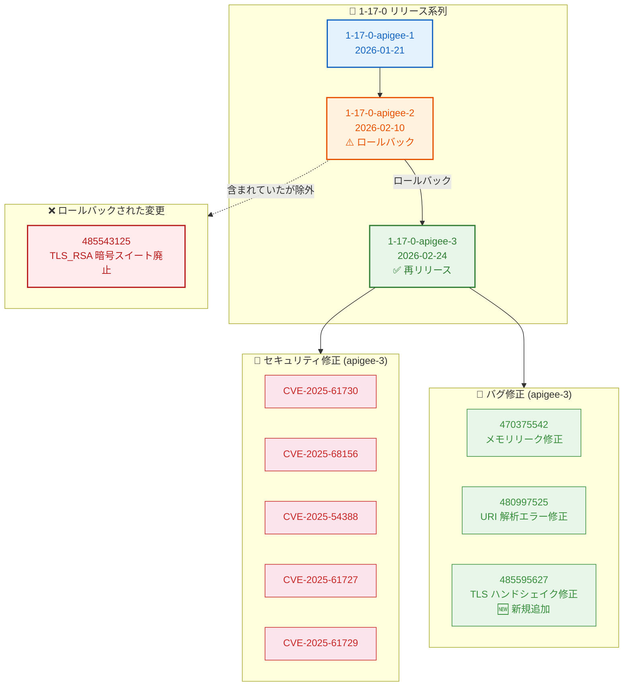

# Apigee X: セキュリティアップデート バージョン 1-17-0-apigee-3

**リリース日**: 2026-02-24
**サービス**: Apigee X
**機能**: セキュリティ修正およびバグ修正 (バージョン 1-17-0-apigee-3)
**ステータス**: Announcement, Security, Fixed

[このアップデートのインフォグラフィックを見る](https://takech9203.github.io/google-cloud-news-summary/20260224-apigee-x-security-update-1-17-0-3.html)

## 概要

2026 年 2 月 24 日、Google Cloud は Apigee の更新バージョン 1-17-0-apigee-3 をリリースした。本リリースは、2 月 10 日にリリースされた 1-17-0-apigee-2 がロールバックされたことを受けた再リリースであり、Apigee インフラストラクチャに存在する 5 件のセキュリティ脆弱性 (CVE-2025-61730、CVE-2025-68156、CVE-2025-54388、CVE-2025-61727、CVE-2025-61729) の修正に加え、メモリリーク、URI 解析エラー、TLS ハンドシェイクエラーの 3 件のバグ修正を含む。

前バージョン 1-17-0-apigee-2 では、TLS_RSA 暗号スイートのサポート廃止 (Bug ID: 485543125) が含まれていたが、これがロールバックの原因となった。本バージョン 1-17-0-apigee-3 では、TLS_RSA 暗号スイートの廃止は含まれず、代わりに TLS ハンドシェイクエラーの修正 (Bug ID: 485595627) が新たに追加されている。ロールアウトは 2 月 24 日に開始され、すべての Google Cloud ゾーンへの展開には 4 営業日以上かかる可能性がある。

Apigee X を利用するすべての組織が対象であり、ユーザー側でのアクション不要で自動的に適用される。API 管理プラットフォームのセキュリティと安定性を維持するため、ロールアウトの完了状況を確認することが推奨される。

**アップデート前の課題**

本アップデート適用前には、以下の課題が存在していた。

- Apigee インフラストラクチャに 5 件のセキュリティ脆弱性 (CVE-2025-61730、CVE-2025-68156、CVE-2025-54388、CVE-2025-61727、CVE-2025-61729) が存在していた
- メモリリークにより 503 レスポンスが "no_healthy_upstream" メッセージとともに急増する可能性があった (Bug ID: 470375542)
- Netty アップグレード後、プロキシ呼び出しが "The URI contains illegal characters" エラーで失敗するケースがあった (Bug ID: 480997525)
- TLS ハンドシェイクエラーが発生するケースがあった (Bug ID: 485595627)
- 前バージョン 1-17-0-apigee-2 が TLS_RSA 暗号スイート廃止に起因する問題でロールバックされ、セキュリティ修正とバグ修正が未適用の状態が継続していた

**アップデート後の改善**

今回のアップデートにより、以下の改善が実現した。

- 5 件のインフラストラクチャ CVE が修正され、Apigee 基盤のセキュリティが向上した
- メモリリークが解消され、503 レスポンスの急増が防止されることでサービスの安定性が向上した
- URI 解析の不具合が修正され、プロキシ呼び出しの信頼性が回復した
- TLS ハンドシェイクエラーが修正され、TLS 接続の安定性が向上した
- TLS_RSA 暗号スイートの廃止はロールバックされ、既存の TLS 設定との互換性が維持された

## アーキテクチャ図

この図は、1-17-0 リリース系列の経緯と、バージョン 1-17-0-apigee-3 に含まれるセキュリティ修正・バグ修正、およびロールバックにより除外された変更の関係を示している。apigee-2 からの主な変更点は、TLS_RSA 暗号スイート廃止の撤回と TLS ハンドシェイクエラー修正の追加である。

## サービスアップデートの詳細

### 主要機能

1. **インフラストラクチャセキュリティ修正 (Bug ID: 481735779, 457138941, 471232237)**
   - CVE-2025-61730: Apigee インフラストラクチャのセキュリティ脆弱性を修正
   - CVE-2025-68156: Apigee インフラストラクチャのセキュリティ脆弱性を修正
   - CVE-2025-54388: Apigee インフラストラクチャのセキュリティ脆弱性を修正
   - CVE-2025-61727: Apigee インフラストラクチャのセキュリティ脆弱性を修正
   - CVE-2025-61729: Apigee インフラストラクチャのセキュリティ脆弱性を修正

2. **メモリリーク修正 (Bug ID: 470375542)**
   - 503 レスポンスが "no_healthy_upstream" メッセージとともに急増する原因となるメモリリークを修正
   - 長時間稼働する Apigee インスタンスにおける安定性が向上

3. **URI 解析エラー修正 (Bug ID: 480997525)**
   - Netty アップグレード後にプロキシ呼び出しが "The URI contains illegal characters" エラーで失敗する問題を修正

4. **TLS ハンドシェイクエラー修正 (Bug ID: 485595627)**
   - TLS ハンドシェイクエラーが発生する問題を修正
   - 本修正は 1-17-0-apigee-3 で新たに追加されたもので、前バージョン 1-17-0-apigee-2 には含まれていなかった

### ロールバックされた変更

1-17-0-apigee-2 に含まれていた以下の変更は、本バージョンには含まれていない。

- **TLS_RSA 暗号スイートのサポート廃止 (Bug ID: 485543125)**: 以下の暗号スイートの廃止はロールバックされ、引き続きサポートされる
  - `TLS_RSA_WITH_AES_256_GCM_SHA384`
  - `TLS_RSA_WITH_AES_128_GCM_SHA256`
  - `TLS_RSA_WITH_AES_256_CBC_SHA256`
  - `TLS_RSA_WITH_AES_128_CBC_SHA256`
  - `TLS_RSA_WITH_AES_256_CBC_SHA`
  - `TLS_RSA_WITH_AES_128_CBC_SHA`

## 技術仕様

### CVE 一覧

以下の表は、本リリースで対処されたセキュリティ脆弱性の一覧である。

| CVE 番号 | Bug ID | 説明 |
|----------|--------|------|
| [CVE-2025-61730](https://nvd.nist.gov/vuln/detail/CVE-2025-61730) | 481735779, 457138941, 471232237 | Apigee インフラストラクチャのセキュリティ修正 |
| [CVE-2025-68156](https://nvd.nist.gov/vuln/detail/CVE-2025-68156) | 481735779, 457138941, 471232237 | Apigee インフラストラクチャのセキュリティ修正 |
| [CVE-2025-54388](https://nvd.nist.gov/vuln/detail/CVE-2025-54388) | 481735779, 457138941, 471232237 | Apigee インフラストラクチャのセキュリティ修正 |
| [CVE-2025-61727](https://nvd.nist.gov/vuln/detail/CVE-2025-61727) | 481735779, 457138941, 471232237 | Apigee インフラストラクチャのセキュリティ修正 |
| [CVE-2025-61729](https://nvd.nist.gov/vuln/detail/CVE-2025-61729) | 481735779, 457138941, 471232237 | Apigee インフラストラクチャのセキュリティ修正 |

### バグ修正一覧

| Bug ID | 説明 | 備考 |
|--------|------|------|
| 470375542 | メモリリークにより 503 レスポンス ("no_healthy_upstream") が急増する問題を修正 | apigee-2 から継続 |
| 480997525 | Netty アップグレード後にプロキシ呼び出しが "The URI contains illegal characters" エラーで失敗する問題を修正 | apigee-2 から継続 |
| 485595627 | TLS ハンドシェイクエラーが発生する問題を修正 | apigee-3 で新規追加 |

### バージョン履歴 (1-17-0 系列)

| リリース日 | バージョン | 主な内容 | ステータス |
|-----------|-----------|----------|-----------|
| 2026-01-21 | 1-17-0-apigee-1 | 13 件の CVE 修正、TLS 検証強化、SSE クォータ更新 | 適用済 |
| 2026-02-10 | 1-17-0-apigee-2 | 5 件の CVE 修正、メモリリーク修正、URI 解析修正、TLS_RSA 廃止 | ロールバック |
| 2026-02-24 | 1-17-0-apigee-3 | 5 件の CVE 修正、メモリリーク修正、URI 解析修正、TLS ハンドシェイク修正 | 適用中 |

### apigee-2 と apigee-3 の差分

| 項目 | apigee-2 (ロールバック) | apigee-3 (本リリース) |
|------|------------------------|----------------------|
| CVE 修正 (5 件) | 含む | 含む |
| メモリリーク修正 (470375542) | 含む | 含む |
| URI 解析修正 (480997525) | 含む | 含む |
| TLS_RSA 暗号スイート廃止 (485543125) | 含む | 含まない (ロールバック) |
| TLS ハンドシェイク修正 (485595627) | 含まない | 含む (新規追加) |

## メリット

### ビジネス面

- **サービス可用性の向上**: メモリリーク修正により 503 エラーの急増が防止され、API サービスの安定性が大幅に改善される。高トラフィック環境においてエンドユーザーへのサービス品質が維持される
- **セキュリティ体制の強化**: 5 件の CVE 修正により、API 管理プラットフォームのセキュリティが向上し、コンプライアンス要件への準拠が維持される
- **既存設定との互換性維持**: TLS_RSA 暗号スイートの廃止がロールバックされたことで、既存の TLS 設定を使用しているクライアントとの接続が維持される

### 技術面

- **インフラストラクチャの堅牢性**: 複数のインフラストラクチャ脆弱性が解消され、Apigee 基盤の攻撃対象面が縮小された
- **URI 処理の信頼性**: Netty アップグレードに起因する URI 解析エラーが解消され、プロキシ呼び出しの信頼性が回復した
- **TLS 接続の安定性**: TLS ハンドシェイクエラーの修正により、TLS 通信の信頼性が向上した
- **メモリ管理の改善**: メモリリークの修正により、長時間稼働するインスタンスの安定性が向上し、予期しない再起動や障害のリスクが低減された

## デメリット・制約事項

### 制限事項

- ロールアウトはすべての Google Cloud ゾーンへの展開に 4 営業日以上かかる場合がある
- ロールアウトが完了するまで、一部のインスタンスには修正が適用されない
- TLS_RSA 暗号スイートの廃止は今回見送られたが、将来のリリースで再度実施される可能性がある。TLS_RSA 暗号スイートに依存している場合は、より安全な暗号スイートへの移行を計画することが推奨される

### 考慮すべき点

- 自動ロールアウトのため、ユーザー側での適用タイミングの制御はできない
- Apigee Hybrid を利用している場合は、本リリースの対象外であるため、別途 Hybrid リリースノートを確認する必要がある
- 前バージョン 1-17-0-apigee-2 のロールバック期間中 (2 月 10 日～2 月 24 日)、セキュリティ修正とバグ修正が適用されていない期間があった可能性がある

## ユースケース

### ユースケース 1: 高トラフィック API ゲートウェイの安定性確保

**シナリオ**: EC サイトやモバイルアプリのバックエンドとして Apigee X を利用する企業が、ピーク時に大量の API トラフィックを処理している。メモリリークに起因する 503 エラーの急増により、エンドユーザーへのサービスが断続的に中断していた。

**効果**: Bug ID 470375542 のメモリリーク修正により、"no_healthy_upstream" メッセージを伴う 503 レスポンスの急増が防止される。長時間稼働するインスタンスにおいても安定した API レスポンスが維持され、エンドユーザーの体験が改善される。

### ユースケース 2: TLS_RSA 暗号スイートを使用するレガシークライアントの継続利用

**シナリオ**: レガシーシステムやハードウェアデバイスなど、TLS_RSA 暗号スイートのみをサポートするクライアントが Apigee X 経由で API に接続している環境がある。1-17-0-apigee-2 では TLS_RSA の廃止が含まれていたため、これらのクライアントとの接続が断絶するリスクがあった。

**効果**: 1-17-0-apigee-3 では TLS_RSA 暗号スイートの廃止がロールバックされたため、レガシークライアントとの接続が維持される。ただし、将来の廃止に備えて ECDHE ベースの暗号スイートへの移行計画を進めることが推奨される。

### ユースケース 3: 国際化 URL を含む API プロキシの信頼性回復

**シナリオ**: 国際化対応の API プロキシを運用する企業が、Netty アップグレード後に "The URI contains illegal characters" エラーによりプロキシ呼び出しが失敗する問題に直面していた。

**効果**: Bug ID 480997525 の修正により、URI 解析の不具合が解消され、特殊文字を含む URI を使用する API プロキシの呼び出しが正常に動作するようになる。

## 料金

Apigee X のセキュリティアップデートは追加費用なしで自動的に適用される。Apigee X の通常の料金体系は変更されない。

### 料金例 (Pay-as-you-go)

以下は Apigee Pay-as-you-go の代表的な料金である (公式ドキュメントより)。

| 項目 | 料金 |
|------|------|
| Standard API Proxy 呼び出し (100 万回あたり、最大 5,000 万回) | $20 |
| Standard API Proxy 呼び出し (100 万回あたり、5,000 万～5 億回) | $16 |
| Standard API Proxy 呼び出し (100 万回あたり、5 億回超) | $13 |
| Extensible API Proxy 呼び出し (100 万回あたり、最大 5,000 万回) | $100 |
| Base 環境使用量 (1 時間あたり、1 リージョン) | $0.5 |
| Intermediate 環境使用量 (1 時間あたり、1 リージョン) | $2.0 |
| Comprehensive 環境使用量 (1 時間あたり、1 リージョン) | $4.7 |

## 利用可能リージョン

Apigee X はグローバルに利用可能であり、本セキュリティアップデートのロールアウトはすべての Google Cloud ゾーンに順次適用される。具体的なリージョン対応状況は [Apigee ロケーション](https://cloud.google.com/apigee/docs/api-platform/get-started/install-cli#supported-regions) を参照。

## 関連サービス・機能

- **Apigee Hybrid**: Apigee のハイブリッドデプロイメントモデル。本リリース (1-17-0-apigee-3) は Apigee X のみが対象であり、Hybrid ユーザーは別途 [Hybrid リリースノート](https://cloud.google.com/apigee/docs/hybrid/release-notes) を確認する必要がある
- **Apigee Advanced API Security**: Apigee の高度な API セキュリティ機能を提供するアドオン。セキュリティアクションやボット検出などの機能で、API の保護をさらに強化できる
- **Cloud Monitoring**: Apigee のメトリクスを監視するサービス。503 レスポンスの発生状況をモニタリングし、メモリリーク修正の効果を確認するために活用できる
- **Cloud Logging**: Apigee のログを収集・分析するサービス。URI 解析エラーや TLS ハンドシェイクエラーの発生状況を確認し、修正の適用を検証するために利用可能

## 参考リンク

- [インフォグラフィック](https://takech9203.github.io/google-cloud-news-summary/20260224-apigee-x-security-update-1-17-0-3.html)
- [公式リリースノート (Apigee)](https://cloud.google.com/apigee/docs/release-notes#February_24_2026)
- [ロールバックされた前バージョンのリリースノート](https://cloud.google.com/apigee/docs/release-notes#February_10_2026)
- [Apigee リリースプロセス](https://cloud.google.com/apigee/docs/release/apigee-release-process)
- [Apigee ドキュメント](https://cloud.google.com/apigee/docs)
- [Apigee Pay-as-you-go 料金](https://cloud.google.com/apigee/docs/api-platform/reference/pay-as-you-go-updated-overview)
- [CVE-2025-61730 (NVD)](https://nvd.nist.gov/vuln/detail/CVE-2025-61730)
- [CVE-2025-68156 (NVD)](https://nvd.nist.gov/vuln/detail/CVE-2025-68156)
- [CVE-2025-54388 (NVD)](https://nvd.nist.gov/vuln/detail/CVE-2025-54388)
- [CVE-2025-61727 (NVD)](https://nvd.nist.gov/vuln/detail/CVE-2025-61727)
- [CVE-2025-61729 (NVD)](https://nvd.nist.gov/vuln/detail/CVE-2025-61729)

## まとめ

Apigee X バージョン 1-17-0-apigee-3 は、ロールバックされた 1-17-0-apigee-2 の再リリースであり、5 件のインフラストラクチャ CVE 修正、503 レスポンス急増を引き起こすメモリリーク修正、URI 解析エラー修正、および新規の TLS ハンドシェイクエラー修正を含む重要なセキュリティ・安定性アップデートである。前バージョンに含まれていた TLS_RSA 暗号スイートの廃止はロールバックされ互換性が維持されているが、セキュリティ強化の観点から ECDHE ベースの暗号スイートへの移行を将来に向けて計画することが推奨される。Cloud Monitoring を活用してロールアウトの適用状況を確認し、503 エラーや TLS ハンドシェイクエラーが解消されていることを検証されたい。

---

**タグ**: Apigee, Security, CVE-2025-61730, CVE-2025-68156, CVE-2025-54388, CVE-2025-61727, CVE-2025-61729, Infrastructure, Memory Leak, TLS, Bug Fix, Rollback
