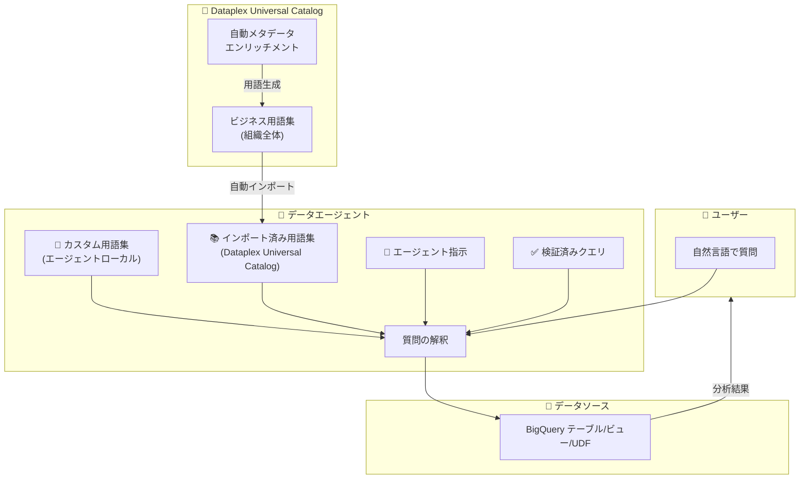

# BigQuery: Conversational Analytics エージェント向けカスタム用語集 (Custom Glossary Terms)

**リリース日**: 2026-02-24
**サービス**: BigQuery
**機能**: Custom Glossary Terms for Conversational Analytics Agent
**ステータス**: Preview

📊 [このアップデートのインフォグラフィックを見る](https://takech9203.github.io/google-cloud-news-summary/20260224-bigquery-custom-glossary-terms.html)

## 概要

BigQuery の Conversational Analytics (会話型分析) において、データエージェント向けのカスタム用語集 (Custom Glossary Terms) を作成・管理できるようになった。これにより、エージェントがユーザーのプロンプトに含まれるビジネス固有の用語や略語を正確に解釈し、より的確な分析結果を返せるようになる。

さらに、Dataplex Universal Catalog の自動メタデータエンリッチメント機能で生成されたビジネス用語集 (Business Glossary Terms) を BigQuery のデータエージェント内で確認できるようになった。これにより、組織全体で定義されたビジネス用語と、エージェント固有のカスタム用語を統合的に活用し、自然言語によるデータ分析の精度を向上させることが可能になる。

本アップデートの主な対象ユーザーは、BigQuery Conversational Analytics を利用するデータアナリスト、データエンジニア、およびビジネスインテリジェンスの担当者である。

**アップデート前の課題**

- データエージェントが組織固有のビジネス用語や略語 (例: 「OMPF」「ロイヤル顧客」) を理解できず、ユーザーがテーブルのカラム名や正式名称を使って質問する必要があった
- Dataplex Universal Catalog で管理されているビジネス用語集をデータエージェント上で直接確認する手段がなく、用語定義の参照に別画面への遷移が必要だった
- エージェントごとにビジネス用語のコンテキストを個別に設定する方法が限定的であり、エージェントの指示文 (Instructions) に自然言語で記述するしかなかった

**アップデート後の改善**

- エージェントごとに BigQuery カスタム用語集を作成でき、用語 (Term)、定義 (Definition)、同義語 (Synonyms) を構造化して登録可能になった
- Dataplex Universal Catalog から自動インポートされたビジネス用語集をエージェントのエディター画面内で直接確認できるようになった
- カスタム用語集と Dataplex Universal Catalog のビジネス用語集を組み合わせることで、エージェントの用語理解精度が向上した

## アーキテクチャ図



データエージェントが自然言語の質問を解釈する際に、カスタム用語集と Dataplex Universal Catalog からインポートされたビジネス用語集の両方を参照してコンテキストを補完する。

## サービスアップデートの詳細

### 主要機能

1. **BigQuery カスタム用語集の作成**
   - エージェントのエディター画面の「Glossary」セクションから、エージェントローカルなカスタム用語を作成可能
   - 各用語には「Term (用語名)」「Definition (定義)」「Synonyms (同義語)」を設定可能
   - カスタム用語は BigQuery 内に保持され、Dataplex Universal Catalog には表示されない

2. **Dataplex Universal Catalog ビジネス用語集の確認**
   - エージェントのナレッジソースに紐づく Dataplex Universal Catalog のビジネス用語集を、エージェントエディター内で直接確認可能
   - インポートされた用語の編集が必要な場合は、Dataplex Universal Catalog 側で変更する必要がある
   - Dataplex Universal Catalog のビジネス用語はグローバルに BigQuery リソースに適用される

3. **自動メタデータエンリッチメントとの連携**
   - Dataplex Universal Catalog の自動メタデータエンリッチメント機能により生成されたビジネス用語を確認可能
   - 自動生成された用語定義を基にエージェントの精度を向上させるワークフローが確立された

## 技術仕様

### カスタム用語集とビジネス用語集の比較

| 項目 | BigQuery カスタム用語集 | Dataplex Universal Catalog ビジネス用語集 |
|------|------------------------|------------------------------------------|
| スコープ | エージェントローカル | 組織全体 (グローバル) |
| 管理場所 | BigQuery エージェントエディター | Dataplex Universal Catalog |
| 作成方法 | エージェントごとに手動作成 | Dataplex Universal Catalog で作成・管理 |
| 編集方法 | エージェントエディター内で直接編集 | Dataplex Universal Catalog で編集後、エージェント側に反映 |
| 用語の構造 | Term / Definition / Synonyms | Term / Description / Category / Data Steward / Synonyms / Related Terms |
| Dataplex での表示 | 表示されない | 表示される |
| 推奨ケース | Dataplex Universal Catalog 未使用時、エージェント固有の用語定義 | 組織横断でビジネス用語を統一管理する場合 |

### Conversational Analytics API での用語集設定

```yaml
# system_instruction 内での用語集定義 (YAML 形式)
- glossaries:
  - glossary:
    - term: OMPF
      description: Order Management and Product Fulfillment
  - glossary:
    - term: complete
      description: Represents an order status where the order has been completed.
      synonyms: 'finish, done, fulfilled'
  - glossary:
    - term: Loyal Customer
      description: >
        A customer who has made more than one purchase.
        High value loyal customers are those with high lifetime_revenue.
      synonyms:
        - repeat customer
        - returning customer
```

### IAM ロール

| ロール | 説明 |
|--------|------|
| `roles/geminidataanalytics.dataAgentOwner` | エージェントの作成・編集・共有・削除 (プロジェクト内全エージェント) |
| `roles/geminidataanalytics.dataAgentCreator` | 自身のエージェントの作成・編集・共有・削除 |
| `roles/geminidataanalytics.dataAgentEditor` | エージェントの表示・編集 |
| `roles/geminidataanalytics.dataAgentViewer` | エージェントの表示 |
| `roles/datacatalog.catalogViewer` | Dataplex Catalog の表示 (用語集インポートに必要) |

## 設定方法

### 前提条件

1. Google Cloud プロジェクトで課金が有効であること
2. BigQuery API、Gemini Data Analytics API、Gemini for Google Cloud API が有効であること
3. 適切な IAM ロール (`roles/geminidataanalytics.dataAgentCreator` 以上) が付与されていること

### 手順

#### ステップ 1: データエージェントの作成またはエディター画面を開く

Google Cloud コンソールで BigQuery の **Agents** ページに移動し、**Agent catalog** タブから新規エージェントを作成するか、既存のエージェントを編集する。

#### ステップ 2: カスタム用語集の追加

1. エージェントエディター画面の **Glossary** セクションで **Add term** をクリック
2. **Custom terms** セクションで **Create term** をクリック
3. 以下の項目を入力:
   - **Term**: 用語名 (例: `OMPF`)
   - **Definition**: 定義 (例: `Order Management and Product Fulfillment`)
   - **Synonyms**: 同義語をカンマ区切りで入力 (例: `order management, fulfillment`)
4. **Add** をクリックして用語を保存

#### ステップ 3: Dataplex Universal Catalog のビジネス用語集の確認

1. エージェントエディター画面の **Glossary** セクションで **Add term** をクリック
2. **Imported from Dataplex Universal Catalog** セクションに移動
3. インポートされた用語を確認
4. 用語の編集が必要な場合は、**Go to Dataplex Universal Catalog glossaries** リンクから Dataplex 側で編集

## メリット

### ビジネス面

- **分析の民主化**: ビジネスユーザーが専門的なテーブル構造やカラム名を知らなくても、日常的なビジネス用語で質問でき、正確な分析結果を得られる
- **組織的な用語統一**: Dataplex Universal Catalog のビジネス用語集と連携することで、組織全体で統一されたビジネス用語の定義をデータ分析に活用できる
- **エージェントのカスタマイズ性向上**: ユースケースごとに異なるカスタム用語集を定義でき、部門やプロジェクトに特化したデータエージェントを構築できる

### 技術面

- **構造化された用語定義**: 自然言語の指示文ではなく、Term / Definition / Synonyms という構造化された形式で用語を管理でき、エージェントの解釈精度が向上する
- **Dataplex Universal Catalog との統合**: 既存のデータガバナンス基盤で管理されているビジネス用語をシームレスに活用可能
- **API レベルでの対応**: Conversational Analytics API の `glossaryTerms` フィールドを通じてプログラマティックに用語集を管理可能

## デメリット・制約事項

### 制限事項

- Conversational Analytics 全体がまだ Preview ステータスであり、本番環境での利用には制限がある
- BigQuery カスタム用語集は Dataplex Universal Catalog に反映されないため、BigQuery エージェント外では参照できない
- Dataplex Universal Catalog からインポートされた用語はエージェントエディター内で直接編集できず、Dataplex 側での変更が必要
- Conversational Analytics はグローバルに動作し、使用するリージョンを選択できない

### 考慮すべき点

- カスタム用語集と Dataplex Universal Catalog のビジネス用語集の使い分けを組織内で明確にする必要がある
- Conversational Analytics の利用時にはクエリが自動実行されるため、大規模テーブルやデータ結合を含む場合に想定外のコストが発生する可能性がある
- Preview 期間中は限定的なサポートとなるため、ミッションクリティカルなワークロードでの利用は推奨されない

## ユースケース

### ユースケース 1: 営業チーム向けデータエージェント

**シナリオ**: 営業チームが BigQuery に格納された売上データについて、「今四半期のトップパフォーマーは?」「OMPF のステータスが完了のオーダーは?」といったビジネス用語を使った質問をする場合。

**実装例**:
```yaml
- glossaries:
  - glossary:
    - term: top performer
      description: >
        Sales representatives with the highest revenue in the given period.
        Maps to the total_sale_amount column.
      synonyms: 'best seller, highest revenue'
  - glossary:
    - term: OMPF
      description: Order Management and Product Fulfillment
  - glossary:
    - term: complete
      description: Represents an order status where the order has been completed.
      synonyms: 'finish, done, fulfilled'
```

**効果**: 営業担当者が SQL やカラム名を意識せずに、日常的なビジネス用語でデータ分析を行えるようになり、セルフサービス分析の促進とデータ活用率の向上が期待できる。

### ユースケース 2: Dataplex Universal Catalog との連携によるデータガバナンス強化

**シナリオ**: 組織全体でデータガバナンスを推進しており、Dataplex Universal Catalog でビジネス用語集を一元管理している。各部門のデータエージェントで、組織標準の用語定義を活用しつつ、部門固有の用語をカスタム用語集で補完する場合。

**効果**: 組織全体で統一されたビジネス用語の定義をデータ分析に活用しながら、部門固有のコンテキストも反映した高精度な分析が可能になる。データガバナンスとセルフサービス分析の両立が実現できる。

## 料金

Conversational Analytics は Preview 期間中、データエージェントの作成および会話機能自体に追加料金は発生しない。ただし、会話中に実行されるクエリには通常の BigQuery コンピューティング料金が適用される。

料金の詳細は [BigQuery 料金ページ](https://cloud.google.com/bigquery/pricing#analysis_pricing_models) を参照。

### コスト管理のベストプラクティス

| 方法 | 説明 |
|------|------|
| プロジェクトレベルのクォータ設定 | IAM & Admin > Quotas で Query usage per day を制限 |
| ユーザーレベルのクォータ設定 | Query usage per day per user を制限 |
| エージェントレベルのバイト制限 | `maximum_bytes_billed` を 10485760 (10 MB) 以上に設定 |

## 利用可能リージョン

Conversational Analytics はグローバルに動作し、特定のリージョンを選択することはできない。

## 関連サービス・機能

- **[Dataplex Universal Catalog](https://cloud.google.com/dataplex/docs/catalog-overview)**: ビジネス用語集の組織的な管理基盤。BigQuery エージェントに用語をインポートする際のソースとなる
- **[Conversational Analytics API](https://cloud.google.com/gemini/docs/conversational-analytics-api/overview)**: データエージェントをプログラマティックに作成・管理するための API。glossaryTerms フィールドで用語集を設定可能
- **[Looker Studio Pro](https://cloud.google.com/looker/docs/studio/conversational-analytics-looker-studio)**: BigQuery で作成したデータエージェントに Looker Studio Pro からアクセスし、会話型分析を実行可能
- **[Gemini for Google Cloud](https://cloud.google.com/gemini/docs/overview)**: Conversational Analytics を支える基盤 AI 技術。自然言語理解と SQL 生成を担当

## 参考リンク

- 📊 [インフォグラフィック](https://takech9203.github.io/google-cloud-news-summary/20260224-bigquery-custom-glossary-terms.html)
- [公式リリースノート](https://cloud.google.com/release-notes#February_24_2026)
- [Conversational Analytics 概要](https://cloud.google.com/bigquery/docs/conversational-analytics)
- [データエージェントの作成](https://cloud.google.com/bigquery/docs/create-data-agents)
- [Dataplex Universal Catalog ビジネス用語集の管理](https://cloud.google.com/dataplex/docs/manage-glossaries)
- [Conversational Analytics API リファレンス](https://cloud.google.com/gemini/docs/conversational-analytics-api/reference/rest)
- [Conversational Analytics のコスト管理](https://cloud.google.com/gemini/docs/conversational-analytics-api/manage-costs)
- [BigQuery 料金](https://cloud.google.com/bigquery/pricing)

## まとめ

本アップデートにより、BigQuery Conversational Analytics のデータエージェントにカスタム用語集を構造化して登録できるようになり、ビジネスユーザーが日常的な用語で正確なデータ分析を行う基盤が強化された。Dataplex Universal Catalog との連携により、組織全体のデータガバナンスとセルフサービス分析の両立が可能になる。Conversational Analytics を活用している組織は、まずカスタム用語集にビジネス固有の用語を登録し、エージェントの応答精度を検証することを推奨する。

---

**タグ**: #BigQuery #ConversationalAnalytics #DataAgent #Glossary #DataplexUniversalCatalog #MetadataEnrichment #GeminiForGoogleCloud #Preview
