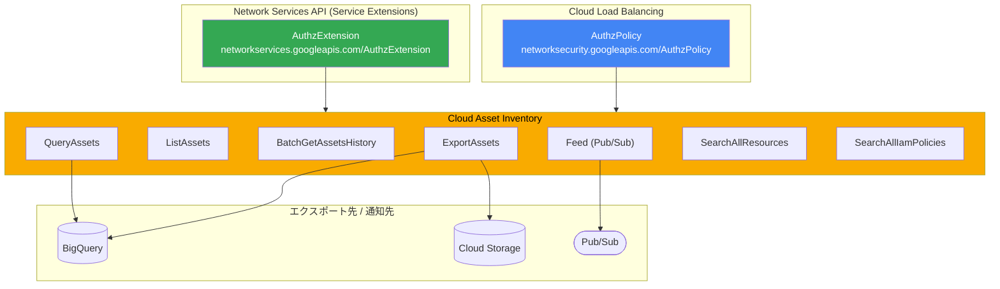

# Cloud Asset Inventory: Cloud Load Balancing / Network Services API リソースタイプの追加

**リリース日**: 2026-02-24
**サービス**: Cloud Asset Inventory
**機能**: AuthzPolicy および AuthzExtension リソースタイプの公開サポート
**ステータス**: 一般提供 (GA)

[このアップデートのインフォグラフィックを見る](https://takech9203.github.io/google-cloud-news-summary/20260224-cloud-asset-inventory-new-resource-types.html)

## 概要

Cloud Asset Inventory において、Cloud Load Balancing と Network Services API に関連する 2 つの新しいリソースタイプが公開サポートされた。具体的には、`networksecurity.googleapis.com/AuthzPolicy` (Cloud Load Balancing) と `networkservices.googleapis.com/AuthzExtension` (Network Services API) が、ExportAssets、ListAssets、BatchGetAssetsHistory、QueryAssets、Feed、SearchAllResources、SearchAllIamPolicies の全 7 つの API で利用可能となった。

AuthzPolicy は Application Load Balancer のフォワーディングルールに適用される認可ポリシーであり、受信トラフィックに対する ALLOW / DENY / CUSTOM (外部認可プロバイダーへの委譲) のアクセス制御を定義する。AuthzExtension は認可判定を外部のコールアウトバックエンドサービスに委譲するためのリソースであり、Service Extensions の一部として機能する。これらのリソースが Cloud Asset Inventory で管理可能になったことで、ロードバランサーレベルの認可設定を組織全体で統合的に可視化・監査できるようになった。

このアップデートは、Application Load Balancer の認可ポリシーを利用しているセキュリティエンジニア、ネットワークエンジニア、プラットフォームエンジニアにとって特に重要である。Cloud Asset Inventory を通じて認可ポリシーの変更履歴の追跡、IAM ポリシーの横断検索、コンプライアンス監査が可能になる。

**アップデート前の課題**

- Cloud Load Balancing の AuthzPolicy リソースは Cloud Asset Inventory の主要 API で公開サポートされていなかった
- Network Services API の AuthzExtension リソースについても Cloud Asset Inventory での追跡ができなかった
- ロードバランサーの認可ポリシー設定を組織全体で一元的に可視化・監査することが困難だった
- 認可ポリシーの変更履歴を Cloud Asset Inventory 経由でリアルタイムに監視できなかった

**アップデート後の改善**

- AuthzPolicy と AuthzExtension を Cloud Asset Inventory の全 7 API で利用可能になった
- Pub/Sub フィードを通じてロードバランサーの認可ポリシー変更をリアルタイムに監視できるようになった
- BigQuery や Cloud Storage へのエクスポートにより認可設定のメタデータを分析基盤に統合できるようになった
- SearchAllResources / SearchAllIamPolicies で認可ポリシーリソースを組織横断で検索できるようになった
- QueryAssets (BigQuery SQL) を使用して認可ポリシーの構成を柔軟にクエリできるようになった

## アーキテクチャ図



Cloud Load Balancing の AuthzPolicy と Network Services API の AuthzExtension が Cloud Asset Inventory に取り込まれ、各種 API を通じてエクスポート、検索、監視が可能になるデータフローを示している。

## サービスアップデートの詳細

### 主要機能

1. **AuthzPolicy リソースのサポート (`networksecurity.googleapis.com/AuthzPolicy`)**
   - Application Load Balancer のフォワーディングルールに適用される認可ポリシー
   - ALLOW、DENY、CUSTOM (外部認可プロバイダーへの委譲) の 3 種類のアクションをサポート
   - IP アドレス範囲、サービスアカウント、タグ、クライアント証明書のプリンシパルに基づくアクセス制御
   - Global / Regional / Cross-region の Application Load Balancer に対応
   - CEL (Common Expression Language) による柔軟な条件定義

2. **AuthzExtension リソースのサポート (`networkservices.googleapis.com/AuthzExtension`)**
   - 認可判定を外部のコールアウトバックエンドサービスに委譲するためのリソース
   - ext_proc (Envoy External Processing) および ext_authz (External Authorization) プロトコルをサポート
   - Identity-Aware Proxy (IAP) やカスタム認可エンジンとの連携に使用
   - タイムアウト設定、フェイルオープン設定、ヘッダー転送設定などの構成が可能

3. **対応 API**
   - ExportAssets: BigQuery / Cloud Storage へのメタデータエクスポート
   - ListAssets: プロジェクト / フォルダ / 組織内のアセット一覧取得
   - BatchGetAssetsHistory: 最大 35 日間のアセット変更履歴取得
   - QueryAssets: BigQuery SQL によるアセットクエリ
   - Feed: Pub/Sub による変更のリアルタイム通知
   - SearchAllResources: リソースの横断検索
   - SearchAllIamPolicies: IAM ポリシーの横断検索

## 技術仕様

### 新規リソースタイプ一覧

| リソースタイプ | サービス | 説明 |
|------|------|------|
| `networksecurity.googleapis.com/AuthzPolicy` | Cloud Load Balancing | Application Load Balancer の認可ポリシー |
| `networkservices.googleapis.com/AuthzExtension` | Network Services API | 外部認可サービスへのコールアウト拡張 |

### 対応 API と権限

| API | 必要な権限 |
|------|------|
| ExportAssets / BatchGetAssetsHistory | `cloudasset.assets.exportResource` |
| ListAssets | `cloudasset.assets.listResource` |
| QueryAssets | `cloudasset.assets.queryResource` |
| Feed (作成) | `cloudasset.feeds.create` + `cloudasset.assets.exportResource` |
| SearchAllResources | `cloudasset.assets.searchAllResources` |
| SearchAllIamPolicies | `cloudasset.assets.searchAllIamPolicies` |

### AuthzPolicy の評価順序

| 順序 | ポリシータイプ | 動作 |
|------|------|------|
| 1 | CUSTOM | 外部認可プロバイダーで評価。拒否された場合リクエストを拒否 |
| 2 | DENY | ルールに一致した場合リクエストを拒否 |
| 3 | ALLOW | ルールに一致した場合リクエストを許可。いずれにも一致しない場合は拒否 |

### AuthzExtension の JSON 構成

```json
{
  "name": "my-authz-extension",
  "loadBalancingScheme": "INTERNAL_MANAGED",
  "authority": "ext-authz.example.com",
  "service": "https://www.googleapis.com/compute/v1/projects/PROJECT_ID/regions/REGION/backendServices/authz-service",
  "timeout": "0.1s",
  "failOpen": false,
  "forwardHeaders": ["Authorization"],
  "wireFormat": "EXT_AUTHZ_GRPC"
}
```

## 設定方法

### 前提条件

1. Cloud Asset Inventory API が有効化されていること (`cloudasset.googleapis.com`)
2. 適切な IAM ロール (例: `roles/cloudasset.viewer`) が付与されていること
3. すべての Cloud Asset Inventory 呼び出しに `serviceusage.services.use` 権限が必要

### 手順

#### ステップ 1: 新しいリソースタイプのアセットを検索

```bash
# SearchAllResources で AuthzPolicy リソースを検索
gcloud asset search-all-resources \
  --scope="organizations/ORGANIZATION_ID" \
  --asset-types="networksecurity.googleapis.com/AuthzPolicy"
```

組織全体の AuthzPolicy リソースを一覧で取得できる。

#### ステップ 2: アセット履歴の取得

```bash
# BatchGetAssetsHistory で変更履歴を確認
gcloud asset get-history \
  --project="PROJECT_ID" \
  --asset-names="//networksecurity.googleapis.com/projects/PROJECT_ID/locations/LOCATION/authzPolicies/POLICY_NAME" \
  --content-type="resource" \
  --start-time="2026-02-01T00:00:00Z" \
  --end-time="2026-02-24T23:59:59Z"
```

指定期間内の AuthzPolicy リソースの変更履歴を取得できる。

#### ステップ 3: Pub/Sub フィードの作成

```bash
# 認可ポリシーの変更を監視するフィードを作成
gcloud asset feeds create authz-policy-feed \
  --project="PROJECT_ID" \
  --asset-types="networksecurity.googleapis.com/AuthzPolicy,networkservices.googleapis.com/AuthzExtension" \
  --content-type="resource" \
  --pubsub-topic="projects/PROJECT_ID/topics/authz-changes"
```

AuthzPolicy と AuthzExtension の変更をリアルタイムで Pub/Sub に通知する。

#### ステップ 4: BigQuery へのエクスポート

```bash
# BigQuery テーブルにエクスポート
gcloud asset export \
  --project="PROJECT_ID" \
  --asset-types="networksecurity.googleapis.com/AuthzPolicy" \
  --content-type="resource" \
  --bigquery-table="projects/PROJECT_ID/datasets/DATASET/tables/authz_policies" \
  --output-bigquery-force
```

BigQuery にエクスポートして SQL ベースの分析を行える。

## メリット

### ビジネス面

- **コンプライアンス強化**: ロードバランサーの認可ポリシー設定を組織全体で一元管理し、監査証跡を自動的に記録できる
- **セキュリティ可視性向上**: 認可ポリシーの構成ドリフトを検出し、セキュリティインシデントの早期発見に寄与する
- **運用効率化**: BigQuery SQL によるクエリで認可設定の分析を効率化し、レポーティングを自動化できる

### 技術面

- **統合インベントリ管理**: 認可ポリシーを他の Google Cloud リソースと同じプラットフォームで統合的に管理できる
- **リアルタイム変更追跡**: Pub/Sub フィードにより認可ポリシーの変更をリアルタイムで検知し、自動化ワークフローを構築できる
- **IAM ポリシー横断検索**: SearchAllIamPolicies により、認可ポリシーリソースに対する IAM 権限付与状況を組織横断で把握できる

## デメリット・制約事項

### 制限事項

- Cloud Asset Inventory のアセット履歴は最大 35 日間で、それ以前の変更履歴は保持されない
- Pub/Sub メッセージサイズ上限を超えるアセット更新は破棄される場合がある

### 考慮すべき点

- ExportAssets API にはプロジェクトあたり 60 回/分、1 日あたり 6,000 回のクォータ制限がある
- SearchAllResources は組織あたり 1,500 回/分のレート制限がある
- `cloudasset.assets.exportResource` 権限の付与はすべてのリソースタイプのエクスポートを許可するため、必要に応じて `cloudasset.assets.export*` の粒度の細かい権限を使用すること

## ユースケース

### ユースケース 1: 認可ポリシーのセキュリティ監査

**シナリオ**: 大規模組織において、複数のプロジェクトにまたがる Application Load Balancer の認可ポリシーが適切に設定されているかを定期的に監査する必要がある。

**実装例**:
```bash
# 組織全体の AuthzPolicy を BigQuery にエクスポート
gcloud asset export \
  --organization="ORGANIZATION_ID" \
  --asset-types="networksecurity.googleapis.com/AuthzPolicy" \
  --content-type="resource" \
  --bigquery-table="projects/audit-project/datasets/security_audit/tables/authz_policies" \
  --output-bigquery-force

# BigQuery で DENY ポリシーが設定されていないフォワーディングルールを検出
bq query --nouse_legacy_sql \
  'SELECT name, resource.data.target
   FROM `audit-project.security_audit.authz_policies`
   WHERE resource.data.action != "DENY"'
```

**効果**: 認可ポリシーの設定漏れやセキュリティ上の懸念を自動的に検出し、コンプライアンス要件への適合性を継続的に確認できる。

### ユースケース 2: 認可ポリシー変更のリアルタイム通知

**シナリオ**: セキュリティチームが認可ポリシーの変更をリアルタイムで検知し、意図しない変更に即座に対応したい。

**効果**: Pub/Sub フィードと Cloud Functions を組み合わせることで、認可ポリシーの変更を即座に検知し、Slack 通知やチケット自動起票などのアクションを実行できる。不正な認可ポリシー変更への対応時間を大幅に短縮できる。

## 料金

Cloud Asset Inventory の基本的なアセット管理機能 (ExportAssets、ListAssets、BatchGetAssetsHistory、SearchAllResources、Feed など) は無料で利用可能である。Policy Analyzer (AnalyzeIamPolicy) については、組織あたり 1 日 20 クエリまで無料で、それ以上の利用には Security Command Center Premium または Enterprise ティアの組織レベルのアクティベーションが必要となる。

### 料金例

| 機能 | 料金 |
|--------|-----------------|
| ExportAssets / ListAssets / BatchGetAssetsHistory / Feed | 無料 |
| SearchAllResources / SearchAllIamPolicies | 無料 |
| QueryAssets | 無料 |
| Policy Analyzer (1 日 20 クエリまで) | 無料 |
| Policy Analyzer (20 クエリ超) | Security Command Center Premium/Enterprise が必要 |

エクスポート先の BigQuery や Cloud Storage の利用料金は別途発生する。

## 利用可能リージョン

Cloud Asset Inventory はグローバルサービスであり、特定のリージョンに限定されない。すべての Google Cloud リージョンのリソースを対象にアセット管理が可能である。

## 関連サービス・機能

- **Cloud Load Balancing**: AuthzPolicy の適用対象であり、Application Load Balancer (Global / Regional / Cross-region) で認可ポリシーを使用する
- **Service Extensions**: AuthzExtension を通じて外部認可サービスへのコールアウトを構成する。ext_proc および ext_authz プロトコルをサポート
- **Identity-Aware Proxy (IAP)**: AuthzPolicy の CUSTOM アクションで認可を委譲できる外部プロバイダーの一つ
- **Security Command Center**: Cloud Asset Inventory のデータを活用してセキュリティ態勢の評価を行う。Premium/Enterprise ティアでは Policy Analyzer のクォータが無制限
- **Google Cloud Armor**: ネットワークセキュリティポリシーは AuthzPolicy の評価前に処理される
- **Cloud Monitoring / Cloud Logging**: 認可ポリシーの評価結果がロードバランサーのログに記録される

## 参考リンク

- [インフォグラフィック](https://takech9203.github.io/google-cloud-news-summary/20260224-cloud-asset-inventory-new-resource-types.html)
- [公式リリースノート](https://cloud.google.com/release-notes#February_24_2026)
- [Cloud Asset Inventory リリースノート](https://cloud.google.com/asset-inventory/docs/release-notes)
- [Cloud Asset Inventory ドキュメント](https://cloud.google.com/asset-inventory/docs/overview)
- [サポートされているアセットタイプ](https://cloud.google.com/asset-inventory/docs/asset-types)
- [Cloud Load Balancing 認可ポリシーの概要](https://cloud.google.com/load-balancing/docs/auth-policy/auth-policy-overview)
- [認可ポリシーの設定ガイド](https://cloud.google.com/load-balancing/docs/auth-policy/set-up-auth-policy-app-lb)
- [Service Extensions 認可拡張の構成](https://cloud.google.com/service-extensions/docs/configure-authorization-extensions)
- [Cloud Asset Inventory のクォータと制限](https://cloud.google.com/asset-inventory/docs/quota)
- [Cloud Asset Inventory の料金](https://cloud.google.com/asset-inventory/pricing)

## まとめ

Cloud Asset Inventory に Cloud Load Balancing の AuthzPolicy と Network Services API の AuthzExtension リソースタイプが追加されたことで、ロードバランサーレベルの認可設定を組織全体で統合的に管理・監査できるようになった。特に、セキュリティ監査やコンプライアンス対応において、認可ポリシーの変更追跡、横断検索、BigQuery による分析が可能になる点が重要である。Application Load Balancer で認可ポリシーを利用している組織は、Cloud Asset Inventory の Feed やエクスポート機能を活用して、認可設定の継続的な監視体制を構築することを推奨する。

---

**タグ**: #CloudAssetInventory #CloudLoadBalancing #NetworkServicesAPI #AuthzPolicy #AuthzExtension #セキュリティ #認可ポリシー #コンプライアンス #アセット管理
