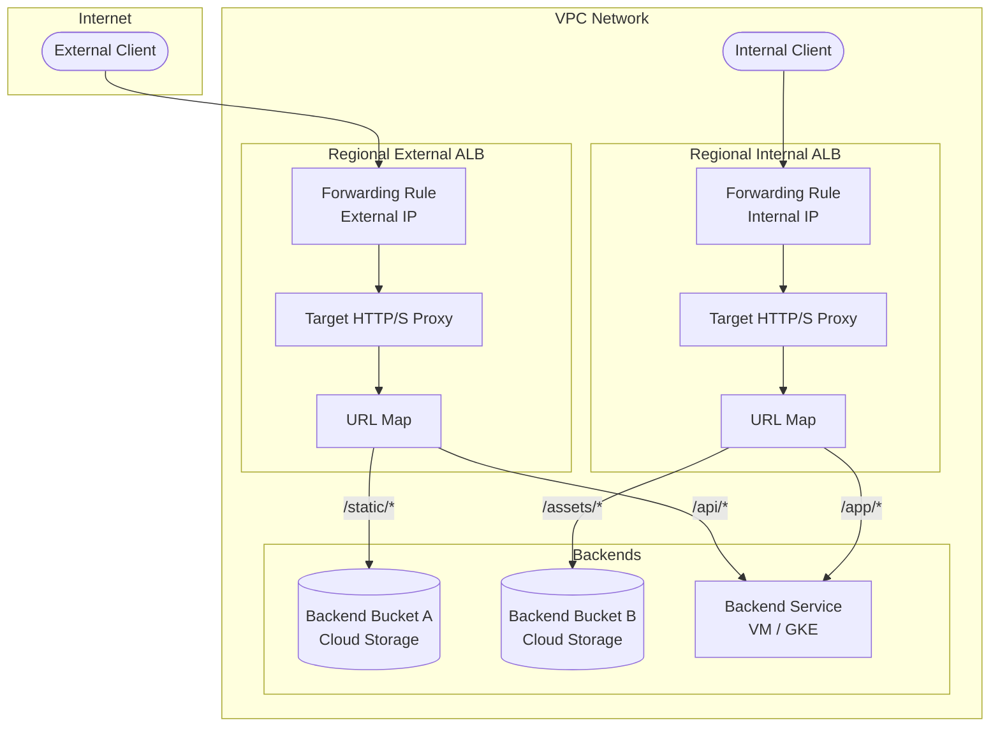

# Cloud Load Balancing: リージョナルロードバランサ向けバックエンド Cloud Storage バケット

**リリース日**: 2026-02-24
**サービス**: Cloud Load Balancing, Cloud Storage
**機能**: Backend Cloud Storage Buckets for Regional Load Balancers
**ステータス**: Preview

[このアップデートのインフォグラフィックを見る](https://takech9203.github.io/google-cloud-news-summary/20260224-cloud-load-balancing-backend-cloud-storage-buckets.html)

## 概要

Cloud Load Balancing において、バックエンド Cloud Storage バケットがリージョナル外部アプリケーションロードバランサ、リージョナル内部アプリケーションロードバランサ、およびクロスリージョン内部アプリケーションロードバランサで利用可能になった。これにより、リージョナルロードバランサを通じて Cloud Storage から直接静的コンテンツを配信できるようになる。

従来、バックエンドバケット機能はグローバル外部アプリケーションロードバランサとクラシックアプリケーションロードバランサでのみ利用可能だった。今回のアップデートにより、リージョナルスコープのロードバランサでも同様に Cloud Storage バケットをバックエンドとして構成できるようになり、データレジデンシー要件やリージョナルな負荷分散要件を持つワークロードにおいて、静的コンテンツ配信の柔軟性が大幅に向上する。

この機能は、画像、動画、CSS、JavaScript ファイルなどの静的コンテンツをロードバランサ経由で直接配信する必要があるアーキテクチャに適している。バックエンドサービス (Compute Engine VM や GKE など) と組み合わせて URL パスベースのルーティングを構成することで、動的コンテンツと静的コンテンツを同一ロードバランサで効率的に処理できる。

**アップデート前の課題**

- バックエンドバケットはグローバル外部アプリケーションロードバランサとクラシックアプリケーションロードバランサでのみ利用可能であり、リージョナルロードバランサでは Cloud Storage バケットをバックエンドとして直接構成できなかった
- リージョナルなデータレジデンシー要件を持つワークロードでは、静的コンテンツ配信のためにバックエンドサービス (VM) を経由する必要があり、コストと運用の複雑さが増していた
- 内部ロードバランサ経由で VPC 内部から Cloud Storage の静的コンテンツを直接配信する手段がなかった

**アップデート後の改善**

- リージョナル外部アプリケーションロードバランサ、リージョナル内部アプリケーションロードバランサ、クロスリージョン内部アプリケーションロードバランサでバックエンド Cloud Storage バケットが利用可能になった
- リージョナルスコープのロードバランサで静的コンテンツを VM なしで直接配信でき、コスト削減と運用簡素化が可能になった
- 内部ロードバランサ経由で VPC 内部のクライアントに Cloud Storage の静的コンテンツを直接配信できるようになった

## アーキテクチャ図



リージョナル外部アプリケーションロードバランサとリージョナル内部アプリケーションロードバランサの両方で、URL マップに基づいてバックエンドバケット (Cloud Storage) とバックエンドサービス (VM/GKE) にトラフィックをルーティングできる構成を示している。

## サービスアップデートの詳細

### 主要機能

1. **リージョナル外部アプリケーションロードバランサのバックエンドバケットサポート (Preview)**
   - リージョナル外部アプリケーションロードバランサでバックエンドバケットを構成可能
   - 外部 IP アドレスを持つフォワーディングルールを使用
   - ロードバランシングスキームは `EXTERNAL_MANAGED`

2. **リージョナル内部アプリケーションロードバランサのバックエンドバケットサポート (Preview)**
   - VPC ネットワーク内のクライアントから Cloud Storage バケットの静的コンテンツにアクセス可能
   - 内部 IP アドレスを持つフォワーディングルールを使用
   - ロードバランシングスキームは `INTERNAL_MANAGED`

3. **クロスリージョン内部アプリケーションロードバランサのバックエンドバケットサポート**
   - 複数リージョンにまたがる高可用性構成をサポート
   - DNS ルーティングポリシーと組み合わせてフェイルオーバーが可能
   - グローバルな URL マップとフォワーディングルールを使用

4. **URL マップによるパスベースルーティング**
   - バックエンドバケットとバックエンドサービスを組み合わせた URL マップの構成が可能
   - パスルールに基づいて異なるバックエンドバケットにトラフィックを分散

## 技術仕様

### 対応ロードバランサ一覧

| ロードバランサタイプ | バックエンドバケットサポート | ステータス |
|------|------|------|
| グローバル外部アプリケーションロードバランサ | 対応 | GA |
| クラシックアプリケーションロードバランサ | 対応 | GA |
| リージョナル外部アプリケーションロードバランサ | 対応 | Preview |
| クロスリージョン内部アプリケーションロードバランサ | 対応 | GA |
| リージョナル内部アプリケーションロードバランサ | 対応 | Preview |

### 必要な IAM ロール

| タスク | 必要なロール |
|------|------|
| ネットワーク・サブネット・ロードバランサコンポーネントの作成 | Compute Network Admin (`roles/compute.networkAdmin`) |
| ファイアウォールルールの追加・削除 | Compute Security Admin (`roles/compute.securityAdmin`) |
| Cloud Storage バケットの作成 | Storage Object Admin (`roles/storage.objectAdmin`) |

### gcloud CLI 構成例 (リージョナル内部アプリケーションロードバランサ)

```bash
# バックエンドバケットの作成
gcloud beta compute backend-buckets create backend-bucket-cats \
    --gcs-bucket-name=BUCKET1_NAME \
    --load-balancing-scheme=INTERNAL_MANAGED \
    --region=us-east1

# URL マップの作成
gcloud beta compute url-maps create lb-map \
    --default-backend-bucket=backend-bucket-cats \
    --region=us-east1

# パスマッチャーの追加
gcloud beta compute url-maps add-path-matcher lb-map \
    --path-matcher-name=path-matcher-pets \
    --new-hosts=* \
    --backend-bucket-path-rules="/love-to-fetch/*=backend-bucket-dogs" \
    --default-backend-bucket=backend-bucket-cats \
    --region=us-east1
```

## 設定方法

### 前提条件

1. Google Cloud CLI のインストール (`gcloud beta` コンポーネントが必要)
2. 適切な IAM ロールの付与 (Compute Network Admin, Storage Object Admin)
3. VPC ネットワークとサブネットの作成
4. プロキシ専用サブネット (proxy-only subnet) の作成

### 手順

#### ステップ 1: VPC ネットワークとサブネットの作成

```bash
# カスタム VPC ネットワークの作成
gcloud compute networks create lb-network --subnet-mode=custom

# ロードバランサ用サブネットの作成
gcloud compute networks subnets create subnet-us \
    --network=lb-network \
    --range=10.1.2.0/24 \
    --region=us-east1

# プロキシ専用サブネットの作成
gcloud compute networks subnets create proxy-only-subnet-us \
    --purpose=REGIONAL_MANAGED_PROXY \
    --role=ACTIVE \
    --region=us-east1 \
    --network=lb-network \
    --range=10.129.0.0/23
```

プロキシ専用サブネットは、Google Cloud が Envoy プロキシを実行するために使用する IP アドレスの範囲を提供する。リージョン内の VPC ネットワークごとに 1 つのプロキシ専用サブネットが必要。

#### ステップ 2: Cloud Storage バケットの作成と公開設定

```bash
# Cloud Storage バケットの作成
gcloud storage buckets create gs://BUCKET_NAME \
    --default-storage-class=standard \
    --location=us-east1 \
    --uniform-bucket-level-access

# バケットの公開設定
gcloud storage buckets add-iam-policy-binding gs://BUCKET_NAME \
    --member=allUsers \
    --role=roles/storage.objectViewer
```

バックエンドバケットとして使用するには、バケットを公開アクセス可能にする必要がある。

#### ステップ 3: ロードバランサの構成

```bash
# バックエンドバケットの作成 (リージョナル外部 ALB の場合)
gcloud beta compute backend-buckets create my-backend-bucket \
    --gcs-bucket-name=BUCKET_NAME \
    --load-balancing-scheme=EXTERNAL_MANAGED \
    --region=us-east1

# URL マップの作成
gcloud beta compute url-maps create my-url-map \
    --default-backend-bucket=my-backend-bucket \
    --region=us-east1

# ターゲット HTTP プロキシの作成
gcloud compute target-http-proxies create my-http-proxy \
    --url-map=my-url-map \
    --region=us-east1

# フォワーディングルールの作成
gcloud compute forwarding-rules create my-fw-rule \
    --load-balancing-scheme=EXTERNAL_MANAGED \
    --network=lb-network \
    --address=RESERVED_IP_ADDRESS \
    --ports=80 \
    --region=us-east1 \
    --target-http-proxy=my-http-proxy \
    --target-http-proxy-region=us-east1
```

## メリット

### ビジネス面

- **コスト削減**: 静的コンテンツ配信のためにバックエンド VM を維持する必要がなくなり、コンピューティングコストを削減できる
- **データレジデンシー対応**: リージョナルロードバランサを使用することで、特定リージョンでのデータ処理・トラフィック終端が可能となり、コンプライアンス要件に対応できる
- **運用簡素化**: Cloud Storage の組み込みキャッシュ機能を活用しつつ、ロードバランサ経由で統一的にコンテンツを配信できる

### 技術面

- **URL パスベースルーティング**: URL マップを使用して、静的コンテンツ (バックエンドバケット) と動的コンテンツ (バックエンドサービス) を同一ロードバランサで効率的に処理できる
- **VPC 内部からのアクセス**: リージョナル内部アプリケーションロードバランサにより、VPC 内部のクライアントから Cloud Storage の静的コンテンツに直接アクセスできる
- **高可用性**: クロスリージョン内部アプリケーションロードバランサでは、複数リージョンにまたがるバックエンドバケットの構成と DNS ベースのフェイルオーバーが可能
- **Shared VPC サポート**: クロスプロジェクト構成により、Shared VPC 環境でのバックエンドバケットの利用が可能

## デメリット・制約事項

### 制限事項

- プライベートバケットアクセスはサポートされず、バックエンドバケットはインターネット上で公開アクセス可能である必要がある
- 署名付き URL (Signed URLs) はサポートされない
- Cloud CDN 統合はリージョナルロードバランサのバックエンドバケットでは利用不可
- HTTP GET メソッドのみサポートされ、ロードバランサ経由でのバケットへのアップロードは不可
- リージョナルロードバランサでは、ロードバランサが構成されているリージョンと同じリージョンの Cloud Storage バケットのみサポート (デュアルリージョンやマルチリージョンバケットは非対応)
- リージョナル外部アプリケーションロードバランサとリージョナル内部アプリケーションロードバランサの場合、現在 Preview ステータス

### 考慮すべき点

- バケットを公開設定にする必要があるため、機密データを含むバケットには不適切。機密データへのアクセスが必要な場合は、Private Service Connect NEG による代替デプロイメントを検討すること
- リージョナルロードバランサのバックエンドバケット構成は現時点で gcloud CLI のみ対応 (Google Cloud コンソールでは構成不可)
- `gcloud beta` コマンドが必要であり、正式な GA 前に仕様が変更される可能性がある

## ユースケース

### ユースケース 1: リージョナル準拠の静的コンテンツ配信

**シナリオ**: データレジデンシー要件により、特定のリージョン内でトラフィックを処理する必要がある Web アプリケーション。静的アセット (画像、CSS、JS) は Cloud Storage に格納し、動的 API はバックエンドサービスで処理する。

**実装例**:
```bash
# 静的コンテンツ用バックエンドバケット
gcloud beta compute backend-buckets create static-assets \
    --gcs-bucket-name=my-static-assets-bucket \
    --load-balancing-scheme=EXTERNAL_MANAGED \
    --region=europe-west1

# API 用バックエンドサービス (既存)
# gcloud compute backend-services create api-service ...

# URL マップでパスベースルーティング
gcloud beta compute url-maps create web-app-map \
    --default-backend-bucket=static-assets \
    --region=europe-west1

gcloud beta compute url-maps add-path-matcher web-app-map \
    --path-matcher-name=api-routes \
    --new-hosts=* \
    --backend-service-path-rules="/api/*=api-service" \
    --default-backend-bucket=static-assets \
    --region=europe-west1
```

**効果**: EU データレジデンシー要件を満たしつつ、静的コンテンツ配信にバックエンド VM を必要としないため、運用コストとインフラ管理の負担を軽減できる。

### ユースケース 2: VPC 内部の静的コンテンツ配信

**シナリオ**: 社内アプリケーションが VPC 内部から Cloud Storage に格納されたドキュメントや画像にアクセスする必要がある。外部公開は不要で、内部ロードバランサ経由でアクセスしたい。

**効果**: リージョナル内部アプリケーションロードバランサを使用することで、VPC 内部のクライアントから Cloud Storage の公開バケットに統一的にアクセスでき、URL パスベースのルーティングで複数のバケットを効率的に管理できる。

## 料金

Cloud Load Balancing の料金は、ロードバランサの種類に応じて課金される。バックエンドバケットの利用自体に追加料金はなく、通常の Cloud Load Balancing の料金体系が適用される。Cloud Storage のストレージ料金とデータ転送料金は別途発生する。

詳細は [Cloud Load Balancing の料金ページ](https://cloud.google.com/vpc/network-pricing#lb) を参照。

## 利用可能リージョン

リージョナル外部アプリケーションロードバランサおよびリージョナル内部アプリケーションロードバランサのバックエンドバケットは、これらのロードバランサが利用可能なすべてのリージョンで構成可能。ただし、バックエンドバケットとして使用する Cloud Storage バケットは、ロードバランサと同じリージョンに存在する必要がある。クロスリージョン内部アプリケーションロードバランサでは、複数リージョンのバケットを構成可能。

## 関連サービス・機能

- **Cloud Storage**: バックエンドバケットとして使用される静的コンテンツのストレージサービス。バケットの作成、アクセス制御、オブジェクト管理を提供
- **Cloud CDN**: グローバル外部アプリケーションロードバランサとクラシックアプリケーションロードバランサのバックエンドバケットでは Cloud CDN との統合が可能 (リージョナルロードバランサでは非対応)
- **Certificate Manager**: HTTPS ロードバランサを構成する場合に SSL 証明書の管理に使用
- **Cloud DNS**: クロスリージョン構成やリージョナル高可用性構成において、ジオロケーションルーティングポリシーやフェイルオーバーポリシーを提供
- **Private Service Connect**: バックエンドバケットの代替として、Cloud Storage API エンドポイントへのプライベートネットワークパスを提供する NEG デプロイメントが利用可能

## 参考リンク

- [インフォグラフィック](https://takech9203.github.io/google-cloud-news-summary/20260224-cloud-load-balancing-backend-cloud-storage-buckets.html)
- [公式リリースノート](https://cloud.google.com/release-notes#February_24_2026)
- [バックエンドバケット概要ドキュメント](https://cloud.google.com/load-balancing/docs/backend-bucket)
- [リージョナル外部 ALB のバックエンドバケット設定ガイド](https://cloud.google.com/load-balancing/docs/https/setup-reg-ext-app-lb-backend-buckets)
- [リージョナル内部 ALB のバックエンドバケット設定ガイド](https://cloud.google.com/load-balancing/docs/l7-internal/setup-regional-internal-buckets)
- [クロスリージョン内部 ALB のバックエンドバケット設定ガイド](https://cloud.google.com/load-balancing/docs/l7-internal/setup-cross-region-internal-https-buckets)
- [料金ページ](https://cloud.google.com/vpc/network-pricing#lb)

## まとめ

今回のアップデートにより、Cloud Load Balancing のバックエンドバケット機能がリージョナル外部・内部アプリケーションロードバランサおよびクロスリージョン内部アプリケーションロードバランサに拡張された。これにより、データレジデンシー要件への対応、VPC 内部からの静的コンテンツ配信、リージョナルスコープでのコスト効率の高い静的配信アーキテクチャの構築が可能になる。リージョナルロードバランサを使用中で静的コンテンツの配信を行っている場合は、バックエンド VM の代わりにバックエンドバケットへの移行を検討することを推奨する。現在 Preview ステータスのため、本番環境での利用前にドキュメントの制限事項を十分に確認すること。

---

**タグ**: #CloudLoadBalancing #CloudStorage #BackendBucket #RegionalLoadBalancer #StaticContent #ApplicationLoadBalancer #Preview
