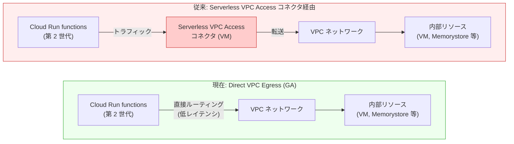

# Cloud Run functions: Direct VPC Egress が第 2 世代関数で GA (一般提供)

**リリース日**: 2026-02-24
**サービス**: Cloud Run functions (Cloud Functions)
**機能**: Direct VPC Egress for 2nd Gen Functions
**ステータス**: GA (General Availability)

📊 [このアップデートのインフォグラフィックを見る](https://takech9203.github.io/google-cloud-news-summary/20260224-cloud-run-functions-direct-vpc-egress-ga.html)

## 概要

Cloud Run functions (第 2 世代) における Direct VPC Egress のサポートが General Availability (GA) となった。Direct VPC Egress は、Cloud Run functions から VPC ネットワークへのアウトバウンドトラフィックを、Serverless VPC Access コネクタを介さずに直接ルーティングする機能である。これにより、サーバーレス関数から VPC 内のリソース (Compute Engine VM、Memorystore インスタンス、内部 IP アドレスを持つその他のリソース) へのアクセスが、よりシンプルかつ低コストで実現できる。

GA 昇格により、本番環境での利用が正式にサポートされ、SLA の対象となった。Direct VPC Egress は Google Cloud が推奨する VPC 接続方式であり、従来の Serverless VPC Access コネクタと比較して、セットアップの簡素化、コスト削減、低レイテンシ、高スループットといった複数の利点を提供する。gcloud CLI、Terraform、Google Cloud Console のいずれからも設定可能である。

このアップデートは、サーバーレスアーキテクチャを採用しつつ VPC 内のプライベートリソースへのアクセスが必要なすべてのユーザーに影響する。特に、ネットワークセキュリティ要件の厳しいエンタープライズ環境や、コスト最適化を重視する開発チームにとって重要なマイルストーンである。

**アップデート前の課題**

- 第 2 世代の Cloud Run functions から VPC ネットワークにアクセスするには、Serverless VPC Access コネクタの作成・管理が必要だった
- Serverless VPC Access コネクタは専用の VM インスタンスを起動するため、追加のコンピューティングコストが発生していた
- コネクタ経由の接続はレイテンシが高く、スループットも制限されていた
- ネットワークタグはコネクタレベルでしか適用できず、関数ごとのきめ細かいファイアウォール制御が困難だった
- Direct VPC Egress は Cloud Run サービスおよびジョブでは利用可能だったが、第 2 世代関数での利用は Preview 段階だった

**アップデート後の改善**

- Serverless VPC Access コネクタなしで、第 2 世代関数から VPC ネットワークへ直接トラフィックをルーティング可能になった
- VM インスタンスの追加コストが不要になり、ネットワーク Egress 料金のみで VPC 接続を実現できるようになった
- 低レイテンシ・高スループットの VPC 接続が GA として本番環境で利用可能になった
- 関数ごとに個別のネットワークタグを設定でき、より粒度の細かいファイアウォール制御が可能になった
- GA により SLA の対象となり、本番ワークロードでの安心した利用が可能になった

## アーキテクチャ図



上図は、従来の Serverless VPC Access コネクタを経由する方式 (上) と、Direct VPC Egress による直接接続方式 (下) を比較している。Direct VPC Egress ではコネクタ VM が不要となり、関数から VPC ネットワークへ直接トラフィックがルーティングされる。

## サービスアップデートの詳細

### 主要機能

1. **Serverless VPC Access コネクタ不要の VPC 接続**
   - Cloud Run functions (第 2 世代) から VPC ネットワークへのアウトバウンドトラフィックを直接ルーティング
   - コネクタ用 VM の管理・スケーリングが完全に不要
   - ゼロスケール対応: トラフィックがない場合はコストが発生しない

2. **柔軟な Egress 設定**
   - `all`: すべてのアウトバウンドトラフィックを VPC ネットワーク経由で送信 (デフォルト)
   - `private-ranges-only`: 内部アドレスへのトラフィックのみ VPC ネットワーク経由で送信
   - デプロイ後の設定変更も可能

3. **ネットワークタグによるきめ細かいセキュリティ制御**
   - 関数ごとに異なるネットワークタグを設定可能
   - ファイアウォールルールを関数単位で適用できる
   - コネクタ方式ではコネクタレベルでの共有タグのみだった

4. **Shared VPC サポート**
   - Shared VPC ネットワークのサブネットに対しても Direct VPC Egress を構成可能
   - IAM 権限の適切な設定により、プロジェクト横断での VPC 接続が実現

5. **Terraform による Infrastructure as Code 対応**
   - `google_cloudfunctions2_function` リソースの `direct_vpc_network_interface` フィールドで設定
   - Terraform Google Provider バージョン 7.21.0 以降で対応

## 技術仕様

### Direct VPC Egress と Serverless VPC Access コネクタの比較

| 項目 | Direct VPC Egress | Serverless VPC Access コネクタ |
|------|-------------------|-------------------------------|
| レイテンシ | 低い | 高い |
| スループット | 高い (最大 1 Gbps/インスタンス) | 低い |
| IP アドレス消費 | 多い (多くの場合) | 少ない |
| コスト | ネットワーク Egress 料金のみ (追加 VM コストなし) | 追加 VM コストが発生 |
| ネットワークタグ | 関数ごとに個別設定可能 | コネクタレベルで共有 |
| スケーリング速度 | VPC ネットワークインターフェース作成時はやや遅い | トラフィック急増時にコネクタインスタンスの追加が必要 |
| ステータス | GA | GA |

### 必要な IAM 権限

| 方式 | ロール / 権限 |
|------|---------------|
| デフォルト | `roles/run.serviceAgent` (Cloud Run Service Agent ロール) |
| カスタム | `compute.networks.get`, `compute.subnetworks.get`, `compute.subnetworks.use`, `compute.addresses.get`, `compute.addresses.list`, `compute.addresses.createInternal`, `compute.addresses.deleteInternal`, `compute.regionOperations.get` |
| 簡易設定 | `roles/compute.networkUser` (Compute Network User ロール) |

### 前提条件

- gcloud CLI バージョン 558.0.0 以降
- Cloud Functions API の有効化
- VPC ネットワークおよびサブネットの存在
- (オプション) Private Google Access の有効化 (内部 IP で Google API にアクセスする場合)

## 設定方法

### 前提条件

1. Cloud Functions API を有効化する
2. gcloud CLI をインストールし、`gcloud init` で初期化する
3. gcloud コンポーネントをバージョン 558.0.0 以降に更新する
4. VPC ネットワークが存在しない場合は作成する

### 手順

#### ステップ 1: IAM 権限の確認

```bash
# デフォルトの Cloud Run Service Agent ロールが付与されていることを確認
# カスタム権限が必要な場合は Compute Network User ロールを付与
gcloud projects add-iam-policy-binding PROJECT_ID \
  --member "serviceAccount:service-PROJECT_NUMBER@serverless-robot-prod.iam.gserviceaccount.com" \
  --role "roles/compute.networkUser"
```

Cloud Run Service Agent (`roles/run.serviceAgent`) がデフォルトで必要な権限を含んでいるため、多くの場合は追加設定不要である。

#### ステップ 2: Direct VPC Egress を有効にして関数をデプロイ

```bash
gcloud functions deploy my-function \
    --source . \
    --runtime nodejs20 \
    --trigger-http \
    --region us-central1 \
    --network=my-vpc-network \
    --subnet=my-subnet \
    --network-tags=my-function-tag \
    --direct-vpc-egress=all
```

`--direct-vpc-egress` には `all` (すべてのトラフィックを VPC 経由) または `private-ranges-only` (プライベート IP 宛てのみ VPC 経由) を指定する。

#### ステップ 3: (Terraform の場合) Terraform 設定

```hcl
resource "google_cloudfunctions2_function" "my_function" {
  name     = "my-function"
  location = "us-central1"

  build_config {
    runtime     = "nodejs20"
    entry_point = "helloWorld"
    source {
      storage_source {
        bucket = google_storage_bucket.source_bucket.name
        object = google_storage_bucket_object.source_object.name
      }
    }
  }

  service_config {
    direct_vpc_network_interface {
      network    = "my-vpc-network"
      subnetwork = "my-subnet"
    }
    direct_vpc_egress = "VPC_EGRESS_ALL_TRAFFIC"
  }
}
```

Terraform Google Provider バージョン 7.21.0 以降が必要である。

#### ステップ 4: (オプション) Direct VPC Egress 設定の解除

```bash
gcloud functions deploy my-function \
    --source . \
    --runtime nodejs20 \
    --trigger-http \
    --region us-central1 \
    --clear-network \
    --clear-network-tags
```

## メリット

### ビジネス面

- **コスト削減**: Serverless VPC Access コネクタで必要だった専用 VM のコストが不要になり、ネットワーク Egress 料金のみで VPC 接続が可能。トラフィックがない場合はゼロスケールによりコストも発生しない
- **運用負荷の軽減**: コネクタ VM の管理・監視・スケーリングが不要になり、運用チームの負担が軽減される
- **本番環境での信頼性**: GA によりSLA の対象となり、エンタープライズ環境で安心して利用可能

### 技術面

- **低レイテンシ**: コネクタを経由しないため、VPC リソースへのアクセスレイテンシが低減される
- **高スループット**: インスタンスあたり最大 1 Gbps のスループットをサポート
- **きめ細かいネットワーク制御**: 関数単位でネットワークタグを設定でき、ファイアウォールルールの精密な適用が可能
- **Infrastructure as Code 対応**: gcloud CLI および Terraform による完全な自動化が可能

## デメリット・制約事項

### 制限事項

- Direct VPC Egress は第 1 世代 (1st gen) の関数では利用不可
- Direct VPC Egress と Serverless VPC Access コネクタを同時に使用することはできない
- インスタンス起動時に 1 分以上の接続確立遅延が発生する場合がある (HTTP スタートアップ プローブの設定を推奨)
- インスタンスあたりのスループット上限は 1 Gbps。超過するとパフォーマンスがスロットリングされる
- VPC Flow Logs では Cloud Run リビジョン名が表示されない
- Firewall Rules Logging はサポートされない
- Packet Mirroring はサポートされない
- ネットワーキングインフラストラクチャのメンテナンスイベント時に接続が切断される可能性がある

### 考慮すべき点

- Direct VPC Egress はコネクタ方式と比較して、多くの場合より多くの IP アドレスを消費する。サブネットの IP アドレス範囲の計画が重要
- ゼロからのスケールアップ時に VPC ネットワークインターフェースの作成が必要なため、コールドスタートがやや遅くなる場合がある
- 1 時間以上実行される Cloud Run ジョブでは、メンテナンスイベントによる接続断が発生する可能性がある (SIGTSTP/SIGCONT シグナルを処理する実装を推奨)

## ユースケース

### ユースケース 1: 内部 Cloud Run サービスへのアクセス

**シナリオ**: マイクロサービスアーキテクチャにおいて、Cloud Run functions から内部 Ingress 設定の Cloud Run サービスを呼び出す必要がある場合。

**実装例**:
```javascript
const axios = require('axios');
const functions = require('@google-cloud/functions-framework');

const callVPCService = async (req, res) => {
  const backendUrl = process.env.BACKEND_URL;

  // メタデータサーバーから認証トークンを取得
  const metadataServerURL =
    'http://metadata.google.internal/computeMetadata/v1/instance/service-accounts/default/identity?audience=';
  const tokenResponse = await axios.get(metadataServerURL + backendUrl, {
    headers: { 'Metadata-Flavor': 'Google' },
  });

  // 内部サービスを呼び出し
  const response = await axios.get(backendUrl, {
    headers: { Authorization: `bearer ${tokenResponse.data}` },
  });

  res.status(200).send(`Response: ${response.data}`);
};

functions.http('callVPCService', callVPCService);
```

**効果**: Serverless VPC Access コネクタの管理コストを排除しつつ、内部サービス間の低レイテンシ通信を実現。

### ユースケース 2: Memorystore (Redis/Valkey) へのプライベートアクセス

**シナリオ**: Cloud Run functions からキャッシュ層として Memorystore インスタンスにアクセスし、API レスポンスをキャッシュする場合。

**効果**: VPC 内のプライベート Memorystore インスタンスに直接アクセスでき、コネクタ VM の追加コストなしでキャッシュの高速アクセスが可能。特にトラフィックが不定期な場合、ゼロスケールによるコスト最適化の恩恵が大きい。

### ユースケース 3: エンタープライズ環境でのセキュリティ制御

**シナリオ**: 複数のサーバーレス関数が VPC 内のリソースにアクセスする環境で、関数ごとに異なるファイアウォールポリシーを適用する必要がある場合。

**効果**: 関数ごとにネットワークタグを個別設定でき、最小権限の原則に基づいたきめ細かいネットワークアクセス制御が可能になる。コネクタ方式ではコネクタ単位でしか制御できなかったセキュリティ境界を、関数単位まで細分化できる。

## 料金

Direct VPC Egress 自体に追加料金は発生しない。Serverless VPC Access コネクタ方式とは異なり、コネクタ用 VM のコンピューティングコストが不要であるため、支払いはネットワーク Egress 料金のみとなる。

Cloud Run functions (第 2 世代) の基本料金体系は Cloud Run pricing に準拠する。

### 料金比較 (VPC 接続方式別)

| 項目 | Direct VPC Egress | Serverless VPC Access コネクタ |
|------|-------------------|-------------------------------|
| コンピューティング (コネクタ VM) | 不要 (0 円) | Compute Engine VM 課金が発生 |
| ネットワーク Egress | VPC Egress 料金 | VPC Egress 料金 (同率) |
| ゼロスケール時 | コストなし | コネクタ VM は常時稼働のためコスト継続 |

詳細は [Cloud Run pricing](https://cloud.google.com/run/pricing) を参照。

## 利用可能リージョン

Cloud Run functions (第 2 世代) が利用可能なすべてのリージョンで Direct VPC Egress を使用可能。

**Tier 1 料金リージョン (主要リージョン):**
- asia-east1 (台湾)、asia-east2 (香港)、asia-northeast1 (東京)、asia-northeast2 (大阪)
- europe-west1 (ベルギー)、europe-west2 (ロンドン)
- us-central1 (アイオワ)、us-east1 (サウスカロライナ)、us-east4 (北バージニア)、us-west1 (オレゴン)

**Tier 2 料金リージョン:**
- asia-northeast3 (ソウル)、asia-southeast1 (シンガポール)、asia-southeast2 (ジャカルタ)、asia-south1 (ムンバイ)
- australia-southeast1 (シドニー)
- europe-central2 (ワルシャワ)、europe-west3 (フランクフルト)、europe-west6 (チューリッヒ)
- northamerica-northeast1 (モントリオール)、southamerica-east1 (サンパウロ)
- us-west2 (ロサンゼルス)、us-west3 (ソルトレイクシティ)、us-west4 (ラスベガス)

## 関連サービス・機能

- **Cloud Run**: Cloud Run functions (第 2 世代) は Cloud Run 上にデプロイされるサービスであり、Direct VPC Egress は Cloud Run の基盤機能を活用している
- **VPC ネットワーク**: Direct VPC Egress の接続先となるネットワーク基盤。サブネット設計と IP アドレス計画が重要
- **Shared VPC**: プロジェクト横断での VPC ネットワーク共有をサポート。Direct VPC Egress と組み合わせて使用可能
- **Cloud NAT**: VPC 経由のインターネットアクセスが必要な場合に、NAT ゲートウェイとして利用
- **Private Google Access**: VPC サブネットから Google API へ内部 IP でアクセスする際に利用
- **Memorystore**: VPC 内のマネージドキャッシュサービス。Direct VPC Egress の代表的な接続先
- **Cloud Monitoring / Cloud Logging**: 関数の VPC 接続状態やネットワークパフォーマンスの監視に利用

## 参考リンク

- 📊 [インフォグラフィック](https://takech9203.github.io/google-cloud-news-summary/20260224-cloud-run-functions-direct-vpc-egress-ga.html)
- [公式リリースノート](https://cloud.google.com/release-notes#February_24_2026)
- [Direct VPC Egress 設定ガイド (第 2 世代関数)](https://cloud.google.com/functions/docs/running/direct-vpc)
- [Direct VPC Egress と VPC コネクタの比較](https://cloud.google.com/run/docs/configuring/connecting-vpc)
- [Direct VPC with a VPC network (Cloud Run)](https://cloud.google.com/run/docs/configuring/vpc-direct-vpc)
- [Shared VPC での Direct VPC Egress](https://cloud.google.com/run/docs/configuring/shared-vpc-direct-vpc)
- [Cloud Run pricing](https://cloud.google.com/run/pricing)

## まとめ

Cloud Run functions (第 2 世代) における Direct VPC Egress の GA は、サーバーレスアーキテクチャの VPC 接続を根本的に簡素化する重要なアップデートである。Serverless VPC Access コネクタの管理負荷とコストを排除しつつ、低レイテンシ・高スループットの VPC 接続を実現する。既存の Serverless VPC Access コネクタを利用している第 2 世代関数については、Direct VPC Egress への移行を検討することを推奨する。

---

**タグ**: #CloudRun #CloudFunctions #VPC #DirectVPCEgress #Networking #Serverless #GA
