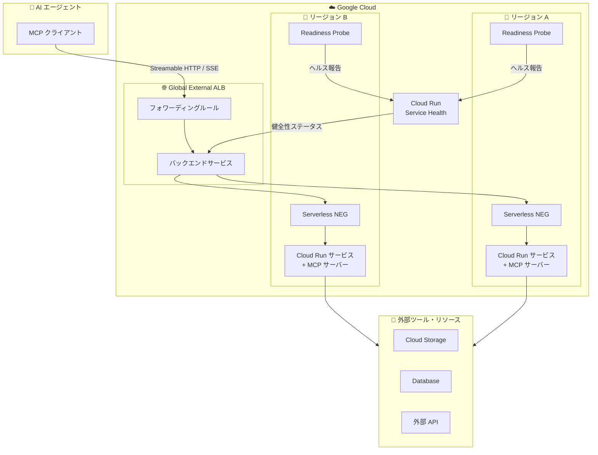

# Cloud Run: リモート MCP サーバーと高可用性デプロイメント

**リリース日**: 2026-02-24
**サービス**: Cloud Run
**機能**: リモート MCP サーバーホスティング / 高可用性デプロイメント
**ステータス**: Preview

📊 [このアップデートのインフォグラフィックを見る](https://takech9203.github.io/google-cloud-news-summary/20260224-cloud-run-mcp-server.html)

## 概要

Cloud Run に 2 つの重要な新機能が Preview として追加された。1 つ目は、AI エージェントやアプリケーションが Cloud Run 上でリモート MCP (Model Context Protocol) サーバーをホストし、デプロイメントを行える機能である。2 つ目は、Cloud Run サービスの高可用性 (HA) デプロイメントを実現する機能で、マルチリージョン構成での自動フェイルオーバーとフェイルバックが可能になる。

MCP サーバーホスティング機能により、AI エージェントが標準化されたプロトコルを通じてツールやリソースとやり取りするためのリモートサーバーを Cloud Run 上で簡単にデプロイできるようになった。MCP はオープンプロトコルであり、AI エージェントが環境とどのようにインタラクションするかを標準化する。Cloud Run は Streamable HTTP トランスポートを使用した MCP サーバーのホスティングをサポートし、コンテナイメージまたはソースコードからのデプロイに対応する。

高可用性デプロイメント機能は Cloud Run service health として提供され、リージョン障害時にトラフィックを自動的に健全なリージョンへ切り替えることで、サービスの中断を最小限に抑える。グローバル外部 Application Load Balancer またはクロスリージョン内部 Application Load Balancer と組み合わせて使用する。

**アップデート前の課題**

- MCP サーバーを本番環境でホストするには、インフラストラクチャの手動管理やスケーリング設定が必要だった
- AI エージェントと MCP サーバー間の認証やネットワーク構成を個別に設計する必要があった
- Cloud Run サービスのクロスリージョンフェイルオーバーは手動で構成する必要があり、リージョン障害時の自動復旧が困難だった
- マルチリージョンデプロイメントにおけるヘルスチェックと自動トラフィック切り替えの統合的な仕組みがなかった

**アップデート後の改善**

- Cloud Run 上で MCP サーバーをコンテナイメージまたはソースコードから直接デプロイ可能になった
- IAM、Cloud Run proxy、サイドカーデプロイメント、Cloud Service Mesh など複数の認証方式が統合的にサポートされた
- Cloud Run service health により、Readiness Probe に基づくリージョンヘルスの自動集約と、ロードバランサーへの健全性レポートが自動化された
- リージョン障害時の自動フェイルオーバーとフェイルバックが可能になり、手動介入なしで高可用性を実現できるようになった

## アーキテクチャ図



Cloud Run 上の MCP サーバーを高可用性構成でデプロイした場合のアーキテクチャを示す。AI エージェントからのリクエストはグローバルロードバランサーを経由し、Cloud Run service health が各リージョンの健全性を監視して自動フェイルオーバーを実現する。

## サービスアップデートの詳細

### 主要機能

1. **リモート MCP サーバーホスティング**
   - Cloud Run 上で Streamable HTTP トランスポートを使用した MCP サーバーをホスト可能
   - コンテナイメージまたはソースコード (Node.js, Python) からのデプロイに対応
   - MCP クライアントとの通信に SSE (Server-Sent Events) または Streamable HTTP をサポート
   - stdio トランスポートはサポート外 (ローカル実行向けのため)

2. **MCP クライアント認証**
   - **IAM invoker 権限**: `roles/run.invoker` による Cloud Run proxy を使用したセキュアな認証
   - **OIDC ID トークン**: カスタムオーディエンスに対応した ID トークンベースの認証
   - **サイドカーデプロイメント**: MCP サーバーを MCP クライアントと同一インスタンスに配置し、localhost 経由で通信
   - **Service-to-Service 認証**: 個別の Cloud Run サービス間での認証
   - **Cloud Service Mesh**: メッシュによる自動認証とトラフィック管理

3. **高可用性デプロイメント (Cloud Run service health)**
   - マルチリージョンデプロイメントでの自動クロスリージョンフェイルオーバーとフェイルバック
   - Readiness Probe に基づくリージョンヘルスの集約と自動報告
   - グローバル外部 Application Load Balancer およびクロスリージョン内部 Application Load Balancer との統合
   - Serverless NEG を使用したリージョン間トラフィック制御

4. **マルチリージョンサービスデプロイメント**
   - 単一の gcloud CLI コマンドまたは YAML / Terraform でマルチリージョンデプロイが可能
   - `gcloud run deploy --regions=REGION_A,REGION_B` で複数リージョンへの同時デプロイ
   - リージョンの追加・削除は `gcloud run multi-region-services update` で管理

## 技術仕様

### MCP サーバーデプロイメント

| 項目 | 詳細 |
|------|------|
| サポートトランスポート | Streamable HTTP, SSE |
| 非サポートトランスポート | stdio |
| デプロイ方式 | コンテナイメージ、ソースコード |
| 推奨 MCP SDK | FastMCP、公式言語 SDK (TypeScript, Python, Go, Kotlin, Java, C#, Ruby, Rust) |
| 認証方式 | IAM invoker、OIDC ID トークン、サイドカー、Service-to-Service、Cloud Service Mesh |

### 高可用性デプロイメント制限事項

| 項目 | 詳細 |
|------|------|
| 最小インスタンス要件 | リージョンごとにサービスレベルまたはリビジョンレベルで 1 以上の最小インスタンスが必須 |
| フェイルオーバー要件 | 少なくとも 2 つの異なるリージョンのサービスが必要 |
| NEG バックエンド上限 | クロスリージョン内部 ALB では最大 5 つの Serverless NEG バックエンド |
| URL マスク / タグ | Serverless NEG では設定不可 |
| IAP | ロードバランサーからの IAP 有効化は不可 (Cloud Run から直接有効化が必要) |

### MCP サーバーデプロイ設定例

```json
{
  "mcpServers": {
    "cloud-run": {
      "url": "http://localhost:3000/sse"
    }
  }
}
```

Cloud Run proxy を使用する場合の MCP クライアント設定例。`gcloud run services proxy` コマンドでローカルに認証済みトンネルを作成し、リモート MCP サーバーにアクセスする。

## 設定方法

### 前提条件

1. Google Cloud プロジェクトで Cloud Run 開発環境をセットアップ済み
2. Cloud Run Admin (`roles/run.admin`) および Service Account User (`roles/iam.serviceAccountUser`) ロールを付与済み
3. Artifact Registry、Cloud Build、Cloud Run Admin API、Compute Engine、Network Services API を有効化済み

### 手順

#### ステップ 1: MCP サーバーのデプロイ (コンテナイメージ)

```bash
# Artifact Registry リポジトリを作成
gcloud artifacts repositories create remote-mcp-servers \
  --repository-format=docker \
  --location=us-central1 \
  --description="Repository for remote MCP servers" \
  --project=PROJECT_ID

# コンテナイメージをビルドしてプッシュ
gcloud builds submit --region=us-central1 \
  --tag us-central1-docker.pkg.dev/PROJECT_ID/remote-mcp-servers/mcp-server:latest

# Cloud Run にデプロイ
gcloud run deploy mcp-server \
  --image us-central1-docker.pkg.dev/PROJECT_ID/remote-mcp-servers/mcp-server:latest \
  --region=us-central1 \
  --no-allow-unauthenticated
```

Artifact Registry にコンテナイメージをビルドし、Cloud Run サービスとしてデプロイする。`--no-allow-unauthenticated` フラグにより認証済みリクエストのみを許可する。

#### ステップ 2: MCP クライアントの認証設定

```bash
# Cloud Run proxy を使用してローカルからアクセス
gcloud run services proxy mcp-server --region=us-central1 --port=3000
```

Cloud Run proxy がローカルのポート 3000 でリクエストを待ち受け、IAM 認証を自動的に注入してリモート MCP サーバーにフォワードする。

#### ステップ 3: マルチリージョン高可用性デプロイメント

```bash
# マルチリージョンサービスのデプロイ (最小インスタンスを設定)
gcloud beta run deploy SERVICE_NAME \
  --regions=us-central1,europe-west1 \
  --min=1

# リージョンの追加
gcloud run multi-region-services update SERVICE_NAME \
  --add-regions=asia-northeast1
```

複数リージョンにサービスをデプロイし、最小インスタンスを 1 以上に設定することで Cloud Run service health が有効になる。

## メリット

### ビジネス面

- **AI エージェント開発の加速**: MCP サーバーを Cloud Run 上で簡単にホストできるため、AI エージェントのツール連携基盤を迅速に構築できる
- **サービス可用性の向上**: 自動フェイルオーバーにより、リージョン障害時もサービスを継続でき、SLA の向上とユーザー影響の最小化が可能
- **運用コストの削減**: Cloud Run のサーバーレス特性により、MCP サーバーもスケールトゥゼロが可能で、使用した分だけ課金される

### 技術面

- **標準化されたプロトコル**: MCP オープンプロトコルにより、エージェントフレームワークに依存しないツール連携が実現できる
- **柔軟な認証方式**: IAM、OIDC、サイドカー、Service Mesh など用途に応じた認証方式を選択可能
- **インフラストラクチャ管理不要**: Cloud Run のマネージドインフラストラクチャにより、MCP サーバーのスケーリング、TLS 終端、ヘルスチェックが自動化される
- **IaC 対応**: gcloud CLI、YAML、Terraform すべてでマルチリージョン構成を定義・管理できる

## デメリット・制約事項

### 制限事項

- Preview 機能のため、SLA の対象外であり、本番環境での利用には注意が必要
- Cloud Run は stdio トランスポートの MCP サーバーをサポートしない (Streamable HTTP / SSE のみ)
- 高可用性機能には最小インスタンスの設定が必須であり、常時起動コストが発生する
- Cloud Run service health はクロスリージョン内部 ALB で 5 つを超える Serverless NEG バックエンドをサポートしない

### 考慮すべき点

- MCP サーバーの Readiness Probe を適切に設計する必要がある (プローブなしのリビジョンは「unknown」として扱われ、ロードバランサーは健全と見なす)
- サービスが削除された場合、Cloud Run は異常ステータスをロードバランサーに報告しない
- 新しいインスタンスの起動時、最初の Readiness Probe はカウントされないため、一時的に新規起動サービスにリクエストがルーティングされる可能性がある
- マルチリージョン構成では、ロードバランサーの SSL 証明書プロビジョニングに最大 30 分かかる場合がある

## ユースケース

### ユースケース 1: AI エージェントのツール基盤

**シナリオ**: 企業内の複数の AI エージェントが共通のツール (データベースアクセス、外部 API 呼び出し、ファイル操作) を MCP サーバー経由で利用する。

**実装例**:
```python
from fastmcp import FastMCP
import os

mcp = FastMCP("Enterprise Tools Server")

@mcp.tool()
def query_database(sql: str) -> str:
    """データベースに対してクエリを実行する"""
    # データベース接続とクエリ実行のロジック
    return result

@mcp.tool()
def call_external_api(endpoint: str, payload: dict) -> dict:
    """外部 API を呼び出す"""
    # API 呼び出しのロジック
    return response

if __name__ == "__main__":
    import asyncio
    asyncio.run(
        mcp.run_async(
            transport="streamable-http",
            host="0.0.0.0",
            port=os.getenv("PORT", 8080),
        )
    )
```

**効果**: MCP プロトコルにより、ADK、LangGraph、Dify など異なるエージェントフレームワークから統一的にツールにアクセスでき、ツールの再利用性が大幅に向上する。

### ユースケース 2: グローバル展開の AI サービスの高可用性確保

**シナリオ**: グローバルに展開する AI チャットボットサービスを Cloud Run で運用し、リージョン障害時にも継続稼働を保証する必要がある。

**効果**: Cloud Run service health と Global External ALB の組み合わせにより、リージョン障害を自動検知し、健全なリージョンにトラフィックを自動フェイルオーバーする。フェイルバックも自動化されるため、運用チームの手動介入が不要になる。

## 料金

Cloud Run の料金体系は従来通り適用される。2 つの課金モデルが利用可能。

- **リクエストベース課金** (デフォルト): リクエスト処理中のみ CPU/メモリが課金される。リクエストごとの料金も発生する。
- **インスタンスベース課金**: インスタンスの全ライフサイクルにわたって課金される。リクエストごとの料金は発生しない。

高可用性デプロイメントでは最小インスタンスの設定 (1 以上) が必須であるため、インスタンスベース課金が推奨される。

### 料金例

| 項目 | 詳細 |
|------|------|
| 無料枠 | 月 200 万リクエスト、360,000 GiB 秒メモリ、180,000 vCPU 秒 |
| Flexible CUD (1 年) | インスタンスベース: 28% 割引 / リクエストベース: 17% 割引 |
| Flexible CUD (3 年) | インスタンスベース: 46% 割引 / リクエストベース: 17% 割引 |

詳細な料金については [Cloud Run 料金ページ](https://cloud.google.com/run/pricing) を参照。

## 利用可能リージョン

Cloud Run は Tier 1 および Tier 2 の合計 40 以上のリージョンで利用可能。マルチリージョンデプロイメントでは任意のリージョンの組み合わせが選択できる。

主な Tier 1 リージョン:
- us-central1 (アイオワ)、us-east1 (サウスカロライナ)、us-west1 (オレゴン)
- europe-west1 (ベルギー)、europe-west4 (オランダ)、europe-north1 (フィンランド)
- asia-east1 (台湾)、asia-northeast1 (東京)、asia-northeast2 (大阪)

主な Tier 2 リージョン:
- asia-northeast3 (ソウル)、asia-southeast1 (シンガポール)、australia-southeast1 (シドニー)

全リージョン一覧は [Cloud Run ロケーション](https://cloud.google.com/run/docs/locations) を参照。

## 関連サービス・機能

- **Agent Development Kit (ADK)**: Cloud Run 上で ADK エージェントをデプロイし、MCP サーバーと連携する統合的なエージェント開発フレームワーク
- **Cloud Service Mesh**: MCP クライアントとサーバー間の認証・トラフィック管理を自動化するサービスメッシュ
- **Global External Application Load Balancer**: マルチリージョン Cloud Run サービスへのグローバルトラフィックルーティングとフェイルオーバーを提供
- **Vertex AI**: Gemini API やカスタムモデルのホスティングなど、AI エージェントの推論レイヤーを提供
- **Artifact Registry**: MCP サーバーのコンテナイメージを保存・管理するレジストリサービス
- **Cloud Build**: MCP サーバーのコンテナイメージのビルドと CI/CD パイプラインの構築

## 参考リンク

- 📊 [インフォグラフィック](https://takech9203.github.io/google-cloud-news-summary/20260224-cloud-run-mcp-server.html)
- [公式リリースノート](https://cloud.google.com/release-notes#February_24_2026)
- [MCP サーバーのホスティングガイド](https://cloud.google.com/run/docs/host-mcp-servers)
- [リモート MCP サーバーデプロイチュートリアル](https://cloud.google.com/run/docs/tutorials/deploy-remote-mcp-server)
- [マルチリージョンデプロイメント](https://cloud.google.com/run/docs/multiple-regions)
- [Cloud Run service health チュートリアル](https://cloud.google.com/run/docs/tutorials/configure-service-health)
- [Cloud Run 上の AI エージェント](https://cloud.google.com/run/docs/ai-agents)
- [料金ページ](https://cloud.google.com/run/pricing)

## まとめ

今回の Cloud Run アップデートは、AI エージェント開発のインフラストラクチャ基盤として Cloud Run をさらに強化するものである。リモート MCP サーバーホスティングにより、AI エージェントがツールやリソースにアクセスするための標準化されたインフラを Cloud Run 上で容易に構築できるようになった。また、Cloud Run service health による高可用性デプロイメントは、ミッションクリティカルな AI サービスのリージョン障害耐性を自動化する。AI エージェント基盤を Cloud Run で構築しているチームは、MCP サーバーの統合と高可用性構成の導入を検討することを推奨する。

---

**タグ**: #CloudRun #MCP #ModelContextProtocol #AIエージェント #高可用性 #マルチリージョン #サーバーレス #Preview #フェイルオーバー #GoogleCloud
