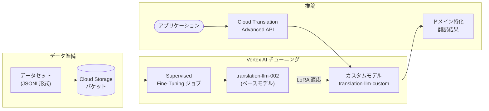

# Cloud Translation: Translation LLM が LoRA による完全ファインチューニングをサポート

**リリース日**: 2026-02-24
**サービス**: Cloud Translation
**機能**: Translation LLM の LoRA ファインチューニング
**ステータス**: Change (機能強化)

[このアップデートのインフォグラフィックを見る](https://takech9203.github.io/google-cloud-news-summary/20260224-cloud-translation-llm-lora-finetuning.html)

## 概要

Google Cloud の Translation LLM (TLLM) が、LoRA (Low-Rank Adaptation) を用いた完全ファインチューニング (Supervised Fine-Tuning) をサポートしました。Translation LLM は Gemini をベースとした翻訳特化型の大規模言語モデルであり、MetricX や COMET といった翻訳品質評価指標で他の翻訳モデルを大きく上回る性能を発揮します。今回のアップデートにより、ユーザーは自社のドメイン固有の用語やスタイルに合わせて翻訳モデルをカスタマイズできるようになりました。

ファインチューニングの対象モデルは `translation-llm-002` であり、Vertex AI の Supervised Tuning API を通じてチューニングジョブを作成・管理できます。データセットは JSONL 形式で Cloud Storage にアップロードし、最低 100 件のトレーニング例から開始できます。チューニング済みモデルは `translation-llm-custom/{model-id}` というモデル ID で Cloud Translation API から呼び出すことが可能です。

このアップデートは、法律、医療、金融、テクノロジーなどの専門分野で高品質な翻訳を必要とする企業や、独自のブランドトーンや用語体系を維持しながら多言語展開を進めるグローバル企業を主な対象としています。

**アップデート前の課題**

- Translation LLM (TLLM) はそのままでは汎用的な翻訳品質に優れていたが、ドメイン固有の専門用語やスタイルに対応させるにはカスタマイズの選択肢が限定的だった
- NMT モデルのカスタマイズ (AutoML Translation) は利用可能だったが、Translation LLM の高品質な翻訳性能をベースにしたカスタマイズはできなかった
- Adaptive Translation (少数の翻訳例によるリアルタイムのスタイルカスタマイズ) は利用できたが、大規模なドメイン適応には不十分だった
- 専門分野の翻訳では、汎用モデルの出力を人手で修正する工程が発生していた

**アップデート後の改善**

- Translation LLM を LoRA ベースの Supervised Fine-Tuning でドメイン固有のデータに適応させることが可能になった
- 100 件程度の少量のデータセットからチューニングを開始でき、数千件まで拡張可能
- Vertex AI の Tuning API および Python SDK を通じてチューニングジョブの作成・管理・モニタリングが可能になった
- カスタマイズ済みモデルを Cloud Translation API から直接利用でき、既存の翻訳ワークフローに統合しやすくなった

## アーキテクチャ図



Translation LLM の LoRA ファインチューニングは、データ準備、Vertex AI でのチューニング実行、Cloud Translation API を通じた推論の 3 段階で構成されます。チューニング済みモデルは既存の Cloud Translation API ワークフローにシームレスに統合できます。

## サービスアップデートの詳細

### 主要機能

1. **LoRA ベースの Supervised Fine-Tuning**
   - LoRA (Low-Rank Adaptation) 技術により、Translation LLM の重みを効率的に調整
   - ベースモデル `translation-llm-002` に対してドメイン固有のデータでチューニング
   - アダプターサイズは 4 のみサポート (他の値を使用するとエラーとなる)

2. **柔軟なデータセット管理**
   - JSONL 形式でトレーニングデータを準備
   - 最低 100 件からチューニング開始可能、数千件まで拡張可能
   - オプションでバリデーションデータセット (最大 1,024 件) を指定して効果を検証
   - AutoML Translation の既存データセットや TSV/CSV/TMX 形式のローカルデータからの変換をサポート

3. **Vertex AI Studio 統合**
   - Google Cloud コンソールの Vertex AI Studio からチューニングジョブの作成・管理が可能
   - トレーニングメトリクス (損失、トークン精度、予測数) のリアルタイムモニタリング
   - バリデーションメトリクスによるモデル評価

4. **Cloud Translation API との統合**
   - チューニング済みモデルを `translation-llm-custom/{model-id}` として Cloud Translation API から呼び出し可能
   - 既存の翻訳ワークフロー (REST API、Python クライアント) から直接利用可能

## 技術仕様

### モデルとデータセットの制限事項

| 項目 | 詳細 |
|------|------|
| ベースモデル | `translation-llm-002` |
| カスタムモデル ID | `translation-llm-custom/{model-id}` |
| アダプターサイズ (LoRA Rank) | 4 (固定、他の値は不可) |
| 入出力トークン上限 (推論時) | 1,000 トークン (~4,000 文字) |
| トレーニング例の長さ上限 | 1,000 トークン (~4,000 文字) |
| トレーニングデータセットサイズ | 最大 1GB (JSONL) |
| バリデーションデータセット | 最大 1,024 件 |
| 推奨最小トレーニング件数 | 100 件 |
| チューニング対応リージョン | us-central1 のみ |
| 同時実行チューニングジョブ | プロジェクトあたりデフォルト 1 件 (クォータ申請で増加可能) |

### トレーニングメトリクス

| メトリクス | 説明 |
|------------|------|
| `/train_total_loss` | トレーニングデータセットに対する損失値 |
| `/train_fraction_of_correct_next_step_preds` | トレーニングステップでのトークン精度 |
| `/train_num_predictions` | トレーニングステップでの予測トークン数 |
| `/eval_total_loss` | バリデーションデータセットに対する損失値 |
| `/eval_fraction_of_correct_next_step_preds` | バリデーションステップでのトークン精度 |
| `/eval_num_predictions` | バリデーションステップでの予測トークン数 |

### データセット形式

```json
{
  "contents": [
    {
      "role": "user",
      "parts": [
        {
          "text": "English: Hello. Spanish:"
        }
      ]
    },
    {
      "role": "model",
      "parts": [
        {
          "text": "Hola."
        }
      ]
    }
  ]
}
```

## 設定方法

### 前提条件

1. Google Cloud プロジェクトで Cloud Translation - Advanced API が有効化されていること
2. Vertex AI API が有効化されていること
3. サービスアカウントに適切な IAM ロール (`roles/cloudtranslate.user`、Vertex AI 関連ロール) が付与されていること
4. トレーニングデータセットが JSONL 形式で Cloud Storage にアップロード済みであること

### 手順

#### ステップ 1: データセットの準備とアップロード

```bash
# Cloud Storage バケットの作成 (us-central1 推奨)
gcloud storage buckets create gs://my-translation-tuning-data \
    --location=us-central1

# JSONL 形式のトレーニングデータをアップロード
gcloud storage cp training_data.jsonl gs://my-translation-tuning-data/
```

トレーニングデータは JSONL 形式で、各行に `user` ロール (ソース言語テキスト) と `model` ロール (ターゲット言語テキスト) のペアを記述します。

#### ステップ 2: REST API でチューニングジョブを作成

```bash
PROJECT_ID=myproject
LOCATION=us-central1

curl -X POST \
  -H "Authorization: Bearer $(gcloud auth print-access-token)" \
  -H "Content-Type: application/json; charset=utf-8" \
  "https://${LOCATION}-aiplatform.googleapis.com/v1/projects/${PROJECT_ID}/locations/${LOCATION}/tuningJobs" \
  -d '{
    "baseModel": "translation-llm-002",
    "supervisedTuningSpec": {
      "trainingDatasetUri": "gs://my-translation-tuning-data/training_data.jsonl",
      "validationDatasetUri": "gs://my-translation-tuning-data/validation_data.jsonl"
    },
    "tunedModelDisplayName": "my-custom-translation-model"
  }'
```

#### ステップ 3: Python SDK でチューニングジョブを作成

```python
import vertexai
from vertexai.tuning import sft

vertexai.init(project="PROJECT_ID", location="us-central1")

sft_tuning_job = sft.train(
    source_model="translation-llm-002",
    train_dataset="gs://my-translation-tuning-data/training_data.jsonl",
    validation_dataset="gs://my-translation-tuning-data/validation_data.jsonl",
    tuned_model_display_name="my-custom-translation-model",
)

# ジョブ完了を待機
import time
while not sft_tuning_job.has_ended:
    time.sleep(60)
    sft_tuning_job.refresh()

print(sft_tuning_job.tuned_model_name)
print(sft_tuning_job.tuned_model_endpoint_name)
```

#### ステップ 4: カスタムモデルで翻訳を実行

```python
from google.cloud import translate_v3

def translate_with_custom_model():
    response = translate_v3.TranslationServiceClient().translate_text(
        contents=["This is domain-specific text to translate."],
        target_language_code="ja",
        source_language_code="en",
        parent="projects/PROJECT_ID/locations/us-central1",
        model="projects/PROJECT_ID/locations/us-central1/models/translation-llm-custom/MODEL_ID"
    )
    print(response)
    return response
```

## メリット

### ビジネス面

- **専門分野の翻訳品質向上**: 法律、医療、金融などの業界固有の用語やスタイルを正確に翻訳できるようになり、翻訳後の人手修正コストを削減できる
- **ブランド一貫性の維持**: 企業固有のトーンや用語体系をモデルに学習させることで、多言語コンテンツのブランド一貫性を確保できる
- **市場投入の迅速化**: 専門翻訳者への外注や手動修正の工程を削減し、多言語コンテンツの公開スピードを向上できる

### 技術面

- **LoRA の効率性**: 全パラメータのファインチューニングと比較して、少量のデータと計算リソースで効果的なカスタマイズが可能
- **既存ワークフローとの互換性**: Cloud Translation API の `translateText` エンドポイントから直接利用でき、アプリケーションの大幅な変更が不要
- **段階的なカスタマイズ**: 100 件の少量データから開始し、結果を評価しながら徐々にデータセットを拡充できる

## デメリット・制約事項

### 制限事項

- チューニングジョブのリージョンは `us-central1` のみに制限されている
- ベースモデルは `translation-llm-002` のみサポート
- LoRA アダプターサイズは 4 に固定されており、変更不可
- 入出力トークンは最大 1,000 トークン (約 4,000 文字) に制限
- 同時実行のチューニングジョブ数にクォータ制限あり (デフォルト 1 件)
- Customized Translation LLM は Preview ステージ

### 考慮すべき点

- チューニングデータの品質がモデル性能に直接影響するため、高品質な翻訳ペアの準備が重要
- ドメイン特化度が高い場合、最低 100 件ではなく数百件以上のトレーニングデータが推奨される
- チューニングに加えて Cloud Storage、Translation LLM Prediction の料金も別途発生する
- Adaptive Translation (少数例によるリアルタイムカスタマイズ) と比較して、ファインチューニングはより多くのデータと準備時間が必要

## ユースケース

### ユースケース 1: 法律文書の専門翻訳

**シナリオ**: 国際的な法律事務所が、契約書や法的文書を複数言語に翻訳する必要がある。法律用語の正確な翻訳と、法的文書特有の文体の維持が求められる。

**実装例**:
```json
{
  "contents": [
    {
      "role": "user",
      "parts": [{"text": "English: The indemnifying party shall hold harmless the indemnified party. Japanese:"}]
    },
    {
      "role": "model",
      "parts": [{"text": "補償当事者は、被補償当事者を免責するものとする。"}]
    }
  ]
}
```

**効果**: 法律用語の正確な翻訳により、翻訳後のリーガルレビュー工程を大幅に短縮し、契約書の多言語化プロセスを高速化できる。

### ユースケース 2: 技術文書のローカリゼーション

**シナリオ**: ソフトウェア企業が、API ドキュメントやユーザーガイドを多言語で提供する必要がある。技術用語の一貫した翻訳と、技術文書特有の簡潔な文体が求められる。

**効果**: 製品固有の技術用語を正確に翻訳し、ドキュメントの多言語展開を効率化できる。Glossary との併用でさらに用語の一貫性を高められる。

## 料金

Translation LLM のファインチューニングに関する料金は、以下の要素で構成されます。

- **チューニング料金**: Vertex AI の Translation Model Tuning 料金に基づいて課金
- **推論料金**: Cloud Translation API の文字数ベースの課金 (送信文字数に基づく月額課金)
- **関連サービス料金**: Cloud Storage (データセット保存)

料金の詳細は公式料金ページを参照してください。

- [Cloud Translation 料金](https://cloud.google.com/translate/pricing)
- [Vertex AI Generative AI 料金 (Translation Model Tuning)](https://cloud.google.com/vertex-ai/generative-ai/pricing#model-tuning)

## 利用可能リージョン

- **チューニングジョブ**: us-central1 のみ
- **Translation LLM (推論)**: Cloud Translation - Advanced API が利用可能なリージョンで実行可能

## 関連サービス・機能

- **Adaptive Translation**: Translation LLM の軽量なリアルタイムカスタマイズ機能。少数の翻訳例を使ってスタイルや用語を調整する。ファインチューニングよりも手軽だが、大規模なドメイン適応には不向き
- **NMT カスタマイズ (AutoML Translation)**: Neural Machine Translation モデルのカスタマイズ。Translation LLM よりもレイテンシが低いが、翻訳品質では Translation LLM に劣る
- **Glossary**: 特定の用語の翻訳を制御する辞書機能。ファインチューニングと併用することで、用語の一貫性をさらに高められる
- **Vertex AI Studio**: ファインチューニングジョブの作成・管理・モニタリングを GUI で実行できるインターフェース
- **Cloud Storage**: トレーニングデータセットの保存先として使用

## 参考リンク

- [インフォグラフィック](https://takech9203.github.io/google-cloud-news-summary/20260224-cloud-translation-llm-lora-finetuning.html)
- [公式リリースノート](https://cloud.google.com/release-notes#February_24_2026)
- [Translation LLM ドキュメント](https://cloud.google.com/translate/docs/translation-llm)
- [Supervised Fine-Tuning ガイド](https://cloud.google.com/vertex-ai/generative-ai/docs/models/translation-use-supervised-tuning)
- [データセット準備ガイド](https://cloud.google.com/vertex-ai/generative-ai/docs/models/translation-supervised-tuning-prepare)
- [Supervised Fine-Tuning 概要](https://cloud.google.com/vertex-ai/generative-ai/docs/models/translation-supervised-tuning)
- [モデル比較ガイド](https://cloud.google.com/translate/docs/advanced/compare-models)
- [カスタム翻訳の概要](https://cloud.google.com/translate/docs/advanced/custom-translations)
- [Cloud Translation 料金](https://cloud.google.com/translate/pricing)

## まとめ

今回のアップデートにより、Translation LLM が LoRA ベースの Supervised Fine-Tuning をサポートし、ドメイン固有の翻訳品質を大幅に向上させる手段が提供されました。法律、医療、金融、テクノロジーなどの専門分野で高品質な翻訳を必要とする組織にとって、翻訳後の人手修正コストの削減とコンテンツの多言語展開の迅速化が期待できます。まずは Adaptive Translation や Glossary と比較しながら自社のユースケースに最適なカスタマイズ手法を選定し、100 件程度の高品質なトレーニングデータから試験的にファインチューニングを開始することを推奨します。

---

**タグ**: #CloudTranslation #TranslationLLM #LoRA #FineTuning #MachineLearning #NLP #Localization #VertexAI
