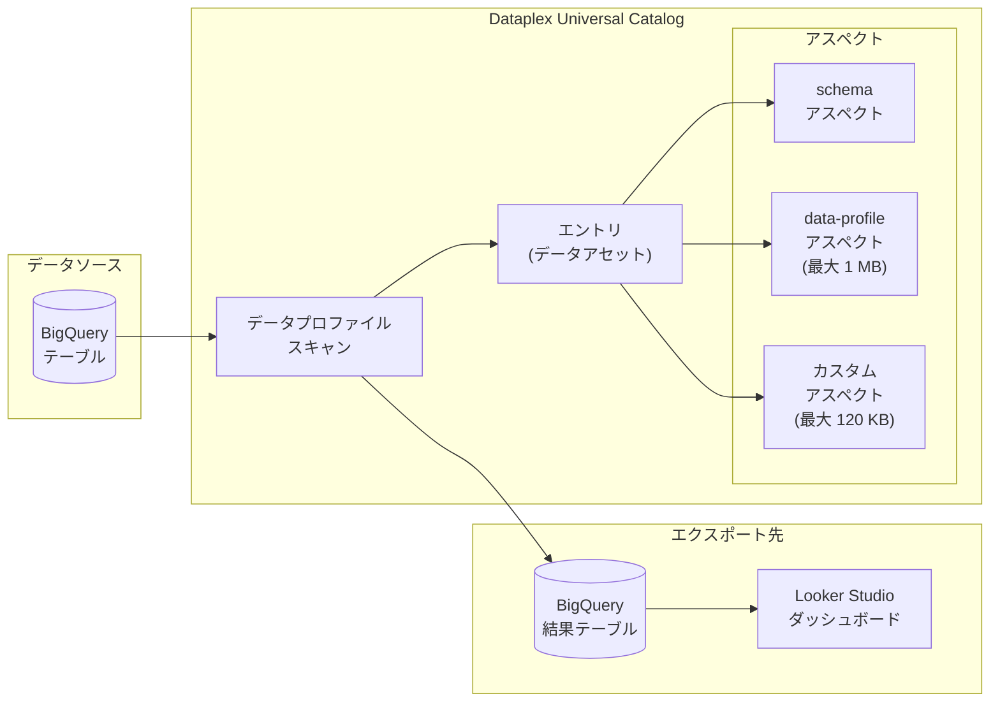

# Dataplex: データプロファイルアスペクトのサイズ上限が 1 MB に拡大

**リリース日**: 2026-02-24
**サービス**: Dataplex Universal Catalog
**機能**: データプロファイルアスペクトのサイズ上限引き上げ
**ステータス**: GA (一般提供)

[このアップデートのインフォグラフィックを見る](https://takech9203.github.io/google-cloud-news-summary/20260224-dataplex-data-profile-aspects.html)

## 概要

Dataplex Universal Catalog において、データプロファイルアスペクトの JSON コンテンツサイズ上限が 1 MB に引き上げられた。これにより、大規模なテーブルやカラム数の多いデータセットに対するデータプロファイリング結果を、Dataplex Universal Catalog のエントリ内に保存できるようになった。

データプロファイルアスペクトは、データプロファイルスキャンの結果を格納するシステムアスペクトタイプ (`dataplex-types.global.data-profile`) である。BigQuery テーブルのカラムごとの統計情報 (NULL 率、ユニーク率、上位値、数値の平均・最小・最大など) を含むため、カラム数が多いテーブルではアスペクトのサイズが大きくなる。今回の上限拡大により、より多くのカラムを持つテーブルのプロファイリング結果を完全に保存できるようになった。

このアップデートは、データガバナンスやデータ品質管理を行うデータエンジニア、データスチュワード、およびデータプラットフォーム管理者を主な対象としている。

**アップデート前の課題**

- データプロファイルアスペクトの JSON コンテンツサイズが通常アスペクトと同じ 120 KB の上限に制約されていた可能性があり、カラム数が多いテーブルのプロファイリング結果が完全に保存できないケースがあった
- 大規模テーブルのデータプロファイリング結果を Dataplex Universal Catalog 内に一元管理することが困難だった
- プロファイリング結果の一部が切り捨てられるリスクがあり、データ品質管理の網羅性に課題があった

**アップデート後の改善**

- データプロファイルアスペクトの JSON コンテンツサイズ上限が 1 MB に拡大され、大規模テーブルのプロファイリング結果を完全に保存可能になった
- 通常のアスペクト (スキーマおよびデータプロファイル以外) の 120 KB 上限とは独立した、データプロファイル専用の上限が設定された
- カラム数の多いテーブルでも、全カラムの統計情報を含むプロファイリング結果を Dataplex Universal Catalog に保存できるようになった

## アーキテクチャ図



Dataplex Universal Catalog のデータプロファイルスキャンが BigQuery テーブルを分析し、結果をエントリのデータプロファイルアスペクト (最大 1 MB) として保存する流れを示している。結果は BigQuery テーブルにもエクスポート可能である。

## サービスアップデートの詳細

### 主要機能

1. **データプロファイルアスペクトのサイズ上限拡大**
   - JSON コンテンツの上限が 1 MB に引き上げ
   - 通常のアスペクト (120 KB) やスキーマアスペクトとは独立した専用上限
   - カラム数が多いテーブルのプロファイリング結果を完全に保存可能

2. **データプロファイルアスペクトの格納内容**
   - `sourceDataInfo`: スキャン対象データの情報 (スコープ、スキャン行数、サンプリング率)
   - `fields`: カラムごとのプロファイル (ユニーク率、NULL 率、上位値、型別統計)
   - 数値カラム: 平均値、標準偏差、最小値、四分位数、最大値
   - 文字列カラム: 平均長、最小長、最大長

3. **データプロファイルスキャンとの連携**
   - スキャン結果を Dataplex Universal Catalog のエントリに自動公開可能
   - BigQuery コンソールおよび Dataplex Universal Catalog コンソールの「Data profile」タブから閲覧
   - 履歴ジョブの結果や Analysis タブでのトレンド分析にも対応

## 技術仕様

### Dataplex Universal Catalog のアスペクトサイズ上限

| 項目 | サイズ上限 |
|------|-----------|
| 通常のアスペクト JSON コンテンツ (スキーマおよびデータプロファイル以外) | 120 KB |
| データプロファイルアスペクト JSON コンテンツ | **1 MB** |
| エントリおよびアスペクトのリクエストサイズ (スキーマアスペクト含む) | 2 MB |
| エントリの合計サイズ | 5 MB |
| エントリあたりの最大アスペクト数 | 10,000 |

### Dataplex Universal Catalog の API クォータ

| クォータ | デフォルト値 |
|---------|-------------|
| エントリ・アスペクトの読み取りリクエスト (プロジェクト/リージョン/分) | 6,000 |
| エントリ・アスペクトの書き込みリクエスト (プロジェクト/リージョン/分) | 1,500 |
| 検索リクエスト (プロジェクト/ユーザー/分) | 900 |
| 検索リクエスト (プロジェクト/分) | 1,200 |

### アスペクト更新の API 例

```json
{
  "aspects": {
    "dataplex-types.global.data-profile": {
      "data": {
        "sourceDataInfo": {
          "scope": "ALL",
          "scannedRows": 100000
        },
        "fields": {
          "column_name": {
            "nullness": 0.02,
            "uniqueness": 0.95,
            "string": {
              "length": {
                "min": 1,
                "max": 255,
                "avg": 42.3
              }
            }
          }
        }
      }
    }
  }
}
```

## 設定方法

### 前提条件

1. Google Cloud プロジェクトで Dataplex API が有効化されていること
2. 対象の BigQuery テーブルに対する適切な IAM 権限があること
3. Dataplex Catalog Admin、Dataplex Catalog Editor、または Dataplex Catalog Viewer のいずれかのロールが付与されていること

### 手順

#### ステップ 1: データプロファイルスキャンの作成

Google Cloud コンソールから操作する場合:

1. Dataplex Universal Catalog の「Data profiling & quality」ページに移動
2. 「Create data profile scan」をクリック
3. 対象の BigQuery テーブルを選択
4. スキャンのスコープ (全テーブル / インクリメンタル)、フィルタ、サンプリング率を設定
5. 結果の公開先 (BigQuery、Dataplex Universal Catalog) を設定

#### ステップ 2: スキャン結果の確認

```bash
# gcloud CLI でエントリのアスペクトを取得
gcloud dataplex entries lookup \
  --entry="projects/PROJECT_ID/locations/LOCATION/entryGroups/@bigquery/entries/TABLE_ENTRY" \
  --aspect-types="dataplex-types.global.data-profile"
```

スキャン結果は Dataplex Universal Catalog のエントリ詳細ページの「Data profile」タブからも確認できる。

## メリット

### ビジネス面

- **データガバナンスの強化**: 大規模テーブルのプロファイリング結果を一元管理でき、データ品質の全体像を把握しやすくなる
- **コンプライアンス対応の改善**: カラムレベルの統計情報を完全に保持することで、PII 検出やデータ分類の精度が向上する

### 技術面

- **大規模テーブルへの対応**: カラム数の多いテーブルでもプロファイリング結果が切り捨てられることなく保存される
- **メタデータの一元管理**: Dataplex Universal Catalog 内でデータプロファイル情報とビジネスメタデータを統合的に管理できる
- **自動化の促進**: プロファイリング結果の自動公開と Metadata Change Feeds による通知を組み合わせることで、データ品質モニタリングの自動化が容易になる

## デメリット・制約事項

### 制限事項

- データプロファイルアスペクト以外の通常アスペクトの上限は 120 KB のまま変更なし
- エントリ全体の合計サイズ上限は 5 MB のまま
- データプロファイリングは BigQuery テーブルのみサポート (BIGNUMERIC カラムを含むテーブルは非対応)

### 考慮すべき点

- プロファイルアスペクトのサイズが大きくなると、エントリの読み取り API レスポンスサイズも増加する可能性がある
- API クォータ (書き込みリクエスト 1,500/分) の範囲内で運用する必要がある
- メタデータストレージの SKU に基づく課金が適用されるため、大量のプロファイルデータを保存する場合はコストへの影響を確認すること

## ユースケース

### ユースケース 1: 大規模データウェアハウスのプロファイリング

**シナリオ**: 数百カラムを持つ BigQuery テーブル群に対してデータプロファイリングを実施し、結果を Dataplex Universal Catalog で一元管理する

**実装例**:
```bash
# データプロファイルスキャンを作成し、結果を Dataplex Universal Catalog に公開
gcloud dataplex datascans create data-profile \
  --location=us-central1 \
  --data-source-resource="//bigquery.googleapis.com/projects/PROJECT/datasets/DATASET/tables/LARGE_TABLE" \
  --data-profile-spec='{"samplingPercent": 10}' \
  --data-scan-id=large-table-profile
```

**効果**: 全カラムの統計情報を含むプロファイリング結果が 1 MB まで保存可能になり、カラム数が多いテーブルでも完全なプロファイル情報を Dataplex Universal Catalog で確認できる

### ユースケース 2: データ品質モニタリングの自動化

**シナリオ**: スケジュール実行のデータプロファイルスキャンと Metadata Change Feeds を組み合わせて、プロファイル変化を検知し自動通知する

**効果**: プロファイリング結果が完全に保存されるため、トレンド分析やアラート条件の設定がより正確になる

## 料金

Dataplex Universal Catalog はメタデータストレージの SKU に基づいて課金される。以下の操作は無料で利用可能:

- Dataplex Universal Catalog のカタログリソースの作成・管理
- Search API の呼び出し
- Google Cloud コンソールでの検索クエリ

詳細な料金については [Dataplex Universal Catalog の料金ページ](https://cloud.google.com/dataplex/pricing) を参照。

## 利用可能リージョン

Dataplex Universal Catalog はマルチリージョンで利用可能。利用可能なリージョンの最新情報は [Dataplex のドキュメント](https://cloud.google.com/dataplex/docs/locations) を参照。

## 関連サービス・機能

- **BigQuery**: データプロファイリングの対象データソース。プロファイルスキャン結果のエクスポート先としても使用
- **Sensitive Data Protection (DLP)**: データプロファイリングと連携して機密データを検出。Dataplex Universal Catalog にプロファイリング結果を格納
- **Dataplex データ品質スキャン**: データプロファイルスキャンと並行して使用し、データ品質ルールの自動推奨を提供
- **Cloud Monitoring / Cloud Logging**: Dataplex のスキャンジョブの実行状況をモニタリング
- **Pub/Sub**: Metadata Change Feeds を通じてアスペクト変更通知を受信

## 参考リンク

- [インフォグラフィック](https://takech9203.github.io/google-cloud-news-summary/20260224-dataplex-data-profile-aspects.html)
- [公式リリースノート](https://cloud.google.com/release-notes#February_24_2026)
- [Dataplex Universal Catalog のクォータと上限](https://cloud.google.com/dataplex/docs/quotas)
- [データプロファイリングについて](https://cloud.google.com/dataplex/docs/data-profiling-overview)
- [アスペクトによるメタデータの管理](https://cloud.google.com/dataplex/docs/enrich-entries-metadata)
- [Dataplex Universal Catalog の概要](https://cloud.google.com/dataplex/docs/catalog-overview)
- [料金ページ](https://cloud.google.com/dataplex/pricing)

## まとめ

今回のアップデートにより、Dataplex Universal Catalog のデータプロファイルアスペクトの JSON コンテンツサイズ上限が 1 MB に拡大された。これは、カラム数の多い大規模な BigQuery テーブルのプロファイリング結果を完全に保存するために重要な改善である。データガバナンスやデータ品質管理を推進する組織においては、Dataplex Universal Catalog のデータプロファイルスキャン機能を活用し、プロファイリング結果の自動公開を有効化することを推奨する。

---

**タグ**: #Dataplex #UniversalCatalog #DataProfile #DataGovernance #DataQuality #BigQuery #メタデータ管理
