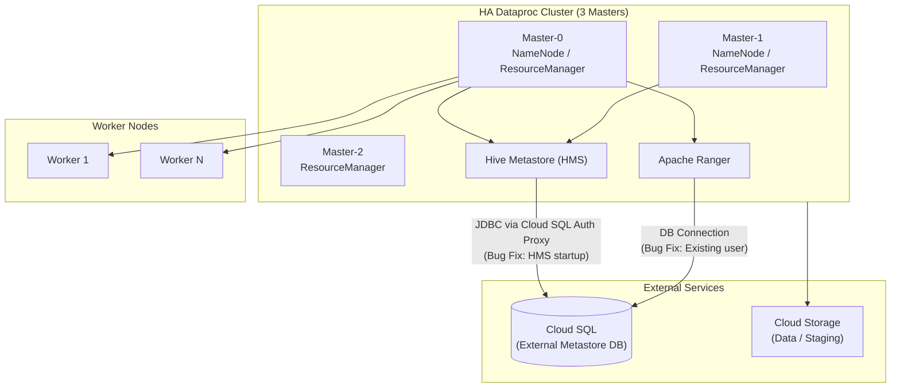

# Dataproc: 新しいサブマイナーイメージバージョンとバグ修正

**リリース日**: 2026-02-24
**サービス**: Dataproc on Compute Engine
**機能**: サブマイナーイメージバージョン更新 (2.0.160, 2.1.109, 2.2.67) およびバグ修正
**ステータス**: Announcement / Fixed

[このアップデートのインフォグラフィックを見る](https://takech9203.github.io/google-cloud-news-summary/20260224-dataproc-image-versions.html)

## 概要

Google Cloud Dataproc on Compute Engine において、新しいサブマイナーイメージバージョンがリリースされた。対象となるメジャーバージョンは 2.0、2.1、2.2 の 3 系統で、それぞれ Debian、Rocky Linux、Ubuntu の各 OS ディストリビューションに対応したイメージが提供される。具体的には 2.0.160、2.1.109、2.2.67 の各サブマイナーバージョンが新たに利用可能となった。

今回のリリースには 2 件の重要なバグ修正が含まれている。1 つ目は、Cloud SQL を外部メタストアとして使用する HA (High Availability) クラスタにおいて、Hive Metastore (HMS) の起動が失敗する問題の修正である。2 つ目は、Ranger DB ユーザーが既に存在する場合に Ranger の起動が失敗する問題の修正である。これらの修正により、HA 構成や Cloud SQL 連携を利用するクラスタの安定性が向上する。

このアップデートは、Dataproc on Compute Engine を使用してビッグデータ処理ワークロードを実行しているすべてのユーザーに関連するが、特に HA クラスタ構成で Cloud SQL を外部 Hive Metastore として利用しているユーザー、および Apache Ranger をオプションコンポーネントとして使用しているユーザーにとって重要である。

**アップデート前の課題**

- HA クラスタ構成で Cloud SQL を外部 Hive Metastore として使用した場合、HMS の起動が失敗することがあり、クラスタの作成や再起動時に問題が発生していた
- Apache Ranger コンポーネントを使用する際、Ranger DB ユーザーが既に存在する環境 (例: Cloud SQL インスタンスを複数クラスタで共有する場合) では、Ranger の起動が失敗していた
- 前回のサブマイナーバージョン以降に発見されたコンポーネントのパッチや修正が未適用の状態であった

**アップデート後の改善**

- HA クラスタで Cloud SQL を外部メタストアとして使用した場合でも、HMS が正常に起動するようになった
- Ranger DB ユーザーが既に存在する環境でも、Ranger が問題なく起動するようになり、クラスタの再作成が容易になった
- 各 OS ディストリビューション (Debian 10/11/12、Rocky Linux 8/9、Ubuntu 18/20/22) に対して最新のパッチが適用された

## アーキテクチャ図



Dataproc HA クラスタにおける HMS と Ranger の Cloud SQL 連携を示す。今回のバグ修正は HMS から Cloud SQL への接続時の起動失敗、および Ranger の DB ユーザー重複時の起動失敗に対するものである。

## サービスアップデートの詳細

### 主要機能

1. **新しいサブマイナーイメージバージョン**
   - バージョン 2.0 系: 2.0.160-debian10、2.0.160-rocky8、2.0.160-ubuntu18
   - バージョン 2.1 系: 2.1.109-debian11、2.1.109-rocky8、2.1.109-ubuntu20
   - バージョン 2.2 系: 2.2.67-debian12、2.2.67-rocky9、2.2.67-ubuntu22
   - 各サブマイナーバージョンにはコンポーネントのパッチおよびセキュリティ修正が含まれる

2. **Hive Metastore (HMS) 起動失敗の修正**
   - HA クラスタ (3 マスター構成) において Cloud SQL を外部メタストアとして使用する際の起動失敗を修正
   - Cloud SQL Auth Proxy 経由でのメタストア DB 接続が安定化
   - HA 構成でのクラスタ作成・再起動の信頼性が向上

3. **Apache Ranger 起動失敗の修正**
   - Ranger DB ユーザーが既に存在する場合の起動失敗を修正
   - Cloud SQL インスタンスを複数クラスタ間で共有する環境での再作成が容易に
   - Ranger コンポーネントの冪等性が改善

## 技術仕様

### イメージバージョンとサポート期間

| メジャーバージョン | サブマイナー | OS ディストリビューション | サポート期限 | 利用可能期限 |
|---|---|---|---|---|
| 2.0 | 2.0.160 | debian10, rocky8, ubuntu18 | 2025/09/30 (終了済み) | 2026/07/31 |
| 2.1 | 2.1.109 | debian11, rocky8, ubuntu20 | 2026/03/31 | 2026/12/31 |
| 2.2 | 2.2.67 | debian12, rocky9, ubuntu22 | 2027/03/31 | 2027/12/31 |

### 対応 OS ディストリビューション

| バージョン系統 | Debian | Rocky Linux | Ubuntu |
|---|---|---|---|
| 2.0.x | Debian 10 (Buster) | Rocky Linux 8 | Ubuntu 18.04 LTS |
| 2.1.x | Debian 11 (Bullseye) | Rocky Linux 8 | Ubuntu 20.04 LTS |
| 2.2.x | Debian 12 (Bookworm) | Rocky Linux 9 | Ubuntu 22.04 LTS |

### Cloud SQL を外部 Hive Metastore として使用する設定

```bash
gcloud dataproc clusters create CLUSTER_NAME \
    --region=REGION \
    --num-masters=3 \
    --properties="hive:javax.jdo.option.ConnectionURL=jdbc:mysql:///<DATABASE>,\
hive:javax.jdo.option.ConnectionDriverName=com.mysql.jdbc.Driver,\
hive:javax.jdo.option.ConnectionUserName=HIVE_USER,\
hive:javax.jdo.option.ConnectionPassword=HIVE_PASSWORD"
```

### Ranger コンポーネントを Cloud SQL で使用する設定

```bash
gcloud dataproc clusters create CLUSTER_NAME \
    --region=REGION \
    --optional-components=SOLR,RANGER \
    --enable-component-gateway \
    --properties="dataproc:ranger.kms.key.uri=projects/PROJECT/locations/global/keyRings/KEYRING/cryptoKeys/KEY,\
dataproc:ranger.admin.password.uri=gs://BUCKET/admin-password.encrypted,\
dataproc:ranger.cloud-sql.instance.connection.name=PROJECT:REGION:INSTANCE,\
dataproc:ranger.cloud-sql.root.password.uri=gs://BUCKET/root-password.encrypted"
```

## 設定方法

### 前提条件

1. Google Cloud プロジェクトで Dataproc API が有効化されていること
2. Compute Engine の適切な IAM 権限が付与されていること
3. Cloud SQL を外部メタストアとして使用する場合は、Cloud SQL Admin API が有効化されていること

### 手順

#### ステップ 1: 最新のサブマイナーバージョンでクラスタを作成

```bash
# バージョン 2.2 (デフォルト: Debian 12) で HA クラスタを作成
gcloud dataproc clusters create my-cluster \
    --region=us-central1 \
    --image-version=2.2 \
    --num-masters=3
```

#### ステップ 2: 特定の OS ディストリビューションを指定する場合

```bash
# Rocky Linux 9 ベースのイメージを明示的に指定
gcloud dataproc clusters create my-cluster \
    --region=us-central1 \
    --image-version=2.2-rocky9 \
    --num-masters=3
```

#### ステップ 3: 既存クラスタの更新

```bash
# 既存クラスタのイメージバージョンを確認
gcloud dataproc clusters describe my-cluster \
    --region=us-central1 \
    --format="value(config.softwareConfig.imageVersion)"

# 最新のサブマイナーバージョンを適用するには、クラスタを再作成する必要がある
gcloud dataproc clusters delete my-cluster --region=us-central1
gcloud dataproc clusters create my-cluster \
    --region=us-central1 \
    --image-version=2.2
```

## メリット

### ビジネス面

- **HA 環境の安定性向上**: Cloud SQL 連携時の HMS 起動失敗が解消され、本番環境でのクラスタ運用の信頼性が向上する
- **運用コスト削減**: バグに起因するクラスタ作成の再試行やトラブルシューティングの工数が不要になる

### 技術面

- **冪等性の向上**: Ranger DB ユーザーが既に存在する場合でも正常に動作するため、クラスタの再作成やスケーリングが安定する
- **マルチ OS サポート**: Debian、Rocky Linux、Ubuntu の 3 種類の OS ディストリビューションそれぞれに対してパッチが適用される
- **セキュリティパッチの適用**: サブマイナーバージョンの更新により、各コンポーネントの最新セキュリティ修正が反映される

## デメリット・制約事項

### 制限事項

- サブマイナーバージョンの更新は既存クラスタに自動適用されない。最新バージョンを適用するにはクラスタの再作成が必要
- バージョン 2.0 系はサポート期限が既に終了 (2025/09/30) しており、利用可能期限は 2026/07/31 まで。早めの移行が推奨される
- バージョン 2.1 系のサポート期限は 2026/03/31 と間近であり、2.2 系以降への移行計画が必要

### 考慮すべき点

- サブマイナーバージョンの変更にはコンポーネントのバージョンアップグレードが含まれる場合があるため、アプリケーションの動作検証を事前に行うことが推奨される
- HA クラスタは 3 台のマスターノードを使用するため、標準クラスタと比較してコストが高くなる
- Ranger コンポーネントの利用には Solr コンポーネントの同時インストールが必須

## ユースケース

### ユースケース 1: HA クラスタでの Cloud SQL 外部メタストア利用

**シナリオ**: 複数の Dataproc クラスタ間で Hive メタデータを共有するため、Cloud SQL を外部 Hive Metastore として使用し、HA 構成でクラスタを運用している環境

**実装例**:
```bash
gcloud dataproc clusters create production-cluster \
    --region=us-central1 \
    --num-masters=3 \
    --image-version=2.2 \
    --scopes=default,sql-admin \
    --properties="hive:javax.jdo.option.ConnectionURL=jdbc:mysql:///<metastore_db>,\
hive:javax.jdo.option.ConnectionUserName=hive_user,\
hive:javax.jdo.option.ConnectionPassword=HIVE_PASSWORD"
```

**効果**: HMS 起動失敗のバグが修正されたことで、HA クラスタの作成・再起動時の信頼性が向上し、本番ワークロードの安定運用が可能になる

### ユースケース 2: Ranger によるアクセス制御を伴うクラスタの再作成

**シナリオ**: Apache Ranger で細粒度のアクセス制御を実装しており、Cloud SQL に Ranger のデータベースを永続化している環境で、クラスタを定期的に再作成するワークフローを運用している場合

**効果**: Ranger DB ユーザーの重複問題が解消され、同じ Cloud SQL インスタンスに対するクラスタの再作成が失敗しなくなる

## 料金

Dataproc の料金は、クラスタ内の仮想 CPU (vCPU) 数に基づく秒単位の課金制で構成される。Dataproc のライセンス料金は vCPU あたり 1 セント/時間 ($0.01/vCPU/時間) であり、これに加えて Compute Engine、Cloud Storage などの基盤リソースの料金が別途発生する。今回のサブマイナーイメージバージョンの更新による追加料金はない。

詳細は [Dataproc 料金ページ](https://cloud.google.com/dataproc/pricing) を参照。

## 利用可能リージョン

Dataproc は Google Cloud の全リージョンおよびゾーンで利用可能である。詳細は [Compute Engine のリージョンとゾーン](https://cloud.google.com/compute/docs/regions-zones) を参照。

## 関連サービス・機能

- **Cloud SQL**: Hive Metastore や Ranger のデータベースを永続化するための外部データベースとして利用。Cloud SQL Auth Proxy を経由して接続する
- **Dataproc Metastore (DPMS)**: マネージド Hive Metastore サービス。Dataproc クラスタとは独立したメタデータ管理が必要な場合の代替選択肢
- **Apache Ranger**: Hadoop エコシステムの権限管理・監査フレームワーク。Dataproc のオプションコンポーネントとして利用可能
- **Apache Solr**: Ranger の監査ログの保存・検索に使用。Ranger コンポーネントの利用には必須
- **Cloud Monitoring / Cloud Logging**: Dataproc クラスタの監視とログ管理に使用

## 参考リンク

- [インフォグラフィック](https://takech9203.github.io/google-cloud-news-summary/20260224-dataproc-image-versions.html)
- [公式リリースノート](https://cloud.google.com/release-notes#February_24_2026)
- [Dataproc イメージバージョン一覧](https://cloud.google.com/dataproc/docs/concepts/versioning/dataproc-version-clusters)
- [Dataproc バージョニング概要](https://cloud.google.com/dataproc/docs/concepts/versioning/overview)
- [Dataproc HA クラスタ構成](https://cloud.google.com/dataproc/docs/concepts/configuring-clusters/high-availability)
- [Hive Metastore パスワード設定](https://cloud.google.com/dataproc/docs/concepts/configuring-clusters/secure-hive-metastore)
- [Apache Ranger コンポーネント](https://cloud.google.com/dataproc/docs/concepts/components/ranger)
- [料金ページ](https://cloud.google.com/dataproc/pricing)

## まとめ

今回の Dataproc サブマイナーイメージバージョンの更新は、HA クラスタにおける Cloud SQL 外部メタストア利用時の HMS 起動失敗、および Ranger DB ユーザー重複時の起動失敗という 2 つの重要なバグを修正するものである。特に HA 構成で Cloud SQL を使用している本番環境のユーザーは、クラスタの再作成により最新のサブマイナーバージョンを適用することを推奨する。また、バージョン 2.0 系はサポート終了済み、2.1 系もサポート期限が間近であるため、2.2 系以降への移行計画を早期に策定することが望ましい。

---

**タグ**: #Dataproc #ComputeEngine #HiveMetastore #Ranger #HA #CloudSQL #ImageVersion #BugFix
