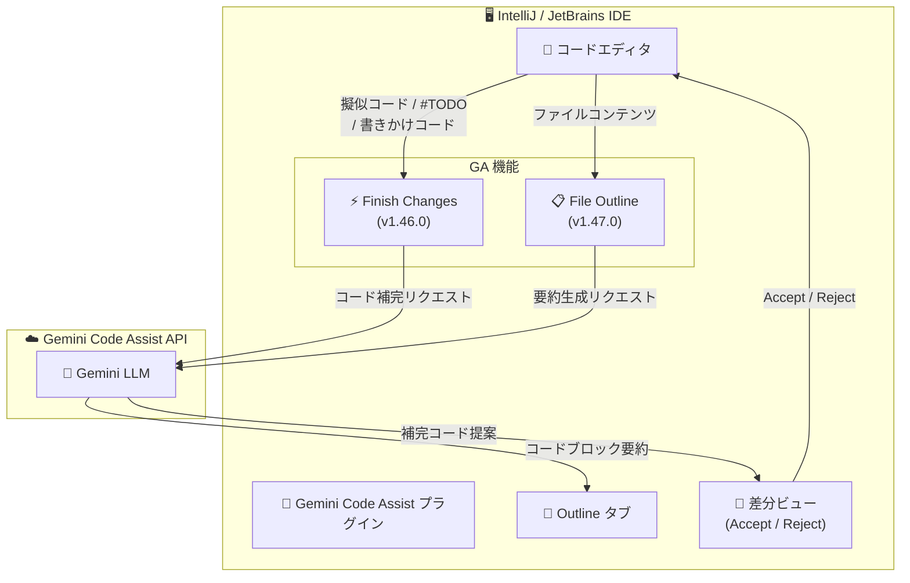

# Gemini Code Assist: IntelliJ 向け Finish Changes / File Outline 機能が GA

**リリース日**: 2026-02-24
**サービス**: Gemini Code Assist (Cloud Code / IDE)
**機能**: Finish Changes (IntelliJ v1.46.0)、File Outline (IntelliJ v1.47.0)
**ステータス**: GA (一般提供)

📊 [このアップデートのインフォグラフィックを見る](https://takech9203.github.io/google-cloud-news-summary/20260224-gemini-intellij-features-ga.html)

## 概要

Gemini Code Assist の IntelliJ プラグインにおいて、2 つの AI 搭載機能が一般提供 (GA) に昇格した。**Finish Changes** 機能 (IntelliJ Gemini Code Assist v1.46.0) と **File Outline** 機能 (IntelliJ Gemini Code Assist v1.47.0) がそれぞれ GA となり、本番環境での利用が正式にサポートされる。

Finish Changes は、開発者が作業中のコードを AI が観察し、擬似コードや #TODO、書きかけのコードを自動的に完成させる「AI ペアプログラマー」機能である。File Outline は、コードブロックの短い英語の要約を AI が自動生成し、Gemini Code Assist プラグインの Outline タブに表示することで、コードの迅速な理解を支援する機能である。

両機能は 2025 年 12 月 5 日に IntelliJ Gemini Code Assist v1.40.0 で Preview として初めて導入され、約 3 か月間の Preview 期間を経て今回 GA に到達した。これにより、IntelliJ および対応する JetBrains IDE を使用する開発者は、本番ワークフローにおいてこれらの機能を安心して活用できるようになった。

**アップデート前の課題**

- Finish Changes と File Outline は Preview ステータスであり、本番環境での利用には SLA やサポートの保証がなかった
- 開発者は不完全なコード (擬似コード、#TODO、書きかけのコード) を手動で補完する必要があり、複雑なプロンプトを記述してAI に指示する手間があった
- 大規模なコードファイルの構造を把握するには、コード全体を読み込む必要があり、新しいプロジェクトへの参加時やコードレビュー時に時間がかかっていた

**アップデート後の改善**

- 両機能が GA となり、本番ワークフローでの利用が SLA 付きで正式にサポートされるようになった
- Finish Changes により、擬似コードや #TODO を書くだけで AI が残りのコードを自動補完するため、複雑なプロンプト作成が不要になった
- File Outline により、ファイル内のコードブロックの要約が自動生成され、コードの抽象的な理解が迅速に行えるようになった

## アーキテクチャ図



Finish Changes 機能はエディタ内の不完全なコードを検出し、Gemini LLM に補完リクエストを送信する。生成された提案は差分ビューで表示され、開発者が Accept / Reject を選択する。File Outline 機能はファイルコンテンツを解析し、Gemini LLM がコードブロックごとの要約を生成して Outline タブに表示する。

## サービスアップデートの詳細

### 主要機能

1. **Finish Changes (コード変更の自動補完)**
   - 作業中のファイル内にある擬似コード、#TODO コメント、書きかけのコードを AI が検出し、自動的に補完する
   - 右クリックメニューの「Gemini > Finish changes」またはキーボードショートカット (`Alt+F` / `Option+F`) で実行
   - 生成されたコード提案は個別に Accept (承認) または Reject (却下) が可能で、ファイル上部には一括操作 (Accept all / Reject all) のオプションも表示される
   - 複雑なプロンプトを記述する必要がなく、開発者は高レベルの設計に集中したまま、AI がコードの詳細を補完する

2. **File Outline (ファイルアウトライン)**
   - ファイルをフォーカスすると、AI がコードブロックごとに短い英語の要約を自動生成する
   - Gemini Code Assist チャットペインの「Outline」タブに要約が表示される
   - Eye アイコンをクリックすると、コードファイル内にインラインでアウトラインを表示可能
   - ファイルを変更した場合は自動再生成されず、「Refresh outline」で手動更新する
   - キーボードショートカット (`Alt+O` / `Option+O`) で手動生成も可能
   - Settings > Tools > Gemini から自動アウトライン生成のオン/オフを切り替えられる

3. **プラグインバージョン**
   - Finish Changes は IntelliJ Gemini Code Assist **v1.46.0** で GA
   - File Outline は IntelliJ Gemini Code Assist **v1.47.0** で GA
   - Preview 版は 2025 年 12 月 5 日の v1.40.0 で初回リリース

## 技術仕様

### 対応環境

| 項目 | 詳細 |
|------|------|
| Finish Changes 対応 IDE | IntelliJ IDEA、PyCharm、WebStorm、GoLand、Rider、その他 JetBrains IDE (2023.3+) |
| File Outline 対応 IDE | IntelliJ IDEA、PyCharm、WebStorm、GoLand、Rider、その他 JetBrains IDE (2023.3+) |
| VS Code 対応状況 | Finish Changes / File Outline ともに現時点では VS Code 非対応 |
| プラグインバージョン | Finish Changes: v1.46.0 / File Outline: v1.47.0 |
| Preview 初回リリース | 2025 年 12 月 5 日 (v1.40.0) |
| GA リリース日 | 2026 年 2 月 24 日 |

### キーボードショートカット

| アクション | Windows / Linux | macOS |
|-----------|-----------------|-------|
| Finish Changes | `Alt+F` | `Option+F` |
| File Outline 生成 | `Alt+O` | `Option+O` |
| コード生成 (インライン) | `Control+G` | `Option+G` |
| In-Editor プロンプト | `Control+\` | `Command+\` |

### Outline の設定

```
Settings > Tools > Gemini > Enable automatic outline generation
```

- **有効 (デフォルト)**: ファイルをフォーカスすると自動的にアウトラインが生成される
- **無効**: Outline タブの「Generate Outline」ボタンまたはショートカットキーで手動生成
- アウトラインは IDE セッション間で保持されず、新しいセッション開始時に再生成される

## 設定方法

### 前提条件

1. Gemini Code Assist のサブスクリプション (Standard、Enterprise、または個人向け無料版) が有効であること
2. Gemini for Google Cloud API がプロジェクトで有効化されていること
3. JetBrains IDE バージョン 2023.3 以降がインストールされていること

### 手順

#### ステップ 1: Gemini Code Assist プラグインのインストール

```
IDE メニュー: Settings > Plugins > Marketplace タブ
"Gemini Code Assist" を検索 > Install > IDE を再起動
```

IntelliJ IDEA を含む JetBrains IDE のプラグインマーケットプレイスから「Gemini Code Assist」を検索してインストールする。インストール後、IDE の再起動が必要。

#### ステップ 2: Finish Changes の使用

```
1. 擬似コードや #TODO を含むファイルを開く
2. 右クリック > Gemini > Finish changes
   (または Alt+F / Option+F)
3. 生成された各提案について Accept または Reject を選択
```

ファイル内の不完全なコード部分が AI によって検出され、補完候補が差分表示で提示される。

#### ステップ 3: File Outline の使用

```
1. コードファイルをエディタで開く (自動生成が有効な場合、自動的にアウトラインが生成される)
2. Gemini Code Assist チャットペインの "Outline" タブをクリック
3. (任意) Eye アイコンでコード内インライン表示を切り替え
```

アウトラインはコードブロックごとの英語の要約として表示される。

## メリット

### ビジネス面

- **開発生産性の向上**: 不完全なコードの補完やコード理解の効率化により、開発サイクルが短縮される
- **オンボーディングの迅速化**: File Outline により、新規メンバーが既存コードベースを素早く理解できるため、チーム参加からの立ち上がり時間が短縮される
- **GA ステータスによる安心感**: Preview から GA に昇格したことで、SLA に基づくサポートが保証され、本番プロジェクトへの導入リスクが低減される

### 技術面

- **コンテキスト維持**: Finish Changes は開発者の作業の流れを中断せず、擬似コードや #TODO から自然にコードを補完するため、思考のコンテキストスイッチが最小限に抑えられる
- **柔軟な入力方式**: 擬似コード、#TODO コメント、書きかけのコードなど、多様な入力スタイルに対応し、開発者の好みに応じた使い方が可能
- **コード構造の可視化**: File Outline がコードブロックの抽象的な要約を提供することで、構文の詳細に煩わされることなくアーキテクチャレベルの理解が得られる

## デメリット・制約事項

### 制限事項

- Finish Changes および File Outline は現時点で **VS Code には非対応** であり、IntelliJ および対応 JetBrains IDE でのみ利用可能
- File Outline が生成する要約は **英語のみ** で、他言語での要約生成はサポートされていない
- アウトラインは IDE セッション間で保持されないため、セッション開始時に毎回再生成される
- ファイル変更後のアウトラインは自動更新されず、手動でのリフレッシュが必要

### 考慮すべき点

- AI が生成するコードは常に正確とは限らないため、提案されたコードのレビューと検証は引き続き必要
- Finish Changes の結果はファイル内のコンテキストに依存するため、ファイル間にまたがる変更には対応しない
- Gemini Code Assist は他のプラグインと同じショートカットや API を使用する場合にコンフリクトが発生する可能性がある

## ユースケース

### ユースケース 1: 擬似コードからの実装自動補完

**シナリオ**: 開発者がアルゴリズムの設計を擬似コードで記述し、そこから実際の実装コードを生成したいケース。

**実装例**:
```python
# TODO: Read CSV file and validate each row
# TODO: Filter rows where status is "active"
# TODO: Calculate the average of the "score" column
# TODO: Write results to output file
```

上記の #TODO コメントを含むファイルで `Alt+F` (Finish Changes) を実行すると、Gemini が各 TODO に対応する実装コードを提案する。

**効果**: 設計意図をコメントとして記述するだけで、実装の詳細を AI が補完。開発者は高レベルの設計に集中しつつ、コーディング時間を大幅に短縮できる。

### ユースケース 2: 大規模コードベースのコードレビュー

**シナリオ**: チームメンバーが大規模なコードファイルのプルリクエストをレビューする必要があるケース。

**効果**: File Outline を使用することで、ファイル全体のコードブロックの役割を瞬時に把握でき、変更箇所の影響範囲の理解が迅速になる。構文の詳細を読み解く前にアーキテクチャレベルの理解が得られるため、レビュー品質と速度が向上する。

## 料金

Gemini Code Assist の Finish Changes および File Outline 機能は、Gemini Code Assist のサブスクリプションに含まれる。個別の追加料金は発生しない。

### 料金プラン

| プラン | 月額料金 (概算) | 備考 |
|--------|-----------------|------|
| Gemini Code Assist for Individuals (無料版) | 無料 | 個人開発者向け、180,000 コード補完/月 |
| Google Developer Program Premium | $24.99/月 (月額) / $299/年 (年額) | Standard 版 + 高クォータ |
| Gemini Code Assist Enterprise | 要問い合わせ | 最低 10 ライセンス、コードカスタマイズ対応 |

新規顧客は初月最大 50 ライセンス分の無料クレジットが適用される。詳細は [Gemini Code Assist 料金ページ](https://cloud.google.com/products/gemini/pricing) を参照。

## 利用可能リージョン

Gemini Code Assist は IDE プラグインとして動作するため、リージョンの制約はユーザーの IDE 環境ではなく、バックエンドの Gemini API に依存する。詳細は [Gemini Code Assist のドキュメント](https://docs.cloud.google.com/gemini/docs/codeassist/overview) を参照。

## 関連サービス・機能

- **Gemini Code Assist (VS Code)**: VS Code 向けの Gemini Code Assist プラグイン。Finish Changes / File Outline は現時点で VS Code 非対応だが、コード補完やチャットなど他の機能は利用可能
- **Cloud Code**: Google Cloud 開発向け IDE プラグインで、Gemini Code Assist と連携して Kubernetes、Cloud Run などのデプロイ支援を提供
- **Gemini CLI**: ターミナルから直接 Gemini の AI エージェントにアクセスできるオープンソースツール。Gemini Code Assist のサブスクリプションに含まれる
- **Cloud Workstations**: クラウドベースの開発環境で、Gemini Code Assist を統合して利用可能
- **Cloud Shell Editor**: ブラウザベースのエディタで、Gemini Code Assist のコード支援機能を利用可能

## 参考リンク

- 📊 [インフォグラフィック](https://takech9203.github.io/google-cloud-news-summary/20260224-gemini-intellij-features-ga.html)
- [公式リリースノート (Gemini for Google Cloud)](https://docs.cloud.google.com/gemini/docs/release-notes)
- [公式リリースノート (Gemini Code Assist)](https://docs.cloud.google.com/gemini/docs/codeassist/release-notes)
- [Finish Changes ドキュメント](https://docs.cloud.google.com/gemini/docs/codeassist/write-code-gemini#finish-changes)
- [File Outline ドキュメント](https://docs.cloud.google.com/gemini/docs/codeassist/chat-gemini#outline)
- [キーボードショートカット](https://docs.cloud.google.com/gemini/docs/codeassist/keyboard-shortcuts)
- [Gemini Code Assist セットアップガイド](https://docs.cloud.google.com/gemini/docs/codeassist/set-up-gemini)
- [Gemini Code Assist 概要](https://docs.cloud.google.com/gemini/docs/codeassist/overview)
- [料金ページ](https://cloud.google.com/products/gemini/pricing)

## まとめ

Gemini Code Assist の IntelliJ プラグインにおいて、Finish Changes と File Outline の 2 つの AI 搭載機能が GA に昇格した。これにより、JetBrains IDE を使用する開発チームは、コードの自動補完やファイル構造の可視化を本番ワークフローに正式に組み込むことが可能になった。IntelliJ ベースの IDE を使用している開発者は、プラグインを最新バージョン (v1.46.0 以降) にアップデートして、これらの GA 機能を活用することを推奨する。

---

**タグ**: #GeminiCodeAssist #IntelliJ #JetBrains #AI #IDE #GA #FinishChanges #FileOutline #開発者ツール #コード補完
