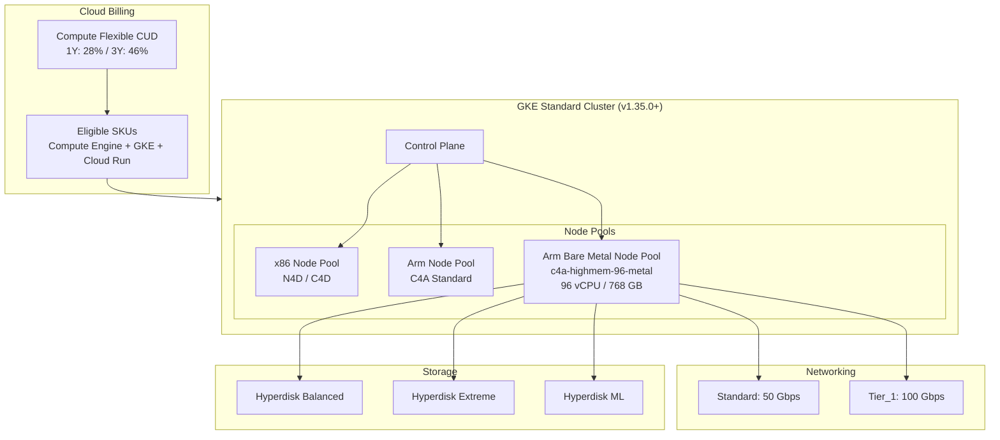

# Google Kubernetes Engine: C4A ベアメタルインスタンス、N4D 訂正、Flex CUD 拡大

**リリース日**: 2026-02-24
**サービス**: Google Kubernetes Engine
**機能**: C4A Bare Metal Instance, N4D Correction, and Flex CUD Expansion
**ステータス**: Public Preview (C4A ベアメタル) / GA (Flex CUD 拡大)

[このアップデートのインフォグラフィックを見る](https://takech9203.github.io/google-cloud-news-summary/20260224-google-kubernetes-engine-c4a-arm.html)

## 概要

Google Kubernetes Engine (GKE) に関する 3 つのアップデートが発表された。最も注目すべきは、C4A マシンシリーズのベアメタルインスタンス (`c4a-highmem-96-metal`) が GKE Standard クラスタで Public Preview として利用可能になったことである。これにより、Google Axion プロセッサ (Arm Neoverse V2 ベース) を搭載した 96 vCPU / 768 GB メモリのベアメタルノードを GKE 上で直接利用できるようになった。

また、2025 年 11 月 11 日のリリースノートに記載されていた N4D マシンタイプに関するバージョン要件が訂正された。Cluster autoscaler が GKE バージョン 1.34.1-gke.2037000 以降を必要とする機能リストに誤って含まれていたが、N4D と Cluster autoscaler は任意の利用可能な GKE バージョンで使用できることが確認された。

さらに、Compute Flexible Committed Use Discounts (CUD) のカバレッジが拡大され、すべての Cloud Billing アカウントが自動的に新しいスペンドベースの CUD モデルに移行された。オプトインは不要となり、Compute Engine、GKE、Cloud Run にまたがる幅広いワークロードに CUD 割引が適用される。

**アップデート前の課題**

- GKE 上で Arm ベースのベアメタルインスタンスを利用できず、ハードウェアレベルの直接アクセスが必要なワークロード (パフォーマンスチューニング、特殊なカーネル設定など) には対応が困難だった
- N4D マシンタイプの Cluster autoscaler に関するドキュメントに誤った GKE バージョン要件が記載されており、利用者が不必要にバージョン制約を受けていた可能性がある
- Compute Flexible CUD の適用範囲が限定的で、一部の Billing アカウントではオプトインが必要だった

**アップデート後の改善**

- `c4a-highmem-96-metal` マシンタイプにより、GKE Standard クラスタ上で Arm ベアメタルノードが Public Preview として利用可能になった (96 vCPU / 768 GB メモリ)
- N4D マシンタイプと Cluster autoscaler は任意の GKE バージョンで利用可能であることが公式に確認された
- Compute Flexible CUD がすべての Cloud Billing アカウントに自動適用され、Compute Engine、GKE、Cloud Run にわたる対象 SKU で最大 28% (1 年) / 46% (3 年) の割引が適用される

## アーキテクチャ図



この図は、GKE Standard クラスタにおける C4A ベアメタルノードプールの構成と、Compute Flexible CUD の適用範囲、およびベアメタルインスタンスがサポートするストレージとネットワークの構成を示している。

## サービスアップデートの詳細

### 主要機能

1. **C4A ベアメタルインスタンス (Public Preview)**
   - マシンタイプ: `c4a-highmem-96-metal`
   - Google Axion プロセッサ (Arm Neoverse V2 ベース) 搭載
   - 96 vCPU、768 GB DDR5 メモリ
   - GKE Standard クラスタ (バージョン 1.35.0-gke.2232000 以降) で利用可能
   - `--machine-type` フラグを使用してクラスタまたはノードプール作成時に指定
   - Titanium ベースのネットワークオフロードとディスク I/O オフロードに対応

2. **N4D マシンタイプのバージョン要件訂正**
   - 2025 年 11 月 11 日のリリースノートの訂正
   - Cluster autoscaler が GKE バージョン 1.34.1-gke.2037000 以降を必要とする機能リストから除外
   - N4D マシンタイプと Cluster autoscaler は任意の利用可能な GKE バージョンで使用可能

3. **Compute Flexible CUD カバレッジ拡大**
   - すべての Cloud Billing アカウントが自動的に新しいスペンドベース CUD モデルに移行
   - オプトイン不要で拡大されたカバレッジが適用
   - 単一のコミットメントで Compute Engine、GKE、Cloud Run の対象利用をカバー
   - 1 年コミットメント: 28% 割引、3 年コミットメント: 46% 割引

## 技術仕様

### C4A ベアメタルインスタンスの仕様

| 項目 | 詳細 |
|------|------|
| マシンタイプ | `c4a-highmem-96-metal` |
| プロセッサ | Google Axion (Arm Neoverse V2) |
| vCPU 数 | 96 |
| メモリ | 768 GB DDR5 |
| 標準ネットワーク帯域幅 | 最大 50 Gbps |
| Tier_1 ネットワーク帯域幅 | 最大 100 Gbps |
| サポートディスク | Hyperdisk Balanced, Hyperdisk Extreme, Hyperdisk ML |
| GKE バージョン要件 | 1.35.0-gke.2232000 以降 |
| クラスタモード | Standard のみ |
| ステータス | Public Preview |

### C4A ベアメタル固有の制限事項

| 機能 | サポート状況 |
|------|-------------|
| Autopilot モード | 非対応 |
| Cluster autoscaling | 非対応 |
| Node auto-provisioning | 非対応 |
| Local SSD | 非対応 |
| Live migration | 非対応 |
| Confidential GKE Nodes | 非対応 |
| Compact placement | 非対応 |
| SMT (Simultaneous multi-threading) | 非対応 |
| Persistent disks | 非対応 (Hyperdisk を使用) |
| Nested virtualization | 非対応 |
| GPU | 非対応 |

### Compute Flexible CUD 割引率

| サービス | 対象 | 1 年コミットメント | 3 年コミットメント |
|----------|------|-------------------|-------------------|
| Compute Engine | C4A を含む汎用マシンシリーズ | 28% | 46% |
| Compute Engine | M1/M2/M3/M4 (メモリ最適化) | 割引なし | 63% |
| Compute Engine | H3/H4D | 17% | 38% |
| GKE | Standard / Autopilot | 28% | 46% |
| Cloud Run | インスタンスベース課金 / ジョブ / Worker Pools | 28% | 46% |
| Cloud Run | リクエストベース課金 / Functions | 17% | 17% |

## 設定方法

### 前提条件

1. GKE バージョン 1.35.0-gke.2232000 以降を実行する Standard クラスタ
2. C4A ベアメタルインスタンスが利用可能なリージョン/ゾーン
3. Google Cloud CLI (gcloud) の最新バージョン
4. Kubernetes Engine Cluster Admin 以上の IAM 権限

### 手順

#### ステップ 1: C4A ベアメタルノードプールの作成

```bash
gcloud container node-pools create arm-bare-metal-pool \
    --cluster CLUSTER_NAME \
    --location CONTROL_PLANE_LOCATION \
    --node-locations NODE_ZONE \
    --machine-type c4a-highmem-96-metal \
    --num-nodes 1
```

C4A ベアメタルインスタンスは専有ホストサーバー上で動作するため、1 台のベアメタルインスタンスがホストサーバー全体を占有する。

#### ステップ 2: Arm ワークロードのスケジューリング設定

```yaml
apiVersion: v1
kind: Pod
metadata:
  name: arm-workload
spec:
  nodeSelector:
    kubernetes.io/arch: arm64
  containers:
  - name: app
    image: your-arm-compatible-image:latest
```

Arm ノードへワークロードを配置するために、nodeSelector または nodeAffinity を使用してアーキテクチャを指定する。

## メリット

### ビジネス面

- **コスト効率の向上**: Arm プロセッサの電力効率により、x86 と比較して優れた価格性能比を実現できる。さらに Compute Flexible CUD の拡大により最大 46% の割引が適用される
- **投資の柔軟性**: 単一の Compute Flexible CUD コミットメントで Compute Engine、GKE、Cloud Run にまたがる利用をカバーでき、プロジェクトやリージョンを問わず適用される
- **コスト最適化の自動化**: すべての Billing アカウントが自動的に新 CUD モデルに移行されるため、追加の設定作業なしで割引が適用される

### 技術面

- **ベアメタルレベルのパフォーマンス**: ハイパーバイザーのオーバーヘッドなしで Arm プロセッサに直接アクセスでき、パフォーマンスクリティカルなワークロードに最適
- **高帯域ネットワーク**: Tier_1 ネットワーキングで最大 100 Gbps の帯域幅を提供
- **Titanium オフロード**: ネットワーク処理と Titanium SSD ディスク I/O がホスト CPU からオフロードされ、アプリケーションが利用可能なコンピュートリソースが増加
- **N4D の制約解消**: Cluster autoscaler のバージョン要件が訂正され、N4D ユーザーは任意の GKE バージョンで Cluster autoscaler を利用可能

## デメリット・制約事項

### 制限事項

- C4A ベアメタルインスタンスは GKE Standard クラスタでのみサポートされ、Autopilot モードでは利用できない
- Cluster autoscaling および Node auto-provisioning が C4A ベアメタルでは非対応のため、手動でのスケーリング管理が必要
- Live migration が非対応のため、メンテナンスイベント時にノードの中断が発生する可能性がある
- Local SSD が C4A ベアメタルでは利用できず、ストレージには Hyperdisk のみ利用可能
- 現在 Public Preview ステータスであり、Pre-GA Offerings Terms が適用される。サポートが限定的な場合がある

### 考慮すべき点

- ベアメタルインスタンスは専有ホストを占有するため、リソースの過剰プロビジョニングに注意が必要
- Arm アーキテクチャへのワークロード移行にはコンテナイメージのマルチアーキテクチャ対応が必要
- Compute Flexible CUD はキャンセル不可のため、コミットメント購入前に利用パターンの十分な分析が推奨される
- CUD コミットメントフィーは利用がなくても毎月課金されるため、最低利用量の見積もりが重要

## ユースケース

### ユースケース 1: 高パフォーマンス Arm ネイティブワークロード

**シナリオ**: メディア処理やエンコーディングパイプラインで、Arm ネイティブのライブラリを活用して高スループットの処理を実行する必要がある場合。ベアメタルアクセスにより、ハイパーバイザーのオーバーヘッドなしで最大限のパフォーマンスを引き出す。

**実装例**:
```bash
# C4A ベアメタルノードプールを作成
gcloud container node-pools create media-processing-pool \
    --cluster media-cluster \
    --location us-central1 \
    --node-locations us-central1-a \
    --machine-type c4a-highmem-96-metal \
    --num-nodes 2

# Arm 対応のメディア処理ワークロードをデプロイ
kubectl apply -f media-pipeline-arm64.yaml
```

**効果**: ハイパーバイザーのオーバーヘッド排除により、CPU バウンドの処理で安定したパフォーマンスが得られる。768 GB のメモリにより大規模なデータセットのインメモリ処理も可能。

### ユースケース 2: Compute Flexible CUD によるマルチサービスコスト最適化

**シナリオ**: GKE Standard / Autopilot クラスタ、Compute Engine VM、Cloud Run サービスを組み合わせて運用しているエンタープライズ環境で、単一のコミットメントによりすべてのサービスのコストを最適化する。

**効果**: プロジェクトやリージョンの制約なく、Cloud Billing アカウント全体で対象利用に割引が適用される。3 年コミットメントで GKE と Compute Engine に 46% の割引を受けることで、年間数万ドルのコスト削減が可能。

## 料金

### C4A ベアメタルインスタンス

C4A ベアメタルインスタンスの料金は、Compute Engine の C4A マシンシリーズの料金体系に従う。ベアメタルインスタンスは専有ホストを使用するため、通常の VM と比較して追加のプレミアムが発生する場合がある。Resource-based CUD および Compute Flexible CUD の対象となる。

### Compute Flexible CUD 料金例

| コミットメント期間 | 汎用マシン割引率 | 参考: 月額 $5,000 利用時の節約額 |
|-------------------|-----------------|-------------------------------|
| 1 年 | 28% | 約 $1,400/月 |
| 3 年 | 46% | 約 $2,300/月 |

詳細な料金については公式料金ページを参照。

## 利用可能リージョン

C4A ベアメタルインスタンス (`c4a-highmem-96-metal`) は以下のゾーンで利用可能 (Preview):

| リージョン | ゾーン |
|-----------|-------|
| us-central1 (Iowa) | us-central1-a, us-central1-b, us-central1-c, us-central1-f |
| us-east4 (Virginia) | us-east4-b |

最新のリージョン可用性については、[Compute Engine のリージョンとゾーン](https://cloud.google.com/compute/docs/regions-zones#available) を参照。

## 関連サービス・機能

- **Compute Engine C4A マシンシリーズ**: GKE の C4A ベアメタルノードの基盤となるコンピュートリソース。Arm Neoverse V2 ベースで最大 100 Gbps のネットワーキングを提供
- **Google Titanium**: ネットワーク処理とディスク I/O をホスト CPU からオフロードするカスタムチップ。C4A ベアメタルのパフォーマンス向上に寄与
- **Hyperdisk**: C4A ベアメタルインスタンスで利用可能な唯一のブロックストレージオプション。Balanced、Extreme、ML の 3 種類が利用可能
- **Cloud Billing CUD**: Compute Flexible CUD は GKE、Compute Engine、Cloud Run にまたがるスペンドベースの割引プログラム
- **N4D マシンシリーズ**: AMD EPYC Turin プロセッサベースの汎用マシンシリーズ。今回のバージョン要件訂正により、Cluster autoscaler との組み合わせが容易に

## 参考リンク

- [インフォグラフィック](https://takech9203.github.io/google-cloud-news-summary/20260224-google-kubernetes-engine-c4a-arm.html)
- [公式リリースノート](https://cloud.google.com/release-notes#February_24_2026)
- [Arm workloads on GKE](https://cloud.google.com/kubernetes-engine/docs/concepts/arm-on-gke)
- [C4A マシンシリーズ](https://cloud.google.com/compute/docs/general-purpose-machines#c4a_series)
- [ベアメタルインスタンス](https://cloud.google.com/compute/docs/instances/bare-metal-instances)
- [GKE で Arm クラスタとノードプールを作成](https://cloud.google.com/kubernetes-engine/docs/how-to/create-arm-clusters-nodes)
- [GKE CUD ドキュメント](https://cloud.google.com/kubernetes-engine/cud)
- [Compute Flexible CUD 概要](https://cloud.google.com/compute/docs/instances/committed-use-discounts-overview)
- [CUD 対象 SKU 一覧](https://cloud.google.com/skus/sku-groups/compute-flexible-cud-eligible-skus)
- [スペンドベース CUD の改善](https://cloud.google.com/docs/cuds-multiprice)
- [GKE 料金ページ](https://cloud.google.com/kubernetes-engine/pricing)

## まとめ

今回のアップデートは、GKE における Arm エコシステムの拡充とコスト最適化の両面で重要な進展である。C4A ベアメタルインスタンスは、パフォーマンスクリティカルな Arm ワークロードに対してハイパーバイザーのオーバーヘッドなしのコンピュートを提供し、Compute Flexible CUD の拡大はマルチサービス環境でのコスト効率を大幅に改善する。Arm ワークロードの GKE への移行を検討している場合は、C4A ベアメタルの Preview を評価しつつ、Compute Flexible CUD を活用したコスト最適化戦略を策定することを推奨する。

---

**タグ**: #GoogleKubernetesEngine #GKE #C4A #BareMetal #Arm #GoogleAxion #N4D #ComputeFlexibleCUD #CommittedUseDiscount #CostOptimization #Titanium #Hyperdisk
