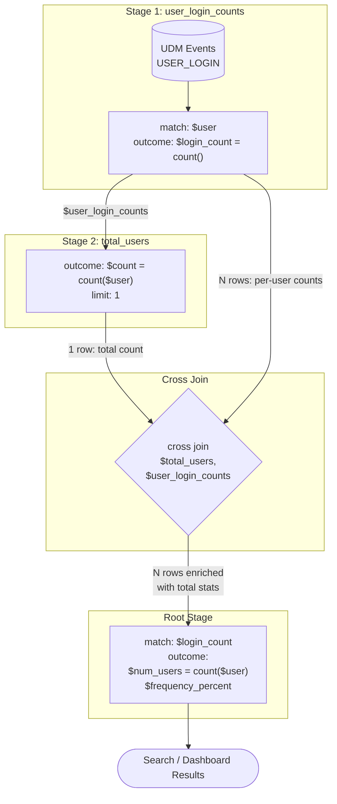

# Google SecOps: YARA-L 2.0 マルチステージクエリにおけるクロスジョイン

**リリース日**: 2026-02-24
**サービス**: Google SecOps / Google SecOps SIEM
**機能**: Cross Joins in Multi-stage Queries
**ステータス**: Feature (新機能、Pre-GA)

[このアップデートのインフォグラフィックを見る](https://takech9203.github.io/google-cloud-news-summary/20260224-google-secops-cross-joins.html)

## 概要

Google SecOps (旧 Chronicle) の YARA-L 2.0 において、マルチステージクエリでクロスジョイン (cross join) が新たにサポートされた。これにより、個別の UDM イベントデータと、他の YARA-L ステージで算出された集約統計データを直接比較できるようになる。

クロスジョインは、`limit: 1` が設定されたステージ (1 行のみを出力するステージ) と、別のデータセット (UDM イベントなど) を組み合わせる仕組みである。`limit: 1` のステージから出力された 1 行が、もう一方のデータセットの各行に付加されるため、イベントデータ全体に対して全体統計 (平均値、標準偏差など) をエンリッチメントとして付与できる。この機能は Search および Dashboards の両方でサポートされる。

主な対象ユーザーは、Google SecOps を利用するセキュリティアナリスト、SOC チーム、Detection Engineer である。特に、ベースラインからの逸脱検知や異常行動分析など、個別イベントと全体傾向を比較する高度なセキュリティ分析ワークフローにおいて大きな価値を提供する。

**アップデート前の課題**

今回のアップデート以前には、マルチステージクエリで個別イベントデータと集約統計を比較する際に以下の制限が存在していた。

- マルチステージクエリの各ステージ間で結合を行うには、共通の match 変数による等価結合 (equi-join) が必要であり、1 対多のブロードキャスト結合ができなかった
- 全体の集約統計 (全ユーザーの平均ログイン回数など) を個別イベントと比較するには、複数のクエリを個別に実行して手動で突き合わせる必要があった
- 個別イベントに全体統計を付与するエンリッチメントパターンをクエリ単体で実現する手段がなかった

**アップデート後の改善**

今回のアップデートにより、以下が可能になった。

- `cross join` キーワードを使用して、`limit: 1` のステージ出力を他のデータセットの全行にブロードキャスト結合できるようになった
- 個別のユーザーアクティビティと全体の集約統計 (平均値、件数など) を単一のクエリ内で比較できるようになった
- ベースラインとの乖離による異常検知 (通常より多いログイン回数の検出など) を、マルチステージクエリだけで完結できるようになった

## アーキテクチャ図



この図は、クロスジョインを使用して個別ユーザーのログインカウントと全体ユーザー数を結合し、異常なログイン頻度を検出するクエリの処理フローを示している。Stage 2 の `limit: 1` により 1 行のみが出力され、それが Stage 1 の全行にブロードキャストされる。

## サービスアップデートの詳細

### 主要機能

1. **クロスジョインキーワード**
   - `cross join` キーワードにより、`limit: 1` のステージ出力を他のデータセットの全行に結合する
   - 構文: `cross join $stage_with_limit_1, $other_stage`
   - `limit: 1` のステージは 1 行のみを出力し、その 1 行がもう一方のデータセットの各行に付加される

2. **集約統計のブロードキャスト**
   - 全体統計 (平均値、件数、標準偏差など) を集約したステージの出力を、個別イベントデータにエンリッチメントとして付与できる
   - これにより、各イベントに対して「全体と比較してどうか」という文脈情報が自動的に追加される

3. **Search および Dashboards でのサポート**
   - クロスジョインは Google SecOps の Search 機能と Dashboards 機能の両方で使用可能
   - リアルタイムの検索結果や、ダッシュボードでの可視化に対応する

## 技術仕様

### YARA-L 2.0 クロスジョイン構文

| 項目 | 詳細 |
|------|------|
| キーワード | `cross join` |
| 必須条件 | 一方のステージに `limit: 1` が設定されていること |
| サポート対象 | Search、Dashboards |
| 非サポート対象 | Rules (検出ルール) |
| 最大ステージ数 | ルートステージに加えて最大 4 つの名前付きステージ |
| 最大 Join 数 | 全ステージ合計で最大 4 つの non-data-table Join |
| 最大結果セットサイズ | 10,000 件 |
| 最大クエリ時間範囲 | 30 日間 |
| 最大 UDM イベント数 | クエリあたり 2 つ |
| 最大 ECG イベント数 | クエリあたり 1 つ |
| 統計クエリレート制限 | 120 QPH (API および UI) |

### クロスジョインのクエリ例

```text
stage user_login_counts {
    $user = principal.user.userid
    metadata.event_type = "USER_LOGIN"
    security_result.action = "ALLOW"

    match:
        $user

    outcome:
        $login_count = count(metadata.id)
}

stage total_users {
    outcome:
        $count = count($user_login_counts.user)
    limit:
        1
}

cross join $total_users, $user_login_counts

$login_count = $user_login_counts.login_count
$user = $user_login_counts.user
$tot_users = $total_users.count

// all users who logged in the same number of times are grouped together.
match:
    $login_count
outcome:
    $num_users = count($user)
    $frequency_percent = (count($user) / max($tot_users) ) * 100
```

## 設定方法

### 前提条件

1. Google SecOps のアクティブなサブスクリプション (Enterprise パッケージ推奨)
2. Search または Dashboards へのアクセス権限
3. YARA-L 2.0 のマルチステージクエリに関する基本的な知識

### 手順

#### ステップ 1: Search 画面へのアクセス

Google SecOps コンソールで **Investigation > Search** に移動する。

#### ステップ 2: マルチステージクエリの作成

名前付きステージを定義し、集約したいステージに `limit: 1` を設定する。

```text
stage aggregated_stats {
    // 全体の統計を計算
    outcome:
        $total_count = count($previous_stage.variable)
    limit:
        1
}
```

#### ステップ 3: クロスジョインの適用

ルートステージの前に `cross join` キーワードで 2 つのステージを結合する。

```text
cross join $aggregated_stats, $detail_stage

$detail_var = $detail_stage.variable
$total = $aggregated_stats.total_count

match:
    $detail_var
outcome:
    $ratio = $detail_var / max($total)
```

#### ステップ 4: 結果の確認

クエリを実行し、Search 結果または Dashboard で個別イベントにエンリッチされた全体統計を確認する。

## メリット

### ビジネス面

- **脅威検出の精度向上**: 個別のアクティビティを全体のベースラインと比較することで、統計的に異常な行動パターンを単一のクエリで特定でき、脅威の早期発見につながる
- **調査効率の改善**: 従来は複数クエリの実行と手動突き合わせが必要だった分析が、単一のマルチステージクエリで完結するため、インシデント対応時間 (MTTR) の短縮に貢献する

### 技術面

- **クエリのシンプル化**: 全体統計と個別イベントの比較ロジックを 1 つのクエリに集約できるため、クエリの管理・保守が容易になる
- **リアルタイム分析**: Search 機能でリアルタイムに結果を取得できるため、Composite Detection Rules と異なり即座にインタラクティブな分析が可能

## デメリット・制約事項

### 制限事項

- クロスジョインを含むマルチステージクエリは Rules (検出ルール) ではサポートされておらず、Search と Dashboards のみで使用可能
- クロスジョインの一方のステージには必ず `limit: 1` を設定する必要がある
- マルチステージクエリ全体として、最大 4 つの名前付きステージ、最大 4 つの non-data-table Join、最大 10,000 件の結果という制約がある
- 本機能は Pre-GA Offerings Terms の対象であり、制限付きサポートおよび互換性のない変更が行われる可能性がある

### 考慮すべき点

- UDM イベントやエンティティイベントを含む Join は、データセットのサイズによりパフォーマンスが低下する可能性がある。UDM 側のフィルタリング (例: イベントタイプでの絞り込み) を可能な限り行うことが推奨される
- マルチステージクエリはすべて統計クエリとして動作するため、出力は集約された統計情報となり、未集約の個別イベントやデータテーブル行は返されない
- 統計クエリのレート制限 (120 QPH) が適用されるため、大量のクエリを短時間に実行する場合は注意が必要

## ユースケース

### ユースケース 1: 異常なログイン頻度の検出

**シナリオ**: 組織内の全ユーザーの平均ログイン回数と比較して、突出してログイン回数の多いユーザーを特定する。これは、アカウント侵害やクレデンシャルスタッフィング攻撃の兆候を示す可能性がある。

**実装例**:
```text
stage user_login_counts {
    $user = principal.user.userid
    metadata.event_type = "USER_LOGIN"
    security_result.action = "ALLOW"

    match:
        $user

    outcome:
        $login_count = count(metadata.id)
}

stage total_users {
    outcome:
        $count = count($user_login_counts.user)
    limit:
        1
}

cross join $total_users, $user_login_counts

$login_count = $user_login_counts.login_count
$user = $user_login_counts.user
$tot_users = $total_users.count

match:
    $login_count
outcome:
    $num_users = count($user)
    $frequency_percent = (count($user) / max($tot_users) ) * 100
```

**効果**: 全ユーザーのログイン頻度分布を一目で把握でき、外れ値となるユーザーを即座に特定可能。手動で複数クエリを実行する手間が不要になる。

### ユースケース 2: ネットワークトラフィックの異常検知

**シナリオ**: 日次のネットワーク通信量の全体平均・標準偏差と個別の通信ペアのデータ量を比較し、統計的に異常なトラフィックパターンを検出する。データ流出やC2通信の兆候を発見するための分析に活用できる。

**効果**: Z スコアやパーセンタイルベースの異常検知を単一のマルチステージクエリで実現でき、Dashboard で継続的にモニタリングすることで、ベースラインからの逸脱をリアルタイムに把握可能。

### ユースケース 3: 権限昇格の検知

**シナリオ**: 全ユーザーの平均的な権限変更回数と比較して、短期間に多数の権限変更を実行しているユーザーを特定する。ラテラルムーブメントや権限昇格攻撃の早期検知に有効。

**効果**: 組織全体のベースラインに対する個別ユーザーの振る舞いを定量的に評価し、リスクスコアリングに活用できる。

## 料金

Google SecOps の料金はサブスクリプションベースで、データ取り込み量に基づいて課金される。クロスジョイン機能自体に追加料金は発生しないが、マルチステージクエリの実行は統計クエリのレート制限 (120 QPH) の対象となる。

| 項目 | 詳細 |
|------|------|
| サブスクリプション (コミットメント) | 契約内容に基づく定額課金 |
| 使用量 (データ取り込み) | 取り込みバイト数に基づく従量課金 |
| 超過料金 | コミットメントを超過した場合、交渉済みレートで追加課金 |
| データ保持延長 | 12 か月超のデータ保持は追加課金 |

詳細な料金については、Google Cloud の営業担当者またはパートナーに問い合わせること。

## 利用可能リージョン

Google SecOps はグローバルに提供されるサービスであり、リージョナルエンドポイントとして US、Europe、Asia などが利用可能。具体的なリージョン情報は公式ドキュメントを参照のこと。

## 関連サービス・機能

- **マルチステージクエリ**: クロスジョインはマルチステージクエリの拡張機能であり、ステージ間でデータを受け渡す基盤機能と密接に関連する。詳細は [Create multi-stage queries in YARA-L](https://docs.cloud.google.com/chronicle/docs/investigation/multi-stage-yaral) を参照
- **Search Joins**: Inner Join、Outer Join、Data Join など、Search での結合操作全般。クロスジョインはこれらの Join タイプを補完する。詳細は [Use joins in Search](https://docs.cloud.google.com/chronicle/docs/investigation/search-joins) を参照
- **Composite Detection Rules**: マルチステージクエリが Search でリアルタイムに結果を返すのに対し、Composite Detection Rules はルールベースの検知を提供する。詳細は [Composite detection rules](https://docs.cloud.google.com/chronicle/docs/yara-l/composite-detection-rules) を参照
- **YARA-L 2.0 ベストプラクティス**: Join クエリのパフォーマンス最適化に関するガイダンス。詳細は [YARA-L best practices](https://docs.cloud.google.com/chronicle/docs/detection/yara-l-best-practices) を参照

## 参考リンク

- [インフォグラフィック](https://takech9203.github.io/google-cloud-news-summary/20260224-google-secops-cross-joins.html)
- [公式リリースノート](https://cloud.google.com/release-notes#February_24_2026)
- [Google SecOps リリースノート](https://docs.cloud.google.com/chronicle/docs/secops/release-notes)
- [Cross joins in multi-stage queries ドキュメント](https://docs.cloud.google.com/chronicle/docs/investigation/multi-stage-yaral#cross-joins)
- [Use joins in Search](https://docs.cloud.google.com/chronicle/docs/investigation/search-joins)
- [YARA-L best practices](https://docs.cloud.google.com/chronicle/docs/detection/yara-l-best-practices)

## まとめ

Google SecOps の YARA-L 2.0 マルチステージクエリにクロスジョインが追加されたことで、個別イベントデータと全体の集約統計を単一のクエリ内で直接比較できるようになった。これにより、異常なログイン活動やネットワークトラフィックの逸脱検知など、ベースライン比較型のセキュリティ分析が大幅に効率化される。Google SecOps を利用しているセキュリティチームは、Search および Dashboards でクロスジョインを活用した脅威ハンティングクエリの構築を検討することを推奨する。

---

**タグ**: #GoogleSecOps #YARAL #CrossJoin #MultiStageQuery #SIEM #ThreatDetection #SecurityAnalytics #UDM
