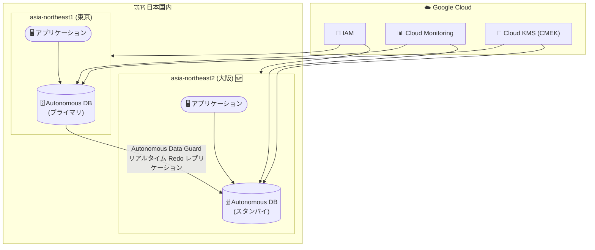

# Oracle Database@Google Cloud: Autonomous Database の大阪 (asia-northeast2) リージョン対応

**リリース日**: 2026-02-24
**サービス**: Oracle Database@Google Cloud
**機能**: Autonomous Database Service の大阪 (asia-northeast2) リージョンサポート
**ステータス**: Feature

📊 [このアップデートのインフォグラフィックを見る](https://takech9203.github.io/google-cloud-news-summary/20260224-oracle-database-at-google-cloud-osaka-region.html)

## 概要

Oracle Database@Google Cloud の Autonomous Database Service が、新たに asia-northeast2 (大阪、日本) リージョンをサポートした。これにより、日本国内で東京 (asia-northeast1) に加えて大阪リージョンでも Autonomous Database の作成と管理が可能になった。

Oracle Database@Google Cloud は、Google Cloud と Oracle の提携により、Google Cloud データセンター内で OCI Exadata ハードウェア上の Oracle データベースサービスをデプロイできるサービスである。Autonomous Database は、Oracle が提供するフルマネージドのサーバーレスデータベースサービスで、自動チューニング、自動スケーリング、自動パッチ適用などの機能を備えている。

今回のアップデートは、日本国内で Oracle Database ワークロードを運用する企業にとって重要なマイルストーンとなる。特に、大阪リージョンの追加により、東京リージョンとの組み合わせで日本国内での災害復旧 (DR) 構成が実現可能になる点が大きな価値を持つ。

**アップデート前の課題**

- 日本国内で Autonomous Database を利用する場合、東京 (asia-northeast1) リージョンのみに限定されていた
- 日本国内での地理的な冗長構成 (DR) を Autonomous Database で実現するには、海外リージョンを利用する必要があった
- 大阪に近い西日本地域の顧客にとっては、東京リージョンまでのネットワークレイテンシが発生していた

**アップデート後の改善**

- 大阪 (asia-northeast2) リージョンで Autonomous Database の作成と管理が可能になった
- 東京と大阪の 2 リージョンを活用し、Autonomous Data Guard による日本国内でのクロスリージョン DR 構成が実現可能になった
- 西日本地域のアプリケーションからのアクセスレイテンシが低減された

## アーキテクチャ図



東京リージョンと大阪リージョンの Autonomous Database を Autonomous Data Guard で接続することで、日本国内でのクロスリージョン災害復旧構成が実現可能になる。Google Cloud の IAM、Cloud Monitoring、Cloud KMS (CMEK) との統合により、セキュリティと運用監視を一元管理できる。

## サービスアップデートの詳細

### 主要機能

1. **大阪リージョンでの Autonomous Database プロビジョニング**
   - Google Cloud コンソール、gcloud CLI、Oracle Database@Google Cloud API を使用して、大阪リージョンで Autonomous Database リソースを作成・管理可能
   - ワークロードタイプとして Data Warehouse (DW) およびトランザクション処理 (OLTP) をサポート

2. **クロスリージョン災害復旧 (Autonomous Data Guard)**
   - 東京 (asia-northeast1) と大阪 (asia-northeast2) 間で Autonomous Data Guard を構成可能
   - リアルタイムの Redo ログレプリケーションにより、RPO (Recovery Point Objective) と RTO (Recovery Time Objective) を最小化
   - 自動フェイルオーバーおよび計画切り替え (スイッチオーバー) をサポート

3. **Google Cloud サービスとの統合**
   - Cloud Monitoring によるメトリクス監視 (CPU 使用率、セッション数、ストレージ使用量、クエリレイテンシなど)
   - Cloud KMS を使用したカスタマー管理暗号鍵 (CMEK) のサポート
   - IAM によるアクセス管理

## 技術仕様

### Autonomous Database Service の対応リージョン一覧 (2026 年 2 月 24 日時点)

| リージョン | リージョン名 | ロケーション |
|-----------|------------|------------|
| asia-northeast1 | 東京 | 日本 |
| asia-northeast2 | 大阪 | 日本 (今回追加) |
| asia-south1 | ムンバイ | インド |
| asia-south2 | デリー | インド |
| australia-southeast1 | シドニー | オーストラリア |
| australia-southeast2 | メルボルン | オーストラリア |
| northamerica-northeast1 | モントリオール | カナダ |
| northamerica-northeast2 | トロント | カナダ |
| us-central1 | アイオワ | 北米 |
| us-east4 | 北バージニア | 北米 |
| us-west3 | ソルトレイクシティ | 北米 |
| southamerica-east1 | サンパウロ | ブラジル |
| europe-west2 | ロンドン | ヨーロッパ |
| europe-west3 | フランクフルト | ヨーロッパ |

### 大阪リージョンでの Oracle Database@Google Cloud サービス対応状況

| サービス | 大阪リージョン対応日 |
|---------|-------------------|
| Exadata Database Service | 2026-02-04 |
| Autonomous Database Service | 2026-02-24 (今回) |
| Exadata Database Service on Exascale Infrastructure | 未対応 |
| Base Database Service | 未対応 |

### IAM ロール設定

Autonomous Database の管理に必要な IAM ロール:

| ユーザーロール | 必要な IAM ロール |
|-------------|-----------------|
| ネットワーク管理者 | `roles/oracledatabase.odbNetworkAdmin`、`roles/oracledatabase.odbSubnetAdmin` |
| Autonomous Database 管理者 | `roles/oracledatabase.odbSubnetUser`、`roles/oracledatabase.autonomousDatabaseAdmin` |

## 設定方法

### 前提条件

1. Google Cloud Marketplace で Oracle Database@Google Cloud の注文を完了していること
2. Oracle Cloud Infrastructure (OCI) アカウントのオンボーディングが完了していること
3. gcloud CLI バージョン 532.0.0 以降がインストールされていること
4. Oracle Database@Google Cloud API が有効化されていること
5. ODB Network および ODB Subnet (少なくともクライアントサブネット) が作成済みであること

### 手順

#### ステップ 1: Oracle Database@Google Cloud API の有効化

```bash
gcloud services enable oracledatabase.googleapis.com --project=PROJECT_ID
```

プロジェクトで Oracle Database@Google Cloud API を有効化する。

#### ステップ 2: IAM ロールの付与

```bash
# Autonomous Database 管理者ロールの付与
gcloud projects add-iam-policy-binding PROJECT_ID \
  --member="user:USER_EMAIL" \
  --role="roles/oracledatabase.autonomousDatabaseAdmin"

# ODB Subnet ユーザーロールの付与
gcloud projects add-iam-policy-binding PROJECT_ID \
  --member="user:USER_EMAIL" \
  --role="roles/oracledatabase.odbSubnetUser"
```

必要な IAM ロールをユーザーに付与する。

#### ステップ 3: 大阪リージョンで Autonomous Database を作成

```bash
gcloud oracle-database autonomous-databases create my-adb-osaka \
  --location=asia-northeast2 \
  --display-name="My Autonomous DB Osaka" \
  --database=myaebosaka \
  --admin-password=YOUR_SECURE_PASSWORD \
  --properties-compute-count=2 \
  --properties-db-version=19c \
  --properties-license-type=LICENSE_INCLUDED \
  --properties-db-workload=DW \
  --odb-network=projects/PROJECT_ID/locations/asia-northeast2/odbNetworks/my-odb-network \
  --odb-subnet=projects/PROJECT_ID/locations/asia-northeast2/odbNetworks/my-odb-network/odbSubnets/my-odb-subnet
```

大阪リージョン (asia-northeast2) を指定して Autonomous Database リソースを作成する。

## メリット

### ビジネス面

- **日本国内でのデータレジデンシ**: 大阪リージョンの追加により、東京と大阪の 2 拠点で日本国内にデータを保持しながら高可用性構成を実現できる
- **災害復旧能力の向上**: 東京-大阪間の DR 構成により、広域災害時のビジネス継続性が大幅に向上する
- **西日本地域の顧客対応**: 大阪周辺のデータセンターを活用することで、西日本地域のエンドユーザーへのレスポンスが改善される

### 技術面

- **低レイテンシ接続**: 大阪リージョン内のアプリケーションから Oracle Autonomous Database への低レイテンシアクセスが可能
- **Autonomous Data Guard 対応**: 日本国内の 2 リージョン間でのリアルタイムレプリケーションにより、RPO/RTO を最小化
- **Cloud Monitoring 統合**: Google Cloud の監視基盤を活用し、CPU 使用率、セッション数、クエリレイテンシ、ストレージ使用率などの Oracle データベースメトリクスを一元監視

## デメリット・制約事項

### 制限事項

- Autonomous Database はリージョナルリソースであり、ゾーン指定は不要 (ゾーン指定が必要なのは Exadata Infrastructure や VM Cluster などのゾーナルリソース)
- Exadata Database Service on Exascale Infrastructure および Base Database Service は大阪リージョンでは未対応
- Oracle Database@Google Cloud の利用には Google Cloud Marketplace 経由での注文と Oracle アカウントのオンボーディングが必要

### 考慮すべき点

- クロスリージョン Autonomous Data Guard を構成する場合、リージョン間のネットワークレイテンシがピアデータベースのラグに影響する可能性がある
- 料金は Oracle の公式料金体系に基づき、OCPU 時間やストレージ消費量に応じて課金される (Google Cloud の請求書に統合)
- フェイルオーバーやスイッチオーバーの手順は定期的にテストすることが推奨される

## ユースケース

### ユースケース 1: 日本国内でのクロスリージョン災害復旧

**シナリオ**: 金融機関が Oracle Database ワークロードを Google Cloud 上で運用しており、日本国内でのデータレジデンシ要件を満たしつつ、広域災害への備えが必要。

**実装例**:
```bash
# 東京にプライマリ Autonomous Database を作成
gcloud oracle-database autonomous-databases create adb-primary \
  --location=asia-northeast1 \
  --database=adbprimary \
  --properties-compute-count=4 \
  --properties-license-type=LICENSE_INCLUDED \
  --properties-db-workload=OLTP \
  --odb-network=projects/PROJECT_ID/locations/asia-northeast1/odbNetworks/tokyo-odb-network \
  --odb-subnet=projects/PROJECT_ID/locations/asia-northeast1/odbNetworks/tokyo-odb-network/odbSubnets/tokyo-subnet

# 大阪にスタンバイを作成 (Autonomous Data Guard によるクロスリージョン DR)
gcloud oracle-database autonomous-databases create adb-standby \
  --location=asia-northeast2 \
  --source-config-autonomous-database=projects/PROJECT_ID/locations/asia-northeast1/autonomousDatabases/adb-primary
```

**効果**: 東京リージョンに障害が発生した場合でも、大阪リージョンのスタンバイデータベースに自動フェイルオーバーし、ビジネスの継続性を確保できる。

### ユースケース 2: 西日本拠点からの低レイテンシアクセス

**シナリオ**: 大阪に本社を持つ製造業企業が、ERP システムのバックエンドとして Oracle Autonomous Database を利用しており、レスポンスタイムの最適化が求められている。

**効果**: 大阪リージョンに Autonomous Database をデプロイすることで、西日本地域のユーザーからのアクセスレイテンシが低減され、ERP システムの操作性が向上する。

## 料金

Oracle Database@Google Cloud の料金は、Oracle の公式料金体系に基づいて課金される。請求は Google Cloud の請求書に統合される。

- **Public (Pay-As-You-Go)**: オンデマンド料金モデル。OCPU 時間やストレージ GB 単位で課金
- **Private (プライベートオファー)**: Oracle 営業チームとの交渉によるカスタム料金。契約期間やコミット使用量に応じた割引が可能

詳細な料金については [Oracle Database@Google Cloud 料金ページ](https://www.oracle.com/cloud/google/oracle-database-at-google-cloud/pricing/) を参照。

## 利用可能リージョン

Autonomous Database Service は、全世界 14 リージョンで利用可能。日本国内では以下の 2 リージョンが対応している。

| リージョン | ロケーション | 対応開始日 |
|-----------|------------|-----------|
| asia-northeast1 | 東京 | 2025-06-05 |
| asia-northeast2 | 大阪 | 2026-02-24 |

全リージョン一覧は[サポートされるリージョンとゾーン](https://cloud.google.com/oracle/database/docs/regions-and-zones)を参照。

## 関連サービス・機能

- **Exadata Database Service**: 同じ大阪リージョン (asia-northeast2) で 2026-02-04 に対応済み。Exadata Infrastructure と VM Cluster のデプロイが可能
- **Cloud Monitoring**: Oracle Database メトリクス (CPU 使用率、セッション数、ストレージ、クエリレイテンシなど) の監視に使用
- **Cloud KMS**: CMEK (カスタマー管理暗号鍵) によるデータ暗号化に対応
- **IAM**: Oracle Database@Google Cloud リソースへのアクセス制御に使用
- **ODB Network / ODB Subnet**: Oracle Database@Google Cloud のネットワーク接続管理。Shared VPC にも対応

## 参考リンク

- 📊 [インフォグラフィック](https://takech9203.github.io/google-cloud-news-summary/20260224-oracle-database-at-google-cloud-osaka-region.html)
- [公式リリースノート](https://cloud.google.com/release-notes#February_24_2026)
- [Oracle Database@Google Cloud リリースノート](https://docs.cloud.google.com/oracle/database/docs/release-notes)
- [サポートされるリージョンとゾーン](https://cloud.google.com/oracle/database/docs/regions-and-zones)
- [Oracle Database@Google Cloud 概要](https://cloud.google.com/oracle/database/docs/overview)
- [Autonomous Database の作成](https://cloud.google.com/oracle/database/docs/create-databases)
- [クロスリージョン DR (Autonomous Data Guard)](https://cloud.google.com/oracle/database/docs/cross-region-dr-with-data-guard)
- [料金ページ](https://www.oracle.com/cloud/google/oracle-database-at-google-cloud/pricing/)

## まとめ

Oracle Database@Google Cloud の Autonomous Database Service が大阪 (asia-northeast2) リージョンに対応したことで、日本国内で東京・大阪の 2 リージョン体制が実現した。これにより、日本のデータレジデンシ要件を満たしながら、Autonomous Data Guard を活用したクロスリージョン災害復旧構成が国内で完結できるようになった。Oracle Database ワークロードを Google Cloud で運用している、または移行を検討している日本の企業にとって、まず東京-大阪間の DR アーキテクチャの設計を開始することを推奨する。

---

**タグ**: #OracleDatabase #GoogleCloud #AutonomousDatabase #asia-northeast2 #大阪リージョン #DR #DisasterRecovery #AutonomousDataGuard #データベース #リージョン拡張
