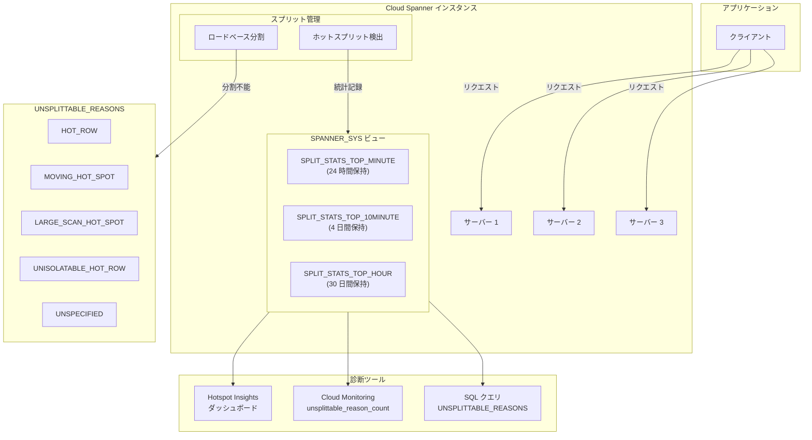

# Spanner: Hotspot Insights と Split Statistics における UNSPLITTABLE_REASONS

**リリース日**: 2026-02-24
**サービス**: Cloud Spanner
**機能**: UNSPLITTABLE_REASONS in Hotspot Insights and Split Statistics
**ステータス**: Feature

[このアップデートのインフォグラフィックを見る](https://takech9203.github.io/google-cloud-news-summary/20260224-spanner-unsplittable-reasons.html)

## 概要

Cloud Spanner の Hotspot Insights ダッシュボードおよび Split Statistics ビューに、新しい `UNSPLITTABLE_REASONS` カラムが追加された。この機能により、ホットスポットが発生しているスプリットが、なぜこれ以上分割できないのかを具体的な理由コードとして確認できるようになった。

Spanner はロードベース分割 (load-based splitting) を使用して、負荷が高いスプリットを自動的に分割し、サーバー間で負荷を分散する。しかし、スキーマ設計のアンチパターンや特定のワークロードパターンにより、Spanner がスプリットをこれ以上分割できないケースが存在する。このような「分割不能なスプリット」はパフォーマンスボトルネックの原因となり、高レイテンシやタイムアウトを引き起こす可能性がある。

今回のアップデートにより、データベース管理者やアプリケーション開発者は、ホットスポットの根本原因を迅速に特定し、スキーマ変更やワークロード調整といった適切な対策を講じることが可能になった。Solutions Architect にとっては、Spanner を利用する顧客のパフォーマンストラブルシューティングにおいて、診断プロセスが大幅に効率化される重要なアップデートである。

**アップデート前の課題**

- ホットスポットが発生しても、スプリットがなぜ分割されないのか具体的な理由を知る手段がなかった
- `CPU_USAGE_SCORE` でホットスプリットの存在は確認できたが、根本原因の特定には手動での調査が必要だった
- 10 分以上持続するホットスポットに対して、スキーマ設計の問題なのかワークロードの問題なのか判断が困難だった
- Cloud Monitoring のメトリクスだけでは、ホットスポットの種類 (ホットロー、移動するホットスポット、大規模スキャンなど) を区別できなかった

**アップデート後の改善**

- `UNSPLITTABLE_REASONS` カラムにより、分割不能な理由が `HOT_ROW`、`MOVING_HOT_SPOT`、`LARGE_SCAN_HOT_SPOT`、`UNISOLATABLE_HOT_ROW`、`UNSPECIFIED` の具体的なコードで提示されるようになった
- Hotspot Insights ダッシュボード (Google Cloud コンソール) で視覚的に分割不能理由を確認可能になった
- SQL クエリで `SPANNER_SYS.SPLIT_STATS_TOP_*` ビューから直接理由コードを取得し、プログラム的な分析が可能になった
- Cloud Monitoring の `unsplittable_reason_count` メトリクスでアラート設定や継続的な監視が可能になった
- 理由コードごとに推奨される緩和策が文書化されており、トラブルシューティングの時間が短縮された

## アーキテクチャ図



Spanner インスタンス内でホットスプリットが検出されると、`SPANNER_SYS.SPLIT_STATS_TOP_*` ビューに統計が記録される。ロードベース分割で対応できない場合は `UNSPLITTABLE_REASONS` に理由コードが格納され、Hotspot Insights ダッシュボード、SQL クエリ、Cloud Monitoring の 3 つの手段で確認できる。

## サービスアップデートの詳細

### 主要機能

1. **UNSPLITTABLE_REASONS カラム**
   - `SPANNER_SYS.SPLIT_STATS_TOP_MINUTE`、`SPLIT_STATS_TOP_10MINUTE`、`SPLIT_STATS_TOP_HOUR` の各ビューに `STRING ARRAY` 型で追加
   - ロードベース分割では緩和できないホットスポットの種類を識別
   - 空の配列は、分割不能な状態が検出されなかったか、高負荷が一時的すぎて Spanner が判定できなかったことを意味する

2. **Hotspot Insights ダッシュボードでの表示**
   - Google Cloud コンソールの Spanner ページから、インスタンスの Hotspot Insights タブにアクセス
   - Peak split CPU usage score グラフでホットスポットの傾向を視覚化
   - TopN splits テーブルに `UNSPLITTABLE_REASONS` カラムが表示され、分割不能な理由を即座に確認可能
   - 追加料金なし

3. **5 種類の理由コード**
   - `HOT_ROW`: 単一行への負荷集中。Spanner は個々の行内にスプリットポイントを追加できない
   - `MOVING_HOT_SPOT`: 高負荷のキー範囲が時間とともにシーケンシャルに移動。分割が追いつかない
   - `LARGE_SCAN_HOT_SPOT`: 広範囲のスキャン操作による高負荷。過度な分割はスキャン性能を劣化させるため Spanner が分割を控える
   - `UNISOLATABLE_HOT_ROW`: 高負荷の狭いキー範囲を特定できるが、適切なスプリットポイントが見つからない
   - `UNSPECIFIED`: 上記のいずれにも該当しない複雑な負荷パターン

4. **Cloud Monitoring 連携**
   - `unsplittable_reason_count` メトリクスで分割不能理由の発生回数を監視可能
   - アラートポリシーを設定して、分割不能なホットスポットの発生を即座に検知できる

## 技術仕様

### Split Statistics ビューのスキーマ

| カラム名 | 型 | 説明 |
|---------|------|------|
| INTERVAL_END | TIMESTAMP | スプリットが warm または hot だった時間間隔の終了時刻 |
| SPLIT_START | STRING | スプリット内の行範囲の開始キー (`<begin>` の場合はキー空間の先頭) |
| SPLIT_LIMIT | STRING | スプリット内の行範囲の制限キー (`<end>` の場合はキー空間の末尾) |
| CPU_USAGE_SCORE | INT64 | スプリットの CPU 使用率スコア (50% 以上で warm、100% で hot) |
| AFFECTED_TABLES | STRING ARRAY | スプリットに行が含まれる可能性があるテーブル |
| UNSPLITTABLE_REASONS | STRING ARRAY | ロードベース分割では緩和できないホットスポットの理由コード |

### データ保持期間

| ビュー | 保持期間 |
|--------|---------|
| SPANNER_SYS.SPLIT_STATS_TOP_MINUTE | 24 時間 |
| SPANNER_SYS.SPLIT_STATS_TOP_10MINUTE | 4 日間 |
| SPANNER_SYS.SPLIT_STATS_TOP_HOUR | 30 日間 |

### 集約ルール (10MINUTE / HOUR ビュー)

- `CPU_USAGE_SCORE`: ウィンドウ内の 1 分間隔の最大値
- `UNSPLITTABLE_REASONS`: ウィンドウ内のすべての 1 分間隔で観測されたユニークな理由コードの和集合

### 必要な IAM ロール

```
# IAM ユーザーの場合
roles/spanner.viewer
roles/spanner.databaseReader

# Fine-grained access control ユーザーの場合
roles/spanner.viewer + spanner_sys_reader システムロール
```

## 設定方法

### 前提条件

1. Cloud Spanner インスタンスが作成済みであること
2. 対象データベースに対する `spanner.databases.select` 権限があること
3. `roles/spanner.viewer` および `roles/spanner.databaseReader` ロールが付与されていること

### 手順

#### ステップ 1: Hotspot Insights ダッシュボードで確認

Google Cloud コンソールで Spanner ページを開き、インスタンスを選択後、ナビゲーションメニューの「Hotspot insights」タブをクリックする。データベースを選択すると、Peak split CPU usage score グラフと TopN splits テーブルが表示される。

#### ステップ 2: SQL クエリで UNSPLITTABLE_REASONS を確認

```sql
-- 特定の時間帯の分割不能理由を集計
SELECT
  reason,
  COUNT(*) AS occurrences
FROM
  SPANNER_SYS.SPLIT_STATS_TOP_MINUTE AS t,
  UNNEST(t.unsplittable_reasons) AS reason
WHERE
  t.cpu_usage_score >= 50
  AND ARRAY_LENGTH(t.unsplittable_reasons) > 0
  AND t.interval_end >= "2026-02-24T10:00:00Z"
  AND t.interval_end <= "2026-02-24T11:00:00Z"
GROUP BY reason
ORDER BY occurrences DESC;
```

#### ステップ 3: 最も高い CPU_USAGE_SCORE のスプリットと理由を特定

```sql
-- GoogleSQL
SELECT
  t.split_start,
  t.split_limit,
  t.cpu_usage_score,
  t.affected_tables,
  t.unsplittable_reasons
FROM
  SPANNER_SYS.SPLIT_STATS_TOP_MINUTE t
WHERE
  t.cpu_usage_score >= 50
  AND t.interval_end = "2026-02-24T10:00:00Z";
```

#### ステップ 4: Cloud Monitoring でアラートを設定

Cloud Monitoring の `unsplittable_reason_count` メトリクスを使用して、分割不能なホットスポットが発生した場合のアラートポリシーを設定する。

## メリット

### ビジネス面

- **障害対応時間の短縮**: ホットスポットの根本原因を即座に特定できるため、パフォーマンス問題の解決までの時間 (MTTR) が大幅に短縮される
- **プロアクティブな監視**: Cloud Monitoring 連携により、問題がエンドユーザーに影響を与える前に検知・対応が可能になる
- **運用コストの削減**: 手動での調査プロセスが不要になり、DBA やエンジニアの工数が削減される

### 技術面

- **診断の精度向上**: 5 種類の具体的な理由コードにより、ホットスポットの種類に応じた最適な緩和策を選択できる
- **GoogleSQL / PostgreSQL 両対応**: 両方のダイアレクトで同じシステムビューにアクセス可能
- **多段階の時間粒度**: 1 分、10 分、1 時間の 3 つの集約レベルで、短期的な問題と長期的な傾向の両方を分析できる
- **プログラム的アクセス**: SQL クエリでデータを取得できるため、自動化されたモニタリングパイプラインに組み込み可能

## デメリット・制約事項

### 制限事項

- データ保持期間は固定で変更不可 (MINUTE: 24 時間、10MINUTE: 4 日間、HOUR: 30 日間)
- 統計データの収集を無効化することはできない
- 長期保持が必要な場合は、定期的に統計データを外部にコピーする必要がある
- `UNSPLITTABLE_REASONS` が空の配列の場合、分割不能な状態がないか高負荷が一時的すぎて判定できなかったかの区別ができない

### 考慮すべき点

- 分割不能理由が検出されても、10 分以上持続しない場合は Spanner が自動的に解決する可能性がある
- 根本的な解決にはスキーマ設計の変更やアプリケーションのワークロード調整が必要なケースが多く、即座に修正できるとは限らない
- Fine-grained access control ユーザーの場合、`spanner_sys_reader` システムロールの付与が別途必要

## ユースケース

### ユースケース 1: ホットロー問題の特定と解決

**シナリオ**: EC サイトの在庫管理テーブルで、人気商品の在庫行に対する高頻度な更新 (在庫の増減) により、単一行がホットスポットになっている。

**実装例**:
```sql
-- ホットロー問題の検出
SELECT
  t.split_start,
  t.split_limit,
  t.cpu_usage_score,
  t.affected_tables,
  t.unsplittable_reasons
FROM
  SPANNER_SYS.SPLIT_STATS_TOP_MINUTE t
WHERE
  t.cpu_usage_score >= 80
  AND ARRAY_LENGTH(t.unsplittable_reasons) > 0;

-- 結果例:
-- SPLIT_START: Inventory(product_123)
-- SPLIT_LIMIT: Inventory(product_124)
-- CPU_USAGE_SCORE: 95
-- UNSPLITTABLE_REASONS: [HOT_ROW]
```

**効果**: `HOT_ROW` の検出により、シャードカウンターパターン (複数行に在庫カウンターを分散させる) の適用が必要であることが即座に判明する。

### ユースケース 2: 単調増加キーによる移動するホットスポットの診断

**シナリオ**: IoT デバイスのログテーブルで、タイムスタンプをプライマリキーの先頭に使用しているため、挿入が常にキー空間の末尾に集中する。

**効果**: `MOVING_HOT_SPOT` の理由コードにより、プライマリキーの設計変更 (UUID の先頭付与やハッシュプレフィックスの追加) が必要であることが明確になる。スキーマ設計のベストプラクティスに基づいた最適な対策を即座に講じることができる。

## 料金

Hotspot Insights および Split Statistics の利用に追加料金は発生しない。通常の Spanner インスタンスのコンピュートキャパシティとストレージに対する課金のみ。

Spanner のエディション別料金体系は以下の通り。

| エディション | 主な対象 | CUD 割引 |
|-------------|---------|---------|
| Standard | 単一リージョン、基本機能 | 1 年: 20%、3 年: 40% |
| Enterprise | マルチモデル、マネージドオートスケーラー | 1 年: 20%、3 年: 40% |
| Enterprise Plus | マルチリージョン、99.999% SLA | 1 年: 20%、3 年: 40% |

詳細は [Spanner 料金ページ](https://cloud.google.com/spanner/pricing) を参照。

## 利用可能リージョン

Hotspot Insights は、単一リージョン、マルチリージョン、デュアルリージョン構成のすべてで利用可能。Spanner がサポートするすべてのリージョンで使用できる。

## 関連サービス・機能

- **Cloud Monitoring**: `unsplittable_reason_count` メトリクスで分割不能理由の監視とアラート設定が可能
- **Query Insights**: クエリパフォーマンスの分析と非効率なクエリの特定。ホットスポットの原因がクエリにある場合に併用
- **Transaction Insights**: トランザクションのレイテンシやロック競合の分析。ホットスポットがトランザクション処理に影響している場合に併用
- **Lock Insights**: トランザクションロックの競合検出。ホットスポットとロック競合が同時に発生している場合の総合的な診断に活用
- **Key Visualizer**: データベースのキー空間全体のアクセスパターンをヒートマップで視覚化。ホットスポットの傾向を長期的に把握

## 参考リンク

- [インフォグラフィック](https://takech9203.github.io/google-cloud-news-summary/20260224-spanner-unsplittable-reasons.html)
- [公式リリースノート](https://cloud.google.com/release-notes#February_24_2026)
- [Hot Split Statistics ドキュメント](https://cloud.google.com/spanner/docs/introspection/hot-split-statistics)
- [Hotspot Insights ダッシュボード ドキュメント](https://cloud.google.com/spanner/docs/find-hotspots-in-database)
- [スキーマ設計のベストプラクティス](https://cloud.google.com/spanner/docs/schema-design)
- [料金ページ](https://cloud.google.com/spanner/pricing)

## まとめ

Spanner の UNSPLITTABLE_REASONS 機能は、ホットスポット問題の根本原因特定を劇的に効率化する。従来は手動調査が必要だった「スプリットがなぜ分割されないのか」という問いに対して、5 種類の具体的な理由コードで即座に回答が得られるようになった。Spanner を本番環境で運用しているチームは、Hotspot Insights ダッシュボードの確認と Cloud Monitoring のアラート設定を推奨する。

---

**タグ**: #CloudSpanner #HotspotInsights #SplitStatistics #UNSPLITTABLE_REASONS #パフォーマンス診断 #ロードベース分割 #データベース運用
