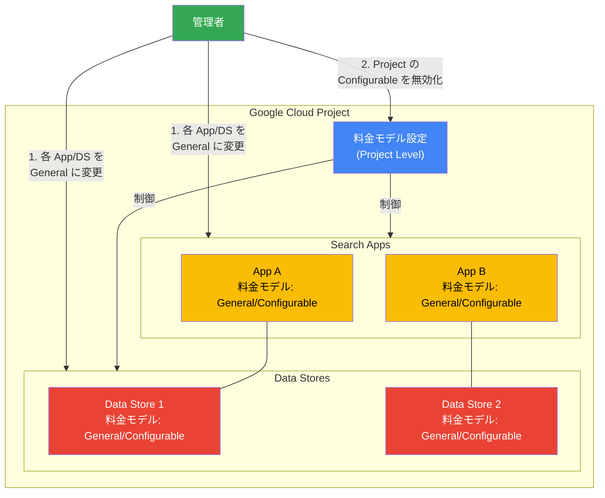

# Vertex AI Search: プロジェクトレベルの料金モデル変更サポート

**リリース日**: 2026-02-24
**サービス**: Vertex AI Search
**機能**: プロジェクトレベルの料金モデル切り替え
**ステータス**: Feature (GA)

[このアップデートのインフォグラフィックを見る](https://takech9203.github.io/google-cloud-news-summary/20260224-vertex-ai-search-pricing-model-change.html)

## 概要

Vertex AI Search において、プロジェクトレベルで料金モデルを切り替える機能が追加された。Vertex AI Search のカスタム検索では「General (従量課金)」と「Configurable (サブスクリプション)」の 2 つの料金モデルが提供されており、今回のアップデートにより、プロジェクト内のすべてのアプリとデータストアが General モデルを使用している場合に、Configurable 料金モデルから General 料金モデルへプロジェクト単位で切り替えることが可能になった。

これは 2025 年 12 月 9 日に GA となった Configurable Pricing と、2026 年 1 月 26 日に追加されたアプリ・データストア単位の料金モデル変更機能を補完するアップデートである。プロジェクト管理者は、利用状況の変化に応じてプロジェクト全体の課金体系を柔軟に調整できるようになり、コスト最適化の選択肢が広がった。

対象ユーザーは Vertex AI Search のカスタム検索を利用しているプロジェクト管理者やソリューションアーキテクトであり、特にサブスクリプションモデルから従量課金モデルへの移行を検討している場合に有用な機能である。

**アップデート前の課題**

- プロジェクトレベルで一度 Configurable Pricing を有効化すると、プロジェクト全体を General Pricing に戻すことができなかった
- 料金モデルの検証後に元に戻したい場合でも、プロジェクト単位での解除手段がなかった
- 利用パターンの変化により従量課金の方が有利になった場合でも、プロジェクトレベルの Configurable Pricing 設定が残り続けた

**アップデート後の改善**

- プロジェクト内のすべてのアプリとデータストアを General モデルに切り替えた後、プロジェクト全体の Configurable Pricing を無効化できるようになった
- Google Cloud コンソールの Billing ページから簡単にプロジェクトの料金モデルを General Pricing に切り替え可能
- 料金モデルの試行錯誤が容易になり、最適なコスト構造を柔軟に選択できるようになった

## アーキテクチャ図

プロジェクトレベルの料金モデル変更は、まずすべてのアプリとデータストアを General モデルに切り替えた上で、プロジェクト全体の Configurable Pricing を無効化するという 2 段階の手順で行う。

## サービスアップデートの詳細

### 主要機能

1. **プロジェクトレベルの Configurable Pricing 無効化**
   - プロジェクト内のすべてのアプリとデータストアが General モデルを使用している場合に、プロジェクト全体の Configurable Pricing を無効化できる
   - Google Cloud コンソールの Billing ページから「General Pricing」を選択して切り替える

2. **段階的な料金モデル移行**
   - まずデータストアの料金モデルを General に変更する (General Pricing のアプリは Configurable Pricing のデータストアに接続できないため)
   - 次にアプリの料金モデルを General に変更する
   - 最後にプロジェクトレベルで Configurable Pricing を無効化する

3. **柔軟な混在構成 (Configurable Pricing 有効時)**
   - Configurable Pricing がプロジェクトで有効な状態では、同一プロジェクト内で General と Configurable の両方のアプリ・データストアを混在させることが可能
   - 個別のアプリやデータストア単位での料金モデル変更は 2026 年 1 月 26 日のアップデートで追加済み

## 技術仕様

### 料金モデル比較

| 項目 | General (従量課金) | Configurable (サブスクリプション) |
|------|-------------------|--------------------------------|
| 課金方式 | 使用量に応じた従量課金 | 月額サブスクリプション + 超過分は従量課金 |
| ストレージ | 使用量ベース | 最小 50 GiB/月のサブスクリプション |
| 検索クエリ | 使用量ベース | 最小 1,000 QPM/月のサブスクリプション |
| 機能アドオン | 全機能込み | セマンティック検索、KPI・パーソナライゼーション、AI Overview を個別選択 |
| 適用範囲 | デフォルト | プロジェクトレベルで有効化後、アプリ・DS 単位で適用 |

### 必要な IAM 権限

| 操作 | 必要なロール | 必要なパーミッション |
|------|------------|---------------------|
| プロジェクトの料金モデル変更 | Discovery Engine Admin (`roles/discoveryengine.admin`) | `discoveryengine.projects.update` |
| アプリの料金モデル変更 | Discovery Engine Admin または Editor | `discoveryengine.engines.create`, `discoveryengine.engines.update`, `discoveryengine.engines.delete` |
| データストアの料金モデル変更 | Discovery Engine Admin または Editor | `discoveryengine.dataStores.create`, `discoveryengine.dataStores.update`, `discoveryengine.dataStores.delete` |

## 設定方法

### 前提条件

1. プロジェクトで Configurable Pricing が有効化されていること
2. Discovery Engine Admin ロール (`roles/discoveryengine.admin`) が付与されていること
3. プロジェクト内のすべてのアプリとデータストアが General Pricing に切り替え済みであること

### 手順

#### ステップ 1: データストアの料金モデルを General に変更

Google Cloud コンソールで以下の操作を行う。

1. **Data Stores** ページに移動する
2. 対象のデータストアをクリック
3. **Billing** をクリックし、**General Pricing** を選択
4. **Save** をクリック

#### ステップ 2: アプリの料金モデルを General に変更

1. **Apps** ページに移動する
2. アプリに接続されているデータストアが General Pricing であることを確認する (General Pricing のアプリは Configurable Pricing のデータストアに接続できない)
3. 対象のアプリをクリック
4. メインメニューの **Billing** をクリックし、**General Pricing** を選択
5. **Save** をクリック

#### ステップ 3: プロジェクトの Configurable Pricing を無効化

すべてのアプリとデータストアが General Pricing であることを確認した上で、以下の操作を行う。

1. Google Cloud コンソールで **Billing** ページに移動する
2. **General Pricing** を選択する
3. **Save project settings** をクリックする

## メリット

### ビジネス面

- **コスト最適化の柔軟性**: 利用パターンの変化に応じて、サブスクリプションモデルから従量課金モデルへ切り替えることで、過剰な固定費を削減できる
- **料金モデルの試行が容易に**: Configurable Pricing を試した結果、従量課金の方が有利と判断した場合にプロジェクト全体を元に戻せるため、料金モデルの検証リスクが低下する
- **運用コストの透明性向上**: 従量課金モデルに戻すことで、実際の使用量に基づいた予測可能なコスト管理が可能になる

### 技術面

- **プロジェクト管理の簡素化**: プロジェクトレベルでの料金モデル変更により、管理者は一元的にコスト構造を制御できる
- **段階的な移行サポート**: データストア → アプリ → プロジェクトの順に変更できるため、リスクを最小化した段階的な移行が可能
- **既存の Gemini Enterprise との整合**: Gemini Enterprise データストアは General Pricing を使用する必要があるため、プロジェクト全体を General に統一する際に一貫性を確保できる

## デメリット・制約事項

### 制限事項

- プロジェクトの Configurable Pricing を無効化するには、先にすべてのアプリとデータストアを General モデルに個別に切り替える必要がある
- Configurable Pricing のサブスクリプションしきい値 (ストレージサイズ、QPM) は増加のみ可能で、減少させることはできない
- サブスクリプションしきい値を増加した後、次の増加まで最大 2 時間の待機時間が必要
- General Pricing のアプリは Configurable Pricing のデータストアに接続できないため、混在構成には注意が必要

### 考慮すべき点

- Configurable Pricing を無効化すると、再度有効化した場合にサブスクリプション課金が即座に開始される
- 各アプリ・データストアの料金モデル変更は個別に行う必要があり、大規模プロジェクトでは手順が多くなる可能性がある
- Configurable Pricing のアドオン (セマンティック検索、AI Overview 等) を利用中の場合、General モデルに切り替えると課金体系が変わるため、事前のコスト比較が推奨される

## ユースケース

### ユースケース 1: サブスクリプションから従量課金への移行

**シナリオ**: Configurable Pricing を導入したが、実際の利用量がサブスクリプションの最小しきい値を大きく下回っており、従量課金の方がコスト効率が良いと判明した場合。

**手順**:
1. 各データストアの Billing 設定で General Pricing を選択
2. 各アプリの Billing 設定で General Pricing を選択
3. プロジェクトの Billing ページで General Pricing を選択して保存

**効果**: 不要な固定費 (最小 50 GiB/月のストレージ + 1,000 QPM/月の検索クエリサブスクリプション) を削減し、実際の使用量に応じた課金に切り替えられる。

### ユースケース 2: 料金モデルの検証・評価

**シナリオ**: 新規プロジェクトで Configurable Pricing と General Pricing のどちらが適切か判断するため、一時的に Configurable Pricing を有効化して検証を行いたい場合。

**効果**: 検証の結果、General Pricing が適切と判断した場合にプロジェクト全体を元に戻せるため、料金モデルの評価をリスクなく実施できる。Billing Consumption タブで使用量を追跡し、最適なモデルを選択できる。

## 料金

Vertex AI Search のカスタム検索は 2 つの料金モデルを提供している。

### 料金モデル概要

| 料金モデル | 概要 | 適用 |
|-----------|------|------|
| General (従量課金) | 使用量に応じた従量課金。デフォルトの料金モデル | プロジェクトにデフォルトで適用 |
| Configurable (サブスクリプション) | ストレージと検索クエリのサブスクリプション + オプションのアドオン | プロジェクトレベルで有効化後、アプリ・DS 単位で適用 |

### Configurable Pricing のサブスクリプション構成

| コンポーネント | 最小しきい値 | 計測単位 |
|--------------|------------|---------|
| ストレージサブスクリプション | 50 GiB/月 | GiB |
| 検索クエリサブスクリプション | 1,000 QPM/月 | QPM (queries per minute) |

### Configurable Pricing のアドオン

| アドオン種別 | アドオン名 | 説明 |
|------------|-----------|------|
| ストレージ | Semantic Embedding | ドキュメントのベクトル埋め込み生成・維持。セマンティック検索の前提条件 |
| 検索リクエスト | Semantic Query | 埋め込みを使用したセマンティック検索。Semantic Embedding が前提条件 |
| 検索リクエスト | KPI & Personalization | ユーザーイベントベースのリランキングとパーソナライゼーション |
| 検索リクエスト | AI Overview | 生成 AI による要約・フォローアップ質問。Semantic Query が前提条件 |

詳細な料金については [Vertex AI Search 料金ページ](https://cloud.google.com/generative-ai-app-builder/pricing) を参照。

## 利用可能リージョン

Vertex AI Search は global、us (米国マルチリージョン)、eu (EU マルチリージョン) のロケーションで利用可能。料金モデルの変更機能はすべてのサポート対象ロケーションで利用できる。詳細は [Vertex AI Search のロケーションドキュメント](https://cloud.google.com/generative-ai-app-builder/docs/locations) を参照。

## 関連サービス・機能

- **Vertex AI Search (カスタム検索)**: 料金モデルの変更対象となるコアサービス。Google 品質の検索エンジンを独自データに適用できる
- **Vertex AI Agent Builder**: Vertex AI Search を含むプラットフォーム。エージェント構築におけるセッション、Memory Bank、Code Execution の課金も関連する
- **Discovery Engine API**: Vertex AI Search の基盤 API。料金モデルの設定は Discovery Engine Admin ロールで制御される
- **Cloud Billing**: プロジェクトの課金管理。Billing ページから料金モデルの切り替えを実行する
- **IAM (Identity and Access Management)**: 料金モデル変更に必要な権限管理。Discovery Engine Admin/Editor ロールが必要

## 参考リンク

- [インフォグラフィック](https://takech9203.github.io/google-cloud-news-summary/20260224-vertex-ai-search-pricing-model-change.html)
- [公式リリースノート](https://cloud.google.com/release-notes#February_24_2026)
- [Vertex AI Search リリースノート](https://docs.cloud.google.com/generative-ai-app-builder/docs/release-notes)
- [Configurable Pricing 設定ドキュメント](https://docs.cloud.google.com/generative-ai-app-builder/docs/enable-configurable-pricing)
- [Vertex AI Search 料金ページ](https://cloud.google.com/generative-ai-app-builder/pricing)
- [Vertex AI Search 概要](https://docs.cloud.google.com/generative-ai-app-builder/docs/introduction)

## まとめ

今回のアップデートにより、Vertex AI Search のプロジェクト管理者は Configurable Pricing (サブスクリプション) から General Pricing (従量課金) へのプロジェクトレベルでの切り替えが可能になった。2025 年 12 月の Configurable Pricing GA、2026 年 1 月のアプリ・データストア単位の変更機能に続く改善であり、料金モデルの完全な双方向切り替えが実現された。利用パターンの変化に応じたコスト最適化を検討する場合は、Billing Consumption タブで使用量を確認した上で、段階的に移行を進めることを推奨する。

---

**タグ**: #VertexAISearch #Pricing #CostOptimization #ConfigurablePricing #GeneralPricing #DiscoveryEngine #GoogleCloud
