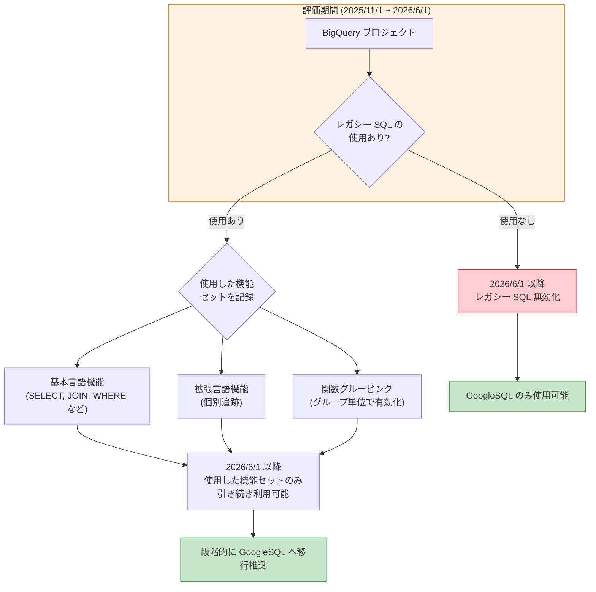

# BigQuery: レガシー SQL 使用制限 (2026 年 6 月 1 日発効)

**リリース日**: 2026-02-25
**サービス**: BigQuery
**機能**: レガシー SQL 機能利用制限
**ステータス**: 変更 (非推奨化)

[このアップデートのインフォグラフィックを見る](https://takech9203.github.io/google-cloud-news-summary/20260225-bigquery-legacy-sql-deprecation.html)

## 概要

2026 年 2 月 25 日、Google Cloud は BigQuery におけるレガシー SQL の使用制限を正式に発表した。2026 年 6 月 1 日以降、評価期間 (2025 年 11 月 1 日 ~ 2026 年 6 月 1 日) にレガシー SQL を使用していない組織およびプロジェクトでは、レガシー SQL が無効化される。これは BigQuery がレガシー SQL から GoogleSQL (ANSI 準拠の推奨 SQL 方言) への移行を推進する取り組みの一環である。

評価期間中にレガシー SQL を使用した組織およびプロジェクトでは、使用した特定の機能セットに限り引き続きレガシー SQL を利用できる。機能の使用状況は組織レベルで集約され、組織内のいずれかのプロジェクトが特定の機能を使用していれば、その機能は組織内の全プロジェクトで引き続き利用可能となる。組織に属さないプロジェクトの場合は、プロジェクトレベルで管理される。

GoogleSQL への移行は必須ではないが強く推奨されている。GoogleSQL は DML/DDL ステートメント、共通テーブル式 (CTE)、マテリアライズドビュー、検索インデックス、生成 AI 関数など、レガシー SQL では利用できない多くの機能をサポートしており、BigQuery アドバンスドランタイムによるパフォーマンス向上も期待できる。

**アップデート前の課題**

レガシー SQL と GoogleSQL の 2 つの SQL 方言が並行して利用可能であり、以下の課題が存在していた。

- レガシー SQL は SQL 2011 標準に準拠しておらず、独自の構文やセマンティクスを持っていたため、他のデータベースシステムとの互換性が低かった
- レガシー SQL では DML (INSERT, UPDATE, DELETE)、DDL、CTE、マテリアライズドビュー、検索インデックス、生成 AI 関数などの最新機能が利用できなかった
- レガシー SQL は BigQuery アドバンスドランタイムを活用できないため、パフォーマンスとコスト効率の面で不利だった
- 2 つの方言が混在することで、ビュー定義の互換性問題が発生していた (レガシー SQL で定義されたビューは GoogleSQL からクエリできず、その逆も同様)

**アップデート後の改善**

今回のアップデートにより、レガシー SQL から GoogleSQL への移行が促進される。

- 評価期間の仕組みにより、レガシー SQL を使用していない組織は自動的に GoogleSQL のみの環境へ移行される
- 使用中の組織には十分な猶予期間が与えられ、段階的な移行が可能
- 特別な事情がある場合は免除申請が可能 (Google Forms または bq-legacysql-support@google.com 宛のメール)
- INFORMATION_SCHEMA.JOBS ビューの `query_dialect` フィールドにより、レガシー SQL の使用状況を追跡可能

## アーキテクチャ図



評価期間中のレガシー SQL 使用状況に基づいて、2026 年 6 月 1 日以降の機能利用可否が決定される。使用していない組織ではレガシー SQL が無効化され、使用している組織では使用した機能セットのみが引き続き利用可能となる。

## サービスアップデートの詳細

### 主要機能

1. **評価期間ベースの機能利用可否判定**
   - 2025 年 11 月 1 日から 2026 年 6 月 1 日までの評価期間中のレガシー SQL 使用状況に基づいて判定
   - 評価期間中にレガシー SQL を一度も使用しなかった組織/プロジェクトでは、2026 年 6 月 1 日以降レガシー SQL が無効化される
   - 評価期間中に使用した場合は、使用した特定の機能セットのみ引き続き利用可能

2. **組織レベルでの機能集約**
   - 機能の使用状況は組織レベルで集約される
   - 組織内のいずれかのプロジェクトが特定の機能を使用すれば、その機能は組織内の全プロジェクトで利用可能
   - 組織に属さないプロジェクトはプロジェクトレベルで個別管理
   - 既存のレガシー SQL を使用している組織は、新規プロジェクトでもレガシー SQL を利用可能

3. **3 つの機能セット分類**
   - **基本言語機能**: SELECT, FROM, JOIN, WHERE, GROUP BY などのコア機能。1 つでもレガシー SQL クエリを実行すれば全体が有効化
   - **拡張言語機能**: FLATTEN 演算子、EACH 修飾子、テーブルデコレータ、ユーザー定義関数など。個別に追跡され、各機能を明示的に使用する必要がある
   - **関数グルーピング**: 数学関数、文字列関数、ウィンドウ関数など。グループ内の 1 つの関数を使用すれば、そのグループ全体が有効化

## 技術仕様

### レガシー SQL 機能セットの分類

| 機能セット | 追跡方法 | 有効化条件 |
|-----------|---------|-----------|
| 基本言語機能 | セット全体 | 1 つのレガシー SQL クエリ実行で全体有効化 |
| 拡張言語機能 | 個別追跡 | 各機能を明示的に使用する必要あり |
| 関数グルーピング | グループ単位 | グループ内の 1 関数使用で全グループ有効化 |

### 拡張言語機能一覧

| 機能 | 説明 |
|------|------|
| カンマを UNION ALL として使用 | テーブル間のカンマ区切りによる結合 |
| 明示的 FLATTEN 演算子 | ネストされたフィールドの展開 |
| GROUP BY EACH 修飾子 | 大規模データの分散集計 |
| JOIN EACH 修飾子 | 大規模データの分散結合 |
| IGNORE CASE 修飾子 | 大文字小文字を無視した文字列比較 |
| 論理ビュー | レガシー SQL で定義されたビュー |
| OMIT ... IF 句 | 条件付きカラム除外 |
| Semi-join / Anti-join | 半結合・反結合 |
| テーブルデコレータ | パーティション、範囲、時間デコレータ |
| ユーザー定義関数 | レガシー SQL の UDF |
| ワイルドカード関数 | TABLE_DATE_RANGE, TABLE_QUERY など |
| WITHIN 修飾子 | 集計関数の WITHIN 句 |

### レガシー SQL 使用状況の確認クエリ

```sql
-- プロジェクト別のレガシー SQL クエリジョブ数を確認
SELECT
  project_id,
  COUNTIF(query_dialect = 'DEFAULT_LEGACY_SQL') AS default_legacysql_query_jobs,
  COUNTIF(query_dialect = 'LEGACY_SQL') AS legacysql_query_jobs,
FROM
  `region-REGION_NAME`.INFORMATION_SCHEMA.JOBS
WHERE
  query_dialect = 'DEFAULT_LEGACY_SQL'
  OR query_dialect = 'LEGACY_SQL'
GROUP BY project_id
ORDER BY
  default_legacysql_query_jobs DESC,
  legacysql_query_jobs DESC;
```

### query_dialect フィールドの値

| 値 | 説明 |
|----|------|
| `GOOGLE_SQL` | GoogleSQL が明示的に指定されたジョブ |
| `LEGACY_SQL` | レガシー SQL が明示的に指定されたジョブ |
| `DEFAULT_LEGACY_SQL` | クエリ方言が指定されず、デフォルトのレガシー SQL が使用されたジョブ |
| `DEFAULT_GOOGLE_SQL` | クエリ方言が指定されず、デフォルトの GoogleSQL が使用されたジョブ |

## 設定方法

### 前提条件

1. BigQuery プロジェクトまたは組織が存在すること
2. INFORMATION_SCHEMA.JOBS ビューへのアクセス権限があること (レガシー SQL 使用状況の確認用)

### 手順

#### ステップ 1: レガシー SQL の使用状況を確認する

```sql
-- 過去 30 日間のレガシー SQL 使用状況を確認
SELECT
  project_id,
  COUNTIF(query_dialect = 'DEFAULT_LEGACY_SQL') AS default_legacysql_jobs,
  COUNTIF(query_dialect = 'LEGACY_SQL') AS explicit_legacysql_jobs
FROM
  `region-us`.INFORMATION_SCHEMA.JOBS
WHERE
  creation_time >= TIMESTAMP_SUB(CURRENT_TIMESTAMP(), INTERVAL 30 DAY)
  AND (query_dialect = 'DEFAULT_LEGACY_SQL' OR query_dialect = 'LEGACY_SQL')
GROUP BY project_id
ORDER BY default_legacysql_jobs DESC;
```

レガシー SQL を使用しているプロジェクトとジョブ数を特定する。`DEFAULT_LEGACY_SQL` はクエリ方言を明示的に指定していないケースであり、特に注意が必要。

#### ステップ 2: レガシー SQL クエリを特定して GoogleSQL に移行する

```sql
-- レガシー SQL を使用しているクエリの詳細を確認
SELECT
  job_id,
  user_email,
  query,
  creation_time
FROM
  `region-us`.INFORMATION_SCHEMA.JOBS
WHERE
  creation_time >= TIMESTAMP_SUB(CURRENT_TIMESTAMP(), INTERVAL 30 DAY)
  AND (query_dialect = 'DEFAULT_LEGACY_SQL' OR query_dialect = 'LEGACY_SQL')
  AND job_type = 'QUERY'
ORDER BY creation_time DESC
LIMIT 100;
```

特定されたクエリを GoogleSQL に書き換える。主な構文の違いに注意する。

#### ステップ 3: GoogleSQL をデフォルトの SQL 方言に設定する

BigQuery のデフォルト SQL 方言を GoogleSQL に変更する。これにより、方言を指定しないクエリが自動的に GoogleSQL で実行される。

#### ステップ 4: レガシー SQL で定義されたビューを移行する

```sql
-- レガシー SQL で定義されたビューの確認 (GoogleSQL)
SELECT
  table_catalog,
  table_schema,
  table_name,
  view_definition
FROM
  `project_id`.`dataset_id`.INFORMATION_SCHEMA.VIEWS
WHERE
  -- ビュー定義を確認して手動でレガシー SQL のものを特定する
  TRUE;
```

レガシー SQL で定義されたビューは GoogleSQL から参照できないため、GoogleSQL で再作成する必要がある。

## メリット

### ビジネス面

- **コスト最適化**: GoogleSQL は BigQuery アドバンスドランタイムを活用でき、クエリ実行のパフォーマンスが向上しコストが削減される可能性がある
- **将来の機能アクセス**: 今後の BigQuery の新機能 (生成 AI 関数、マテリアライズドビュー、検索インデックスなど) はすべて GoogleSQL で提供されるため、移行により最新機能を活用可能
- **人材確保の容易さ**: GoogleSQL は SQL 2011 標準に準拠しており、標準的な SQL スキルを持つ人材を活用しやすい

### 技術面

- **標準 SQL 準拠**: SQL 2011 標準に準拠しているため、他のデータベースシステムとの互換性が高い
- **高度なクエリ機能**: WITH 句による構成可能性、サブクエリの柔軟な配置、ARRAY/STRUCT データ型、相関サブクエリなどが利用可能
- **DML/DDL サポート**: INSERT, UPDATE, DELETE, CREATE TABLE などのデータ操作・定義言語が利用可能
- **正確な COUNT(DISTINCT)**: GoogleSQL では COUNT(DISTINCT) が正確かつスケーラブルで、レガシー SQL の EXACT_COUNT_DISTINCT の制限がない

## デメリット・制約事項

### 制限事項

- レガシー SQL の特定機能を使用している場合、評価期間中に使用されなかった機能は 2026 年 6 月 1 日以降利用不可になる
- レガシー SQL で定義された論理ビューは GoogleSQL からクエリできず、逆も同様のため、ビューの再作成が必要
- 評価期間終了後、新しい組織やプロジェクトではレガシー SQL を利用できない
- 特定の機能使用状況を監査するための専用ツールは提供されていない

### 考慮すべき点

- 評価期間中にめったに使用しないレガシー SQL クエリも、引き続き利用したい場合は一度実行しておく必要がある
- 組織内のすべてのプロジェクトのレガシー SQL 使用状況を確認し、影響範囲を事前に把握する必要がある
- レガシー SQL のビューを GoogleSQL に移行する際、そのビューを参照しているクエリも同時に移行する必要がある
- `DEFAULT_LEGACY_SQL` としてカウントされるクエリ (方言未指定のケース) の特定と対応が必要

## ユースケース

### ユースケース 1: レガシー SQL 使用状況の棚卸し

**シナリオ**: 大規模組織において、複数のプロジェクトでレガシー SQL がどの程度使用されているかを把握し、移行計画を策定する。

**実装例**:
```sql
-- 組織全体のレガシー SQL 使用状況サマリー
SELECT
  project_id,
  COUNTIF(query_dialect = 'DEFAULT_LEGACY_SQL') AS implicit_legacy_jobs,
  COUNTIF(query_dialect = 'LEGACY_SQL') AS explicit_legacy_jobs,
  COUNTIF(query_dialect IN ('GOOGLE_SQL', 'DEFAULT_GOOGLE_SQL')) AS googlesql_jobs,
  MIN(creation_time) AS earliest_legacy_usage,
  MAX(creation_time) AS latest_legacy_usage
FROM
  `region-us`.INFORMATION_SCHEMA.JOBS
WHERE
  creation_time >= TIMESTAMP('2025-11-01')
  AND job_type = 'QUERY'
GROUP BY project_id
HAVING implicit_legacy_jobs > 0 OR explicit_legacy_jobs > 0
ORDER BY implicit_legacy_jobs + explicit_legacy_jobs DESC;
```

**効果**: 移行が必要なプロジェクトの優先順位付けと、移行作業の工数見積もりが可能になる。

### ユースケース 2: レガシー SQL ビューの移行

**シナリオ**: レガシー SQL で定義されたビューを GoogleSQL に移行し、クエリ間の互換性問題を解消する。

**実装例**:
```sql
-- レガシー SQL ビュー (移行前)
-- #legacySQL
-- SELECT *, UTC_USEC_TO_DAY(timestamp_col) AS day FROM MyTable

-- GoogleSQL ビュー (移行後)
CREATE OR REPLACE VIEW `project.dataset.my_view` AS
SELECT *, EXTRACT(DAY FROM timestamp_col) AS day FROM `project.dataset.MyTable`;
```

**効果**: GoogleSQL のビューを使用することで、DML、CTE、マテリアライズドビューなどの最新機能と組み合わせて活用可能になる。

## 料金

今回のレガシー SQL 使用制限自体には追加料金は発生しない。BigQuery の料金体系は変更されていない。

GoogleSQL への移行により、BigQuery アドバンスドランタイムが利用可能になるため、クエリ実行コストの削減が期待できる。

BigQuery の料金体系は以下の 2 つのモデルがある。

| 料金モデル | 概要 | 課金方式 |
|-----------|------|---------|
| オンデマンド | クエリがスキャンしたデータ量に基づく課金 | TiB あたりの料金 |
| キャパシティベース (Editions) | スロットによる処理能力に基づく課金 | スロット時間あたりの料金 |

詳細は [BigQuery 料金ページ](https://cloud.google.com/bigquery/pricing) を参照。

## 関連サービス・機能

- **BigQuery アドバンスドランタイム**: GoogleSQL でのみ利用可能な高性能ランタイム。クエリ実行のパフォーマンス向上とコスト削減に寄与
- **BigQuery ML**: 機械学習モデルの作成・実行機能。GoogleSQL でのみ利用可能
- **BigQuery 生成 AI 関数**: Vertex AI と連携した生成 AI 関数。GoogleSQL でのみ利用可能
- **Cloud Logging**: レガシー SQL の使用状況をクエリログから確認可能
- **INFORMATION_SCHEMA**: JOBS ビューの `query_dialect` フィールドでレガシー SQL の使用追跡が可能

## 参考リンク

- [インフォグラフィック](https://takech9203.github.io/google-cloud-news-summary/20260225-bigquery-legacy-sql-deprecation.html)
- [公式リリースノート](https://cloud.google.com/release-notes#February_25_2026)
- [レガシー SQL 機能利用可否ドキュメント](https://cloud.google.com/bigquery/docs/legacy-sql-feature-availability)
- [レガシー SQL から GoogleSQL への移行ガイド](https://cloud.google.com/bigquery/docs/reference/standard-sql/migrating-from-legacy-sql)
- [BigQuery SQL 方言の紹介](https://cloud.google.com/bigquery/docs/introduction-sql)
- [INFORMATION_SCHEMA.JOBS ビュー](https://cloud.google.com/bigquery/docs/information-schema-jobs)
- [免除申請フォーム](https://forms.gle/mSgyvY9peo4LLBj67)
- [料金ページ](https://cloud.google.com/bigquery/pricing)

## まとめ

BigQuery のレガシー SQL 使用制限は、GoogleSQL への移行を促進する重要な変更である。2026 年 6 月 1 日の期限までに、まず INFORMATION_SCHEMA.JOBS ビューの `query_dialect` フィールドを活用してレガシー SQL の使用状況を確認し、影響範囲を把握することが推奨される。レガシー SQL を使用している場合は、評価期間中に必要な機能がすべて実行されていることを確認するとともに、計画的に GoogleSQL への移行を進めるべきである。特に、レガシー SQL で定義されたビューの移行は早期に着手することが望ましい。

---

**タグ**: #BigQuery #LegacySQL #GoogleSQL #SQL移行 #非推奨化 #データ分析 #評価期間
