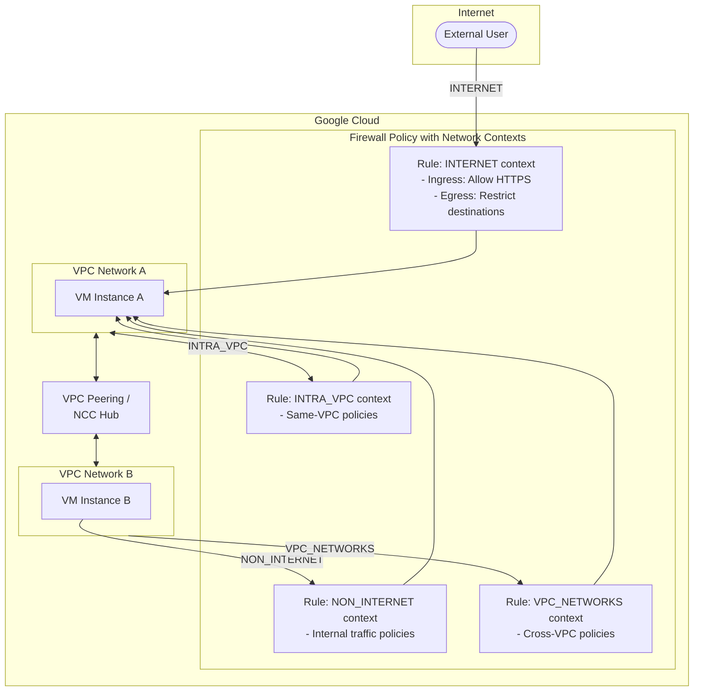

# Cloud NGFW: Network Contexts による効率的なファイアウォールポリシー管理

**リリース日**: 2026-02-25
**サービス**: Cloud NGFW, VPC
**機能**: Network Contexts (ネットワークコンテキスト)
**ステータス**: GA (General Availability)

[このアップデートのインフォグラフィックを見る](https://takech9203.github.io/google-cloud-news-summary/20260225-cloud-ngfw-network-contexts.html)

## 概要

Cloud NGFW (Cloud Next Generation Firewall) に Network Contexts (ネットワークコンテキスト) 機能が GA (一般提供) として追加された。この機能により、トラフィックの送信元や宛先のネットワークコンテキスト (インターネット、非インターネット、VPC ネットワーク、イントラ VPC) に基づいてファイアウォールルールを定義できるようになり、少ないルール数でより効率的にセキュリティ目標を達成できる。

Network Contexts は、階層型ファイアウォールポリシー、グローバルネットワークファイアウォールポリシー、リージョナルネットワークファイアウォールポリシーのルールにおいて、ソースコンビネーションまたはデスティネーションコンビネーションの一部として使用できる。4 種類のネットワークコンテキスト (INTERNET、NON_INTERNET、VPC_NETWORKS、INTRA_VPC) を活用することで、従来は IP レンジベースで複数のルールを作成する必要があった構成を、論理的なネットワーク分類に基づく少数のルールに集約できる。

この機能は、マルチ VPC 環境やハイブリッドクラウド環境でセキュリティポリシーを管理するネットワーク管理者やセキュリティエンジニアに特に有用である。2024 年 12 月に Preview (当時の名称は「Network Scopes」) として公開された機能が、GA に昇格したものである。

**アップデート前の課題**

Network Contexts 導入以前は、トラフィックの送信元や宛先がインターネット経由なのか、VPC 内部なのかを区別するために、IP アドレスレンジベースのルールを多数作成する必要があった。

- インターネットからのトラフィックと VPC 間のトラフィックを区別するために、送信元 IP レンジを明示的に指定した複数のルールが必要だった
- VPC ピアリングや Network Connectivity Center 経由のトラフィックを識別するための論理的な分類手段がなく、IP レンジの管理が煩雑だった
- ファイアウォールポリシーのルール数が増大し、管理コストと誤設定リスクが高まっていた

**アップデート後の改善**

Network Contexts の GA により、トラフィックの論理的な分類に基づいた効率的なルール定義が可能になった。

- INTERNET / NON_INTERNET コンテキストにより、インターネット経由のトラフィックと内部トラフィックを 1 つのルールパラメータで区別可能になった
- VPC_NETWORKS コンテキストにより、特定の送信元 VPC ネットワークからのトラフィックを識別できるようになった (最大 250 VPC を指定可能)
- INTRA_VPC コンテキストにより、同一 VPC 内のトラフィック (East-West トラフィック) を簡潔に識別可能になった

## アーキテクチャ図



この図は、4 種類のネットワークコンテキストがどのようにトラフィックを分類し、ファイアウォールポリシールールに適用されるかを示している。インターネットからのトラフィック、VPC 間のトラフィック、同一 VPC 内のトラフィックがそれぞれ異なるコンテキストとして識別される。

## サービスアップデートの詳細

### 主要機能

1. **INTERNET コンテキスト**
   - インターネット経由で到着するトラフィック (Ingress) およびインターネット向けに送出されるトラフィック (Egress) を識別する
   - Ingress: Google Maglev 経由でルーティングされた VM ネットワークインターフェースへのパケットが対象
   - Egress: デフォルトインターネットゲートウェイを next hop とする静的ルート経由のパケットが対象 (ただし Google API/サービス向けトラフィックは除外)
   - Ingress ルールのソースコンビネーション、Egress ルールのデスティネーションコンビネーションの両方で使用可能

2. **NON_INTERNET コンテキスト**
   - インターネットを経由しないすべてのトラフィックを識別する (INTERNET と相互排他)
   - サブネットルート、静的ルート、ポリシーベースルート、特殊ルーティングパス経由のトラフィックが対象
   - Google API/サービスへのレスポンスパケットも非インターネットコンテキストに含まれる
   - Ingress / Egress 両方向で使用可能

3. **VPC_NETWORKS コンテキスト**
   - 特定の送信元 VPC ネットワークからのトラフィックを識別する (NON_INTERNET のサブセット)
   - Ingress ルールのソースコンビネーションでのみ使用可能
   - 送信元 VPC ネットワークリストに最大 250 VPC を指定可能
   - VPC ピアリングまたは Network Connectivity Center ハブ経由で接続された VPC も対象
   - VM インターフェース、Cloud VPN トンネル、Cloud Interconnect VLAN アタッチメント、ルーターアプライアンス、プロキシ専用サブネットの Envoy プロキシ、Private Service Connect エンドポイント、Serverless VPC Access コネクタが対象リソース

4. **INTRA_VPC コンテキスト**
   - ファイアウォールポリシーが適用されている同一 VPC ネットワーク内のリソースからのトラフィックを識別する (NON_INTERNET のサブセット)
   - Ingress ルールのソースコンビネーションでのみ使用可能
   - East-West トラフィック (VPC 内部通信) のマイクロセグメンテーションに最適

## 技術仕様

### ネットワークコンテキストの対応表

| ネットワークコンテキスト | ターゲットタイプ | Ingress ソース | Egress デスティネーション |
|---|---|---|---|
| INTERNET | INSTANCES, INTERNAL_MANAGED_LB | 対応 | 対応 |
| NON_INTERNET | INSTANCES, INTERNAL_MANAGED_LB | 対応 | 対応 |
| VPC_NETWORKS | INSTANCES, INTERNAL_MANAGED_LB | 対応 | 非対応 |
| INTRA_VPC | INSTANCES, INTERNAL_MANAGED_LB | 対応 | 非対応 |

### コンテキスト間の関係

| 関係 | 詳細 |
|---|---|
| INTERNET と NON_INTERNET | 相互排他 (同時指定不可) |
| VPC_NETWORKS | NON_INTERNET のサブセット |
| INTRA_VPC | NON_INTERNET のサブセット |

### 制約事項

| 項目 | 制限 |
|---|---|
| VPC_NETWORKS の最大 VPC 数 | 250 VPC |
| INTERNET コンテキスト | ソースセキュアタグとの併用不可 |
| NON_INTERNET / VPC_NETWORKS / INTRA_VPC | Google Threat Intelligence リストおよびジオロケーションソースとの併用不可 |
| VPC_NETWORKS / INTRA_VPC | Egress ルールでは使用不可 |

### gcloud CLI での設定例

```bash
# Ingress ルール: インターネットからの HTTPS トラフィックを許可
gcloud compute network-firewall-policies rules create 100 \
    --firewall-policy=my-policy \
    --action=allow \
    --direction=INGRESS \
    --src-network-context=INTERNET \
    --src-ip-ranges=0.0.0.0/0 \
    --layer4-configs=tcp:443 \
    --global-firewall-policy \
    --description="Allow HTTPS from internet"

# Ingress ルール: 特定の VPC ネットワークからのトラフィックを許可
gcloud compute network-firewall-policies rules create 200 \
    --firewall-policy=my-policy \
    --action=allow \
    --direction=INGRESS \
    --src-network-context=VPC_NETWORKS \
    --src-networks=projects/my-project/global/networks/vpc-a,projects/my-project/global/networks/vpc-b \
    --src-ip-ranges=10.0.0.0/8 \
    --layer4-configs=tcp:8080 \
    --global-firewall-policy \
    --description="Allow traffic from specific VPCs"

# Egress ルール: インターネット向けトラフィックを制限
gcloud compute network-firewall-policies rules create 300 \
    --firewall-policy=my-policy \
    --action=deny \
    --direction=EGRESS \
    --dest-network-context=INTERNET \
    --dest-ip-ranges=0.0.0.0/0 \
    --layer4-configs=tcp:25 \
    --global-firewall-policy \
    --description="Block outbound SMTP to internet"

# Ingress ルール: 同一 VPC 内トラフィックのみ許可
gcloud compute network-firewall-policies rules create 400 \
    --firewall-policy=my-policy \
    --action=allow \
    --direction=INGRESS \
    --src-network-context=INTRA_VPC \
    --src-ip-ranges=10.0.0.0/8 \
    --layer4-configs=tcp:3306 \
    --global-firewall-policy \
    --description="Allow MySQL only from same VPC"

# 階層型ファイアウォールポリシーでの使用
gcloud compute firewall-policies rules create 100 \
    --firewall-policy=123456789 \
    --action=allow \
    --direction=INGRESS \
    --src-network-context=NON_INTERNET \
    --src-ip-ranges=10.0.0.0/8 \
    --layer4-configs=tcp:443 \
    --description="Allow internal HTTPS"
```

## 設定方法

### 前提条件

1. Google Cloud プロジェクトで Compute Engine API が有効であること
2. 適切な IAM ロール (例: `compute.securityAdmin` または `compute.networkAdmin`) が付与されていること
3. 階層型/グローバル/リージョナルネットワークファイアウォールポリシーが作成済みであること

### 手順

#### ステップ 1: ファイアウォールポリシーの確認または作成

```bash
# グローバルネットワークファイアウォールポリシーの作成
gcloud compute network-firewall-policies create my-policy \
    --global \
    --description="Policy with network contexts"

# VPC ネットワークへの関連付け
gcloud compute network-firewall-policies associations create \
    --firewall-policy=my-policy \
    --network=my-vpc \
    --global-firewall-policy \
    --name=my-association
```

#### ステップ 2: ネットワークコンテキストを使用したルールの作成

```bash
# インターネットからの Ingress を制御するルールを作成
gcloud compute network-firewall-policies rules create 100 \
    --firewall-policy=my-policy \
    --action=allow \
    --direction=INGRESS \
    --src-network-context=INTERNET \
    --src-ip-ranges=0.0.0.0/0 \
    --layer4-configs=tcp:443 \
    --global-firewall-policy \
    --description="Allow HTTPS from internet"
```

#### ステップ 3: ルールの確認

```bash
# ポリシー内のルールを一覧表示
gcloud compute network-firewall-policies rules list \
    --firewall-policy=my-policy \
    --global-firewall-policy
```

## メリット

### ビジネス面

- **運用コスト削減**: ファイアウォールルール数を大幅に削減でき、ポリシー管理の工数が減少する
- **セキュリティガバナンスの強化**: インターネット/内部トラフィックの分類が明確になり、セキュリティ監査への対応が容易になる
- **コンプライアンス対応**: インターネット境界の明確な定義により、規制要件への適合を証明しやすくなる

### 技術面

- **ルール数の効率化**: 従来 IP レンジベースで複数ルールが必要だった構成を、ネットワークコンテキストで 1 ルールに集約可能
- **マイクロセグメンテーションの簡素化**: INTRA_VPC コンテキストにより、同一 VPC 内の East-West トラフィック制御が容易になる
- **マルチ VPC 管理の改善**: VPC_NETWORKS コンテキストで最大 250 VPC を対象とした一括制御が可能
- **3 種類のポリシーで利用可能**: 階層型、グローバルネットワーク、リージョナルネットワークの全ファイアウォールポリシーで使用可能

## デメリット・制約事項

### 制限事項

- VPC_NETWORKS と INTRA_VPC は Ingress ルールのソースコンビネーションでのみ使用可能であり、Egress ルールでは使用できない
- INTERNET コンテキストはソースセキュアタグとの併用ができない
- NON_INTERNET / VPC_NETWORKS / INTRA_VPC は Google Threat Intelligence リストやジオロケーションソースと併用できない
- VPC_NETWORKS コンテキストで指定可能な VPC ネットワーク数は最大 250 に制限される
- VPC_NETWORKS コンテキストで指定した VPC が削除された場合、参照は残るがルールは無効になる (パケットにマッチしなくなる)

### 考慮すべき点

- 既存の IP レンジベースのルールからの移行計画を立てる必要がある
- ネットワークコンテキストは他のソース/デスティネーションパラメータと組み合わせて使用する必要があり、単独では使用できない
- VPC ピアリングや NCC ハブ経由の接続関係を正確に把握した上でルール設計を行う必要がある

## ユースケース

### ユースケース 1: インターネット境界のセキュリティ強化

**シナリオ**: Web アプリケーションを公開しており、インターネットからの Ingress トラフィックと内部サービス間のトラフィックに異なるセキュリティポリシーを適用したい場合。

**実装例**:
```bash
# インターネットからの HTTPS のみ許可
gcloud compute network-firewall-policies rules create 100 \
    --firewall-policy=web-policy \
    --action=allow \
    --direction=INGRESS \
    --src-network-context=INTERNET \
    --src-ip-ranges=0.0.0.0/0 \
    --layer4-configs=tcp:443 \
    --global-firewall-policy

# 内部トラフィックは全ポート許可
gcloud compute network-firewall-policies rules create 200 \
    --firewall-policy=web-policy \
    --action=allow \
    --direction=INGRESS \
    --src-network-context=NON_INTERNET \
    --src-ip-ranges=10.0.0.0/8 \
    --layer4-configs=all \
    --global-firewall-policy
```

**効果**: 2 つのルールでインターネット境界のセキュリティポリシーを完結でき、IP レンジの詳細管理が不要になる。

### ユースケース 2: マルチ VPC 環境でのアクセス制御

**シナリオ**: 複数の VPC ネットワークを運用しており、特定の VPC からのアクセスのみを許可する共有サービス VPC を構築したい場合。

**実装例**:
```bash
# 本番 VPC と開発 VPC からのアクセスのみ許可
gcloud compute network-firewall-policies rules create 100 \
    --firewall-policy=shared-services-policy \
    --action=allow \
    --direction=INGRESS \
    --src-network-context=VPC_NETWORKS \
    --src-networks=projects/prod/global/networks/prod-vpc,projects/dev/global/networks/dev-vpc \
    --src-ip-ranges=10.0.0.0/8 \
    --layer4-configs=tcp:8080,tcp:8443 \
    --global-firewall-policy
```

**効果**: VPC_NETWORKS コンテキストにより、VPC ピアリングや NCC ハブ経由で接続された特定の VPC からのトラフィックのみを許可でき、ゼロトラストアーキテクチャの実現に貢献する。

### ユースケース 3: データベースのマイクロセグメンテーション

**シナリオ**: データベース VM への接続を同一 VPC 内のアプリケーション VM からのみに制限したい場合。

**実装例**:
```bash
# 同一 VPC 内からの MySQL 接続のみ許可
gcloud compute network-firewall-policies rules create 100 \
    --firewall-policy=db-policy \
    --action=allow \
    --direction=INGRESS \
    --src-network-context=INTRA_VPC \
    --src-ip-ranges=10.0.0.0/8 \
    --layer4-configs=tcp:3306 \
    --target-secure-tags=db-servers \
    --global-firewall-policy
```

**効果**: INTRA_VPC コンテキストにより、VPC ピアリング経由や他の VPC からのデータベースアクセスを確実にブロックし、データベース層のセキュリティを強化できる。

## 料金

Network Contexts は Cloud NGFW のファイアウォールポリシールールの機能であり、Cloud NGFW のティア (Essentials / Standard / Enterprise) に応じた料金体系の中で提供される。Network Contexts 自体の追加料金はない。

Cloud NGFW の詳細な料金については、公式料金ページを参照のこと。

## 利用可能リージョン

Network Contexts はグローバルネットワークファイアウォールポリシーおよびリージョナルネットワークファイアウォールポリシーの両方で利用可能である。グローバルポリシーの場合は全リージョンに適用され、リージョナルポリシーの場合は指定されたリージョンに適用される。階層型ファイアウォールポリシーでも利用可能であり、組織またはフォルダレベルで適用できる。

## 関連サービス・機能

- **VPC (Virtual Private Cloud)**: Network Contexts は VPC ネットワーク間のトラフィック分類に直接関連し、VPC ピアリングや NCC ハブ経由の接続を識別可能
- **Cloud NGFW Enterprise**: 侵入防止サービス (IDS/IPS) や TLS インスペクションと組み合わせることで、ネットワークコンテキストに基づいた高度な脅威検出が可能
- **Cloud NGFW Standard**: FQDN オブジェクト、ジオロケーションオブジェクト、Google Threat Intelligence とネットワークコンテキストを組み合わせた多層防御が可能 (一部制約あり)
- **Network Connectivity Center (NCC)**: NCC ハブ経由で接続された VPC 間のトラフィックも VPC_NETWORKS コンテキストで識別可能
- **Cloud Logging / Cloud Monitoring**: ファイアウォールルールのログ記録を有効にすることで、ネットワークコンテキストに基づくトラフィックパターンの可視化が可能

## 参考リンク

- [インフォグラフィック](https://takech9203.github.io/google-cloud-news-summary/20260225-cloud-ngfw-network-contexts.html)
- [公式リリースノート](https://cloud.google.com/release-notes#February_25_2026)
- [Network Contexts ドキュメント](https://cloud.google.com/firewall/docs/understand-network-contexts)
- [ファイアウォールポリシールールの詳細](https://cloud.google.com/firewall/docs/firewall-policies-rule-details)
- [ネットワークファイアウォールポリシーの使用](https://cloud.google.com/firewall/docs/use-network-firewall-policies)
- [Cloud NGFW 概要](https://cloud.google.com/firewall/docs/about-firewalls)
- [Cloud NGFW 料金ページ](https://cloud.google.com/firewall/pricing)
- [gcloud compute network-firewall-policies rules create](https://cloud.google.com/sdk/gcloud/reference/compute/network-firewall-policies/rules/create)

## まとめ

Cloud NGFW の Network Contexts は、ファイアウォールポリシー管理の効率化とセキュリティ強化を両立する重要なアップデートである。4 種類のネットワークコンテキスト (INTERNET / NON_INTERNET / VPC_NETWORKS / INTRA_VPC) を活用することで、従来は多数の IP レンジベースのルールで実現していたトラフィック制御を、論理的で管理しやすい少数のルールに集約できる。特にマルチ VPC 環境やハイブリッドクラウド環境を運用している組織は、既存のファイアウォールポリシーを見直し、Network Contexts を活用したルール最適化を検討することを推奨する。

---

**タグ**: #CloudNGFW #VPC #NetworkSecurity #Firewall #FirewallPolicy #NetworkContexts #MicroSegmentation #ZeroTrust #GA
