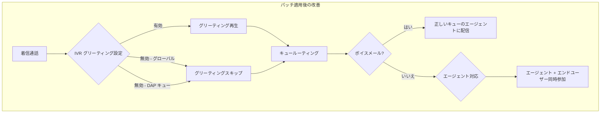

# Google Cloud Contact Center as a Service (CCaaS): 4.0 Patch

**リリース日**: 2026-02-25
**サービス**: Google Cloud Contact Center as a Service (CCAI Platform)
**機能**: CCaaS 4.0 パッチ (ボイスメールルーティング修正、IVR グリーティング無効化、同時通話参加)
**ステータス**: Announcement (Patch)

:bar_chart: [このアップデートのインフォグラフィックを見る](https://takech9203.github.io/google-cloud-news-summary/20260225-google-cloud-contact-center-as-a-service-ccaas-4-0-patch.html)

## 概要

Google Cloud Contact Center as a Service (CCaaS) 4.0 のパッチがリリースされた。CCaaS は Google Cloud 上にネイティブに構築された AI 駆動のコンタクトセンタープラットフォームであり、Gemini Enterprise for Customer Experience (CX) の一部として提供されている。音声およびデジタルチャネルにわたる顧客インタラクションのキューイングとルーティングを行うフルスタックのコンタクトセンターソリューションである。

今回のパッチでは、ボイスメールが意図されたキューに割り当てられていないエージェントにルーティングされる問題の修正、IVR グリーティングメッセージのグローバルレベルおよび Direct Access Point キューレベルでの無効化機能の追加、エージェントとエンドユーザーが同時に通話に参加できる機能の追加が含まれている。

このパッチは、CCaaS 4.0 を運用しているすべてのコンタクトセンター管理者およびオペレーターに影響がある。特に、ボイスメール機能を利用しているチームや、IVR フローのカスタマイズを必要としているチームにとって重要なアップデートとなる。

**アップデート前の課題**

CCaaS 4.0 の初回リリース (2026-02-17) 以降、以下の問題が存在していた。

- ボイスメールが、意図されたキューに割り当てられていないエージェントに誤ってルーティングされることがあった
- IVR グリーティングメッセージを無効化するオプションがなく、すべての着信に対してグリーティングが再生されていた (Direct Access Point キューを含む)
- エージェントとエンドユーザーが同時に通話に参加することができなかった

**アップデート後の改善**

今回のパッチにより以下の改善が実現された。

- ボイスメールが正しいキューに割り当てられたエージェントにのみルーティングされるようになった
- IVR グリーティングメッセージをグローバルレベルおよび Direct Access Point キューレベルで無効化できるようになった
- エージェントとエンドユーザーが同時に通話に参加できるようになり、より柔軟な通話フローが実現された

## アーキテクチャ図

この図は、パッチ適用後の通話フローを示している。IVR グリーティングの無効化オプション、正しいボイスメールルーティング、エージェントとエンドユーザーの同時通話参加の 3 つの改善ポイントが反映されている。

## サービスアップデートの詳細

### 主要機能

1. **ボイスメールルーティングの修正**
   - ボイスメールが意図されたキューに割り当てられていないエージェントにルーティングされる不具合を修正
   - ボイスメールは、キューに割り当てられたエージェントにのみ正しく配信されるようになった
   - IVR、モバイル、Web チャネルのボイスメール設定 (Settings > Queue > 各チャネル > Custom After Hours Deflection > Voicemail) に影響

2. **IVR グリーティングメッセージの無効化**
   - グローバルレベルでの IVR グリーティングメッセージの無効化が可能になった
   - Direct Access Point (DAP) キューレベルでもグリーティングメッセージを無効化できるようになった
   - DAP は、エンドユーザーを特定のキューに直接ルーティングするための機能であり、Support Phone Number DAP、User Segment DAP、API Response DAP、General DAP などの種類がある
   - グリーティングの無効化により、単一宛先のコールフローにおいて接続速度が向上する

3. **エージェントとエンドユーザーの同時通話参加**
   - エージェントとエンドユーザーが同時に通話に参加できるようになった
   - これにより、スーパーバイザーの介入やトレーニング目的でのモニタリングなど、より柔軟な通話フローが実現された

## 技術仕様

### Direct Access Point (DAP) の種類

| DAP タイプ | IVR | モバイル | Web | 説明 |
|-----------|-----|---------|-----|------|
| User Segment DAP | 対応 | 対応 | 対応 | CRM のユーザーセグメントデータに基づくルーティング |
| General DAP | 対応 | 対応 | 対応 | アプリや SDK 内に配置する汎用アクセスポイント |
| Support Phone Number DAP | 対応 | - | - | 電話番号に基づくキュールーティング |
| API Response DAP | 対応 | - | - | API レスポンスのキーバリューに基づくルーティング |
| Mobile App DAP | - | 対応 | - | モバイルアプリに基づくルーティング |

### インスタンスサイズ

| インスタンスサイズ | 最大エージェント数 |
|-------------------|-------------------|
| Small | 250 (最小 25) |
| Medium | 1,600 |
| Large | 3,800 |
| X-Large | 14,000 |
| 2X-Large | 38,000 |
| 3X-Large | 100,000 |

### IVR グリーティング設定

DAP 作成時のグリーティングメッセージ設定では、以下のオプションが利用可能である。

- **Text-to-Speech**: テキストを入力してメッセージを自動生成
- **カスタム録音ファイル**: 独自の音声ファイルをアップロード
- **グリーティングスキップ**: フィールドに `.` を入力するか、空のファイルをアップロードすることでスキップ可能 (今回のパッチで無効化オプションが追加)

## 設定方法

### 前提条件

1. Google Cloud CCaaS 4.0 がデプロイされていること
2. CCAI Platform ポータルへの管理者権限でのアクセス
3. IVR チャネルが有効化されていること

### 手順

#### ステップ 1: IVR グリーティングメッセージの無効化 (グローバルレベル)

CCAI Platform ポータルにログインし、Settings メニューから IVR グリーティングの設定を変更する。

#### ステップ 2: DAP キューレベルでのグリーティング無効化

1. CCAI Platform ポータルで **Settings > Queue** に移動
2. IVR (Interactive Voice Response) パネルの **Edit / View** をクリック
3. 対象のキューを選択
4. Access Point セクションで対象の DAP を選択
5. グリーティングメッセージを無効化

#### ステップ 3: ボイスメールルーティングの確認

パッチ適用後、ボイスメールが正しいキューのエージェントに配信されていることを確認する。テスト通話を行い、意図したキューのエージェントにボイスメールが届くことを検証することを推奨する。

## メリット

### ビジネス面

- **顧客対応品質の向上**: ボイスメールが正しいエージェントに配信されることで、顧客の問い合わせが適切なチームに迅速に届くようになった
- **通話接続時間の短縮**: IVR グリーティングを無効化できることで、Direct Access Point 経由の通話フローにおいてエンドユーザーの待ち時間を削減できる
- **柔軟な通話運用**: エージェントとエンドユーザーの同時参加により、通話のエスカレーションやトレーニングシナリオがよりスムーズに行える

### 技術面

- **ルーティング精度の改善**: ボイスメールのルーティングロジックが修正され、キュー割り当てに基づく正確な配信が実現された
- **きめ細かな IVR 制御**: グローバルレベルと DAP キューレベルの 2 段階でグリーティングメッセージを制御できるようになった
- **通話フローの拡張**: 同時通話参加機能により、3 者間通話やモニタリングなどの高度な通話フローパターンが利用可能になった

## デメリット・制約事項

### 制限事項

- パッチの適用タイミングは、インスタンスに設定されたデプロイメントスケジュールに依存する
- Non-production インスタンス (Trial, Sandbox, Dev) は本番トラフィックには使用できない

### 考慮すべき点

- IVR グリーティングを無効化する場合、エンドユーザーへの案内が省略されるため、単一宛先のシンプルなコールフロー以外では慎重に検討する必要がある
- ボイスメールルーティングの修正後、これまで誤ったエージェントに届いていたボイスメールの再確認が必要になる場合がある
- エージェントとエンドユーザーの同時通話参加機能の導入にあたり、通話録音やコンプライアンスの設定を確認することを推奨する

## ユースケース

### ユースケース 1: 単一宛先コールフローの高速化

**シナリオ**: 特定のサポート電話番号にかけてきた顧客を、IVR メニューを経由せずに直接担当キューに接続したい場合。

**実装例**:
1. Support Phone Number DAP を作成し、対象キューに紐付ける
2. DAP のグリーティングメッセージを無効化する
3. 顧客は電話をかけるとすぐにキューに入り、エージェントが対応可能になり次第接続される

**効果**: グリーティング再生の待ち時間がなくなり、顧客の接続体験が向上する。Google の公式ドキュメントでも、単一宛先のコールフローにおけるグリーティングスキップを推奨している。

### ユースケース 2: VIP 顧客向け専用キューのボイスメール運用

**シナリオ**: CRM の顧客セグメント情報に基づいて VIP 顧客を専用キューにルーティングし、営業時間外にはボイスメールを受け付ける運用を行っている場合。

**効果**: パッチ適用後、VIP キューに割り当てられた専任エージェントにのみボイスメールが配信されるようになり、一般キューのエージェントに誤配信されることがなくなる。

## 料金

CCaaS の料金は以下のいずれかの課金モデルに基づく (インスタンスごとに月額課金)。

| 課金モデル | 説明 |
|-----------|------|
| 同時エージェント数 (Concurrent agents) | 月間で同時にサインインしているエージェントロールのユーザーの最大数 |
| 指名エージェント数 (Named agents) | 月間でエージェントロールを持つインスタンス内のユーザーの最大数 |
| 使用分数 (Minutes used) | エージェントロールのユーザーがサインインしている分数 |

テレフォニー料金は使用量に応じて別途課金される。Non-production インスタンス (Trial, Sandbox, Dev) はテレフォニー以外無料で利用可能。詳細な料金については Google Cloud アカウントチームまたは認定パートナーに問い合わせが必要。

## 利用可能リージョン

CCAI Platform が利用可能な国および Google Cloud リージョンの一覧は、[ロケーションページ](https://cloud.google.com/contact-center/ccai-platform/docs/localities)を参照。

## 関連サービス・機能

- **Dialogflow CX**: 高度なバーチャルエージェントを作成し、ルーティンインタラクションを処理する。CCaaS と連携して IVR フローからのシームレスなエスカレーションを実現する
- **Customer Experience Insights**: 自然言語処理を使用して、通話ドライバー、センチメント、頻出質問などの顧客インタラクション情報を分析する
- **Agent Assist**: 顧客の意図を識別し、エージェントの通話およびチャット中にリアルタイムでステップバイステップのアシスタンスを提供する
- **Cloud Logging**: CCaaS のログデータとイベントをキャプチャし、Logs Explorer で確認できる (CCaaS 3.43 で GA)
- **Salesforce Service Cloud 連携**: CRM 統合により顧客レコードの検索やフィールドマッピングが可能 (CCaaS 4.0 でセカンダリルックアップオブジェクトが追加)

## 参考リンク

- :bar_chart: [インフォグラフィック](https://takech9203.github.io/google-cloud-news-summary/20260225-google-cloud-contact-center-as-a-service-ccaas-4-0-patch.html)
- [公式リリースノート](https://cloud.google.com/release-notes#February_25_2026)
- [CCAI Platform リリースノート](https://cloud.google.com/contact-center/ccai-platform/docs/release-notes)
- [CCAI Platform ドキュメント](https://cloud.google.com/contact-center/ccai-platform/docs)
- [IVR メッセージの設定](https://cloud.google.com/contact-center/ccai-platform/docs/customizing_languages_recordings_messages)
- [Direct Access Point の設定](https://cloud.google.com/contact-center/ccai-platform/docs/dap)
- [キューとメニューの設定](https://cloud.google.com/contact-center/ccai-platform/docs/Queue_and_Menu_Setup)
- [デプロイメントスケジュール](https://cloud.google.com/contact-center/ccai-platform/docs/deployment-schedules)
- [FIFO キュールーティング](https://cloud.google.com/contact-center/ccai-platform/docs/fifo-queue-routing)
- [利用可能ロケーション](https://cloud.google.com/contact-center/ccai-platform/docs/localities)

## まとめ

Google Cloud CCaaS 4.0 パッチは、ボイスメールルーティングの不具合修正、IVR グリーティングメッセージの無効化オプション追加、エージェントとエンドユーザーの同時通話参加機能の 3 点を含む重要な改善である。CCaaS を運用しているコンタクトセンター管理者は、パッチ適用後にボイスメールのルーティング動作を確認し、必要に応じて IVR グリーティング設定を見直すことを推奨する。特に Direct Access Point を活用した単一宛先のコールフローでは、グリーティング無効化により接続時間の短縮が期待できる。

---

**タグ**: #GoogleCloud #CCaaS #CCAI #ContactCenter #IVR #VoIP #CustomerExperience #Patch
