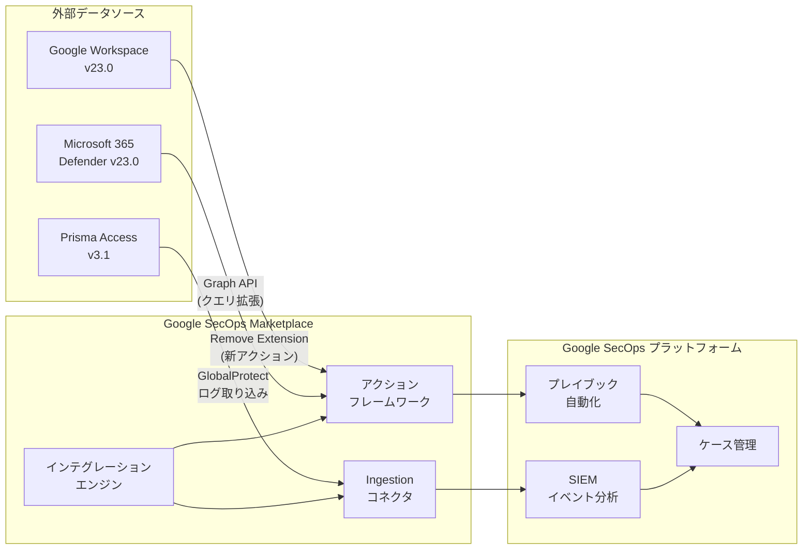

# Google SecOps Marketplace: インテグレーションアップデート (Google Workspace, Microsoft 365 Defender, Prisma Access)

**リリース日**: 2026-02-25
**サービス**: Google SecOps Marketplace
**機能**: インテグレーション更新 (Google Workspace v23.0, Microsoft 365 Defender v23.0, Prisma Access v3.1)
**ステータス**: Feature / Change

[このアップデートのインフォグラフィックを見る](https://takech9203.github.io/google-cloud-news-summary/20260225-google-secops-marketplace.html)

## 概要

Google SecOps (旧 Chronicle SOAR) の Marketplace において、2026 年 2 月 25 日付けで複数のインテグレーションがアップデートされた。Google Workspace (v23.0) では新しいアクション「Remove Extension」が追加され、Microsoft 365 Defender (v23.0) では Graph API のサポートが拡充された。また、Prisma Access (v3.1) では Ingestion コネクタにおいて GlobalProtect Integration ログの取り込みがサポートされた。

これらのアップデートにより、SOC チームはより広範なデータソースからのログ収集と、より柔軟なインシデント対応アクションが利用可能になる。Google SecOps Marketplace のインテグレーションは、セキュリティ運用の自動化とオーケストレーションを強化するための重要なコンポーネントであり、今回のアップデートはマルチベンダー環境でのセキュリティ運用を効率化するものである。

**アップデート前の課題**

- Google Workspace インテグレーションでは、ブラウザ拡張機能の管理に関するアクションが不足しており、不正な拡張機能の削除を自動化できなかった
- Microsoft 365 Defender インテグレーションでは、一部のクエリアクションが旧 API に依存しており、最新の Microsoft Graph API の機能を活用できなかった
- Prisma Access インテグレーションでは、GlobalProtect 関連のログを Ingestion コネクタで直接取り込む手段がなく、VPN 接続イベントの可視性が制限されていた

**アップデート後の改善**

- Google Workspace v23.0 の「Remove Extension」アクションにより、プレイブックを通じたブラウザ拡張機能の自動削除が可能になった
- Microsoft 365 Defender v23.0 で Graph API サポートが追加され、Execute Query / Execute Custom Query / Execute Entity Query アクションでより高度なクエリが実行可能になった
- Prisma Access v3.1 で GlobalProtect Integration ログが Ingestion コネクタに対応し、VPN 接続イベントの包括的な取り込みが可能になった

## アーキテクチャ図



Google SecOps Marketplace を介して外部セキュリティ製品と連携し、アクション (対応操作) と Ingestion コネクタ (データ取り込み) の両面でセキュリティ運用を自動化する構成を示している。

## サービスアップデートの詳細

### 主要機能

1. **Google Workspace: Version 23.0 - Remove Extension アクション**
   - 新しいアクション「Remove Extension」が追加された
   - プレイブック内でブラウザ拡張機能の削除を自動化できる
   - インシデント対応ワークフローの一部として、不正または脆弱な拡張機能を検出した際の自動修復に活用可能
   - Google SecOps の User エンティティに対して実行可能と想定される

2. **Microsoft 365 Defender: Version 23.0 - Graph API サポート拡充**
   - 以下のアクションに Graph API サポートが追加された:
     - **Execute Query**: 標準的なクエリ実行
     - **Execute Custom Query**: カスタムクエリの実行
     - **Execute Entity Query**: エンティティベースのクエリ実行
   - Microsoft Graph API を活用することで、Azure AD サインインイベントを含む幅広いデータへのアクセスが可能になった
   - 従来の API と比較して、より豊富なデータフィールドとフィルタリングオプションを利用可能

3. **Prisma Access: Version 3.1 - GlobalProtect Integration ログサポート**
   - Ingestion コネクタにおいて GlobalProtect Integration ログの取り込みに対応
   - Palo Alto Networks の GlobalProtect VPN 経由のリモートアクセスイベントを Google SecOps に取り込み可能
   - VPN 接続 / 切断、認証イベント、ネットワークアクセスパターンなどのログを一元管理

## 技術仕様

### インテグレーションバージョン一覧

| インテグレーション | バージョン | 更新タイプ | 主な変更内容 |
|---------------------|-----------|-----------|-------------|
| Google Workspace | 23.0 | Feature | 新アクション「Remove Extension」追加 |
| Microsoft 365 Defender | 23.0 | Change | Graph API サポート追加 (Query 系アクション) |
| Prisma Access | 3.1 | Change | GlobalProtect Integration ログの Ingestion サポート |
| Google Chronicle | 77.0 | Change | Workload Identity 認証のエラーハンドリング改善 |

### Microsoft 365 Defender 連携パラメータ

Microsoft 365 Defender インテグレーションの設定に必要な主要パラメータは以下の通り。

| パラメータ | 説明 |
|-----------|------|
| Login API Root | Microsoft 365 Defender の Login API ルート (デフォルト: `https://login.microsoftonline.com`) |
| Graph API Root | Microsoft Graph サービスの API ルート (デフォルト: `https://graph.microsoft.com`) |
| API Root | Microsoft 365 Defender の API ルート (デフォルト: `https://api.security.microsoft.com`) |
| Tenant ID | Microsoft Entra ID のテナント ID |
| Client ID | Microsoft Entra ID アプリケーションのクライアント ID |
| Client Secret | Microsoft Entra ID アプリケーションのクライアントシークレット |

### Google Workspace 連携の前提条件

Google Workspace インテグレーションを利用するには、以下の準備が必要である。

1. サービスアカウントの作成
2. ドメイン全体の委任権限の設定
3. Admin SDK API の有効化
4. 適切な IAM ロールの付与

## 設定方法

### 前提条件

1. Google SecOps のライセンス (Standard / Enterprise / Enterprise Plus のいずれか)
2. 各連携先サービスの管理者権限
3. Google SecOps Marketplace へのアクセス権限

### 手順

#### ステップ 1: インテグレーションのアップグレード

Google SecOps コンソールから Marketplace にアクセスし、対象のインテグレーションをアップグレードする。

```
Google SecOps コンソール > Marketplace > Integrations
> 対象インテグレーションを検索
> "Upgrade to [バージョン]" をクリック
```

#### ステップ 2: コネクタの更新 (Prisma Access の場合)

インテグレーションのアップグレード後、Ingestion コネクタの設定を更新する。

```
Google SecOps コンソール > Settings > Ingestion > Connectors
> Prisma Access コネクタを選択
> "Update" をクリック
> GlobalProtect Integration ログの取り込み設定を確認
```

#### ステップ 3: プレイブックへの組み込み (Google Workspace の場合)

新しい「Remove Extension」アクションをプレイブックに追加する。

```
Google SecOps コンソール > Playbooks
> 既存のプレイブックを編集、または新規作成
> アクション追加 > Google Workspace > Remove Extension
> パラメータを設定して保存
```

## メリット

### ビジネス面

- **SOC 運用効率の向上**: 不正ブラウザ拡張機能の検出から削除までを自動化することで、アナリストの手動対応時間を短縮できる
- **マルチクラウド環境の可視性強化**: Microsoft 365 環境と Palo Alto Networks 環境からのデータ取り込みが強化され、ハイブリッド/マルチクラウド環境全体のセキュリティ状況を把握しやすくなる
- **コンプライアンス対応の強化**: VPN 接続ログの一元管理により、リモートアクセスに関する監査要件への対応が容易になる

### 技術面

- **Graph API 対応による拡張性**: Microsoft Graph API を活用することで、Azure AD サインインイベント、条件付きアクセスポリシー、リスクイベントなど、より豊富なデータにアクセス可能
- **ログ取り込みの包括性向上**: GlobalProtect ログの取り込みにより、VPN を経由したリモートアクセスの通信パターンを SIEM で分析可能
- **プレイブック自動化の拡充**: Remove Extension アクションにより、エンドポイントセキュリティに関するインシデントレスポンスの自動化範囲が拡大

## デメリット・制約事項

### 制限事項

- インテグレーションのアップグレード時に Ontology マッピングの上書きまたは保持を選択する必要があり、カスタムマッピングを事前にバックアップすることが推奨される
- Microsoft 365 Defender インテグレーションの API パーミッション変更後は、クライアントシークレットの再生成と Google SecOps での認証情報の更新が必要
- Prisma Access の GlobalProtect ログ取り込みの対応ログフォーマットの詳細は公式ドキュメントの更新を確認する必要がある

### 考慮すべき点

- 既存のコネクタ設定がある場合、インテグレーションのアップグレード後にコネクタの手動更新が必要
- Graph API への移行に伴い、既存のクエリの動作が変わる可能性があるため、アップグレード前にテスト環境での検証を推奨
- Prisma Access のログ量が大量の場合、Google SecOps の Ingestion ボリュームへの影響を事前に見積もること

## ユースケース

### ユースケース 1: 不正ブラウザ拡張機能の自動修復

**シナリオ**: SOC チームが Google Workspace 環境でユーザーのブラウザに不正な拡張機能がインストールされていることを検出した場合、自動的に対応するプレイブックを構築する。

**実装例**:
```
プレイブックフロー:
1. トリガー: 不審な拡張機能インストールイベントを検出
2. エンリッチメント: 拡張機能の脅威インテリジェンスを確認
3. 判定: 既知の悪意ある拡張機能リストと照合
4. アクション: Google Workspace > Remove Extension を実行
5. 通知: ユーザーとセキュリティチームに修復完了を通知
```

**効果**: 手動対応では数時間かかる拡張機能の調査・削除プロセスを数分に短縮し、マルウェア感染の拡大を防止する。

### ユースケース 2: VPN アクセス異常の検出と調査

**シナリオ**: Prisma Access の GlobalProtect ログを Google SecOps に取り込み、異常な VPN 接続パターンを検出して自動調査を行う。

**実装例**:
```
検出ルール (YARA-L):
- 通常と異なる地理的ロケーションからの VPN 接続
- 短時間での複数国からのアクセス (impossible travel)
- 営業時間外の大量データ転送

プレイブック:
1. トリガー: 異常 VPN 接続アラート
2. エンリッチメント: Microsoft 365 Defender で Azure AD サインインイベントを照合
3. 調査: ユーザーの直近のアクティビティを確認
4. 対応: リスクレベルに応じたアクション実行
```

**効果**: マルチベンダーのログを統合分析することで、VPN 経由の不正アクセスを早期に検出し、インシデント対応時間を短縮する。

## 料金

Google SecOps はクレジットベースのサブスクリプションモデルを採用している。Marketplace のインテグレーション利用自体に追加料金は発生しないが、Ingestion コネクタ経由のデータ取り込み量がサブスクリプションのクレジット消費に影響する。

| パッケージ | 特徴 |
|-----------|------|
| Standard | 基本的な SIEM / SOAR 機能 |
| Enterprise | 高度な脅威検出とインシデント対応 |
| Enterprise Plus | 完全な機能セットと優先サポート |

詳細な料金情報については [Google SecOps の料金ページ](https://cloud.google.com/chronicle/pricing) を参照すること。

## 利用可能リージョン

Google SecOps はリージョン固有の SKU を使用しており、データレジデンシー要件に対応している。利用可能なリージョンの詳細については [Google SecOps のドキュメント](https://cloud.google.com/chronicle/docs/onboard/understand-billing) を参照すること。

## 関連サービス・機能

- **Google SecOps SIEM**: ログの取り込み、正規化、分析を行う SIEM 基盤。Marketplace インテグレーション経由のデータは UDM 形式に変換されて格納される
- **Google SecOps SOAR**: プレイブック、オーケストレーション、自動化を担うコンポーネント。Marketplace のアクションはプレイブック内で使用される
- **Google Chronicle**: Google SecOps のコア分析エンジン。今回のアップデートでは v77.0 として Workload Identity 認証のエラーハンドリングも改善されている
- **VPC Service Controls**: 2026 年 2 月 25 日同日に Preview として Google SecOps の VPC Service Controls サポートが発表されている

## 参考リンク

- [インフォグラフィック](https://takech9203.github.io/google-cloud-news-summary/20260225-google-secops-marketplace.html)
- [公式リリースノート (SecOps Marketplace)](https://cloud.google.com/release-notes#February_25_2026)
- [SecOps Marketplace インテグレーション リリースノート](https://docs.cloud.google.com/chronicle/docs/soar/marketplace-integrations/release-notes)
- [Google Workspace インテグレーション ドキュメント](https://docs.cloud.google.com/chronicle/docs/soar/marketplace-integrations/google-workspace)
- [Microsoft 365 Defender インテグレーション ドキュメント](https://docs.cloud.google.com/chronicle/docs/soar/marketplace-integrations/microsoft-365-defender)
- [Marketplace の使用方法](https://docs.cloud.google.com/chronicle/docs/soar/marketplace/using-the-marketplace)
- [コネクタの設定方法](https://docs.cloud.google.com/chronicle/docs/soar/ingest/connectors/ingest-your-data-connectors)
- [Google SecOps 料金](https://cloud.google.com/chronicle/pricing)

## まとめ

今回の Google SecOps Marketplace アップデートは、Google Workspace、Microsoft 365 Defender、Prisma Access の 3 つのインテグレーションを強化するものである。SOC チームは新しい Remove Extension アクションを活用したブラウザセキュリティの自動化、Graph API によるより柔軟な Microsoft 環境のクエリ、GlobalProtect ログの包括的な取り込みにより、マルチベンダー環境でのセキュリティ運用をさらに効率化できる。既存のインテグレーションを利用中の場合は、Marketplace からアップグレードを実行し、コネクタ設定の更新を忘れずに行うことを推奨する。

---

**タグ**: #GoogleSecOps #Marketplace #SOAR #GoogleWorkspace #Microsoft365Defender #PrismaAccess #GlobalProtect #セキュリティ運用 #インテグレーション #SIEM
