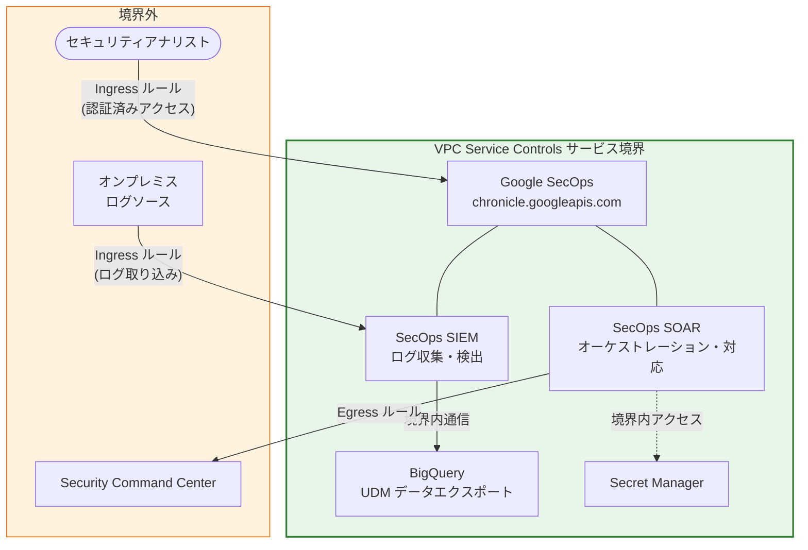

# Google SecOps: VPC Service Controls サポート (Preview)

**リリース日**: 2026-02-25
**サービス**: Google SecOps (Google Security Operations)
**機能**: VPC Service Controls 統合
**ステータス**: Preview

[このアップデートのインフォグラフィックを見る](https://takech9203.github.io/google-cloud-news-summary/20260225-google-secops-vpc-service-controls.html)

## 概要

Google SecOps (Google Security Operations) が Google Cloud VPC Service Controls との統合をサポートしました。この機能は現在 Preview ステージで提供されています。VPC Service Controls は、Google Cloud のリソースに対するサービス境界を設定し、意図しないデータ流出や標的型のデータ漏洩から保護するためのセキュリティ機能です。

今回のアップデートにより、Google SecOps の SIEM および SOAR 環境を VPC Service Controls のサービス境界内に配置し、データの入出力を厳密に制御できるようになりました。これにより、セキュリティオペレーションで扱う機密性の高いテレメトリデータやインシデント情報が、許可されたネットワーク境界の外部に流出するリスクを大幅に低減できます。

この機能は、規制対応が求められる金融機関、医療機関、政府機関などの組織、およびゼロトラストセキュリティを推進する企業のセキュリティチームを主な対象としています。VPC-SC の Pre-GA Offerings Terms の適用を受けるため、本番環境での完全なサポートは今後の GA リリースで提供される予定です。

**アップデート前の課題**

以前は、Google SecOps と VPC Service Controls の統合がサポートされておらず、以下の課題がありました。

- Google SecOps で処理されるセキュリティテレメトリデータに対して、VPC Service Controls によるネットワークレベルのデータ流出防止策を適用できなかった
- セキュリティオペレーションで扱うログデータやアラート情報を、Google Cloud のサービス境界内に隔離する手段がなかった
- 規制産業の顧客が求めるデータ境界要件を Google SecOps 環境だけでは満たすことが困難だった

**アップデート後の改善**

今回のアップデートにより、以下の改善が実現しました。

- Google SecOps の `chronicle.googleapis.com` および `chronicleservicemanager.googleapis.com` API を VPC Service Controls のサービス境界で保護できるようになった
- Ingress/Egress ルールを設定することで、SIEM、SOAR、Security Command Center 連携のデータフローを厳密に制御できるようになった
- CMEK (顧客管理暗号鍵) との組み合わせにより、暗号化とネットワーク境界の両面からデータを保護できるようになった

## アーキテクチャ図



VPC Service Controls のサービス境界により、Google SecOps の SIEM/SOAR コンポーネントが保護され、外部との通信は Ingress/Egress ルールで制御されます。

## サービスアップデートの詳細

### 主要機能

1. **VPC Service Controls によるサービス境界保護**
   - Google SecOps の API (`chronicle.googleapis.com`, `chronicleservicemanager.googleapis.com`) をサービス境界で保護
   - サービス境界内のリソースと外部との通信を Ingress/Egress ルールで制御
   - Dry-run モードでの事前検証により、本番適用前に違反を検出可能

2. **SIEM 向け VPC-SC 構成**
   - ログデータ取り込み用の Egress ルール設定 (Pub/Sub 経由)
   - Google 内部プロジェクト (`malachite-oob`) へのデータ転送をルールで制御
   - BigQuery へのセルフマネージドプロジェクトまたは Advanced BigQuery Export によるデータエクスポートをサポート

3. **SOAR 向け VPC-SC 構成**
   - Secret Manager、Binary Authorization、Monitoring サービスへのアクセスを Ingress ルールで制御
   - SOAR プロビジョニングサービスアカウント (`chronicle-soar-provisioning-service@system.gserviceaccount.com`) による Egress 通信を制御
   - Security Command Center 連携時の Pub/Sub および SecurityCenter API へのアクセスルール設定

## 技術仕様

### サポートされる API と認証方式

| 項目 | 詳細 |
|------|------|
| サービス名 | `chronicle.googleapis.com`, `chronicleservicemanager.googleapis.com` |
| ステータス | Preview |
| 認証方式 | Google Cloud Identity、BYOID (Bring Your Own Identity)、Workforce Identity Federation |
| 前提条件 | Feature RBAC の有効化が必須 |
| 制限付き VIP | サポート対象 |

### サポートされるデータエクスポート方式

| エクスポート方式 | VPC-SC 保護 |
|-----------------|-------------|
| セルフマネージド BigQuery プロジェクト | 対応 |
| Advanced BigQuery Export | 対応 |
| その他のエクスポート方式 | 非対応 (特別ルールが必要) |

### SOAR 向け Ingress ルール設定例

```yaml
# Secret Manager へのアクセスを許可
- ingressFrom:
    identityType: ANY_SERVICE_ACCOUNT
    sources:
    - accessLevel: "*"
  ingressTo:
    operations:
    - serviceName: secretmanager.googleapis.com
      methodSelectors:
      - method: "*"
    resources:
    - projects/PROJECT_NUMBER

# SOAR プロビジョニングサービス用
- ingressFrom:
    identities:
    - serviceAccount: chronicle-soar-provisioning-service@system.gserviceaccount.com
    sources:
    - accessLevel: "*"
  ingressTo:
    operations:
    - serviceName: binaryauthorization.googleapis.com
      methodSelectors:
      - method: "*"
    - serviceName: monitoring.googleapis.com
      methodSelectors:
      - method: "*"
    resources:
    - projects/PROJECT_NUMBER
```

### SIEM 向け Egress ルール設定例

```yaml
- egressTo:
    operations:
    - serviceName: pubsub.googleapis.com
      methodSelectors:
      - method: "*"
    resources:
    - projects/389186463911
  egressFrom:
    identities:
    - user: "*"
    sources:
    - resource: PROJECT_NUMBER
```

## 設定方法

### 前提条件

1. VPC Service Controls を設定するための組織レベルの IAM ロール (`roles/accesscontextmanager.policyAdmin` など) を持つこと
2. Google SecOps の Feature RBAC が有効化されていること
3. Google Cloud Identity、BYOID、または Workforce Identity Federation のいずれかの認証方式を使用していること

### 手順

#### ステップ 1: サービス境界の作成

```bash
# VPC Service Controls サービス境界を作成
gcloud access-context-manager perimeters create PERIMETER_NAME \
    --title="SecOps Perimeter" \
    --resources="projects/PROJECT_NUMBER" \
    --restricted-services="chronicle.googleapis.com,chronicleservicemanager.googleapis.com" \
    --policy=POLICY_ID
```

Google SecOps プロジェクトを含むサービス境界を作成し、`chronicle.googleapis.com` と `chronicleservicemanager.googleapis.com` を制限対象サービスとして指定します。

#### ステップ 2: Ingress/Egress ルールの設定

```bash
# Dry-run モードでの検証を推奨
gcloud access-context-manager perimeters dry-run create PERIMETER_NAME \
    --resources="projects/PROJECT_NUMBER" \
    --restricted-services="chronicle.googleapis.com,chronicleservicemanager.googleapis.com" \
    --ingress-policies=ingress.yaml \
    --egress-policies=egress.yaml \
    --policy=POLICY_ID
```

Ingress/Egress ルールを YAML ファイルで定義し、まず Dry-run モードで適用します。Cloud Audit Logs で違反がないことを数週間確認してから、Enforced モードに移行することが推奨されています。

#### ステップ 3: 違反の確認と移行

```bash
# Cloud Audit Logs で VPC-SC 違反を確認
gcloud logging read 'protoPayload.metadata.@type="type.googleapis.com/google.cloud.audit.VpcServiceControlAuditMetadata"' \
    --project=PROJECT_ID \
    --limit=50
```

Dry-run モードで検出された違反を確認し、必要に応じて Ingress/Egress ルールを調整します。

## メリット

### ビジネス面

- **コンプライアンス強化**: 金融規制 (PCI DSS、SOX) や医療規制 (HIPAA) などで求められるデータ境界要件を、Google SecOps 環境で満たすことが可能になる
- **データガバナンス向上**: セキュリティオペレーションで扱う機密データの流出リスクを大幅に低減し、組織のデータガバナンス戦略を強化できる
- **セキュリティ投資の最大化**: 既存の VPC Service Controls インフラストラクチャを Google SecOps にも拡張でき、追加のセキュリティツール導入が不要

### 技術面

- **ネットワークレベルの防御**: API レベルのアクセス制御に加え、ネットワーク境界によるデータ流出防止を実現
- **きめ細かなアクセス制御**: Ingress/Egress ルールにより、サービスアカウント、ユーザー、プロジェクト単位で通信を制御可能
- **Dry-run モードによる安全な導入**: 本番環境に影響を与えずに設定を検証でき、段階的な導入が可能

## デメリット・制約事項

### 制限事項

- VPC Service Controls で保護されるのは `chronicle.googleapis.com` と `chronicleservicemanager.googleapis.com` の 2 つの API のみ。他の Google SecOps API は保護対象外
- Cloud Monitoring による SecOps のヘルスメトリクス監視は VPC-SC の保護対象外
- Looker ダッシュボードは VPC-SC 非対応。Google SecOps ネイティブダッシュボードのみ対応
- Xenon フィードは非対応。`GOOGLE_CLOUD_STORAGE_V2` ソースタイプの Cloud Storage フィードを使用する必要がある
- Security Validation (攻撃シミュレーション) は VPC-SC 非対応
- DataTap は VPC-SC 非対応

### 考慮すべき点

- 現在 Preview ステージのため、本番環境での完全なサポートは提供されていない。Pre-GA Offerings Terms が適用される
- CMEK を異なるプロジェクトで管理している場合、追加の Egress ルール設定が必要
- 既存の Google SecOps 環境への適用時は、Dry-run モードで数週間のテストが推奨されている
- Feature RBAC が有効化されていない場合、まず RBAC の設定を完了する必要がある

## ユースケース

### ユースケース 1: 金融機関のセキュリティオペレーション保護

**シナリオ**: 金融機関が Google SecOps を使用してセキュリティ監視を行っており、PCI DSS や SOX 規制に準拠するためにデータ境界の設定が求められている。

**実装例**:
```yaml
# 金融機関向け: 社内ネットワークからのみ SecOps へのアクセスを許可
- ingressFrom:
    identityType: ANY_IDENTITY
    sources:
    - accessLevel: accessPolicies/POLICY_ID/accessLevels/corp-network
  ingressTo:
    operations:
    - serviceName: chronicle.googleapis.com
      methodSelectors:
      - method: "*"
    resources:
    - projects/PROJECT_NUMBER
```

**効果**: セキュリティテレメトリデータが VPC Service Controls の境界内に隔離され、許可されたネットワークからのみアクセス可能になる。規制監査時にデータ境界の証跡を提示できる。

### ユースケース 2: マルチクラウド環境でのデータ流出防止

**シナリオ**: 企業がマルチクラウド環境で Google SecOps を運用しており、オンプレミスや他クラウドからのログ収集時にデータの意図しない流出を防止したい。

**効果**: Ingress/Egress ルールにより、ログソースからのデータ取り込みと BigQuery へのエクスポートのみが許可され、それ以外の経路でのデータ流出が防止される。特に SOAR による自動対応プレイブック実行時の外部サービス連携も制御下に置かれる。

## 料金

Google SecOps はサブスクリプションベースの課金モデルを採用しています。パッケージは Standard、Enterprise、Enterprise Plus の 3 種類があり、データ取り込み量に基づくクレジットベースの課金が行われます。

VPC Service Controls 自体の利用に追加料金はかかりません。ただし、VPC Service Controls はデータの流入出を制御する機能であり、Google SecOps のサブスクリプション料金とは別に、関連する Google Cloud サービス (BigQuery、Pub/Sub、Secret Manager 等) の利用料金が発生する場合があります。

詳細な料金体系については、[Google SecOps 課金コンポーネントのドキュメント](https://cloud.google.com/chronicle/docs/onboard/understand-billing) を参照してください。

## 利用可能リージョン

Google SecOps はリージョン固有の SKU を使用しており、データ所在地要件に対応しています。VPC Service Controls の利用可能リージョンについては、[VPC Service Controls のドキュメント](https://cloud.google.com/vpc-service-controls/docs/overview) を参照してください。

## 関連サービス・機能

- **[VPC Service Controls](https://cloud.google.com/vpc-service-controls/docs/overview)**: Google Cloud リソースに対するサービス境界を設定し、データ流出を防止するセキュリティ機能。本アップデートの基盤となるサービス
- **[Security Command Center](https://cloud.google.com/security-command-center/docs)**: Google SecOps SOAR と連携して脅威検出結果を取り込む。VPC-SC 環境下では専用の Ingress/Egress ルール設定が必要
- **[Cloud KMS (CMEK)](https://cloud.google.com/kms/docs/cmek)**: 顧客管理暗号鍵による暗号化。VPC-SC と組み合わせることで、暗号化とネットワーク境界の両面からデータを保護
- **[Access Context Manager](https://cloud.google.com/access-context-manager/docs/overview)**: アクセスポリシーとアクセスレベルを管理し、VPC Service Controls の制御を補完
- **[Cloud Audit Logs](https://cloud.google.com/logging/docs/audit)**: VPC-SC の Dry-run モードや Enforced モードでの違反ログを記録し、設定の検証に使用

## 参考リンク

- [インフォグラフィック](https://takech9203.github.io/google-cloud-news-summary/20260225-google-secops-vpc-service-controls.html)
- [公式リリースノート](https://cloud.google.com/release-notes#February_25_2026)
- [VPC Service Controls for Google Security Operations ドキュメント](https://cloud.google.com/chronicle/docs/secops/vpcsc-for-secops)
- [VPC Service Controls 対応プロダクト一覧](https://cloud.google.com/vpc-service-controls/docs/supported-products)
- [VPC Service Controls 概要](https://cloud.google.com/vpc-service-controls/docs/overview)
- [Google SecOps 課金コンポーネント](https://cloud.google.com/chronicle/docs/onboard/understand-billing)
- [Google SecOps プラットフォーム概要](https://cloud.google.com/chronicle/docs/secops/secops-overview)

## まとめ

Google SecOps の VPC Service Controls サポートは、セキュリティオペレーション環境におけるデータ流出防止の重要な強化です。特に規制産業の顧客にとって、セキュリティ監視基盤そのものをネットワーク境界で保護できることは、コンプライアンス要件の充足に直結します。現在は Preview ステージのため、まず Dry-run モードで検証を開始し、GA リリース時に本番環境へのスムーズな移行を計画することを推奨します。

---

**タグ**: #GoogleSecOps #VPCServiceControls #セキュリティ #SIEM #SOAR #データ流出防止 #コンプライアンス #Preview #GoogleCloud
