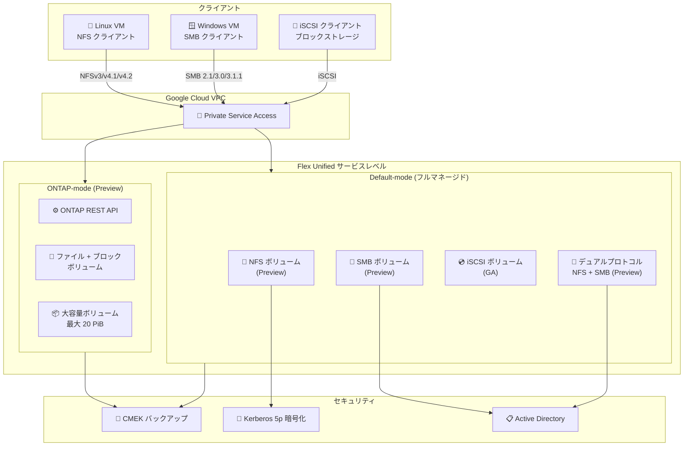

# NetApp Volumes: Flex Unified File サービスレベル NFS/SMB 対応 (Preview)

**リリース日**: 2026-02-25
**サービス**: Google Cloud NetApp Volumes
**機能**: Flex Unified File サービスレベル NFS/SMB プロトコル対応、ONTAP-mode、大容量ボリューム、CMEK バックアップ
**ステータス**: Preview (NFS/SMB)、GA (iSCSI、CMEK バックアップ)

📊 [このアップデートのインフォグラフィックを見る](https://takech9203.github.io/google-cloud-news-summary/20260225-netapp-volumes-flex-unified-service.html)

## 概要

Google Cloud NetApp Volumes の Flex Unified サービスレベルが、NFS および SMB プロトコルを Preview で正式にサポートした。これまで Flex Unified サービスレベルの Default-mode では iSCSI のみが GA で利用可能であったが、今回のアップデートにより、ファイルストレージプロトコル (NFS/SMB) にも対応し、統合的なブロック・ファイルストレージプラットフォームとしての機能が大幅に拡張された。

同時に、ONTAP-mode と呼ばれる新しい運用モードが Preview で提供開始され、基盤となる ONTAP クラスターへの直接 API アクセスが可能になった。さらに、大容量ボリューム (最大 20 PiB) のサポート、CMEK バックアップ暗号化の GA 昇格 (Standard/Premium/Extreme) および Preview (Flex Unified) など、エンタープライズ向けの複数機能が一斉にリリースされた。

本アップデートは、オンプレミスの NetApp ストレージを Google Cloud に移行する企業、マルチプロトコル (NFS/SMB/iSCSI) を単一プラットフォームで統合管理したい組織、および大規模データセットを扱うワークロードを持つユーザーを主な対象としている。

**アップデート前の課題**

- Flex Unified サービスレベルの Default-mode では iSCSI プロトコルのみが GA であり、NFS/SMB でファイルストレージを利用するには営業担当への問い合わせが必要だった
- ONTAP の高度な機能 (SVM 管理、カスタムスナップショット、詳細なプロトコル設定等) を利用するには、他のサービスレベルや外部ソリューションに依存する必要があった
- 大規模データセット (数 PiB 規模) を Flex Unified で扱う場合、ストレージプール容量やスループットに制限があった
- Standard/Premium/Extreme サービスレベルの CMEK バックアップ暗号化が限定的な GA (allow-listed) であった

**アップデート後の改善**

- Flex Unified サービスレベルで NFS (NFSv3, NFSv4.1, NFSv4.2) および SMB (2.1, 3.0, 3.1.1) プロトコルが Preview として利用可能になり、ファイル・ブロック統合ストレージが実現した
- ONTAP-mode により、ONTAP クラスターへの直接 REST API アクセスが可能となり、SVM、ボリューム、プロトコル、スナップショットなどを細かく制御できるようになった
- 大容量ボリューム (最大 20 PiB、22 GiBps スループット、750,000 IOPS) が Preview で利用可能になり、大規模ワークロードへの対応力が向上した
- CMEK バックアップ暗号化が Standard/Premium/Extreme で GA に昇格し、Flex Unified でも Preview として利用可能になった

## アーキテクチャ図



Flex Unified サービスレベルのアーキテクチャ。Default-mode ではフルマネージドの NFS/SMB/iSCSI ボリュームを提供し、ONTAP-mode では ONTAP REST API による高度な管理が可能。Private Service Access を通じてクライアント VPC から安全にアクセスする構成となっている。

## サービスアップデートの詳細

### 主要機能

1. **Flex Unified File サービスレベル NFS/SMB 対応 (Preview)**
   - NFS プロトコル: NFSv3、NFSv4.1、NFSv4.2 をサポート
   - SMB プロトコル: SMB 2.1、3.0、3.1.1 をサポート
   - デュアルプロトコル (NFS + SMB): 同一ボリュームで NFS と SMB の同時利用が Preview で可能
   - Kerberos 認証: krb5、krb5i、krb5p (プライバシー暗号化) をサポート
   - NFSv4.1 セキュリティ識別子 (SID)、数値 ID、ACL をサポート
   - SMB3 暗号化、アクセスベースの列挙 (ABE)、継続的可用性共有 (SQL Server、FSLogix 向け) をサポート

2. **ONTAP-mode (Preview)**
   - Flex Unified プールの新しい運用モード
   - 基盤となる ONTAP クラスターへの直接 REST API アクセスを提供
   - ファイルボリュームとブロックボリュームの両方をサポート
   - SVM (Storage Virtual Machine)、ボリューム、プロトコル、スナップショットの詳細管理が可能
   - 最大 1,023 スナップショット/ボリューム (Default-mode は最大 255)
   - カスタムレプリケーションスケジュールの設定が可能
   - SMB ワークグループモードをサポート (Default-mode はドメインモードのみ)

3. **Flex Unified 大容量ボリューム (Preview)**
   - NFS および SMB プロトコル対応のファイル専用大容量ボリューム
   - ストレージプール容量: 最大 2.5 PiB (Auto-tiering 無効時)、最大 20 PiB (Auto-tiering 有効時)
   - ボリューム容量: 4.8 TiB -- 2.5 PiB (Auto-tiering 無効時)、最大 20 PiB (Auto-tiering 有効時)
   - 最大 22 GiBps スループット、750,000 IOPS
   - 6 つのストレージエンドポイント (IP アドレス) によるクライアントトラフィックのロードバランシング

4. **iSCSI ブロックストレージ GA**
   - Flex Unified サービスレベルの iSCSI プロトコルが正式に GA
   - 以前は allow-listed GA であったものが、全ユーザーに開放

5. **CMEK バックアップ暗号化**
   - Standard、Premium、Extreme サービスレベル: GA に昇格
   - Flex Unified サービスレベル: Preview として新規サポート
   - 顧客管理の暗号鍵でバックアップデータを暗号化

## 技術仕様

### Flex Unified パフォーマンス仕様

| 項目 | 通常プール | 大容量プール |
|------|-----------|-------------|
| ストレージプール容量 | 1 -- 425 TiB | 6 TiB -- 2.5 PiB (Auto-tiering なし) / 6 TiB -- 20 PiB (Auto-tiering あり) |
| ボリューム容量 | 1 GiB -- 128 TiB (Default-mode) / 20 MiB -- 300 TiB (ONTAP-mode) | 4.8 TiB -- 2.5 PiB / 最大 20 PiB (Auto-tiering あり) |
| 最大スループット | 5 GiBps | 22 GiBps |
| 最大 IOPS | 160,000 | 750,000 |
| スループットプロビジョニング | 64 MiBps -- 5 GiBps (1 MiBps 刻み) | -- |
| IOPS プロビジョニング | 1 MiBps あたり 16 IOPS (追加 IOPS 設定可能) | -- |
| 高可用性 | ゾーナル / リージョナル | ゾーナルのみ |

### サポートプロトコル比較

| プロトコル | Default-mode | ONTAP-mode |
|-----------|-------------|------------|
| NFS (NFSv3, v4.1, v4.2) | Preview | Preview |
| SMB (2.1, 3.0, 3.1.1) | Preview | Preview |
| iSCSI | GA | Preview |
| デュアルプロトコル (NFS + SMB) | Preview | Preview |
| Kerberos 5p 暗号化 | Preview | Preview |
| SMB ワークグループモード | 非対応 | 対応 |

### Default-mode と ONTAP-mode の管理範囲

| リソース | Google Cloud API | ONTAP REST API |
|---------|-----------------|----------------|
| ストレージプール | 対応 | 非対応 |
| ボリューム | Default-mode のみ | ONTAP-mode のみ |
| スナップショット | Default-mode のみ | ONTAP-mode のみ |
| バックアップ (ポリシー、Vault) | 対応 | 非対応 |
| CMEK | 対応 | 非対応 |
| Auto-tiering (プール設定) | 対応 | 非対応 |
| Auto-tiering (ボリューム設定) | 非対応 | 対応 |
| Active Directory | Default-mode のみ | ONTAP-mode のみ |
| ボリュームレプリケーション | Default-mode のみ | ONTAP-mode のみ |

### gcloud CLI によるボリューム作成例

```bash
# Kerberos 5p 暗号化を有効にした NFS ボリュームの作成
gcloud netapp volumes create my-nfs-volume \
  --location=us-central1 \
  --storage-pool=my-flex-unified-pool \
  --capacity=1024 \
  --share-name=my-nfs-share \
  --protocols=NFSv4.1 \
  --enable-kerberos=true \
  --export-policy=allowed-clients=10.0.0.0/8,\
has-root-access=true,\
access-type=READ_WRITE,\
nfsv4=true,\
kerberos-5p-read-write=true
```

## 設定方法

### 前提条件

1. Google Cloud プロジェクトで NetApp Volumes API が有効であること
2. Private Service Access が構成された VPC ネットワーク
3. NFS/SMB を使用する場合: Active Directory ポリシーの構成 (Kerberos、デュアルプロトコル使用時は必須)
4. ONTAP-mode を使用する場合: ONTAP の管理知識と REST API の使用経験

### 手順

#### ステップ 1: ストレージプールの作成

```bash
# Flex Unified ストレージプールの作成 (Default-mode)
gcloud netapp storage-pools create my-flex-unified-pool \
  --location=us-central1 \
  --service-level=FLEX \
  --capacity=10240 \
  --network=my-vpc-network
```

Google Cloud Console からも作成可能。Flex Unified サービスレベルを選択し、プール容量とパフォーマンス設定を指定する。

#### ステップ 2: Active Directory ポリシーの構成 (NFS Kerberos / SMB / デュアルプロトコル使用時)

```bash
# Active Directory ポリシーの作成
gcloud netapp active-directories create my-ad-policy \
  --location=us-central1 \
  --domain=example.com \
  --dns=10.0.0.1,10.0.0.2 \
  --net-bios-prefix=NETAPP \
  --username=admin \
  --password=<password> \
  --enable-aes=true
```

#### ステップ 3: ボリュームの作成

NFS、SMB、デュアルプロトコル、iSCSI のいずれかを選択してボリュームを作成する。デュアルプロトコルの場合はセキュリティスタイル (UNIX または NTFS) を選択する。

## メリット

### ビジネス面

- **統合ストレージプラットフォーム**: NFS、SMB、iSCSI を単一のサービスレベルで統合管理でき、ストレージインフラの複雑性を削減
- **オンプレミス移行の加速**: ONTAP-mode により、既存の NetApp ONTAP 環境からの移行パスが明確になり、オンプレミスの運用知識をそのまま活用可能
- **大規模データ対応**: 最大 20 PiB のストレージプールにより、データ分析、メディア処理、HPC などの大規模ワークロードに対応

### 技術面

- **柔軟なパフォーマンス制御**: キャパシティとパフォーマンスを独立してプロビジョニングでき、ワークロードに最適なリソース配分が可能
- **高度なセキュリティ**: Kerberos 5p 暗号化 (転送時暗号化)、CMEK バックアップ暗号化、SMB3 暗号化など、エンタープライズグレードのセキュリティ機能を搭載
- **ONTAP エコシステムとの互換性**: ONTAP REST API による直接制御により、SnapMirror、FlexClone、FlexGroup などの ONTAP 固有機能を活用可能

## デメリット・制約事項

### 制限事項

- NFS および SMB プロトコルは Preview ステータスであり、本番ワークロードでの利用は「Pre-GA Offerings Terms」に基づく限定的なサポートとなる
- ONTAP-mode も Preview であり、ストレージプールと CMEK 以外のほとんどの機能は Google Cloud Console や gcloud CLI では管理できない
- 大容量ボリュームは作成後に通常ボリュームへの変換はできず、逆も同様
- Flex Unified の大容量プールはゾーナルのみ対応 (リージョナル非対応)
- デフォルトのストレージプールクォータは 25 TiB/リージョンであり、大容量利用にはクォータ引き上げ申請が必要

### 考慮すべき点

- ONTAP-mode を利用する場合、ONTAP の管理知識が必要であり、学習コストが発生する
- デュアルプロトコルボリュームでは Active Directory の構成が必須であり、セットアップの複雑性が増す
- Preview 機能のため、GA 昇格時に仕様変更が発生する可能性がある
- Flex Unified のサービスレベル変更はプロビジョニングされたスループットと IOPS の変更に限定される (他のサービスレベルへの変更ではない)

## ユースケース

### ユースケース 1: マルチプロトコルファイル共有

**シナリオ**: Linux と Windows が混在する企業環境で、同一のファイルデータに NFS と SMB の両方からアクセスする必要がある。

**実装例**:
```bash
# デュアルプロトコルボリュームの作成
gcloud netapp volumes create shared-data \
  --location=us-central1 \
  --storage-pool=my-flex-unified-pool \
  --capacity=10240 \
  --share-name=shared-data \
  --protocols=NFSv3,SMB \
  --security-style=UNIX
```

**効果**: 単一のボリュームで Linux VM からの NFS マウントと Windows VM からの SMB アクセスを統合し、データの重複管理を排除。Active Directory によるユーザーマッピングで、両プラットフォーム間の権限管理も統一できる。

### ユースケース 2: ONTAP 環境のクラウド移行

**シナリオ**: オンプレミスの NetApp ONTAP ストレージを Google Cloud に移行し、既存の ONTAP 管理スクリプトやワークフローを維持したい。

**効果**: ONTAP-mode により、既存の ONTAP REST API ベースの自動化スクリプトをほぼそのまま使用可能。SVM、ボリューム、スナップショット、レプリケーションの管理を ONTAP ネイティブの方法で継続できる。SnapMirror によるオンプレミスとクラウド間のデータレプリケーションも Preview で利用可能。

### ユースケース 3: 大規模データ分析・メディア処理

**シナリオ**: メディア企業がペタバイト級の動画・画像データを NFS 経由で処理パイプラインに提供する必要がある。

**効果**: Flex Unified 大容量ボリューム (最大 20 PiB) と 22 GiBps のスループットにより、大規模メディアファイルの並行処理が可能。6 つのストレージエンドポイントによるロードバランシングで、多数のクライアントからの同時アクセスにも対応。Auto-tiering によりアクセス頻度の低いデータを自動的にコールドストレージに移動し、コストを最適化できる。

## 料金

NetApp Volumes の料金はサービスレベル、リージョン、プロビジョニングされた容量に基づく。Flex Unified サービスレベルではキャパシティに加えてスループットと IOPS を独立してプロビジョニングするため、料金はこれらの要素の組み合わせで決定される。

Committed Use Discounts (CUD) を活用することで、予測可能なストレージ需要に対して大幅な割引を受けることが可能。

| コミットメント | 割引率 |
|--------------|--------|
| 1 年契約 (月額請求) | 15% |
| 3 年契約 (月額請求) | 20% |

CUD は最低 $11.38/時間 (約 $100,000/年) のコミットメントが必要。CUD は Flex、Standard、Premium、Extreme の全サービスレベルの合計容量に自動適用される。

詳細なリージョン別料金は [NetApp Volumes 料金ページ](https://cloud.google.com/netapp/volumes/pricing) を参照。

## 利用可能リージョン

Flex Unified サービスレベルは以下のリージョンで利用可能:

| リージョン | ロケーション |
|-----------|------------|
| asia-northeast2 | 大阪 |
| asia-south1 | ムンバイ |
| asia-southeast1 | シンガポール |
| australia-southeast1 | シドニー |
| europe-west1 | ベルギー |
| europe-west3 | フランクフルト |
| europe-west4 | オランダ |
| me-central2 | ダンマーム |
| me-west1 | テルアビブ |
| southamerica-east1 | サンパウロ |
| us-central1 | アイオワ |
| us-east1 | サウスカロライナ |
| us-east4 | バージニア北部 |
| us-west1 | オレゴン |
| us-west4 | ラスベガス |

## 関連サービス・機能

- **Google Cloud VMware Engine**: NetApp Volumes NFS ボリュームを VMware Engine ホストのデータストアとして使用可能。Flex Unified でもサポートされる
- **Active Directory / Managed Service for Microsoft AD**: SMB アクセス、Kerberos 認証、LDAP によるユーザーマッピングに必要
- **Cloud Monitoring**: NetApp Volumes のメトリクス (Auto-tiering、バックアップなど) を監視可能
- **Cloud KMS**: CMEK バックアップ暗号化の鍵管理に使用
- **VPC Service Controls**: NetApp Volumes をサービス境界で保護可能
- **Assured Workloads**: オーストラリア、シンガポール、カナダ、ヨーロッパ、米国リージョンで NetApp Volumes をサポート

## 参考リンク

- 📊 [インフォグラフィック](https://takech9203.github.io/google-cloud-news-summary/20260225-netapp-volumes-flex-unified-service.html)
- [公式リリースノート](https://cloud.google.com/release-notes#February_25_2026)
- [NetApp Volumes リリースノート](https://docs.cloud.google.com/netapp/volumes/docs/release-notes)
- [NetApp Volumes 概要](https://docs.cloud.google.com/netapp/volumes/docs/discover/overview)
- [サービスレベル比較](https://docs.cloud.google.com/netapp/volumes/docs/discover/service-levels)
- [ONTAP-mode について](https://docs.cloud.google.com/netapp/volumes/docs/ontap/overview)
- [機能一覧](https://docs.cloud.google.com/netapp/volumes/docs/discover/features)
- [ボリューム作成手順](https://docs.cloud.google.com/netapp/volumes/docs/configure-and-use/volumes/create-volume)
- [セキュリティに関する考慮事項](https://docs.cloud.google.com/netapp/volumes/docs/plan-and-prepare/security-considerations)
- [Committed Use Discounts](https://docs.cloud.google.com/netapp/volumes/docs/cuds)
- [料金ページ](https://cloud.google.com/netapp/volumes/pricing)

## まとめ

今回の NetApp Volumes Flex Unified アップデートは、Google Cloud のエンタープライズストレージ機能を大きく前進させるリリースである。NFS/SMB プロトコルの Preview サポートにより、Flex Unified はファイル (NFS/SMB) とブロック (iSCSI) を統合する真のユニファイドストレージプラットフォームとなった。特に ONTAP-mode の導入は、既存の NetApp ONTAP ユーザーにとってクラウド移行の障壁を大幅に低減する。大容量ボリューム (最大 20 PiB) の Preview サポートにより、ペタバイト級のワークロードにも対応可能となり、Solutions Architect としてはオンプレミス NetApp 環境のクラウド移行計画や、マルチプロトコルストレージ統合の設計において、Flex Unified を有力な選択肢として検討すべきである。NFS/SMB が GA に昇格した際には本番ワークロードへの適用を見据え、Preview 段階での検証を推奨する。

---

**タグ**: #NetAppVolumes #FlexUnified #NFS #SMB #iSCSI #ONTAP #エンタープライズストレージ #Preview #CMEK #大容量ボリューム #Kerberos #GoogleCloud
