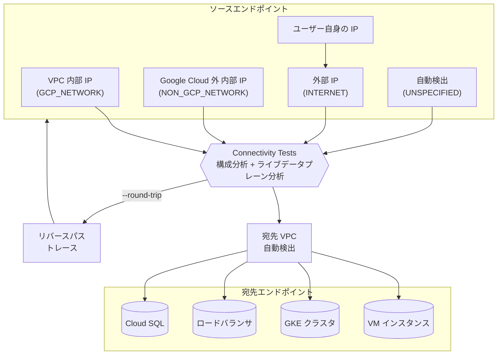

# Network Intelligence Center: Connectivity Tests - ソース IP タイプ選択、宛先ネットワーク自動検出、リバースパステスト

**リリース日**: 2026-02-25
**サービス**: Network Intelligence Center
**機能**: Connectivity Tests - Source IP Type Selection, Automatic VPC Network Detection, Round-Trip Test
**ステータス**: Feature

[このアップデートのインフォグラフィックを見る](https://takech9203.github.io/google-cloud-news-summary/20260225-network-intelligence-center-connectivity-tests.html)

## 概要

Google Cloud の Network Intelligence Center に含まれる Connectivity Tests に、ネットワーク診断能力を大幅に強化する 4 つの新機能が追加された。ソース IP アドレスタイプの明示的な選択、Network Management API への INTERNET ネットワークタイプの追加、ユーザー自身の IP アドレスをソースとして使用する機能、そして宛先 VPC ネットワークの自動検出機能である。

これらの機能により、Connectivity Tests の利便性と診断精度が向上する。特にソース IP タイプの選択機能では、VPC 内部 IP、Google Cloud 外部の内部 IP、外部 IP、自動検出の 4 つのオプションから選択でき、テストの意図を明確に指定できるようになった。また、宛先 VPC ネットワークの自動検出により、手動でのネットワーク指定が不要となり、テスト作成の手間が削減された。

主な対象ユーザーはネットワーク管理者、セキュリティエンジニア、Solutions Architect であり、VPC ネットワークの接続性診断やトラブルシューティングを日常的に行うチームにとって有用なアップデートである。

**アップデート前の課題**

- Connectivity Tests でソース IP アドレスのタイプ (内部/外部) を明示的に指定できず、テスト結果があいまいになる場合があった
- 外部 IP アドレスからのテストを行う際、API で適切なネットワークタイプを指定する方法が限定的だった (GCP_NETWORK または NON_GCP_NETWORK のみ)
- 宛先 IP アドレスが Google Cloud 内にある場合でも、宛先 VPC ネットワークを手動で選択する必要があった
- Google Cloud コンソールから自身のクライアント IP アドレスをソースとして直接指定する簡便な方法がなかった

**アップデート後の改善**

- ソース IP タイプを 4 つのオプション (VPC 内部 IP、Google Cloud 外の内部 IP、外部 IP、自動検出) から明示的に選択可能になった
- Network Management API に INTERNET ネットワークタイプが追加され、外部 IP アドレスからのテストがより正確に記述できるようになった
- 宛先 IP アドレスが Google Cloud 内にある場合、宛先 VPC ネットワークが自動検出されるようになり、手動選択が不要になった
- Google Cloud コンソールからユーザー自身の IP アドレスをソースとしてワンクリックで選択可能になった

## アーキテクチャ図



Connectivity Tests の新しいソース IP タイプ選択オプションと宛先 VPC 自動検出の全体フローを示す。ユーザーは 4 つのソースタイプから選択でき、宛先が Google Cloud 内であれば VPC ネットワークが自動的に検出される。`--round-trip` フラグにより、宛先からソースへのリバースパステストも実行可能。

## サービスアップデートの詳細

### 主要機能

1. **ソース IP タイプの選択 (Source IP Type Selection)**
   - Google Cloud コンソールで Connectivity Test を作成する際に、ソース IP アドレスのタイプを明示的に選択可能
   - 選択肢: VPC ネットワーク内の内部 IP、Google Cloud 外の内部 IP、外部 IP、自動ソース検出 (全パス評価)
   - API では `--source-network-type` パラメータで `gcp-network`、`non-gcp-network`、`internet`、`unspecified` を指定

2. **INTERNET ネットワークタイプの追加 (New Network Type)**
   - Network Management API に `INTERNET` ネットワークタイプが新規追加
   - Google Cloud コンソールの「External IP address」ソース IP タイプに対応
   - インターネット経由のルーティング可能な外部 IP アドレスや、グローバル Google API/サービス向けの IP アドレスに使用

3. **ユーザー自身の IP アドレスをソースとして使用**
   - Google Cloud コンソールから、テスト実行者自身のクライアント IP アドレスをソース IP として選択可能
   - 「自分の場所からこのリソースに到達できるか」というテストを簡単に実行可能

4. **宛先 VPC ネットワークの自動検出 (Automatic VPC Network Detection)**
   - Google Cloud 内の宛先 IP アドレスに対して、Connectivity Tests が宛先 VPC ネットワークを自動検出
   - 手動でのネットワーク選択が不要になり、テスト作成のワークフローが簡素化

## 技術仕様

### ソースネットワークタイプ

| ネットワークタイプ | コンソール表示 | 説明 | 使用例 |
|------|------|------|------|
| `gcp-network` | VPC ネットワーク内の内部 IP | VPC ネットワーク内の内部 IP アドレス用。`--source-network` にネットワーク URI を指定 | VM 間の内部通信テスト |
| `non-gcp-network` | Google Cloud 外の内部 IP | オンプレミスや他クラウドの内部 IP 用。Cloud VPN/Interconnect 経由の接続 | ハイブリッド接続テスト |
| `internet` (新規) | 外部 IP | インターネットルーティング可能な外部 IP やグローバル Google API 向け | 外部からの到達性テスト |
| `unspecified` | 自動ソース検出 | 全パスを評価。時間がかかり結果があいまいになる場合がある | 広範な接続性調査 |

### gcloud コマンドのオプション

| オプション | 説明 |
|------|------|
| `--source-network-type` | ソースネットワークタイプの指定 (`gcp-network`, `internet`, `non-gcp-network`, `unspecified`) |
| `--source-ip-address` | ソース IP アドレス |
| `--source-network` | ソース VPC ネットワークの URI |
| `--destination-network` | 宛先 VPC ネットワークの URI (自動検出が利用可能に) |
| `--round-trip` | リバースパステスト (宛先からソースへの戻りトレース) を有効化 |
| `--bypass-firewall-checks` | ファイアウォールチェックをスキップ |

### API リクエスト例

```json
{
  "source": {
    "ipAddress": "203.0.113.10",
    "networkType": "INTERNET"
  },
  "destination": {
    "ipAddress": "10.128.0.2",
    "port": "443"
  },
  "protocol": "TCP"
}
```

### IAM ロールと権限

| ロール | 説明 |
|------|------|
| `roles/networkmanagement.admin` | Connectivity Tests の全操作 (作成、更新、削除、再実行) |
| `roles/networkmanagement.viewer` | テストの一覧表示、詳細表示のみ |

主要な権限:
- `networkmanagement.connectivitytests.create` - テストの作成
- `networkmanagement.connectivitytests.rerun` - テストの再実行
- `networkmanagement.connectivitytests.get` - テスト結果の取得

## 設定方法

### 前提条件

1. Google Cloud プロジェクトで Network Management API が有効化されていること
2. `roles/networkmanagement.admin` または `networkmanagement.connectivitytests.create` 権限を持つ IAM ロールが付与されていること
3. テスト対象のネットワークリソースへの読み取り権限があること

### 手順

#### ステップ 1: ソース IP タイプを指定したテストの作成 (外部 IP から内部リソースへ)

```bash
gcloud network-management connectivity-tests create my-external-test \
  --source-ip-address=203.0.113.10 \
  --source-network-type=internet \
  --destination-ip-address=10.128.0.2 \
  --destination-port=443 \
  --protocol=TCP
```

`INTERNET` ネットワークタイプを使用して、外部 IP アドレスから VPC 内リソースへの接続性をテストする。宛先 VPC ネットワークは自動検出される。

#### ステップ 2: リバースパステストの実行

```bash
gcloud network-management connectivity-tests create my-roundtrip-test \
  --source-ip-address=10.128.0.2 \
  --source-network=projects/my-project/global/networks/default \
  --source-network-type=gcp-network \
  --destination-ip-address=10.132.0.3 \
  --destination-port=80 \
  --protocol=TCP \
  --round-trip
```

`--round-trip` フラグを指定すると、パケットが宛先に到達した後、宛先からソースへの戻り経路も分析される。

#### ステップ 3: テスト結果の確認

```bash
gcloud network-management connectivity-tests describe my-external-test
```

テスト結果には構成分析の結果 (Reachable / Unreachable / Ambiguous) と、ライブデータプレーン分析の結果が含まれる。

## メリット

### ビジネス面

- **トラブルシューティング時間の短縮**: ソース IP タイプの明示的な選択により、テスト意図が明確になり、より正確な診断結果が得られる
- **運用効率の向上**: 宛先 VPC ネットワークの自動検出により、テスト作成時の手動設定ステップが削減される
- **セキュリティ検証の簡素化**: 自身の IP アドレスからの到達性テストにより、ファイアウォールルールの有効性を簡単に確認可能

### 技術面

- **テスト精度の向上**: INTERNET ネットワークタイプにより、外部トラフィックのシミュレーションがより正確になった
- **双方向の接続性検証**: `--round-trip` フラグにより、往路と復路の両方のネットワーク構成を 1 回のテストで検証可能
- **API の表現力向上**: NetworkType に INTERNET が追加され、API レベルでソースの種別をより正確に表現できるようになった

## デメリット・制約事項

### 制限事項

- 構成分析の反映には 20 秒から 120 秒の遅延があり、ネットワーク構成変更直後のテストでは最新状態が反映されない場合がある
- `unspecified` (自動ソース検出) を選択した場合、全パスの評価に時間がかかり、結果があいまいになる可能性がある

### 考慮すべき点

- 外部 IP アドレスからのテスト時には、ネットワークタイプとして INTERNET を明示的に指定することが推奨される
- 複数のネットワークインターフェースを持つ VM をテストする場合、適切なネットワークインターフェースを指定する必要がある
- リバースパステスト (`--round-trip`) は、往路でパケットが正常に宛先に到達した場合にのみ復路のトレースが計算される

## ユースケース

### ユースケース 1: 外部からのサービス到達性テスト

**シナリオ**: インターネット上のクライアントから VPC 内の Web サーバーへの HTTPS アクセスが可能かどうかを検証したい。

**実装例**:
```bash
# 自分の IP アドレスからの到達性テスト (コンソール操作)
# 1. Google Cloud コンソールで Connectivity Tests を開く
# 2. Source endpoint で "IP address" を選択
# 3. "Your own IP address" を選択
# 4. Destination に Web サーバーの IP を指定
# 5. Protocol: TCP, Port: 443

# gcloud CLI での同等操作
gcloud network-management connectivity-tests create web-access-test \
  --source-ip-address=YOUR_CLIENT_IP \
  --source-network-type=internet \
  --destination-ip-address=10.128.0.5 \
  --destination-port=443 \
  --protocol=TCP
```

**効果**: ファイアウォールルール、ルーティング、NAT 設定など、パケットが通過する全構成要素の正当性を一括検証できる。

### ユースケース 2: ハイブリッド環境の双方向接続性検証

**シナリオ**: オンプレミス環境と Google Cloud VPC 間の接続を Cloud VPN 経由で確立した後、双方向の疎通を確認したい。

**実装例**:
```bash
gcloud network-management connectivity-tests create hybrid-roundtrip-test \
  --source-ip-address=192.168.1.10 \
  --source-network=projects/my-project/global/networks/default \
  --source-network-type=non-gcp-network \
  --destination-ip-address=10.128.0.3 \
  --destination-port=22 \
  --protocol=TCP \
  --round-trip
```

**効果**: `--round-trip` フラグにより、Cloud VPN を介した往路・復路の両方のルーティングとファイアウォール設定を 1 回のテストで検証できる。非対称ルーティングの問題も検出可能。

## 料金

Network Intelligence Center の Connectivity Tests は、Network Management API の一部として提供されている。料金の詳細は公式ドキュメントを参照されたい。

- [Network Intelligence Center 料金ページ](https://cloud.google.com/network-intelligence-center/pricing)

## 利用可能リージョン

Connectivity Tests はグローバルリソースとして提供されており、Google Cloud の全リージョンの VPC ネットワークに対してテストを実行可能。API エンドポイントは `networkmanagement.googleapis.com/v1/projects/PROJECT_ID/locations/global/connectivityTests` で、グローバルにアクセスできる。

## 関連サービス・機能

- **Network Topology**: VPC ネットワークのトポロジを視覚化し、Connectivity Tests と組み合わせてネットワーク構成の理解を深める
- **Network Analyzer**: VPC ネットワーク構成を自動監視し、誤構成や最適化の余地を検出。Connectivity Tests の結果と併用して問題の根本原因を特定
- **Flow Analyzer**: VPC Flow Logs を分析し、実際のトラフィックフローを可視化。Connectivity Tests は構成分析、Flow Analyzer は実トラフィック分析と使い分け可能
- **Firewall Insights**: ファイアウォールルールの使用状況を分析し、過剰に許可的なルールを特定。Connectivity Tests のファイアウォール検証結果と合わせて活用
- **Performance Dashboard**: Google Cloud ネットワーク全体のパフォーマンス (パケットロス、レイテンシ) を可視化
- **Cloud Network Insights (Preview)**: マルチクラウド・ハイブリッドネットワークのパフォーマンス監視と可視化ツール (2026 年 2 月 18 日に Preview 提供開始)

## 参考リンク

- [インフォグラフィック](https://takech9203.github.io/google-cloud-news-summary/20260225-network-intelligence-center-connectivity-tests.html)
- [公式リリースノート](https://cloud.google.com/release-notes#February_25_2026)
- [Connectivity Tests 概要ドキュメント](https://cloud.google.com/network-intelligence-center/docs/connectivity-tests/concepts/overview)
- [Connectivity Tests の作成と実行](https://cloud.google.com/network-intelligence-center/docs/connectivity-tests/how-to/running-connectivity-tests)
- [Network Management API - NetworkType リファレンス](https://cloud.google.com/network-intelligence-center/docs/reference/networkmanagement/rest/v1/projects.locations.global.connectivityTests#networktype)
- [gcloud network-management connectivity-tests create](https://cloud.google.com/sdk/gcloud/reference/network-management/connectivity-tests/create)
- [IAM ロールと権限](https://cloud.google.com/network-intelligence-center/docs/connectivity-tests/concepts/access-control)
- [Network Intelligence Center 概要](https://cloud.google.com/network-intelligence-center/docs/overview)

## まとめ

今回のアップデートにより、Connectivity Tests のソース IP タイプ選択、INTERNET ネットワークタイプの追加、ユーザー IP のワンクリック選択、宛先 VPC 自動検出の 4 機能が利用可能になった。特に外部からの到達性テストやハイブリッド環境の診断がより直感的かつ正確に行えるようになっており、`--round-trip` フラグによる双方向検証と合わせて、ネットワークトラブルシューティングのワークフローが大幅に改善される。ネットワーク管理者は、既存のテストを新しいソース IP タイプ指定に更新し、宛先 VPC 自動検出の恩恵を活用することを推奨する。

---

**タグ**: #NetworkIntelligenceCenter #ConnectivityTests #VPC #NetworkDiagnostics #GoogleCloud #NetworkManagementAPI
