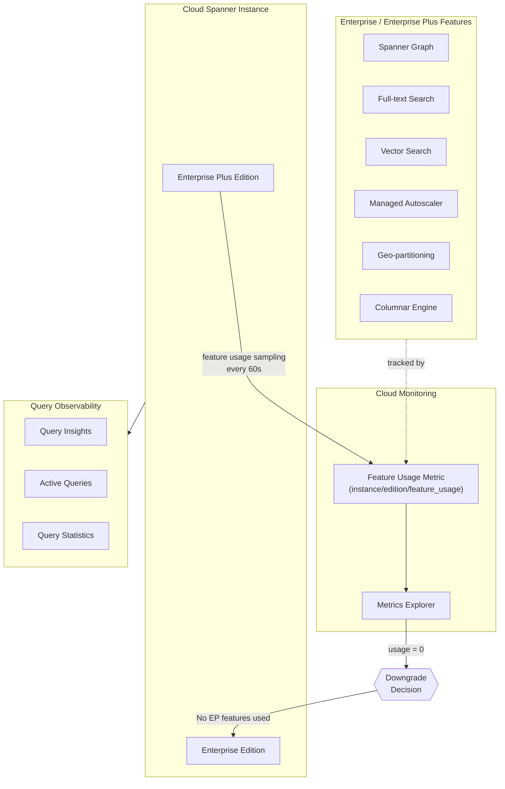

# Spanner: エディション機能モニタリング、インスタンスダウングレード、クエリオブザーバビリティ改善

**リリース日**: 2026-02-25
**サービス**: Cloud Spanner
**機能**: Edition Feature Monitoring, Instance Downgrade, Query Observability Improvements
**ステータス**: Feature

[このアップデートのインフォグラフィックを見る](https://takech9203.github.io/google-cloud-news-summary/20260225-spanner.html)

## 概要

Cloud Spanner において、エディション機能の使用状況モニタリング、インスタンスのエディションダウングレード、およびクエリオブザーバビリティの改善が発表された。これらの機能は、Spanner のエディションベース料金モデル (Standard / Enterprise / Enterprise Plus) を利用するユーザーが、コスト最適化と運用効率の向上を実現するための重要なアップデートである。

エディション機能モニタリングにより、Enterprise および Enterprise Plus エディション固有の機能がインスタンス内でどの程度使用されているかを Cloud Monitoring のメトリクスで可視化できるようになった。これにより、上位エディションの機能を使用していない場合にダウングレードの判断材料を得ることができる。また、Enterprise Plus から Enterprise へのダウングレードが、上位エディション機能を使用していないインスタンスに対してサポートされた。

さらに、クエリオブザーバビリティとモニタリング機能が強化され、クエリパフォーマンスの分析やトラブルシューティングがより効率的に行えるようになった。

**アップデート前の課題**

- Enterprise Plus エディションの機能を実際にどの程度使用しているかを定量的に把握する手段が限定的であり、エディション選択の妥当性を評価しにくかった
- Enterprise Plus エディションから Enterprise エディションへのダウングレードパスが明確でなく、コスト最適化の選択肢が制限されていた
- クエリのパフォーマンス問題の特定と根本原因分析に追加のツールや手動調査が必要だった

**アップデート後の改善**

- `instance/edition/feature_usage` メトリクスにより、エディション固有機能の使用状況を Cloud Monitoring で 60 秒間隔でモニタリングできるようになった
- Enterprise Plus エディションの機能を使用していないインスタンスを Enterprise エディションにダウングレードできるようになり、約 10 分でゼロダウンタイムの切り替えが可能になった
- クエリオブザーバビリティが改善され、Query Insights ダッシュボードでのパフォーマンス問題の検出・診断がより効率的になった

## アーキテクチャ図



Spanner インスタンスのエディション機能使用状況が Cloud Monitoring の Feature Usage メトリクスで追跡され、Enterprise Plus 固有機能が未使用の場合にダウングレード判断が可能となるフローを示している。

## サービスアップデートの詳細

### 主要機能

1. **エディション機能使用状況モニタリング**
   - `instance/edition/feature_usage` メトリクスにより、Enterprise および Enterprise Plus エディション固有の機能使用状況を Cloud Monitoring で可視化
   - 60 秒間隔でサンプリングされ、最大 120 秒で表示に反映
   - 追跡対象の機能: Asymmetric autoscaling, Columnar engine, Full-text search, Geo-partitioning, Incremental backups, KNN vector search, Managed autoscaler, Scheduled backups, Spanner Graph, Tiered storage, Vector search

2. **インスタンスエディションのダウングレード**
   - Enterprise Plus から Enterprise へのダウングレードをサポート
   - Enterprise から Standard へのダウングレードも可能
   - ダウングレードは約 10 分で完了し、ゼロダウンタイムで実施可能
   - データ移行は不要 (設定変更のみ)
   - 上位エディション固有の機能を停止してからダウングレードする必要がある

3. **クエリオブザーバビリティとモニタリングの改善**
   - Query Insights ダッシュボードの機能強化
   - アクティブクエリのモニタリング: 実行中の長時間クエリを特定し、インスタンスのレイテンシや CPU 使用率の原因を調査可能
   - クエリ統計テーブル (SPANNER_SYS.QUERY_STATS_TOP_*) による詳細分析
   - 追加コストなしで利用可能

## 技術仕様

### エディション機能の対応表

| 機能 | Standard | Enterprise | Enterprise Plus |
|------|----------|------------|-----------------|
| Availability SLA | 99.99% | 99.99% | 最大 99.999% |
| インスタンス構成 | リージョナル | リージョナル + カスタムリードオンリーレプリカ | リージョナル、デュアルリージョン、マルチリージョン |
| Spanner Graph | -- | 対応 | 対応 |
| Full-text Search | -- | 対応 | 対応 |
| Vector Search (KNN/ANN) | -- | 対応 | 対応 |
| Managed Autoscaler | -- | 対応 | 対応 |
| Geo-partitioning | -- | -- | 対応 |
| Columnar Engine | -- | 対応 | 対応 |
| Incremental Backups | -- | 対応 | 対応 |
| Tiered Storage | -- | 対応 | 対応 |

### ダウングレード前に必要な操作

ダウングレードを実行する前に、上位エディション固有の機能を停止する必要がある。

**Enterprise / Enterprise Plus 共通の機能停止手順:**

| 機能 | 必要な操作 |
|------|-----------|
| Custom read-only replicas | リージョナル構成に移行するか、インスタンスを削除 |
| Spanner Graph | 全プロパティグラフスキーマを削除 |
| Full-text search | 全検索インデックスを削除 |
| Vector search | 全 KNN/ANN 距離関数の使用を停止し、全ベクトルインデックスを削除 |
| Managed autoscaler | 手動スケーリングに変更 |

**Enterprise Plus 固有の機能停止手順:**

| 機能 | 必要な操作 |
|------|-----------|
| デュアル/マルチリージョン構成 | リージョナル構成に移行するか、インスタンスを削除 |
| Geo-partitioning | 全パーティションを削除 |

### gcloud CLI によるダウングレード

```bash
# インスタンスのエディションをダウングレード
gcloud spanner instances update INSTANCE_ID --edition=EDITION
```

`EDITION` には `STANDARD`、`ENTERPRISE`、`ENTERPRISE_PLUS` のいずれかを指定する。

## 設定方法

### 前提条件

1. Google Cloud プロジェクトで Spanner API が有効化されていること
2. 対象インスタンスの管理権限 (`spanner.instances.update`) を持つ IAM ロールが付与されていること
3. Query Insights の閲覧には `roles/spanner.viewer` および `roles/spanner.databaseReader` ロールが必要

### 手順

#### ステップ 1: エディション機能使用状況の確認

```bash
# Cloud Monitoring の Metrics Explorer で確認
# Google Cloud Console > Monitoring > Metrics Explorer
# メトリクス: Cloud Spanner Instance > Instance > Feature usage
# 集約: Unaggregated
# 表示タイプ: Table または Both
```

Metrics Explorer でフィルタリングし、インスタンスごとの機能使用状況を表形式で確認する。`instance_id`、`instance_config`、`database`、`feature` カラムで使用中の機能を特定できる。

#### ステップ 2: インスタンスのダウングレード (Console)

```
1. Google Cloud Console > Spanner > Instances に移動
2. 対象インスタンス名をクリック
3. Instance overview ページで "Edit instance" をクリック
4. "Choose a Spanner edition" で下位エディションを選択
5. "Update instance" をクリック
```

#### ステップ 3: インスタンスのダウングレード (gcloud CLI)

```bash
# Enterprise Plus から Enterprise にダウングレード
gcloud spanner instances update my-instance --edition=ENTERPRISE

# Enterprise から Standard にダウングレード
gcloud spanner instances update my-instance --edition=STANDARD
```

## メリット

### ビジネス面

- **コスト最適化**: Enterprise Plus エディションの機能を使用していないインスタンスを Enterprise にダウングレードすることで、不要なコストを削減できる
- **透明性の向上**: エディション機能の使用状況が定量的に可視化されるため、エディション選択の妥当性を経営層にも説明しやすくなる
- **柔軟なエディション管理**: ワークロードの変化に応じてエディションを変更でき、ビジネス要件に合わせたコスト構造を実現できる

### 技術面

- **ゼロダウンタイムでのエディション変更**: ダウングレードは約 10 分で完了し、データ移行も不要であるため、運用への影響を最小限に抑えられる
- **クエリパフォーマンスの可視化**: Query Insights とアクティブクエリモニタリングにより、パフォーマンス問題の迅速な特定と解決が可能になる
- **プロアクティブな運用**: Feature Usage メトリクスに基づくアラート設定により、想定外の機能使用を検知できる

## デメリット・制約事項

### 制限事項

- ダウングレード前に上位エディション固有の機能を全て停止する必要があり、Spanner Graph のスキーマ削除やベクトルインデックスの削除など、破壊的な操作が含まれる
- Feature Usage メトリクスのサンプリング間隔は 60 秒であり、最大 120 秒の表示遅延がある
- Standard エディションへのダウングレードは、現時点ではサポートへの問い合わせが必要な場合がある

### 考慮すべき点

- ダウングレード後に上位エディション機能が必要になった場合、再度アップグレードが必要となる (アップグレードもゼロダウンタイムで約 10 分)
- マルチリージョン構成を使用している Enterprise Plus インスタンスは、ダウングレードの前にリージョナル構成への移行が必要であり、この移行には追加の計画と実行時間が必要
- 組織ポリシー制約 (Organization Policy Constraint) を使用して、特定のエディションの作成を防止することが可能

## ユースケース

### ユースケース 1: コスト最適化のためのエディション見直し

**シナリオ**: ある企業が、初期に Enterprise Plus エディションで Spanner インスタンスをプロビジョニングしたが、実際にはマルチリージョン構成や Geo-partitioning を使用しておらず、Enterprise エディションの機能のみを利用している。

**実装例**:
```bash
# 1. Feature Usage メトリクスで Enterprise Plus 固有機能の使用状況を確認
# Cloud Monitoring > Metrics Explorer で以下を設定
# メトリクス: Cloud Spanner Instance > Instance > Feature usage
# フィルタ: instance_id = "my-production-instance"

# 2. Enterprise Plus 固有機能 (Geo-partitioning, multi-region) が
#    使用されていないことを確認した後、ダウングレードを実行
gcloud spanner instances update my-production-instance --edition=ENTERPRISE
```

**効果**: Enterprise Plus と Enterprise の料金差額分のコスト削減が実現できる。ゼロダウンタイムでの切り替えにより、本番環境への影響なくコスト最適化が可能。

### ユースケース 2: クエリパフォーマンス問題の迅速な診断

**シナリオ**: Spanner インスタンスで断続的にレイテンシが上昇し、ユーザーからの応答時間に影響が出ている。Query Insights とアクティブクエリモニタリングを使用して、原因となるクエリを特定する。

**効果**: Query Insights ダッシュボードにより、CPU 時間やレイテンシが高いクエリを迅速に特定でき、実行計画の分析を通じてボトルネックの根本原因を特定できる。追加コストなしで利用可能。

## 料金

Spanner はエディションごとに異なる料金体系を採用している。エディションのダウングレードにより、上位エディションとの差額分を削減できる。

### 料金例 (us-central1 リージョンの参考値)

| 項目 | 料金 (概算) |
|------|------------|
| ノード料金 (オンデマンド) | $0.90/ノード/時間 (リージョン構成参考値) |
| CUD 割引 (1 年) | 20% 割引 |
| CUD 割引 (3 年) | 40% 割引 |
| Query Insights | 追加コストなし |
| Feature Usage モニタリング | 追加コストなし (Cloud Monitoring の標準メトリクス) |

詳細な料金情報は [Spanner 料金ページ](https://cloud.google.com/spanner/pricing) を参照。

## 利用可能リージョン

Spanner エディションは全てのリージョナル、デュアルリージョン、マルチリージョン構成で利用可能。ただし、マルチリージョン構成は Enterprise Plus エディション限定。リージョンの詳細は [Spanner インスタンス構成](https://cloud.google.com/spanner/docs/instance-configurations) を参照。

## 関連サービス・機能

- **Cloud Monitoring**: Feature Usage メトリクスの表示、アラート設定、ダッシュボード構築に使用
- **Cloud Logging**: Spanner の監査ログやデータアクセスログの収集・分析に使用
- **Organization Policy Service**: 組織ポリシー制約により特定エディションの作成を制限可能
- **BigQuery**: Spanner との連携 (Federated Queries, Data Boost, Reverse ETL) はエディションに関わらず利用可能
- **OpenTelemetry**: クライアントサイドのカスタムメトリクスやトレース収集に使用可能

## 参考リンク

- [このアップデートのインフォグラフィック](https://takech9203.github.io/google-cloud-news-summary/20260225-spanner.html)
- [公式リリースノート](https://cloud.google.com/release-notes#February_25_2026)
- [Spanner エディション概要](https://cloud.google.com/spanner/docs/editions-overview)
- [インスタンスの作成と管理](https://cloud.google.com/spanner/docs/create-manage-instances)
- [Query Insights の使用](https://cloud.google.com/spanner/docs/using-query-insights)
- [アクティブクエリのモニタリング](https://cloud.google.com/spanner/docs/monitor-active-queries)
- [Spanner オブザーバビリティ概要](https://cloud.google.com/spanner/docs/signal-capture-overview)
- [料金ページ](https://cloud.google.com/spanner/pricing)

## まとめ

今回のアップデートにより、Spanner のエディション管理とオブザーバビリティが大幅に強化された。Feature Usage メトリクスによるエディション機能の可視化とダウングレード機能の組み合わせは、Enterprise Plus エディションを利用中でありながら上位機能を活用できていないユーザーにとって、直接的なコスト最適化の機会を提供する。まずは Cloud Monitoring の Metrics Explorer で自身のインスタンスの Feature Usage メトリクスを確認し、エディション選択の妥当性を評価することを推奨する。

---

**タグ**: #CloudSpanner #Spanner #エディション #モニタリング #コスト最適化 #QueryInsights #ダウングレード #Enterprise #EnterprisePlus #オブザーバビリティ
