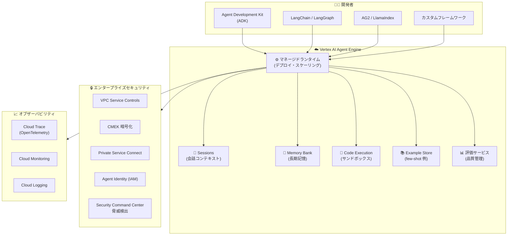

# Vertex AI Agent Engine: 正式リリース (GA)

**リリース日**: 2026-02-25
**サービス**: Vertex AI Agent Engine
**機能**: Agent Engine 正式リリース (GA)
**ステータス**: GA (Generally Available)

📊 [このアップデートのインフォグラフィックを見る](https://takech9203.github.io/google-cloud-news-summary/20260225-vertex-ai-agent-engine-ga.html)

## 概要

Vertex AI Agent Engine が正式リリース (GA) となった。Vertex AI Agent Engine は、Vertex AI Platform の一部として、AI エージェントの本番環境へのデプロイ、管理、スケーリングを可能にするフルマネージドサービス群である。開発者はインフラストラクチャの管理から解放され、エージェントロジックの開発に集中できる。

Agent Engine は元々「LangChain on Vertex AI」として提供されていたサービスが 2025 年 3 月に名称変更・初回 GA となり、その後セッション管理、Memory Bank、Code Execution、エンタープライズセキュリティ機能など多数の機能が段階的に追加されてきた。今回の 2026 年 2 月 25 日のリリースノートでは、Agent Engine の GA ステータスが改めて確認されている。

対象ユーザーは、本番環境で AI エージェントを構築・運用する開発者、MLOps エンジニア、Solutions Architect であり、ADK (Agent Development Kit)、LangChain、LangGraph、AG2、LlamaIndex など複数の Python フレームワークに対応している。

**アップデート前の課題**

- AI エージェントの本番デプロイには、独自のインフラ構築・スケーリング・モニタリングの設計が必要だった
- エージェントの会話コンテキスト (セッション) や長期記憶の管理を独自に実装する必要があった
- エージェントのコード実行環境をセキュアに分離するための仕組みを自前で構築する必要があった
- VPC Service Controls、CMEK、HIPAA 準拠などエンタープライズセキュリティ要件を個別に対応する必要があった

**アップデート後の改善**

- フルマネージドランタイムにより、エージェントのデプロイ・スケーリングが自動化された
- Sessions (GA) と Memory Bank (GA) により、会話コンテキストと長期記憶がマネージドサービスとして利用可能になった
- Code Execution (GA) により、セキュアなサンドボックス環境でのコード実行が提供された
- VPC-SC、CMEK、PSC-I、HIPAA、Access Transparency、Access Approval などエンタープライズセキュリティ機能が統合された
- 20 リージョンでのグローバル展開が完了し、世界各地での利用が可能になった

## アーキテクチャ図



Vertex AI Agent Engine のアーキテクチャを示す図。開発者は複数のフレームワークからマネージドランタイムにエージェントをデプロイし、Sessions、Memory Bank、Code Execution などのサービスを利用できる。エンタープライズセキュリティとオブザーバビリティが統合されている。

## サービスアップデートの詳細

### 主要機能

1. **マネージドランタイム (Runtime)**
   - エージェントのデプロイとスケーリングを自動管理
   - コンテナイメージのカスタマイズ (ビルド時のシステム依存関係インストール)
   - 最小・最大インスタンス数、コンテナリソース制限、コンカレンシーなどのカスタマイズが可能
   - Agent2Agent (A2A) オープンプロトコルに対応

2. **Sessions (GA)**
   - ユーザーとエージェント間の個別インタラクションを保存
   - 会話コンテキストの信頼できるソースとして機能
   - ADK エージェントでのセッションサポートを含む

3. **Memory Bank (GA)**
   - ユーザーの会話から長期記憶を動的に生成
   - セッション情報から情報を保存・検索し、エージェントインタラクションをパーソナライズ
   - Generative AI モデルを使用したメモリ生成

4. **Code Execution (GA)**
   - セキュア、分離、マネージドなサンドボックス環境でコード実行
   - 2026 年 2 月 18 日に GA 到達

5. **Example Store (Preview)**
   - few-shot 例の保存と動的な取得
   - エージェントパフォーマンスの向上に活用

6. **品質評価 (Preview)**
   - Gen AI Evaluation Service と統合
   - Gemini モデルのトレーニングランによるエージェント最適化

7. **ガバナンス機能**
   - Security Command Center による Agent Engine Threat Detection (Preview)
   - Agent Identity による IAM ベースのセキュリティ管理 (Preview)
   - Cloud API Registry によるツール管理 (Preview)

## 技術仕様

### 対応フレームワーク

| サポートレベル | フレームワーク |
|---------------|---------------|
| フルインテグレーション | Agent Development Kit (ADK), LangChain, LangGraph |
| Vertex AI SDK 統合 | AG2, LlamaIndex |
| カスタムテンプレート | CrewAI, カスタムフレームワーク |

### エンタープライズセキュリティ対応状況

| セキュリティ機能 | Runtime | Sessions | Memory Bank | Example Store | Code Execution |
|-----------------|---------|----------|-------------|---------------|----------------|
| VPC Service Controls | Yes | Yes | Yes | No | Yes |
| CMEK | Yes | Yes | Yes | No | Yes |
| Data Residency (DRZ) | Yes | Yes | Yes | No | Yes |
| HIPAA | Yes | Yes | Yes | Yes | Yes |
| Access Transparency | Yes | Yes | Yes | No | No |
| Access Approval | Yes | Yes | Yes | No | No |

### API リソース名

```
# API リソースは後方互換性のため ReasoningEngine を維持
projects.locations.reasoningEngines
```

## 設定方法

### 前提条件

1. Google Cloud プロジェクトの作成と課金の有効化
2. Vertex AI API の有効化
3. 必要な IAM ロールの付与
   - `roles/aiplatform.user` (Vertex AI User)
   - `roles/storage.admin` (Storage Admin)

### 手順

#### ステップ 1: 環境セットアップ

```bash
# Vertex AI SDK for Python のインストール
pip install google-cloud-aiplatform

# ADK を使用する場合
pip install google-adk
```

#### ステップ 2: エージェントの開発とデプロイ

```python
from vertexai import agent_engines

# エージェントの定義 (ADK の例)
# agent = ... (フレームワークに応じた実装)

# Agent Engine にデプロイ
deployed_agent = agent_engines.create(
    agent=agent,
    display_name="my-agent",
    requirements=["google-adk"],
)

# エージェントへのクエリ
response = deployed_agent.query(input="Hello, agent!")
```

#### ステップ 3: Agent Starter Pack の利用 (推奨)

```bash
# Agent Starter Pack を使用した迅速なセットアップ
# ReAct, RAG, マルチエージェントなどのテンプレートを提供
# Terraform によるインフラ自動化、Cloud Build による CI/CD を含む
git clone https://github.com/GoogleCloudPlatform/agent-starter-pack
```

## メリット

### ビジネス面

- **開発速度の向上**: インフラ管理からの解放により、エージェントロジック開発に集中でき、市場投入までの時間を短縮
- **運用コストの削減**: フルマネージドサービスにより、インフラ運用チームの負担を軽減
- **グローバル展開**: 20 リージョン対応により、世界各地のユーザーに低レイテンシでサービスを提供可能

### 技術面

- **フレームワーク柔軟性**: ADK、LangChain、LangGraph、AG2、LlamaIndex、カスタムフレームワークなど多数のフレームワークに対応
- **自動スケーリング**: トラフィックに応じた自動スケーリングにより、手動の容量管理が不要
- **統合オブザーバビリティ**: Cloud Trace (OpenTelemetry)、Cloud Monitoring、Cloud Logging による包括的な可観測性
- **エンタープライズセキュリティ**: VPC-SC、CMEK、HIPAA、Access Transparency など包括的なセキュリティ機能を標準搭載

## デメリット・制約事項

### 制限事項

- Python 以外のプログラミング言語はサポートされていない
- カスタム MCP サーバーのホスティングはサポートされていない
- Code Execution は現在 us-central1 リージョンのみで利用可能
- Memory Bank は asia-southeast2 (Jakarta)、australia-southeast2 (Melbourne)、northamerica-northeast2 (Toronto) ではサポートされていない

### 考慮すべき点

- 従来の `google-cloud-aiplatform` SDK バージョン 1.112.0 未満を使用している場合は、クライアントベース SDK への移行が必要
- Sessions、Memory Bank、Code Execution は 2026 年 2 月 11 日以降、利用量に応じた課金が開始されている
- コンピュート環境の広範なカスタマイズが必要な場合は、Cloud Run や GKE の方が適している可能性がある

## ユースケース

### ユースケース 1: カスタマーサポートエージェント

**シナリオ**: 企業のカスタマーサポートで、顧客からの問い合わせに自動応答する AI エージェントを構築。Sessions で会話コンテキストを維持し、Memory Bank で顧客の過去のやり取りを記憶する。

**実装例**:
```python
# ADK を使用したカスタマーサポートエージェント
from google.adk import Agent, Tool

# ツールの定義
@Tool
def lookup_order(order_id: str) -> dict:
    """注文情報を検索"""
    # データベースから注文情報を取得
    ...

# エージェントの構築
agent = Agent(
    model="gemini-2.5-flash",
    tools=[lookup_order],
    system_instruction="顧客サポートエージェントとして振る舞ってください。"
)

# Agent Engine にデプロイ (Sessions と Memory Bank を有効化)
```

**効果**: 24 時間対応可能なカスタマーサポートを実現。Memory Bank により顧客ごとにパーソナライズされた対応が可能になり、顧客満足度の向上が期待できる。

### ユースケース 2: データ分析エージェント

**シナリオ**: 社内データベースに自然言語でクエリを行い、分析結果をレポートとして出力する AI エージェントを構築。Code Execution でデータ処理コードを安全に実行する。

**効果**: データアナリストの工数を削減し、ビジネスユーザーが直接データにアクセス可能になる。Code Execution のサンドボックス環境により、セキュアなコード実行が保証される。

## 料金

Vertex AI Agent Engine Runtime には無料枠が提供されている。

### 料金例

| SKU | 料金 |
|-----|------|
| ReasoningEngine vCPU | $0.0994/vCPU-Hr |
| ReasoningEngine Memory | $0.0105/GiB-Hr |

Sessions、Memory Bank、Code Execution は 2026 年 2 月 11 日以降、利用量に応じた課金が開始されている。最新の料金詳細は [Vertex AI pricing](https://cloud.google.com/vertex-ai/pricing#vertex-ai-agent-engine) を参照。

## 利用可能リージョン

Vertex AI Agent Engine は以下の 20 リージョンで利用可能。

| リージョン | ロケーション |
|-----------|-------------|
| us-central1 | Iowa |
| us-east4 | Northern Virginia |
| us-west1 | Oregon |
| europe-west1 | Belgium |
| europe-west2 | London |
| europe-west3 | Frankfurt |
| europe-west4 | Netherlands |
| europe-west6 | Zurich |
| europe-west8 | Milan |
| europe-southwest1 | Madrid |
| asia-east1 | Taiwan |
| asia-east2 | Hong Kong |
| asia-northeast1 | Tokyo |
| asia-northeast3 | Seoul |
| asia-south1 | Mumbai |
| asia-southeast1 | Singapore |
| asia-southeast2 | Jakarta |
| australia-southeast2 | Melbourne |
| northamerica-northeast2 | Toronto |
| southamerica-east1 | Sao Paulo |

## 関連サービス・機能

- **Vertex AI Agent Builder**: Agent Engine を含む AI エージェント構築のためのスイート。Agent Garden、Agent Designer なども含む
- **Agent Development Kit (ADK)**: Google が提供するオープンソースのエージェント開発フレームワーク。Agent Engine との完全統合を提供
- **Agent Starter Pack**: 本番環境向けの AI エージェントテンプレート集。Terraform、Cloud Build による CI/CD パイプラインを含む
- **Cloud Monitoring / Cloud Trace / Cloud Logging**: Agent Engine と統合されたオブザーバビリティサービス
- **Security Command Center**: Agent Engine Threat Detection によるエージェントへの攻撃検出
- **Gen AI Evaluation Service**: エージェント品質の評価と最適化

## 参考リンク

- 📊 [インフォグラフィック](https://takech9203.github.io/google-cloud-news-summary/20260225-vertex-ai-agent-engine-ga.html)
- [公式リリースノート](https://cloud.google.com/release-notes#February_25_2026)
- [Vertex AI Agent Engine 概要](https://cloud.google.com/agent-builder/agent-engine/overview)
- [Vertex AI Agent Builder 概要](https://cloud.google.com/agent-builder/overview)
- [Agent Engine クイックスタート](https://cloud.google.com/agent-builder/agent-engine/quickstart)
- [料金ページ](https://cloud.google.com/vertex-ai/pricing#vertex-ai-agent-engine)
- [対応リージョン](https://cloud.google.com/agent-builder/locations#supported-regions-agent-engine)
- [Agent Development Kit ドキュメント](https://google.github.io/adk-docs/)
- [Agent Starter Pack (GitHub)](https://github.com/GoogleCloudPlatform/agent-starter-pack)
- [Vertex AI Agent Builder リリースノート](https://cloud.google.com/agent-builder/release-notes)

## まとめ

Vertex AI Agent Engine の GA は、AI エージェントの本番環境運用を大幅に簡素化するものである。Runtime、Sessions、Memory Bank、Code Execution がすべて GA となり、20 リージョンでのグローバル展開、VPC-SC / CMEK / HIPAA 対応を含むエンタープライズセキュリティ、ADK を含む複数フレームワーク対応により、エンタープライズ規模での AI エージェント構築・運用の基盤が整った。AI エージェントの本番デプロイを検討している組織は、Agent Starter Pack を活用した迅速なプロトタイピングから始めることを推奨する。

---

**タグ**: #VertexAI #AgentEngine #GA #AIAgent #AgentDevelopmentKit #LangChain #LangGraph #ManagedRuntime #エンタープライズAI
