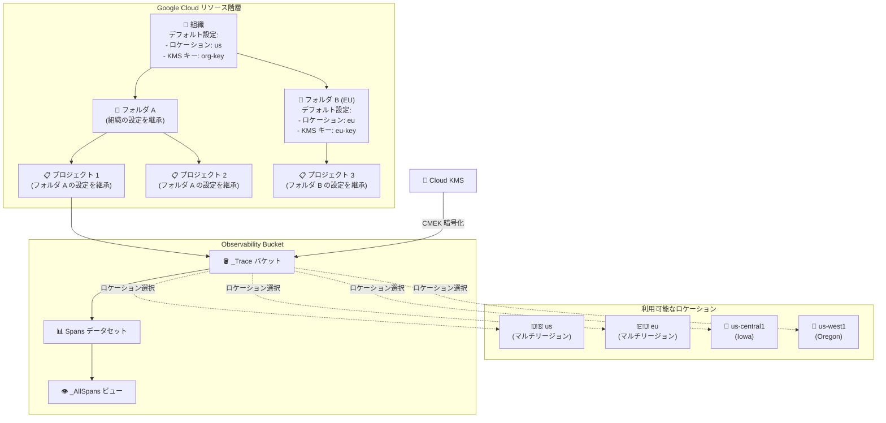

# Cloud Trace: Observability Buckets デフォルト設定と新ロケーション

**リリース日**: 2026-02-26
**サービス**: Cloud Trace, Cloud Monitoring
**機能**: Observability Buckets デフォルト設定、新ロケーション追加
**ステータス**: Public Preview

📊 [このアップデートのインフォグラフィックを見る](https://takech9203.github.io/google-cloud-news-summary/20260226-cloud-trace-observability-buckets-defaults.html)

## 概要

Google Cloud は Cloud Trace の Observability Buckets に対して、2 つの重要なアップデートを発表した。1 つ目は、組織、フォルダ、プロジェクトの各レベルで Observability Buckets のデフォルト設定を構成できるようになったこと。2 つ目は、Observability Buckets の配置先として新たに 4 つのロケーション (us, eu, us-central1, us-west1) が利用可能になったことである。いずれも Public Preview として提供される。

これらのアップデートにより、トレースデータのデータレジデンシー (データ所在地) 要件を持つ企業は、リソース階層の上位レベルでストレージロケーションと暗号化キー (Cloud KMS) をデフォルトとして一括設定できるようになった。下位のリソースは自動的にこれらの設定を継承するため、大規模な組織でもコンプライアンス要件を効率的に満たすことが可能になる。

主な対象ユーザーは、データレジデンシーやコンプライアンス要件を持つエンタープライズ企業のクラウドアーキテクト、セキュリティ管理者、および SRE チームである。

**アップデート前の課題**

- Observability Buckets のストレージロケーションを組織やフォルダの単位で一括指定する手段がなかった
- 新しいプロジェクトごとに個別にトレースデータの保存先やCMEK設定を行う必要があった
- トレースデータの保存先ロケーションの選択肢が限られていた
- リソース階層全体で一貫したデータレジデンシーポリシーを適用することが困難だった

**アップデート後の改善**

- 組織、フォルダ、プロジェクトの各レベルでデフォルトのストレージロケーションを設定できるようになった
- 各ロケーションに対してデフォルトの Cloud KMS キーを設定し、CMEK による暗号化を一括適用できるようになった
- リソース階層の継承により、下位リソースが自動的に上位の設定を使用するようになった
- us, eu, us-central1, us-west1 の 4 ロケーションでトレースデータを保存できるようになった

## アーキテクチャ図



リソース階層の各レベルで Observability Buckets のデフォルト設定 (ストレージロケーションと Cloud KMS キー) を構成できる。下位リソースは上位の設定を自動継承し、必要に応じて個別にオーバーライドが可能である。

## サービスアップデートの詳細

### 主要機能

1. **Observability Buckets デフォルト設定 (Public Preview)**
   - 組織、フォルダ、プロジェクトの各レベルでデフォルトのストレージロケーションを設定可能
   - 各ロケーションに対してデフォルトの Cloud KMS キーを設定可能
   - リソース階層の子孫は、自身でデフォルト設定を構成していない限り、親リソースの設定を自動的に継承する
   - デフォルト設定は新規リソースにのみ適用され、既存リソースには影響しない

2. **新しいロケーションの追加**
   - マルチリージョン: `us` (米国内の任意のデータセンター)、`eu` (欧州連合内の任意のデータセンター)
   - 単一リージョン: `us-central1` (Iowa)、`us-west1` (Oregon)
   - トレースデータは指定したロケーションの Observability Bucket に保存される

3. **CMEK (顧客管理の暗号化キー) サポート**
   - Cloud KMS キーを使用して Observability Bucket 内のトレースデータを暗号化可能
   - リソースのサービスアカウントに Cloud KMS CryptoKey Encrypter/Decrypter ロールの付与が必要
   - Cloud KMS キーはリージョナルリソースであり、バケットと同じロケーションのキーが必要

## 技術仕様

### Observability Bucket ストレージモデル

| 項目 | 詳細 |
|------|------|
| バケット名 | `_Trace` (システムが自動作成) |
| データセット名 | `Spans` |
| ビュー名 | `_AllSpans` (全データを含む) |
| データ保持期間 | 30 日 (デフォルト) |
| 適用対象 | 新規リソースのみ (既存リソースには適用されない) |

### サポートされるロケーション

| リージョン名 | 説明 | タイプ |
|-------------|------|--------|
| `us` | 米国内の任意のデータセンター | マルチリージョン |
| `eu` | 欧州連合内の任意のデータセンター | マルチリージョン |
| `us-central1` | Iowa | 単一リージョン |
| `us-west1` | Oregon | 単一リージョン |

### 必要な IAM ロール

| 操作 | 必要なロール |
|------|-------------|
| デフォルト設定の閲覧 | `roles/observability.viewer` |
| デフォルト設定の変更 | `roles/observability.editor` |
| CMEK 設定 | `roles/cloudkms.admin` |
| データの暗号化/復号 (サービスアカウント) | `roles/cloudkms.cryptoKeyEncrypterDecrypter` |

### 必要な権限

```text
observability.settings.get
observability.settings.update
cloudkms.cryptoKeys.getIamPolicy
cloudkms.cryptoKeys.setIamPolicy
```

## 設定方法

### 前提条件

1. 対象の組織、フォルダ、またはプロジェクトに対する `roles/observability.editor` ロール
2. CMEK を使用する場合は `roles/cloudkms.admin` ロールと適切なロケーションの Cloud KMS キーリングおよびキー

### 手順

#### ステップ 1: デフォルトストレージロケーションの設定

Observability API の `updateSettings` エンドポイントを使用して、デフォルトのストレージロケーションを設定する。

```text
# 組織の場合
API エンドポイント: organizations.locations.updateSettings
パスパラメータ: organizations/ORGANIZATION_ID/locations/global/settings

# updateMask
updateMask=defaultStorageLocation

# リクエストボディ
{
  "defaultStorageLocation"="us"
}
```

組織レベルで `us` を設定すると、その組織配下の全フォルダ・プロジェクトで新規作成される Observability Bucket は `us` ロケーションに配置される。

#### ステップ 2: Cloud KMS キーの設定 (CMEK を使用する場合)

まず、リソースのサービスアカウントに Cloud KMS キーへのアクセス権を付与する。

```bash
gcloud kms keys add-iam-policy-binding KMS_KEY_NAME \
  --project=KMS_PROJECT_ID \
  --member=serviceAccount:SERVICE_ACCT_NAME@gcp-sa-observability.iam.gserviceaccount.com \
  --role=roles/cloudkms.cryptoKeyEncrypterDecrypter \
  --location=LOCATION_ID \
  --keyring=KMS_KEY_RING
```

次に、デフォルト設定に Cloud KMS キーを登録する。

```text
# 組織の場合
API エンドポイント: organizations.locations.updateSettings
パスパラメータ: organizations/ORGANIZATION_ID/locations/LOCATION_ID/settings

# updateMask
updateMask=kmsKeyName

# リクエストボディ
{
  "kmsKeyName"="projects/KMS_PROJECT_ID/locations/LOCATION_ID/keyRings/KMS_KEY_RING/cryptoKeys/KMS_KEY_NAME"
}
```

CMEK を使用する場合は、Cloud KMS キーの設定をストレージロケーションの設定より先に行う必要がある。

## メリット

### ビジネス面

- **コンプライアンス対応の効率化**: GDPR、HIPAA などのデータレジデンシー要件に対して、リソース階層の上位レベルで一括設定が可能になり、管理コストが削減される
- **セキュリティガバナンスの強化**: CMEK によるトレースデータの暗号化を組織全体で強制でき、セキュリティポリシーの一貫性を確保できる

### 技術面

- **リソース階層の継承**: 組織やフォルダレベルで設定すれば、配下のプロジェクトが自動的にその設定を継承するため、個別設定が不要
- **柔軟なオーバーライド**: 特定のフォルダやプロジェクトで異なる要件がある場合は、個別にデフォルト設定をオーバーライド可能
- **BigQuery 連携**: Observability Bucket にリンクを作成すると、BigQuery からトレースデータの SQL クエリが可能

## デメリット・制約事項

### 制限事項

- Observability Buckets を変更・削除することはできない
- データセットの作成・削除・変更はできない
- ビューの作成・削除・変更はできない
- Google Cloud コンソールからバケット、データセット、ビュー、リンクをリストすることはできない
- デフォルト設定は新規リソースにのみ適用され、既存リソースには影響しない
- 現在は Public Preview であり、GA 前に機能や仕様が変更される可能性がある

### 考慮すべき点

- CMEK 使用時、Cloud KMS キーが利用不能になった場合、保存済みデータのクエリが不可能になる
- Cloud KMS キーが利用不能になると、直近 3 時間分のデータのみバッファリングされ、それ以前のデータは破棄される可能性がある
- 永続ストレージへのデータ書き込みには、データ書き込み後 48 時間以内に少なくとも 24 時間連続で Cloud KMS キーが利用可能かつアクセス可能である必要がある
- ロケーションは現在 4 箇所 (us, eu, us-central1, us-west1) に限られており、アジアリージョンは含まれていない
- Cloud Logging のログバケットのデフォルト設定とは独立した設定であり、別途 Cloud Logging 側での設定が必要

## ユースケース

### ユースケース 1: EU データレジデンシー要件への対応

**シナリオ**: GDPR 対応が必要なグローバル企業において、EU 拠点のプロジェクト群のトレースデータを EU 内に限定して保存する必要がある場合。

**実装例**:
```text
# 1. EU プロジェクト用フォルダにデフォルトロケーションを設定
API: folders.locations.updateSettings
パス: folders/EU_FOLDER_ID/locations/global/settings
updateMask=defaultStorageLocation
Body: {"defaultStorageLocation"="eu"}

# 2. 必要に応じて CMEK も設定
API: folders.locations.updateSettings
パス: folders/EU_FOLDER_ID/locations/eu/settings
updateMask=kmsKeyName
Body: {"kmsKeyName"="projects/kms-project/locations/eu/keyRings/eu-ring/cryptoKeys/eu-key"}
```

**効果**: EU フォルダ配下に新規作成されるすべてのプロジェクトで、トレースデータが自動的に EU 内に保存され、CMEK で暗号化される。個別プロジェクトごとの設定が不要となり、運用負荷が大幅に軽減される。

### ユースケース 2: マルチリージョン組織での一括暗号化ポリシー

**シナリオ**: セキュリティポリシーにより、すべてのトレースデータを CMEK で暗号化する必要があるエンタープライズ企業。米国内の複数リージョンにプロジェクトが存在する場合。

**効果**: 組織レベルでデフォルトストレージロケーションを `us` に設定し、CMEK を構成することで、新規プロジェクトのトレースデータは自動的に米国内に保存され、指定した Cloud KMS キーで暗号化される。セキュリティ監査への対応も容易になる。

## 料金

Observability Buckets のデフォルト設定機能自体には追加料金は発生しない。Cloud Trace の料金は、スパンの取り込み量に基づいて計算される。CMEK を使用する場合は Cloud KMS の料金が別途発生する。

詳細な料金情報については以下を参照のこと。

- [Cloud Trace の料金](https://cloud.google.com/stackdriver/pricing#trace-costs)
- [Cloud KMS の料金](https://cloud.google.com/kms/pricing)

## 利用可能リージョン

現在、Observability Buckets は以下のロケーションで利用可能である。

| タイプ | リージョン名 | 説明 |
|--------|-------------|------|
| マルチリージョン | `eu` | 欧州連合内の任意のデータセンターに保存。データセンター間でデータが移動する場合がある |
| マルチリージョン | `us` | 米国内の任意のデータセンターに保存。データセンター間でデータが移動する場合がある |
| 単一リージョン | `us-central1` | Iowa |
| 単一リージョン | `us-west1` | Oregon |

なお、現時点ではアジア太平洋リージョンはサポートされていない。

## 関連サービス・機能

- **Cloud Logging**: ログバケットにも同様のデフォルトリソース設定機能がある。ただし Observability Buckets のデフォルト設定とは独立しており、別途設定が必要
- **Cloud Monitoring**: メトリクスデータはデータ発生元のプロジェクトに保存される。Observability Buckets とは異なるストレージモデルを使用
- **Cloud KMS**: CMEK によるトレースデータの暗号化に使用。Cloud KMS キーはリージョナルリソースであり、Observability Bucket と同じロケーションのキーが必要
- **BigQuery**: Observability Bucket のデータセットにリンクを作成すると、BigQuery からトレースデータを SQL でクエリ・分析可能
- **Log Analytics**: SQL クエリインターフェースを提供し、トレースデータとログデータの結合クエリが可能

## 参考リンク

- 📊 [インフォグラフィック](https://takech9203.github.io/google-cloud-news-summary/20260226-cloud-trace-observability-buckets-defaults.html)
- [公式リリースノート](https://cloud.google.com/release-notes#February_26_2026)
- [Observability Buckets のデフォルト設定ドキュメント](https://cloud.google.com/stackdriver/docs/observability/set-defaults-for-observability-buckets)
- [Observability Bucket のロケーション一覧](https://cloud.google.com/stackdriver/docs/observability/observability-bucket-locations)
- [Trace ストレージの概要](https://cloud.google.com/trace/docs/storage-overview)
- [Observability ストレージの概要](https://cloud.google.com/stackdriver/docs/observability/storage-overview)
- [Cloud Trace の料金](https://cloud.google.com/stackdriver/pricing#trace-costs)

## まとめ

今回のアップデートにより、Cloud Trace の Observability Buckets に対してリソース階層レベルでのデフォルト設定 (ストレージロケーションと CMEK) が構成可能になり、データレジデンシーとセキュリティ要件を持つ組織にとって大きな改善となる。特に、GDPR や業界固有のコンプライアンス要件を持つエンタープライズ企業は、この機能を活用して組織全体でトレースデータのガバナンスを効率的に実施すべきである。現在 Public Preview であるため、GA に向けたロケーション拡大 (アジア太平洋リージョンなど) にも注目したい。

---

**タグ**: #CloudTrace #CloudMonitoring #Observability #DataResidency #CMEK #CloudKMS #コンプライアンス #Preview
