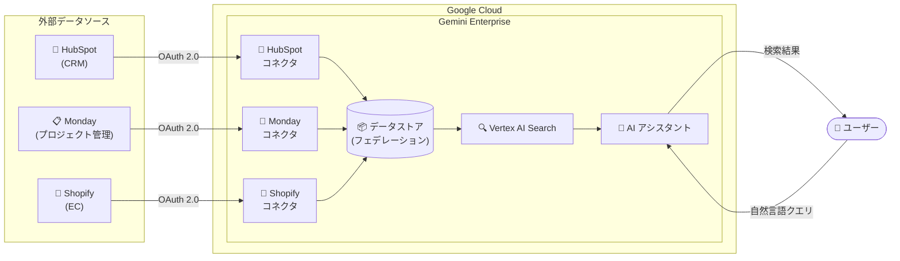

# Gemini Enterprise: 新規データソースコネクタ (HubSpot, Monday, Shopify) - Public Preview

**リリース日**: 2026-02-26
**サービス**: Gemini Enterprise
**機能**: 新規データソースコネクタ (HubSpot, Monday, Shopify)
**ステータス**: Public Preview

[このアップデートのインフォグラフィックを見る](https://takech9203.github.io/google-cloud-news-summary/20260226-gemini-enterprise.html)

## 概要

Gemini Enterprise に 3 つの新しいサードパーティデータソースコネクタが Public Preview として追加された。対象は HubSpot、Monday、Shopify の 3 サービスで、いずれもデータフェデレーション方式によるフェデレーテッドサーチに対応している。これにより、CRM (HubSpot)、プロジェクト管理 (Monday)、E コマース (Shopify) の各プラットフォームに蓄積されたデータを、Gemini Enterprise の統合検索基盤から直接検索・活用できるようになった。

今回のアップデートは、Gemini Enterprise のデータコネクタエコシステムの拡充の一環であり、既存の GA コネクタ (Jira Cloud、Confluence Cloud、Microsoft SharePoint、ServiceNow など) および Preview コネクタ (Box、Dropbox、Linear、Notion、Zendesk など) に加えて、CRM・プロジェクト管理・EC の領域をカバーする。各コネクタは Google Cloud コンソールから設定可能で、OAuth 認証を通じてセキュアにデータアクセスを実現する。

対象ユーザーは、営業・マーケティングチーム (HubSpot)、プロジェクトマネジメントチーム (Monday)、EC 運営チーム (Shopify) など、各プラットフォームを業務で活用しつつ、Gemini Enterprise の AI アシスタントによる統合的な情報アクセスを求めている組織である。

**アップデート前の課題**

HubSpot、Monday、Shopify のデータを Gemini Enterprise で活用するには、以下の課題があった。

- HubSpot の顧客情報や営業パイプラインデータを Gemini Enterprise の AI アシスタントから直接検索する手段がなく、CRM データと社内ナレッジを横断的に検索できなかった
- Monday のプロジェクトボード、タスク、ドキュメントの情報を Gemini Enterprise に統合するにはカスタムコネクタを開発する必要があり、開発・運用コストが発生していた
- Shopify の商品情報、注文データ、顧客データを Gemini Enterprise で活用できず、EC 運営に必要な情報の一元検索が実現できなかった

**アップデート後の改善**

今回のアップデートにより、以下が可能になった。

- HubSpot、Monday、Shopify の各データストアを Google Cloud コンソールから設定し、Gemini Enterprise に接続できるようになった
- データフェデレーション方式により、各プラットフォームのデータをコピーせずにリアルタイムで検索可能になった
- Monday コネクタでは検索に加えて Insert / Update / Delete 操作、HubSpot では検索操作、Shopify では Create / Update / Read 操作が可能になった

## アーキテクチャ図



Gemini Enterprise のフェデレーテッドサーチアーキテクチャを示す図。ユーザーの自然言語クエリが AI アシスタントを経由して Vertex AI Search に送信され、各コネクタを通じて HubSpot、Monday、Shopify の API にリアルタイムでアクセスし、統合された検索結果を返す。

## サービスアップデートの詳細

### 主要機能

1. **HubSpot コネクタ (フェデレーテッドサーチ + アクション)**
   - HubSpot のデータセットに対する検索操作をサポート
   - Google マネージド OAuth アプリを使用し、手動での OAuth アプリ設定が不要
   - データフェデレーション方式で、HubSpot のデータをインデックスにコピーせずにリアルタイム検索を実現

2. **Monday コネクタ (フェデレーテッドサーチ + CRUD 操作)**
   - Monday のデータセットに対する Insert、Delete、Update、Read 操作をサポート
   - ボード構造、カラムメタデータ、アイテムデータ、Workdocs、アップデート (投稿) などの幅広いエンティティにアクセス可能
   - 11 の OAuth スコープにより、アカウント情報、アセット、ボード、ドキュメント、タグ、チーム、ユーザー、ワークスペースなど包括的なデータにアクセス

3. **Shopify コネクタ (フェデレーテッドサーチ + CRU 操作)**
   - Shopify の最新クラウドバージョンをサポート
   - 顧客プロファイル (read_customers)、注文詳細 (read_orders)、商品情報 (read_products) の 3 つのスコープに対応
   - Create、Update、Read 操作が可能で、EC データの検索と更新を統合的に実施

## 技術仕様

### データ接続方式

| 項目 | HubSpot | Monday | Shopify |
|------|---------|--------|---------|
| 検索方式 | フェデレーテッドサーチ | フェデレーテッドサーチ | フェデレーテッドサーチ |
| アクション | 検索操作 | Insert / Delete / Update / Read | Create / Update / Read |
| 認証方式 | Google マネージド OAuth | OAuth 2.0 (Client ID / Secret) | OAuth 2.0 (Client ID / Secret) |
| 対応リージョン | global / us / eu | global / us / eu | global / us / eu |
| CMEK サポート | あり (us / eu リージョン) | あり (us / eu リージョン) | あり (us / eu リージョン) |

### 必要な OAuth スコープ

**Monday コネクタ:**

| スコープ | 用途 |
|---------|------|
| `account:read` | アカウント詳細とユーザー情報の参照 |
| `assets:read` | アイテムやアップデートに添付されたファイルの参照・ダウンロード |
| `boards:read` | ボード構造、カラムメタデータ、アイテムデータの参照 |
| `docs:read` | Monday Workdocs の内容と構造の読み取り |
| `me:read` | 認証済みユーザーの情報参照 |
| `tags:read` | アイテムやボードに関連付けられたタグの参照 |
| `teams:read` | チーム情報と構造の参照 |
| `users:read` | ユーザー詳細とプロファイルの参照 |
| `updates:read` | アイテムのアップデート (投稿)、返信、アクティビティログの読み取り |
| `webhooks:read` | ボードに設定された Webhook の一覧参照 |
| `workspaces:read` | ワークスペース名、ID、内部構造の参照 |

**Shopify コネクタ:**

| スコープ | 用途 |
|---------|------|
| `read_customers` | 顧客プロファイル、連絡先情報、履歴の取得 |
| `read_orders` | 注文詳細 (取引、アイテム、ステータス) の参照 |
| `read_products` | 商品情報およびバリエーション情報の参照 |

### IAM 権限

```
roles/discoveryengine.editor
```

データストアを作成するユーザーには Discovery Engine Editor ロール (`roles/discoveryengine.editor`) の付与が必要。

## 設定方法

### 前提条件

1. Google Cloud プロジェクトの作成または選択
2. Discovery Engine Editor ロール (`roles/discoveryengine.editor`) の付与
3. 各サードパーティプラットフォームの管理者アカウントへのアクセス
4. Gemini Enterprise サブスクリプション (Standard / Plus / Business / Frontline のいずれか)

### 手順

#### ステップ 1: サードパーティ側の OAuth アプリ設定

**Monday の場合:**
1. Monday.com にサインインし、プロファイルアイコンから「Developers」を選択
2. 「Create app」をクリックし、アプリ名とスラグを入力
3. Client ID と Client Secret をコピーして保管
4. OAuth & permissions ページでリダイレクト URL に `https://vertexaisearch.cloud.google.com/oauth-redirect` を設定
5. 必要なスコープを選択して保存

**Shopify の場合:**
1. Shopify にサインインし、Developer console からアプリを作成
2. Settings タブで Client ID と Client Secret をコピー
3. Versions ページでスコープ (`read_customers`, `read_orders`, `read_products`) を設定
4. リダイレクト URL に `https://vertexaisearch.cloud.google.com/oauth-redirect` を設定
5. アプリをインストール

**HubSpot の場合:**
- Google マネージド OAuth アプリを使用するため、HubSpot 側での OAuth アプリ作成は不要

#### ステップ 2: Gemini Enterprise でデータストアを作成

1. Google Cloud コンソールで Gemini Enterprise ページに移動
2. ナビゲーションメニューから「Data stores」をクリック
3. 「Create data store」をクリック
4. Source セクションで対象のコネクタ (HubSpot / Monday / Shopify) を検索して選択
5. 認証情報を入力 (HubSpot の場合は Google マネージド OAuth により省略可)
6. 検索対象のエンティティを選択
7. マルチリージョン (global / us / eu) を選択
8. 暗号化設定 (Google マネージド暗号化キーまたは Cloud KMS キー) を構成
9. 課金プラン (General pricing または Configurable pricing) を選択
10. 「Create」をクリック

#### ステップ 3: アプリへの接続と認可

データストアの状態が「Active」になったら:
1. 既存のアプリに接続するか、新しいアプリを作成して接続
2. Gemini Enterprise がサードパーティサービスにアクセスすることを認可
3. HubSpot の場合は管理者が先にコネクタを認可し、その後個別ユーザーが認可

## メリット

### ビジネス面

- **CRM データの統合活用**: HubSpot の顧客情報、取引パイプライン、マーケティングデータを Gemini Enterprise の AI アシスタントから直接検索でき、営業・マーケティング業務の効率化が実現
- **プロジェクト管理の一元化**: Monday のボード、タスク、ドキュメントを他の社内データと横断的に検索・操作でき、チーム間のコラボレーションが向上
- **EC オペレーションの効率化**: Shopify の商品情報、注文データ、顧客データを Gemini Enterprise から自然言語で検索・更新でき、EC 運営業務の迅速化が可能

### 技術面

- **データフェデレーション方式**: データをコピーせずにリアルタイム検索を実現し、ストレージコストの増加を回避。データの鮮度も高く維持可能
- **統合検索基盤**: Vertex AI Search をベースとした統合検索により、複数のデータソースの結果を自然言語クエリで横断的に取得可能
- **CMEK サポート**: us / eu リージョンでは Customer-Managed Encryption Keys (CMEK) に対応し、暗号化キーの管理をユーザー側で制御可能

## デメリット・制約事項

### 制限事項

- 対応リージョンは global、us、eu の 3 つのみ。アジア太平洋やその他のリージョンは現時点で非対応
- VPC Service Controls ペリメーターを既存のデータストアに適用することは不可。VPC Service Controls を適用するにはデータストアの再作成が必要
- 1 つのアプリに対してコネクタタイプごとに 1 つのデータストアのみを関連付けることを推奨
- Public Preview の段階であり、SLA やサポートが限定される可能性がある (Pre-GA Offerings Terms が適用)

### 考慮すべき点

- データフェデレーション方式のため、データがインデックス化されず検索品質がインジェスト方式と比較して低くなる場合がある
- LLM によるクエリの書き換えが行われる場合があり、セッションのクエリ履歴がサードパーティ API に送信される可能性がある
- サードパーティシステムに到達したデータは、そのシステムの利用規約とプライバシーポリシーに準拠する
- Monday と Shopify では OAuth アプリの手動作成・設定が必要 (HubSpot は Google マネージド OAuth のため不要)

## ユースケース

### ユースケース 1: 営業チームの商談支援 (HubSpot)

**シナリオ**: 営業担当者が商談前の準備として、HubSpot の顧客情報と社内の提案資料を横断的に検索したい場合

**効果**: Gemini Enterprise の AI アシスタントに「A 社の直近の商談履歴と関連する提案資料を教えて」と質問するだけで、HubSpot の CRM データと SharePoint や Google Drive の提案資料を統合的に検索し、商談準備時間を短縮できる

### ユースケース 2: プロジェクトの進捗確認と課題管理 (Monday)

**シナリオ**: プロジェクトマネージャーが複数の Monday ボードにまたがるタスクの進捗を一元的に把握したい場合

**効果**: Gemini Enterprise から Monday のボード、タスク、ドキュメントを横断検索し、さらに Jira Cloud や Confluence Cloud のデータと合わせてプロジェクトの全体像を把握できる。Monday コネクタの CRUD 操作により、検索結果に基づいてタスクの更新も直接実行可能

### ユースケース 3: EC サポート業務の効率化 (Shopify)

**シナリオ**: カスタマーサポート担当者が顧客からの問い合わせに対して、Shopify の注文情報と社内のサポートナレッジベースを同時に確認したい場合

**効果**: 顧客名や注文番号で Gemini Enterprise を検索するだけで、Shopify の注文詳細、商品情報、顧客履歴と、ServiceNow や Confluence のサポートナレッジベースの情報を統合的に取得し、回答時間を短縮できる

## 料金

Gemini Enterprise の料金はエディション別のサブスクリプション (ライセンス) 制で提供される。コネクタ機能はサブスクリプションに含まれる。

### エディション別ストレージ容量

| エディション | ユーザー数 | ストレージ/ユーザー/月 |
|-------------|----------|---------------------|
| Gemini Enterprise Business | 1-300 ユーザー | 25 GiB (プール) |
| Gemini Enterprise Standard | 1 ユーザー以上 | 30 GiB (プール) |
| Gemini Enterprise Plus | 1 ユーザー以上 | 75 GiB (プール) |
| Gemini Enterprise Frontline | 150 ユーザー以上 (Standard / Plus と併用) | 2 GiB (プール) |

データフェデレーション方式ではデータが Vertex AI Search のインデックスにコピーされないため、ストレージ容量の消費は最小限に抑えられる。

詳細な料金情報は [Gemini Enterprise のライセンスページ](https://cloud.google.com/gemini/enterprise/docs/licenses) を参照。

## 利用可能リージョン

3 つのコネクタすべてが以下のリージョンで利用可能:

| リージョン | 説明 |
|-----------|------|
| `global` | グローバル (デフォルト推奨) |
| `us` | 米国マルチリージョン |
| `eu` | 欧州マルチリージョン |

us または eu リージョンを選択した場合、CMEK (Customer-Managed Encryption Keys) による暗号化設定が可能。コンプライアンスや規制上の理由がない場合は、global リージョンの使用が推奨される。

## 関連サービス・機能

- **Vertex AI Search**: Gemini Enterprise のバックエンドとして統合検索機能を提供。フェデレーテッドサーチのクエリ処理と結果のブレンディングを担当
- **Discovery Engine API**: カスタムコネクタの構築やデータストアの管理に使用される API。各コネクタのデータストア作成・管理の基盤
- **VPC Service Controls**: Gemini Enterprise アプリケーションへのアクセス制御とデータ保護。コネクタ利用時のセキュリティ境界の設定に使用
- **Cloud KMS**: us / eu リージョンでの CMEK サポートに使用。データストアの暗号化キーの管理
- **既存の GA コネクタ群**: Jira Cloud、Confluence Cloud、Microsoft Entra ID、Microsoft OneDrive、Microsoft Outlook、Microsoft SharePoint、ServiceNow との併用で統合検索の対象を拡大

## 参考リンク

- [インフォグラフィック](https://takech9203.github.io/google-cloud-news-summary/20260226-gemini-enterprise.html)
- [公式リリースノート](https://cloud.google.com/release-notes#February_26_2026)
- [HubSpot コネクタドキュメント](https://cloud.google.com/gemini/enterprise/docs/connectors/hubspot)
- [Monday コネクタドキュメント](https://cloud.google.com/gemini/enterprise/docs/connectors/monday)
- [Shopify コネクタドキュメント](https://cloud.google.com/gemini/enterprise/docs/connectors/shopify)
- [HubSpot データストアの設定](https://cloud.google.com/gemini/enterprise/docs/connectors/hubspot/set-up-data-store)
- [Monday データストアの設定](https://cloud.google.com/gemini/enterprise/docs/connectors/monday/set-up-data-store)
- [Shopify データストアの設定](https://cloud.google.com/gemini/enterprise/docs/connectors/shopify/set-up-data-store)
- [サードパーティデータソースの接続](https://cloud.google.com/gemini/enterprise/docs/connectors/connect-third-party-data-source)
- [コネクタとデータストアの概要](https://cloud.google.com/gemini/enterprise/docs/connectors/introduction-to-connectors-and-data-stores)
- [ライセンス管理](https://cloud.google.com/gemini/enterprise/docs/licenses)
- [エディション比較](https://cloud.google.com/gemini/enterprise/docs/editions)

## まとめ

Gemini Enterprise に HubSpot、Monday、Shopify の 3 つの新規データソースコネクタが Public Preview として追加されたことで、CRM、プロジェクト管理、E コマースの領域に蓄積されたデータを Gemini Enterprise の AI アシスタントから統合的に検索・操作できるようになった。データフェデレーション方式により、データのコピーなしにリアルタイムでの検索が可能であり、ストレージコストの抑制とデータの鮮度維持を両立している。これらのプラットフォームを活用している組織は、まず Preview として接続を試行し、統合検索による業務効率化の効果を検証することを推奨する。

---

**タグ**: #GeminiEnterprise #HubSpot #Monday #Shopify #DataConnectors #FederatedSearch #VertexAISearch #PublicPreview
