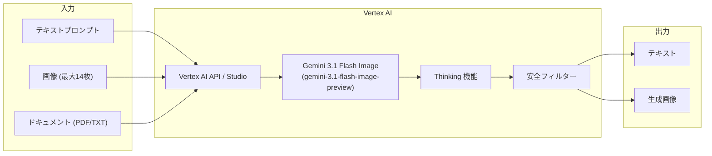

# Generative AI on Vertex AI: Gemini 3.1 Flash Image (Public Preview)

**リリース日**: 2026-02-26
**サービス**: Generative AI on Vertex AI
**機能**: Gemini 3.1 Flash Image
**ステータス**: Public Preview

[このアップデートのインフォグラフィックを見る](https://takech9203.github.io/google-cloud-news-summary/20260226-generative-ai-on-vertex-ai-gemini-3-1-flash-image.html)

## 概要

Gemini 3.1 Flash Image (`gemini-3.1-flash-image`) が Public Preview として利用可能になった。このモデルは画像理解と画像生成に最適化されており、価格とパフォーマンスのバランスに優れたモデルとして位置付けられている。Google は画像生成を行う際に Gemini 3.1 Flash Image の使用を推奨している。

Gemini 3.1 Flash Image は、テキストと画像を入力として受け取り、テキストと画像の両方を出力できるマルチモーダルモデルである。最大入力トークン数は 131,072、最大出力トークン数は 32,768 であり、前世代の Gemini 2.5 Flash Image (入力 32,768 トークン) と比較して入力コンテキストウィンドウが 4 倍に拡大されている。これにより、より多くのコンテキストを考慮した高品質な画像生成が可能になった。

本モデルは Thinking (思考プロセス) 機能をサポートしており、画像生成リクエストに対してより高度な推論を行うことができる。アプリケーション開発者、デザイナー、コンテンツクリエイターを主な対象ユーザーとしている。

**アップデート前の課題**

- Gemini 2.5 Flash Image は入力コンテキストウィンドウが 32,768 トークンに制限されており、大量のコンテキスト情報を画像生成に反映することが難しかった
- Gemini 2.5 Flash Image ではプロンプトあたりの最大入力画像数が 3 枚に制限されており、複数画像を参照した画像生成の柔軟性が低かった
- Gemini 2.5 Flash Image では Thinking (思考プロセス) 機能がサポートされておらず、複雑なプロンプトに対する推論能力に限界があった
- サポートされるアスペクト比が 10 種類に制限されていた (4:1 や 8:1 がなかった)

**アップデート後の改善**

- 入力コンテキストウィンドウが 131,072 トークンに拡大され、より多くのコンテキスト情報を活用した画像生成が可能になった
- プロンプトあたりの最大入力画像数が 14 枚に拡大され、複数画像を参照した編集や合成の柔軟性が大幅に向上した
- Thinking 機能のサポートにより、複雑なプロンプトに対してより高度な推論に基づく画像生成が可能になった
- サポートされるアスペクト比が 12 種類に拡大された (4:1、8:1 が追加)
- Flex PayGo 消費オプションが新たにサポートされ、柔軟な料金体系で利用可能になった

## アーキテクチャ図



Gemini 3.1 Flash Image は、テキスト・画像・ドキュメントを入力として受け取り、Thinking 機能による推論と安全フィルターを経て、テキストと画像を出力するマルチモーダルモデルである。

## サービスアップデートの詳細

### 主要機能

1. **高品質画像生成 (テキストから画像)**
   - テキストプロンプトから高品質な画像を生成
   - 12 種類のアスペクト比をサポート: 1:1, 3:2, 2:3, 3:4, 4:1, 4:3, 4:5, 5:4, 8:1, 9:16, 16:9, 21:9
   - 画像生成あたり最大 2,520 トークンを消費

2. **マルチモーダル入力対応**
   - テキストと画像の同時入力による画像編集・合成
   - プロンプトあたり最大 14 枚の入力画像をサポート
   - PDF およびプレーンテキストドキュメントの入力にも対応
   - Google Cloud Storage からの最大 30 MB ファイル入力をサポート

3. **Thinking (思考プロセス) 機能**
   - 複雑なプロンプトに対して推論プロセスを実行
   - Gemini 2.5 Flash Image ではサポートされていなかった新機能
   - より精緻で意図に沿った画像生成を実現

4. **テキストと画像のインターリーブ出力**
   - テキストと画像を混在させた出力が可能
   - 画像の説明や文脈をテキストで補完しながら画像を生成

5. **システムインストラクション対応**
   - システムインストラクションによるモデル動作のカスタマイズが可能
   - 一貫したスタイルやトーンでの画像生成を設定可能

## 技術仕様

### モデル仕様

| 項目 | Gemini 3.1 Flash Image | Gemini 2.5 Flash Image (比較) |
|------|------------------------|-------------------------------|
| モデル ID | `gemini-3.1-flash-image-preview` | `gemini-2.5-flash-image` |
| ステータス | Public Preview | GA |
| 最大入力トークン | 131,072 | 32,768 |
| 最大出力トークン | 32,768 | 32,768 |
| 画像生成あたりトークン消費 | 最大 2,520 | 1,290 |
| 最大入力画像数/プロンプト | 14 | 3 |
| サポートアスペクト比 | 12 種類 | 10 種類 |
| 入力サイズ上限 | 500 MB | 500 MB |
| 知識カットオフ | 2025 年 1 月 | 2024 年 6 月 |
| Thinking 機能 | サポート | 非サポート |
| Flex PayGo | サポート | 非サポート |

### サポートされる入出力形式

| 項目 | 詳細 |
|------|------|
| 入力形式 | テキスト、画像 |
| 出力形式 | テキストおよび画像 |
| 画像 MIME タイプ | `image/png`, `image/jpeg`, `image/webp`, `image/heic`, `image/heif` |
| ドキュメント MIME タイプ | `application/pdf`, `text/plain` |
| インライン画像最大サイズ | 7 MB |
| GCS 経由画像最大サイズ | 30 MB |
| ドキュメント最大サイズ | 50 MB (API/GCS), 7 MB (コンソール直接アップロード) |

### パラメータ設定

```json
{
  "temperature": 1.0,
  "topP": 0.95,
  "candidateCount": 1
}
```

- **Temperature**: 0.0 - 2.0 (デフォルト: 1.0)
- **topP**: 0.0 - 1.0 (デフォルト: 0.95)

### サポートされる消費オプション

| 消費オプション | サポート状況 |
|--------------|------------|
| Standard PayGo | サポート |
| Flex PayGo | サポート |
| Provisioned Throughput | サポート |
| Batch prediction | サポート |
| Priority PayGo | 非サポート |

## 設定方法

### 前提条件

1. Google Cloud プロジェクトの作成と課金の有効化
2. Vertex AI API の有効化
3. 適切な IAM 権限の設定

### 手順

#### ステップ 1: Vertex AI Studio からの利用 (コンソール)

Vertex AI Studio から直接画像生成を試すことができる。

1. [Vertex AI Studio > Create prompt](https://console.cloud.google.com/vertex-ai/studio/multimodal;mode=prompt) を開く
2. 「Switch model」をクリックし、`gemini-3.1-flash-image-preview` を選択
3. Outputs パネルで「Image and text」を選択
4. テキストプロンプトを入力して「Prompt」ボタンをクリック

#### ステップ 2: Python SDK での利用

```bash
pip install --upgrade google-genai
```

環境変数を設定する。

```bash
export GOOGLE_CLOUD_PROJECT=YOUR_PROJECT_ID
export GOOGLE_CLOUD_LOCATION=global
export GOOGLE_GENAI_USE_VERTEXAI=True
```

Python コードで画像を生成する。

```python
from google import genai
from google.genai.types import GenerateContentConfig, Modality
from PIL import Image
from io import BytesIO
import os

client = genai.Client()

response = client.models.generate_content(
    model="gemini-3.1-flash-image-preview",
    contents=(
        "Generate an image of the Eiffel tower with fireworks in the background."
    ),
    config=GenerateContentConfig(
        response_modalities=[Modality.TEXT, Modality.IMAGE],
    ),
)

for part in response.candidates[0].content.parts:
    if part.text:
        print(part.text)
    elif part.inline_data:
        image = Image.open(BytesIO(part.inline_data.data))
        output_dir = "output_folder"
        os.makedirs(output_dir, exist_ok=True)
        image.save(os.path.join(output_dir, "generated-image.png"))
```

#### ステップ 3: REST API での利用

```bash
curl -X POST \
  -H "Authorization: Bearer $(gcloud auth print-access-token)" \
  -H "Content-Type: application/json" \
  "https://global-aiplatform.googleapis.com/v1/projects/${PROJECT_ID}/locations/global/publishers/google/models/gemini-3.1-flash-image-preview:generateContent" \
  -d '{
    "contents": [{
      "parts": [{
        "text": "Generate an image of a sunset over the ocean."
      }]
    }],
    "generationConfig": {
      "responseModalities": ["TEXT", "IMAGE"]
    }
  }'
```

## メリット

### ビジネス面

- **大幅に拡張されたコンテキスト理解**: 131K トークンの入力ウィンドウにより、ブランドガイドライン、スタイルリファレンス、詳細な仕様書を含む複雑なプロンプトに対応可能
- **柔軟な料金オプション**: Standard PayGo、Flex PayGo、Provisioned Throughput、Batch prediction の 4 つの消費オプションをサポートし、ワークロードに応じた最適な料金選択が可能
- **多様なアスペクト比対応**: 12 種類のアスペクト比サポートにより、SNS 投稿、広告バナー、ウェブサイトヒーロー画像など、さまざまな用途に対応

### 技術面

- **マルチモーダル推論の強化**: Thinking 機能により、複雑な指示に対する理解度が向上し、意図に沿った高品質な画像を生成
- **大幅に増加した入力画像数**: 最大 14 枚の入力画像を参照可能になり、スタイル転送やコンポジション合成の精度が向上
- **知識カットオフの更新**: 2025 年 1 月までの知識を保持しており、最新のトレンドやコンテキストを反映した画像生成が可能

## デメリット・制約事項

### 制限事項

- Public Preview 段階であり、GA (一般提供) ではないため、プロダクション利用にあたっては Pre-GA Offerings Terms が適用される
- 現時点では `global` リージョンのみで利用可能 (Gemini 2.5 Flash Image は us-central1、europe-west1 など複数の個別リージョンでも利用可能)
- コード実行、Function calling、Gemini Live API、コンテキストキャッシュ、Vertex AI RAG Engine、Chat completions は非サポート
- Priority PayGo 消費オプションは非サポート

### 考慮すべき点

- 画像生成あたりのトークン消費量が最大 2,520 トークンであり、Gemini 2.5 Flash Image (1,290 トークン) と比較して約 2 倍のトークンを消費する可能性がある
- Preview 段階のため、GA 移行時にモデルの動作や API が変更される可能性がある
- セキュリティコントロール (Data residency、CMEK、VPC-SC、AXT) の情報がまだ公開されていない (Gemini 2.5 Flash Image の GA 版ではこれらがサポートされている)

## ユースケース

### ユースケース 1: EC サイトの商品画像自動生成

**シナリオ**: EC サイト運営者が、複数の商品写真とブランドガイドラインをもとに、統一感のあるプロモーション画像を自動生成する。

**実装例**:
```python
from google import genai
from google.genai.types import GenerateContentConfig, Modality

client = genai.Client()

# 複数の商品画像とブランドガイドラインを入力
response = client.models.generate_content(
    model="gemini-3.1-flash-image-preview",
    contents=[
        "以下のブランドガイドラインに沿って、添付の商品画像を使用した"
        "Instagram 用プロモーション画像を生成してください。"
        "背景は白、商品を中心に配置、ブランドカラーのアクセントを追加。",
        # 商品画像やガイドラインドキュメントをここに追加
    ],
    config=GenerateContentConfig(
        response_modalities=[Modality.TEXT, Modality.IMAGE],
    ),
)
```

**効果**: 14 枚の入力画像と 131K トークンのコンテキストウィンドウを活用し、ブランドの一貫性を保ちながら大量の商品画像を効率的に生成可能。

### ユースケース 2: マルチターン会話による画像編集

**シナリオ**: デザイナーが対話形式で画像を段階的に編集し、理想のデザインに近づける。

**効果**: Thinking 機能とインターリーブ出力により、各編集ステップで意図を正確に理解した上で画像を修正。マスク指定不要でテキスト指示のみで細部の編集が可能。

### ユースケース 3: コンテンツマーケティング素材の一括生成

**シナリオ**: マーケティングチームが、ブログ記事やソーシャルメディア投稿用の画像を、さまざまなアスペクト比で一括生成する。

**効果**: 12 種類のアスペクト比サポートにより、Instagram (1:1, 4:5)、Twitter/X (16:9)、Pinterest (2:3)、ウェブバナー (8:1, 21:9) など、各プラットフォームに最適化された画像を単一のモデルで生成可能。

## 料金

Gemini 3.1 Flash Image の料金はトークンベースの課金である。詳細な料金は [Vertex AI Generative AI Pricing](https://cloud.google.com/vertex-ai/generative-ai/pricing) を参照。

参考として、Gemini 2.5 Flash Image (GA) の Google AI Studio での料金体系は以下の通り (Vertex AI での料金は異なる場合がある)。

### 参考: Gemini 2.5 Flash Image 料金 (Google AI Studio)

| 項目 | Standard (100 万トークンあたり) |
|------|-------------------------------|
| 入力価格 (テキスト/画像) | $0.30 |
| 出力価格 (画像) | $0.039/枚 (1,290 トークン相当) |
| Batch 入力価格 | $0.15 |
| Batch 出力価格 (画像) | $0.0195/枚 |

Gemini 3.1 Flash Image は「改善された料金」を謳っており、Vertex AI での具体的な料金は公式料金ページで確認することを推奨する。

## 利用可能リージョン

現在 Public Preview 段階では、以下のリージョンで利用可能。

| リージョン | エンドポイント |
|-----------|--------------|
| Global | `global` |

Gemini 2.5 Flash Image (GA) は、Global に加えて us-central1、us-east1、us-east4、us-east5、us-south1、us-west1、us-west4、europe-central2、europe-north1、europe-southwest1、europe-west1、europe-west4、europe-west8 で利用可能である。Gemini 3.1 Flash Image の GA 移行に伴い、リージョンが拡大される可能性がある。

## 関連サービス・機能

- **[Gemini 3 Pro Image](https://cloud.google.com/vertex-ai/generative-ai/docs/models/gemini/3-pro-image)**: より高品質な画像生成が必要な場合の上位モデル (Preview)
- **[Gemini 2.5 Flash Image](https://cloud.google.com/vertex-ai/generative-ai/docs/models/gemini/2-5-flash-image)**: 現在 GA の画像生成モデル。複数リージョンでの利用やセキュリティコントロールが必要な場合に推奨
- **[Imagen 4](https://cloud.google.com/vertex-ai/generative-ai/docs/image/overview)**: Google の専用画像生成モデル。フォトリアリズムや特定のスタイル (印象派、アニメなど) が最優先の場合に推奨
- **[Vertex AI Studio](https://console.cloud.google.com/vertex-ai/studio)**: ブラウザ上でモデルを試用できるインタラクティブ環境
- **[Vertex AI Batch Prediction](https://cloud.google.com/vertex-ai/generative-ai/docs/multimodal/batch-prediction-gemini)**: 大量の画像生成リクエストを効率的に処理するためのバッチ処理機能

## 参考リンク

- [インフォグラフィック](https://takech9203.github.io/google-cloud-news-summary/20260226-generative-ai-on-vertex-ai-gemini-3-1-flash-image.html)
- [公式リリースノート](https://cloud.google.com/release-notes#February_26_2026)
- [Gemini 3.1 Flash Image ドキュメント](https://cloud.google.com/vertex-ai/generative-ai/docs/models/gemini/3-1-flash-image)
- [画像生成ガイド](https://cloud.google.com/vertex-ai/generative-ai/docs/multimodal/image-generation)
- [画像生成概要](https://cloud.google.com/vertex-ai/generative-ai/docs/image/overview)
- [料金ページ](https://cloud.google.com/vertex-ai/generative-ai/pricing)
- [利用可能リージョン](https://cloud.google.com/vertex-ai/generative-ai/docs/learn/locations)
- [Colab ノートブック: Gemini 3.1 Flash Image Generation](https://colab.research.google.com/github/GoogleCloudPlatform/generative-ai/blob/main/gemini/getting-started/intro_gemini_3_1_flash_image_gen.ipynb)

## まとめ

Gemini 3.1 Flash Image は、Vertex AI における画像生成モデルの最新版であり、131K トークンの大幅に拡張された入力コンテキスト、最大 14 枚の入力画像サポート、Thinking 機能の追加により、前世代の Gemini 2.5 Flash Image から大幅に進化している。Public Preview 段階ではあるが、Google が画像生成時の推奨モデルとして位置付けていることから、画像生成ワークロードを持つユーザーは早期に評価を開始し、GA 移行に備えることを推奨する。

---

**タグ**: #VertexAI #GenerativeAI #Gemini #ImageGeneration #GeminiFlash #PublicPreview #マルチモーダル #画像生成
