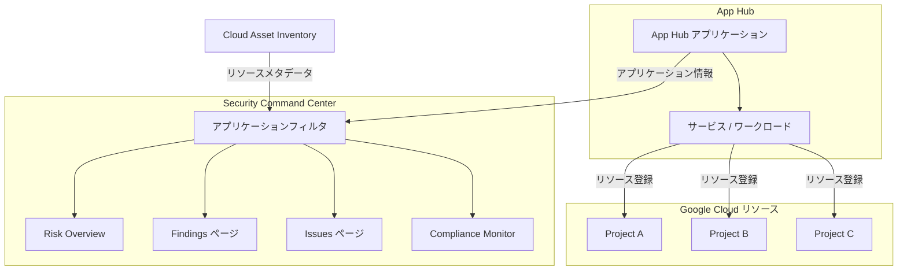

# Security Command Center: App Hub 統合 - リソーススコープフィルタリング

**リリース日**: 2026-02-26
**サービス**: Security Command Center, App Hub
**機能**: App Hub 統合によるリソーススコープフィルタリング
**ステータス**: Feature (全ティア対応: Standard-legacy, Standard, Premium, Enterprise)

[このアップデートのインフォグラフィックを見る](https://takech9203.github.io/google-cloud-news-summary/20260226-security-command-center-resource-scope-filter.html)

## 概要

Security Command Center に App Hub との統合機能が追加され、セキュリティの検出結果 (findings)、課題 (issues)、コンプライアンス情報を App Hub アプリケーションに登録されたリソースのみに絞り込んで表示できるようになった。これにより、組織全体のセキュリティデータの中から、特定のビジネスアプリケーションに関連するリソースだけを効率的に調査・分析できる。

この機能は Security Command Center の Standard-legacy、Standard、Premium、Enterprise の全サービスティアで利用可能であり、組織レベルでの Security Command Center 有効化が前提となる。App Hub で定義されたアプリケーション単位でセキュリティデータをフィルタリングすることで、アプリケーション中心のセキュリティ運用を実現する。

対象ユーザーは、複数のプロジェクトにまたがるリソースを持つ組織のセキュリティ管理者、コンプライアンス担当者、および App Hub を活用してアプリケーション管理を行っている DevOps / Platform Engineering チームである。

**アップデート前の課題**

- Security Command Center の検出結果は組織全体またはプロジェクト/フォルダ単位でしかフィルタリングできず、特定のビジネスアプリケーションに関連するリソースだけを抽出することが困難だった
- 複数プロジェクトにまたがるアプリケーションのセキュリティ状況を横断的に把握するには、手動でリソースを特定してフィルタリングする必要があった
- コンプライアンス監査時に、特定アプリケーションのスコープに限定したレポートを作成するための効率的な手段がなかった

**アップデート後の改善**

- App Hub アプリケーションに登録されたリソースを基準にして、Security Command Center の調査ビューをフィルタリングできるようになった
- Risk Overview、Findings、Issues、Compliance の各ページでアプリケーションフィルタが利用可能になり、アプリケーション単位でのセキュリティ分析が容易になった
- Cloud Asset Inventory と App Hub から取得したアプリケーション情報を活用し、ビジネスコンテキストに基づいたセキュリティ運用が可能になった

## アーキテクチャ図



App Hub に登録されたアプリケーションのリソース情報が Cloud Asset Inventory を通じて Security Command Center のアプリケーションフィルタに連携され、各調査ビューでアプリケーション単位のフィルタリングが可能になる。

## サービスアップデートの詳細

### 主要機能

1. **アプリケーションフィルタによるリソーススコープフィルタリング**
   - App Hub で作成されたアプリケーション単位で Security Command Center のデータをフィルタリング可能
   - 組織レベルでデータを表示している場合にのみアプリケーションフィルタが利用可能
   - フィルタには、Security Command Center が有効化されている組織と同じ組織内で App Hub に作成されたアプリケーションが一覧表示される

2. **対応する調査ビュー**
   - Risk Overview > All risk dashboard
   - Risk Overview > Data dashboard
   - Findings ページ
   - Issues ページ
   - Compliance > Monitor (New) タブ
   - Compliance > Monitor (New) > Framework Details ページ

3. **Cloud Asset Inventory との連携**
   - アプリケーションフィルタの情報は Cloud Asset Inventory と App Hub から取得される
   - App Hub にリソースを登録すると、そのメタデータが自動的に Cloud Asset Inventory に反映される
   - リアルタイムでリソースの所属アプリケーション情報が更新される

## 技術仕様

### フィルタリング対象

| 項目 | 詳細 |
|------|------|
| フィルタリング対象 | Findings (検出結果)、Issues (課題)、Compliance (コンプライアンス情報) |
| フィルタ条件 | App Hub アプリケーションに登録されたリソース |
| 利用可能スコープ | 組織レベルでのデータ表示時のみ |
| 非対応スコープ | プロジェクトまたはフォルダ単位の表示時は利用不可 |
| 対応ティア | Standard-legacy, Standard, Premium, Enterprise |
| データソース | Cloud Asset Inventory, App Hub |

### App Hub アプリケーションの前提条件

| 項目 | 詳細 |
|------|------|
| アプリケーション作成 | App Hub でアプリケーションを作成済みであること |
| リソース登録 | 対象リソースがアプリケーションにサービスまたはワークロードとして登録されていること |
| 組織の一致 | App Hub アプリケーションが Security Command Center と同じ組織にデプロイされていること |
| リソース登録上限 | 一度に最大 10 リソースを登録可能 |

## 設定方法

### 前提条件

1. Security Command Center が組織レベルで有効化されていること (いずれかのティア)
2. App Hub が有効化され、アプリケーション管理境界 (application management boundary) が設定されていること
3. 対象リソースが App Hub アプリケーションにサービスまたはワークロードとして登録されていること
4. 適切な IAM ロールが付与されていること

### 手順

#### ステップ 1: App Hub でアプリケーションを作成しリソースを登録

```bash
# App Hub API を有効化
gcloud services enable apphub.googleapis.com

# アプリケーションを作成 (リージョナル)
gcloud apphub applications create my-app \
    --location=us-central1 \
    --project=management-project-id

# サービスを検出して登録
gcloud apphub discovered-services list \
    --location=us-central1 \
    --project=management-project-id

# サービスを登録
gcloud apphub services create my-service \
    --application=my-app \
    --location=us-central1 \
    --discovered-service=DISCOVERED_SERVICE_URI \
    --project=management-project-id
```

App Hub のアプリケーション管理境界内のリソースを検出し、アプリケーションに登録する。

#### ステップ 2: Security Command Center でアプリケーションフィルタを使用

1. Google Cloud コンソールで Security Command Center を開く
2. 組織レベルでデータを表示していることを確認
3. Risk Overview、Findings、Issues、Compliance のいずれかのページに移動
4. アプリケーションフィルタから対象のアプリケーションを選択
5. フィルタが適用され、選択したアプリケーションに登録されたリソースに関連するデータのみが表示される

## メリット

### ビジネス面

- **アプリケーション単位のセキュリティ可視性**: ビジネスアプリケーションごとにセキュリティ状況を把握でき、経営層やアプリケーションオーナーへの報告が容易になる
- **コンプライアンス監査の効率化**: 特定アプリケーションのスコープに限定したコンプライアンス状況を迅速に確認でき、監査対応の工数を削減できる
- **責任分界の明確化**: アプリケーションごとにセキュリティ課題を分離して表示できるため、責任チームへのエスカレーションが明確になる

### 技術面

- **ノイズの削減**: 組織全体の大量の検出結果から、担当アプリケーションに関連するものだけを抽出でき、調査の効率が向上する
- **クロスプロジェクトの横断的な可視性**: 複数プロジェクトにまたがるアプリケーションのセキュリティデータを統合的に表示できる
- **Cloud Asset Inventory との自動連携**: App Hub にリソースを登録すると自動的にメタデータが連携されるため、手動設定が不要

## デメリット・制約事項

### 制限事項

- アプリケーションフィルタは組織レベルでのデータ表示時のみ利用可能であり、プロジェクトまたはフォルダ単位の表示では使用できない
- App Hub にリソースが登録されていない場合、フィルタの対象外となる (App Hub 未導入の組織では利用不可)
- 排他的サービス (exclusive service) は 1 つのアプリケーションにのみ登録可能
- 共有サービス (shared service) は複数のアプリケーションに登録可能だが、属性 (attribute) の変更に制限がある

### 考慮すべき点

- App Hub のアプリケーション管理境界の設計がセキュリティフィルタリングの精度に直接影響するため、事前に適切な境界設計が必要
- App Hub で管理されていないリソースはフィルタリング対象外となるため、網羅的なリソース登録が重要
- 組織内の全チームが App Hub を活用している状態が理想的であり、段階的な導入計画を検討する必要がある

## ユースケース

### ユースケース 1: マイクロサービスアプリケーションのセキュリティ監査

**シナリオ**: 複数の Google Cloud プロジェクトにまたがるマイクロサービスベースの EC サイトアプリケーション (フロントエンド、API ゲートウェイ、注文処理、決済処理など) のセキュリティ監査を実施する必要がある。

**実装例**:
1. App Hub で「EC サイト」アプリケーションを作成
2. 各プロジェクトの関連リソース (GKE クラスタ、Cloud SQL、Cloud Run サービスなど) をサービス / ワークロードとして登録
3. Security Command Center の Compliance Monitor で「EC サイト」アプリケーションを選択
4. PCI DSS などのコンプライアンスフレームワークに対する準拠状況をアプリケーションスコープで確認

**効果**: 組織全体の数千件の検出結果から、EC サイトに関連するリソースのコンプライアンス状況のみを抽出でき、監査対応時間を大幅に短縮できる。

### ユースケース 2: インシデント対応時のアプリケーションスコープ調査

**シナリオ**: セキュリティインシデントが発生した際に、影響を受けるアプリケーションのスコープを迅速に特定し、関連する全ての検出結果を調査する必要がある。

**効果**: Findings ページでアプリケーションフィルタを適用することで、インシデントに関連するアプリケーションの全リソースにわたる検出結果を即座に一覧表示でき、影響範囲の特定と対応の迅速化が可能になる。

## 料金

App Hub 統合機能自体は Security Command Center の全ティア (Standard-legacy、Standard、Premium、Enterprise) で利用可能であり、追加料金は発生しない。

Security Command Center の各ティアの料金体系は以下の通りである。

| ティア | 料金 | 備考 |
|--------|------|------|
| Standard | 無料 | 基本的なセキュリティ・コンプライアンス管理 |
| Premium | 有料 (従量課金 / サブスクリプション) | Standard に加え、脅威検出やコンプライアンス監視 |
| Enterprise | 有料 (サブスクリプション) | マルチクラウド対応の完全な CNAPP セキュリティ |

詳細な料金については [Security Command Center 料金ページ](https://cloud.google.com/security-command-center/pricing) を参照。

App Hub 自体の利用料金については [App Hub のドキュメント](https://cloud.google.com/app-hub/docs/overview) を参照。

## 利用可能リージョン

App Hub 統合機能は Security Command Center が有効化されている全てのリージョンで利用可能である。App Hub アプリケーションはグローバルまたはリージョナルで作成でき、Security Command Center のアプリケーションフィルタは組織レベルで動作するため、リージョンの制約を受けない。

App Hub のサポートリージョンについては [App Hub のロケーション](https://cloud.google.com/app-hub/docs/locations) を参照。

## 関連サービス・機能

- **[App Hub](https://cloud.google.com/app-hub/docs/overview)**: Google Cloud リソースをアプリケーション単位で論理的にグループ化・管理するサービス。今回の統合の基盤となるサービス
- **[Cloud Asset Inventory](https://cloud.google.com/asset-inventory/docs/overview)**: Google Cloud リソースのメタデータを管理するサービス。アプリケーションフィルタの情報ソースとして使用される
- **[Compliance Manager](https://cloud.google.com/security-command-center/docs/compliance-manager-overview)**: Security Command Center のコンプライアンス管理機能。App Hub 統合によりアプリケーション単位でのコンプライアンス監視が可能
- **[Cloud Hub](https://cloud.google.com/hub/docs/app-project-views)**: App Hub のデータモデルを活用してアラート、インシデント、パフォーマンスデータをアプリケーションコンテキストで表示する運用管理サービス
- **[Application Design Center](https://cloud.google.com/application-design-center/docs/overview)**: アプリケーションテンプレートの設計・デプロイを支援するサービス。App Hub と連携してアプリケーションのライフサイクル管理を提供

## 参考リンク

- [インフォグラフィック](https://takech9203.github.io/google-cloud-news-summary/20260226-security-command-center-resource-scope-filter.html)
- [公式リリースノート](https://cloud.google.com/release-notes#February_26_2026)
- [Security Command Center リリースノート](https://cloud.google.com/security-command-center/docs/release-notes)
- [App Hub 統合ドキュメント](https://cloud.google.com/security-command-center/docs/concepts-security-sources#apphub-integration)
- [App Hub でリソースを登録する](https://cloud.google.com/app-hub/docs/register-resources)
- [App Hub 概要](https://cloud.google.com/app-hub/docs/overview)
- [Security Command Center サービスティア](https://cloud.google.com/security-command-center/docs/service-tiers)
- [Security Command Center 料金ページ](https://cloud.google.com/security-command-center/pricing)

## まとめ

Security Command Center と App Hub の統合により、アプリケーション単位でセキュリティデータをフィルタリングする機能が全ティアで利用可能になった。この機能は、複数プロジェクトにまたがるアプリケーションのセキュリティ運用において、調査の効率化とコンプライアンス監査の迅速化に大きく貢献する。App Hub を既に利用している組織は速やかにこの統合機能を活用し、まだ導入していない組織はアプリケーション中心のセキュリティ運用を実現するために App Hub の導入を検討することを推奨する。

---

**タグ**: #SecurityCommandCenter #AppHub #セキュリティ #コンプライアンス #リソースフィルタリング #CloudAssetInventory #CNAPP #アプリケーション管理
