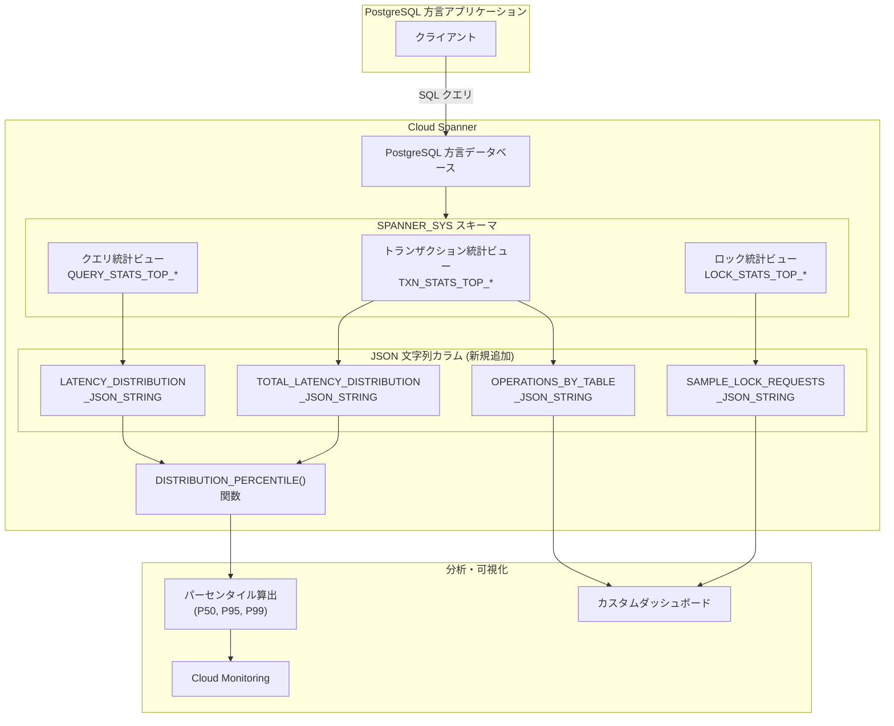

# Spanner: PostgreSQL 方言データベース向け JSON 文字列統計カラム

**リリース日**: 2026-02-26
**サービス**: Cloud Spanner
**機能**: JSON String Statistics Columns for PostgreSQL-dialect
**ステータス**: Feature (一般提供)

[このアップデートのインフォグラフィックを見る](https://takech9203.github.io/google-cloud-news-summary/20260226-spanner-json-statistics.html)

## 概要

Cloud Spanner が PostgreSQL 方言データベース向けに、各種統計ビューにおける JSON 文字列バージョンのカラムを提供開始した。これにより、PostgreSQL 方言データベースでも SPANNER_SYS テーブルからレイテンシ分布やロック統計などの詳細な統計情報を JSON 形式で取得できるようになる。

今回追加された JSON 文字列カラムは、トランザクション統計、クエリ統計、ロック統計の各ビューに対応しており、これまで GoogleSQL 方言でのみ `ARRAY<STRUCT>` 型として提供されていた統計情報を、PostgreSQL 方言でも JSON 互換文字列として利用可能にするものである。対象ユーザーは Spanner の PostgreSQL インターフェースを使用してデータベースのパフォーマンス分析やトラブルシューティングを行うデータベース管理者および開発者となる。

**アップデート前の課題**

- PostgreSQL 方言データベースでは `TOTAL_LATENCY_DISTRIBUTION` (ARRAY<STRUCT> 型) カラムがサポートされておらず、トランザクションのコミットレイテンシ分布を直接取得できなかった
- PostgreSQL 方言データベースでは `OPERATIONS_BY_TABLE` (ARRAY<STRUCT> 型) カラムがサポートされておらず、テーブルごとの INSERT/UPDATE 操作の影響を統計ビューから取得できなかった
- PostgreSQL 方言データベースでは `LATENCY_DISTRIBUTION` (ARRAY<STRUCT> 型) カラムがサポートされておらず、クエリ実行時間のヒストグラムを取得できなかった
- PostgreSQL 方言データベースでは `SAMPLE_LOCK_REQUESTS` (ARRAY<STRUCT> 型) カラムがサポートされておらず、ロック競合に寄与したサンプルリクエストの詳細を取得できなかった

**アップデート後の改善**

- `TOTAL_LATENCY_DISTRIBUTION_JSON_STRING` により、PostgreSQL 方言でもトランザクションのコミットレイテンシ分布を JSON 形式で取得可能になった
- `OPERATIONS_BY_TABLE_JSON_STRING` により、テーブルごとの書き込み操作統計を JSON 形式で取得可能になった
- `LATENCY_DISTRIBUTION_JSON_STRING` により、クエリ実行時間のヒストグラムを JSON 形式で取得可能になった
- `SAMPLE_LOCK_REQUESTS_JSON_STRING` により、ロック競合のサンプルリクエスト詳細を JSON 形式で取得可能になった
- `SPANNER_SYS.DISTRIBUTION_PERCENTILE()` 関数と組み合わせることで、パーセンタイルレイテンシの算出が PostgreSQL 方言でも可能になった

## アーキテクチャ図



Spanner の SPANNER_SYS スキーマ内の各統計ビューに JSON 文字列カラムが追加され、PostgreSQL 方言データベースからも統計データの取得と分析が可能になった構成図。DISTRIBUTION_PERCENTILE 関数と組み合わせることで、パーセンタイルレイテンシの算出も実現できる。

## サービスアップデートの詳細

### 主要機能

1. **TOTAL_LATENCY_DISTRIBUTION_JSON_STRING (トランザクション統計)**
   - トランザクションのコミットレイテンシ (最初のトランザクション操作開始からコミットまたはアボートまでの時間) のヒストグラムを JSON 形式で提供
   - `TOTAL_LATENCY_DISTRIBUTION` カラムの JSON 互換文字列表現
   - トランザクションが複数回アボートして最終的にコミットした場合、各試行のレイテンシが計測される
   - 値は秒単位で計測される
   - 対象ビュー: `SPANNER_SYS.TXN_STATS_TOP_MINUTE`, `TXN_STATS_TOP_10MINUTE`, `TXN_STATS_TOP_HOUR`

2. **OPERATIONS_BY_TABLE_JSON_STRING (トランザクション統計)**
   - テーブルごとの INSERT/UPDATE 操作の影響を JSON 形式で提供
   - 影響を受けた行数 (`INSERT_OR_UPDATE_COUNT`) と書き込みバイト数 (`INSERT_OR_UPDATE_BYTES`) を含む
   - テーブルへの書き込み負荷の可視化とインサイト取得に活用可能
   - 対象ビュー: `SPANNER_SYS.TXN_STATS_TOP_MINUTE`, `TXN_STATS_TOP_10MINUTE`, `TXN_STATS_TOP_HOUR`

3. **LATENCY_DISTRIBUTION_JSON_STRING (クエリ統計)**
   - クエリ実行時間のヒストグラムを JSON 形式で提供
   - `LATENCY_DISTRIBUTION` カラムの JSON 互換文字列表現
   - 値は秒単位で計測される
   - 失敗したクエリ (構文エラーや一時的なエラーでリトライ後成功したものを含む) の統計も含まれる
   - 対象ビュー: `SPANNER_SYS.QUERY_STATS_TOP_MINUTE`, `QUERY_STATS_TOP_10MINUTE`, `QUERY_STATS_TOP_HOUR`

4. **SAMPLE_LOCK_REQUESTS_JSON_STRING (ロック統計)**
   - ロック競合に寄与したサンプルロックリクエストの詳細を JSON 形式で提供
   - 各サンプルには `lock_mode` (ロックモード)、`column` (テーブル名.カラム名)、`transaction_tag` (トランザクションタグ) の 3 フィールドを含む
   - 1 行あたり最大 20 サンプルまで格納
   - 対象ビュー: `SPANNER_SYS.LOCK_STATS_TOP_MINUTE`, `LOCK_STATS_TOP_10MINUTE`, `LOCK_STATS_TOP_HOUR`

## 技術仕様

### JSON 文字列カラム一覧

| カラム名 | 統計ビュー | データ型 | 対応する ARRAY<STRUCT> カラム |
|----------|-----------|---------|------------------------------|
| TOTAL_LATENCY_DISTRIBUTION_JSON_STRING | トランザクション統計 | STRING | TOTAL_LATENCY_DISTRIBUTION |
| OPERATIONS_BY_TABLE_JSON_STRING | トランザクション統計 | STRING | OPERATIONS_BY_TABLE |
| LATENCY_DISTRIBUTION_JSON_STRING | クエリ統計 | STRING | LATENCY_DISTRIBUTION |
| SAMPLE_LOCK_REQUESTS_JSON_STRING | ロック統計 | STRING | SAMPLE_LOCK_REQUESTS |

### 統計ビューの時間粒度とデータ保持期間

| 時間粒度 | ビュー名サフィックス | データ保持期間 |
|---------|---------------------|---------------|
| 1 分間隔 | `*_MINUTE` | 過去 6 時間 |
| 10 分間隔 | `*_10MINUTE` | 過去 4 日間 |
| 1 時間間隔 | `*_HOUR` | 過去 30 日間 |

### Distribution 構造

JSON 文字列に含まれる Distribution オブジェクトは、Cloud Monitoring API の [Distribution](https://cloud.google.com/monitoring/api/ref_v3/rest/v3/TypedValue#Distribution) 型と同じ構造を持つ。

```json
{
  "count": 100,
  "mean": 0.025,
  "sumOfSquaredDeviation": 0.5,
  "numFiniteBuckets": 29,
  "growthFactor": 2.0,
  "scale": 1e-05,
  "bucketCounts": [0, 1, 3, 5, 10, ...]
}
```

### DISTRIBUTION_PERCENTILE 関数

```sql
-- パーセンタイルレイテンシの算出
SELECT
  SPANNER_SYS.DISTRIBUTION_PERCENTILE(
    total_latency_distribution_json_string,
    99.0
  ) AS p99_latency
FROM spanner_sys.txn_stats_top_minute
WHERE interval_end = (
  SELECT MAX(interval_end)
  FROM spanner_sys.txn_stats_top_minute
);
```

## 設定方法

### 前提条件

1. Cloud Spanner インスタンスが作成済みであること
2. PostgreSQL 方言のデータベースが作成済みであること
3. データベースに対する `spanner.databases.read` 権限を持つ IAM ロール (例: `roles/spanner.databaseReader`) が付与されていること

### 手順

#### ステップ 1: トランザクション統計の JSON 文字列カラムを取得

```sql
-- PostgreSQL 方言でのトランザクション統計取得
SELECT
  interval_end,
  fprint,
  total_latency_distribution_json_string,
  operations_by_table_json_string
FROM spanner_sys.txn_stats_top_minute
WHERE interval_end = (
  SELECT MAX(interval_end)
  FROM spanner_sys.txn_stats_top_minute
)
ORDER BY avg_commit_latency_seconds DESC;
```

このクエリにより、直近 1 分間のトランザクション統計を、コミットレイテンシの降順で取得できる。

#### ステップ 2: クエリ統計のパーセンタイルレイテンシを算出

```sql
-- PostgreSQL 方言での P99 レイテンシ算出
SELECT
  text_fingerprint,
  execution_count,
  avg_latency_seconds,
  SPANNER_SYS.DISTRIBUTION_PERCENTILE(
    latency_distribution_json_string, 50.0
  ) AS p50_latency,
  SPANNER_SYS.DISTRIBUTION_PERCENTILE(
    latency_distribution_json_string, 95.0
  ) AS p95_latency,
  SPANNER_SYS.DISTRIBUTION_PERCENTILE(
    latency_distribution_json_string, 99.0
  ) AS p99_latency
FROM spanner_sys.query_stats_top_minute
WHERE interval_end = (
  SELECT MAX(interval_end)
  FROM spanner_sys.query_stats_top_minute
)
ORDER BY p99_latency DESC
LIMIT 10;
```

DISTRIBUTION_PERCENTILE 関数を使用して、クエリごとの P50/P95/P99 レイテンシを算出する。

#### ステップ 3: ロック統計のサンプルリクエストを JSON で取得

```sql
-- PostgreSQL 方言でのロック統計取得
SELECT
  cast(row_range_start_key AS varchar) AS row_range_start_key,
  lock_wait_seconds,
  sample_lock_requests_json_string
FROM spanner_sys.lock_stats_top_minute
WHERE interval_end = (
  SELECT MAX(interval_end)
  FROM spanner_sys.lock_stats_top_minute
)
ORDER BY lock_wait_seconds DESC;
```

ロック競合のサンプルリクエストを JSON 文字列として取得し、競合の原因となるトランザクションやカラムを特定できる。

## メリット

### ビジネス面

- **PostgreSQL 方言ユーザーの運用効率向上**: PostgreSQL 方言データベースでもパフォーマンス分析が本番環境で完結するようになり、運用の効率化とダウンタイム削減に寄与する
- **トラブルシューティング時間の短縮**: レイテンシ分布やロック競合の詳細をデータベース内で直接取得できるため、問題特定までの時間が短縮される

### 技術面

- **GoogleSQL/PostgreSQL 方言間の機能パリティ向上**: これまで GoogleSQL 方言でのみ利用可能だった統計カラムの情報を、PostgreSQL 方言でも JSON 文字列として同等に取得できるようになった
- **JSON 形式の汎用性**: STRING 型の JSON データは、アプリケーション側での解析が容易であり、外部監視ツールやダッシュボードとの連携が簡便になる
- **パーセンタイルレイテンシの算出**: `SPANNER_SYS.DISTRIBUTION_PERCENTILE()` 関数と組み合わせることで、P50、P95、P99 等の実用的なレイテンシメトリクスを PostgreSQL 方言から算出可能になった

## デメリット・制約事項

### 制限事項

- JSON 文字列カラムは STRING 型であり、GoogleSQL 方言の `ARRAY<STRUCT>` 型とは異なるため、クエリの記述方法が異なる
- `SAMPLE_LOCK_REQUESTS_JSON_STRING` のサンプル数は 1 行あたり最大 20 件に制限される
- ロック競合のサンプリングはランダムに行われるため、競合の片方 (ホルダーまたはウェイター) のみが記録される可能性がある

### 考慮すべき点

- 統計データはベストエフォートで収集されるため、内部ネットワーキングの問題等により一部の統計が欠落する可能性がある
- 統計データの保持期間は固定 (1 分: 6 時間、10 分: 4 日、1 時間: 30 日) であり、変更できない。長期保存が必要な場合はデータを定期的にエクスポートすることが推奨される
- 既に GoogleSQL 方言の `ARRAY<STRUCT>` カラムを使用しているクエリがある場合、PostgreSQL 方言への移行時にクエリの書き換えが必要になる

## ユースケース

### ユースケース 1: PostgreSQL 方言データベースでのレイテンシ異常検知

**シナリオ**: PostgreSQL 方言で運用している Spanner データベースで、特定のトランザクションのレイテンシが急増したことを検知した。原因を特定するために、トランザクション統計からレイテンシ分布を確認する。

**実装例**:
```sql
-- 直近 1 時間のトランザクションを P99 レイテンシの降順で取得
SELECT
  fprint,
  commit_attempt_count,
  avg_commit_latency_seconds,
  SPANNER_SYS.DISTRIBUTION_PERCENTILE(
    total_latency_distribution_json_string, 99.0
  ) AS p99_latency,
  SPANNER_SYS.DISTRIBUTION_PERCENTILE(
    total_latency_distribution_json_string, 50.0
  ) AS p50_latency,
  operations_by_table_json_string
FROM spanner_sys.txn_stats_top_hour
WHERE interval_end = (
  SELECT MAX(interval_end)
  FROM spanner_sys.txn_stats_top_hour
)
ORDER BY p99_latency DESC
LIMIT 5;
```

**効果**: P99 と P50 のレイテンシの差が大きいトランザクションを特定し、テール・レイテンシの原因となるトランザクションパターンを発見できる。さらに `operations_by_table_json_string` により、どのテーブルへの書き込みが集中しているかも把握できる。

### ユースケース 2: ロック競合の原因分析

**シナリオ**: PostgreSQL 方言のデータベースでトランザクションのアボート率が上昇した。ロック統計を使って競合の原因を特定する。

**実装例**:
```sql
-- ロック競合のサンプルリクエストを JSON で確認
SELECT
  cast(row_range_start_key AS varchar) AS row_key,
  lock_wait_seconds,
  sample_lock_requests_json_string
FROM spanner_sys.lock_stats_top_10minute
WHERE interval_end = (
  SELECT MAX(interval_end)
  FROM spanner_sys.lock_stats_top_10minute
)
  AND lock_wait_seconds > 1.0
ORDER BY lock_wait_seconds DESC;
```

**効果**: ロック待ち時間が長いキー範囲を特定し、`sample_lock_requests_json_string` から競合を引き起こしているカラムとトランザクションタグを把握することで、アプリケーション側のスキーマ設計やトランザクション分離の改善を行える。

## 料金

今回の JSON 文字列統計カラムの利用に追加料金は発生しない。統計情報の取得は SPANNER_SYS スキーマへの SQL クエリとして実行され、通常の Spanner の読み取り操作として課金される。

Spanner の料金は使用するエディション (Standard / Enterprise / Enterprise Plus) とコンピュート容量およびストレージ使用量に基づいて課金される。詳細は [Spanner 料金ページ](https://cloud.google.com/spanner/pricing) を参照。

## 利用可能リージョン

この機能は Spanner が利用可能なすべてのリージョンおよびマルチリージョン構成で利用可能。PostgreSQL 方言データベースがサポートされているすべての構成で使用できる。利用可能なリージョン構成の一覧は [Spanner インスタンス構成](https://cloud.google.com/spanner/docs/instance-configurations) を参照。

## 関連サービス・機能

- **Cloud Monitoring**: SPANNER_SYS の統計データの一部は Cloud Monitoring のメトリクスとして公開されており、ダッシュボードやアラートと連携できる
- **Transaction Insights ダッシュボード**: Google Cloud コンソールの Spanner セクションから、トランザクション統計を時系列グラフとして可視化できるプリビルトダッシュボード
- **Query Insights ダッシュボード**: CPU 使用率のスパイクや非効率なクエリを特定するためのプリビルトダッシュボード
- **Lock Insights ダッシュボード**: ロック待ち時間を可視化し、レイテンシがロック競合に起因するかどうかを確認できるダッシュボード
- **Spanner Graph Query Visualization**: Spanner のクエリ実行計画を視覚的に分析するツール

## 参考リンク

- [インフォグラフィック](https://takech9203.github.io/google-cloud-news-summary/20260226-spanner-json-statistics.html)
- [公式リリースノート](https://cloud.google.com/release-notes#February_26_2026)
- [Spanner リリースノート](https://cloud.google.com/spanner/docs/release-notes#February_26_2026)
- [トランザクション統計ドキュメント](https://cloud.google.com/spanner/docs/introspection/transaction-statistics)
- [クエリ統計ドキュメント](https://cloud.google.com/spanner/docs/introspection/query-statistics)
- [ロック統計ドキュメント](https://cloud.google.com/spanner/docs/introspection/lock-statistics)
- [Spanner イントロスペクション概要](https://cloud.google.com/spanner/docs/introspection)
- [料金ページ](https://cloud.google.com/spanner/pricing)

## まとめ

今回のアップデートにより、Cloud Spanner の PostgreSQL 方言データベースにおけるパフォーマンス分析とトラブルシューティングの機能が大幅に向上した。従来は GoogleSQL 方言でしか取得できなかったレイテンシ分布、テーブル書き込み統計、ロック競合詳細が JSON 文字列カラムとして PostgreSQL 方言でも利用可能になり、GoogleSQL/PostgreSQL 間の機能パリティが改善された。PostgreSQL 方言で Spanner を運用しているチームは、SPANNER_SYS の統計ビューに対するクエリを見直し、新しい JSON 文字列カラムを活用したパフォーマンスモニタリングの導入を推奨する。

---

**タグ**: #CloudSpanner #PostgreSQL #Statistics #JSON #IntrospectionTools #PerformanceMonitoring #LockStatistics #TransactionStatistics #QueryStatistics #SPANNER_SYS
