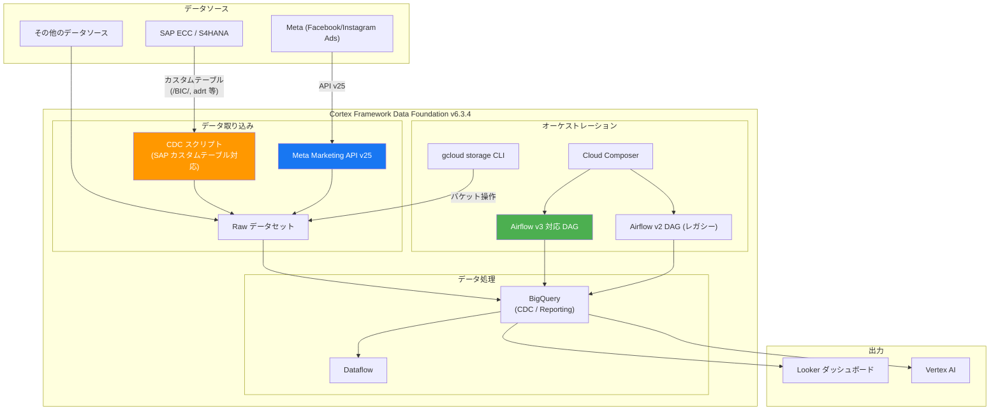

# Cortex Framework: Airflow v3 対応と複数の修正 (Release 6.3.4)

**リリース日**: 2026-02-27
**サービス**: Cortex Framework
**機能**: Airflow v3 対応、SAP CDC 改善、Meta API アップグレード、各種バグ修正
**ステータス**: Fixed / Announcement (Release 6.3.4)

[このアップデートのインフォグラフィックを見る](https://takech9203.github.io/google-cloud-news-summary/20260227-cortex-framework-airflow-v3-support.html)

## 概要

Google Cloud Cortex Framework の Release 6.3.4 がリリースされた。本リリースの最大の変更点は、新規デプロイメントで生成される Cloud Composer DAG が Apache Airflow v3 に対応したことである。Airflow v2 は引き続きサポートされるが、End-of-Life が近づいているため、移行計画の策定が推奨されている。

SAP ワークロードにおいては、CDC (Change Data Capture) スクリプトがテーブル名にスラッシュ (/) を含むカスタムテーブルに対応し、オプションの adrt テーブルが CDC テーブルリストに追加された。マーケティングワークロードでは、Meta Marketing API が v21 から v25 にアップグレードされ、最新の API 仕様に追従している。その他、Cloud SDK から gcloud storage CLI への移行、DAG パッケージインポートの改行問題の修正、ターゲットバケットアクセス検証のエラーハンドリング改善といったマイナー修正も含まれている。

本アップデートは、Cortex Framework を利用して SAP、Salesforce、Meta 等のデータソースから BigQuery にデータを統合しているすべてのユーザーに影響する。特に Airflow v3 への移行準備と、Meta マーケティングデータを利用している組織は対応内容を確認すべきである。

**アップデート前の課題**

- Cortex Framework が生成する Composer DAG は Airflow v2 のみ対応しており、Airflow v3 環境では互換性の問題が発生する可能性があった
- SAP CDC スクリプトがテーブル名にスラッシュ (/) を含むカスタムテーブル (例: /BIC/ や /SAPPO/ プレフィックスのテーブル) を処理できなかった
- Meta Marketing API が v21 で動作しており、v22 以降で導入された新機能やフィールド名の変更に対応していなかった
- Cloud SDK のストレージ操作に旧式の gsutil コマンドが使用されていた
- DAG パッケージインポート時に改行の問題が発生するケースがあった
- ターゲットバケットへのアクセス検証で適切なエラーハンドリングが行われていなかった

**アップデート後の改善**

- 新規デプロイメントで生成される Composer DAG が Airflow v3 と互換性を持つようになった (Airflow v2 も引き続きサポート)
- SAP CDC スクリプトがスラッシュを含むカスタムテーブル名を正しく処理できるようになった (既存デプロイメントには影響なし)
- オプションの adrt テーブルが SAP CDC テーブルリストに追加され、追加のデータ連携が可能になった
- Meta Marketing API が v25 にアップグレードされ、最新の API 仕様とフィールド名に対応した
- Cloud SDK が gcloud storage CLI に移行され、最新の推奨ツールチェーンに準拠した
- DAG パッケージインポートの改行問題が修正され、安定性が向上した
- ターゲットバケットアクセス検証のエラーハンドリングが改善され、問題の特定が容易になった

## アーキテクチャ図



Cortex Framework Data Foundation v6.3.4 のアーキテクチャを示す。SAP からの CDC 取り込みではスラッシュを含むカスタムテーブルが新たにサポートされ、Meta からのデータ取り込みは API v25 にアップグレードされている。Cloud Composer はAirflow v3 対応 DAG と従来の v2 DAG の両方を実行できる。

## サービスアップデートの詳細

### 主要機能

1. **Airflow v3 対応 DAG 生成**
   - 新規デプロイメントで生成されるすべての Cloud Composer DAG が Airflow v3 と互換性を持つように更新された
   - Airflow v2 は引き続きサポートされるが、Airflow v2 の End-of-Life が近づいているため、移行計画の策定が推奨される
   - 既存デプロイメントの DAG は自動的に更新されない。新規デプロイメントまたは再デプロイメントが必要

2. **SAP CDC カスタムテーブル対応**
   - SAP システムではテーブル名にスラッシュ (/) を含むカスタムテーブル (例: `/BIC/AZFIE0100`、`/SAPPO/POBJ`) が一般的に使用される
   - これまで CDC スクリプトの生成コードがスラッシュを含むテーブル名を適切に処理できなかったが、Release 6.3.4 でこの問題が修正された
   - 既存デプロイメントには影響しない。新規デプロイメントまたは再デプロイメント時に適用される
   - adrt テーブル (アドレスの短縮テキストテーブル) がオプションとして SAP CDC テーブルリストに追加された

3. **Meta Marketing API v25 アップグレード**
   - Cortex Framework の Meta データソース用テンプレートが Meta Marketing API v21 から v25 にアップグレードされた
   - API v25 への移行に伴い、一部のフィールド名が変更されている。詳細は Meta API Changelog を参照
   - v21 から v25 の間に導入された新機能や改善が利用可能になった
   - 既存デプロイメントで Meta データを利用している場合、再デプロイメント時にフィールド名の変更に注意が必要

4. **gcloud storage CLI への移行**
   - Cloud SDK のストレージ操作が旧式の gsutil から gcloud storage CLI に移行された
   - gcloud storage CLI は gsutil と比較してパフォーマンスが向上しており、Google Cloud の推奨ツールである

5. **DAG パッケージインポートの修正**
   - DAG パッケージインポート時の改行処理に関するバグが修正された
   - これにより DAG の読み込みエラーが解消される

6. **バケットアクセス検証の改善**
   - ターゲットバケットへのアクセス検証時のエラーハンドリングが改善された
   - 権限不足やバケット不在などの問題がより明確なエラーメッセージで報告される

## 技術仕様

### Airflow v3 互換性

| 項目 | 詳細 |
|------|------|
| 対象範囲 | 新規デプロイメントで生成されるすべての Composer DAG |
| Airflow v2 サポート | 引き続きサポート (ただし EOL が近づいている) |
| 既存デプロイメントへの影響 | なし (再デプロイメントで適用) |
| 推奨アクション | Airflow v3 への移行計画を策定 |

### SAP CDC 変更点

| 項目 | 詳細 |
|------|------|
| スラッシュ対応 | テーブル名に `/` を含むカスタムテーブルをサポート |
| 追加テーブル | adrt (アドレス短縮テキスト) テーブルをオプション追加 |
| 既存デプロイメントへの影響 | なし |
| 設定ファイル | `cdc_settings.yaml` で管理 |

### Meta Marketing API バージョン

| 項目 | 詳細 |
|------|------|
| 旧バージョン | v21 |
| 新バージョン | v25 |
| 変更内容 | フィールド名の変更、新機能の追加 |
| 参照先 | Meta API Changelog |

### Cloud Composer 接続設定 (Meta ワークロード)

```yaml
# ingestion_settings.yaml (Meta)
source_to_raw:
  - base_table: "campaigns"
    load_frequency: "@daily"
    object_endpoint: "campaigns"
    entity_type: "dimension"

raw_to_cdc:
  - base_table: "campaign_insights"
    row_identifiers: "campaign_id,date_start"
    load_frequency: "@daily"
```

## 設定方法

### 前提条件

1. Cortex Framework Data Foundation リポジトリのクローン
2. Cloud Composer (Airflow) 環境のセットアップ
3. BigQuery データセットの準備 (Raw、CDC、Reporting)
4. 各データソースへの接続設定 (SAP、Meta 等)

### 手順

#### ステップ 1: リポジトリの更新

```bash
# Cortex Data Foundation リポジトリを最新版に更新
cd cortex-data-foundation
git pull origin main
git checkout v6.3.4
```

#### ステップ 2: デプロイメント設定の確認

```bash
# config.json の確認と編集
cat config/config.json
```

Meta ワークロードの設定例:
```json
{
  "marketing": {
    "deployMeta": true,
    "Meta": {
      "deployCDC": true,
      "datasets": {
        "cdc": "CDC_Meta",
        "raw": "RAW_Meta",
        "reporting": "REPORTING_Meta"
      }
    }
  }
}
```

#### ステップ 3: デプロイメントの実行

```bash
# Cloud Build でデプロイメントを実行
gcloud builds submit \
  --substitutions=_GCS_BUCKET=LOGS_BUCKET_NAME,_BUILD_ACCOUNT='projects/SOURCE_PROJECT/serviceAccounts/CLOUD_BUILD_SA@SOURCE_PROJECT.iam.gserviceaccount.com'
```

#### ステップ 4: DAG のコピー

```bash
# 生成された DAG を Cloud Composer バケットにコピー
gcloud storage -m cp -r gs://OUTPUT_BUCKET/dags/ gs://COMPOSER_DAG_BUCKET/
gcloud storage -m cp -r gs://OUTPUT_BUCKET/data/ gs://COMPOSER_DAG_BUCKET/
```

## メリット

### ビジネス面

- **将来への対応**: Airflow v3 対応により、Cloud Composer の最新バージョンへのスムーズな移行が可能になり、Airflow v2 の EOL に備えられる
- **SAP データ統合の拡大**: スラッシュを含むカスタムテーブルに対応したことで、より多くの SAP データを Cortex Framework に取り込み可能になった
- **マーケティングデータの最新化**: Meta API v25 への対応により、Meta の最新の広告分析機能とデータフィールドを活用できる

### 技術面

- **互換性の向上**: Airflow v3 と v2 の両方をサポートすることで、段階的な移行が可能
- **ツールチェーンの最新化**: gcloud storage CLI への移行により、パフォーマンスの向上と Google Cloud の推奨プラクティスへの準拠を実現
- **安定性の向上**: DAG パッケージインポートの修正とエラーハンドリングの改善により、デプロイメントと運用の信頼性が向上

## デメリット・制約事項

### 制限事項

- Airflow v3 対応 DAG は新規デプロイメントでのみ生成される。既存デプロイメントの DAG を更新するには再デプロイメントが必要
- SAP CDC のスラッシュ対応も同様に、既存デプロイメントには自動適用されない
- Meta API v25 へのアップグレードに伴い、v21 からのフィールド名変更がある。既存のカスタムレポートやクエリの更新が必要になる場合がある

### 考慮すべき点

- Airflow v2 の EOL が近づいているため、v3 への移行計画を早期に策定することが望ましい
- Meta API のバージョンアップに伴うフィールド名変更について、Meta API Changelog を事前に確認し、影響範囲を特定すること
- SAP システムにおけるカスタムテーブルの命名規則を確認し、スラッシュを含むテーブルが適切に設定されているか検証すること
- Cloud Composer 2 から Cloud Composer 3 への移行を計画している場合、サイドバイサイド移行 (スナップショットまたは移行スクリプト) が必要であり、インプレースアップグレードは不可

## ユースケース

### ユースケース 1: SAP カスタムテーブルを含む CDC パイプラインの構築

**シナリオ**: SAP S/4HANA システムで `/BIC/` プレフィックスの BW テーブルや `/SAPPO/` プレフィックスのカスタムテーブルを使用しており、これらのテーブルの変更データを BigQuery に連携したい。

**実装例**:
```yaml
# cdc_settings.yaml
SAP:
  - base_table: "/BIC/AZFIE0100"
    raw_table: "bic_azfie0100"
    load_frequency: "@daily"
    row_identifiers: "MANDT,KEY_FIELD"
  - base_table: "adrt"
    raw_table: "adrt"
    load_frequency: "@daily"
    row_identifiers: "MANDT,ADDRNUMBER,DATE_FROM,NATION,ADDR_GROUP"
```

**効果**: これまで手動でスラッシュを含むテーブル名を変換する必要があったが、Cortex Framework が自動的に処理するようになり、SAP カスタムテーブルのデータ統合が効率化される。

### ユースケース 2: Airflow v3 環境での Cortex Framework デプロイメント

**シナリオ**: Cloud Composer 3 (Airflow v3) 環境を新規構築し、Cortex Framework を使用して SAP と Meta のデータを BigQuery に統合したい。

**効果**: Release 6.3.4 により、新規デプロイメントで生成される DAG が Airflow v3 と互換性を持つため、Cloud Composer 3 環境でそのまま利用できる。Airflow v2 用の DAG を手動で変換する手間が不要になる。

### ユースケース 3: Meta マーケティングデータの最新 API 対応

**シナリオ**: Meta (Facebook/Instagram) の広告キャンペーンデータを Cortex Framework 経由で BigQuery に取り込み、Looker でマーケティングダッシュボードを構築している。API v25 の新機能を活用したい。

**効果**: Meta Marketing API v25 への対応により、最新のキャンペーン分析フィールドやインサイトデータが利用可能になる。既存のパイプラインを再デプロイすることで、最新の API 仕様に自動的に対応する。

## 料金

Cortex Framework 自体はオープンソースソリューションであり、追加のライセンス費用は発生しない。ただし、Cortex Framework が利用する以下の Google Cloud サービスに対して通常の料金が適用される。

| サービス | 料金の概要 |
|----------|-----------|
| BigQuery | ストレージおよびクエリ処理に対する料金。オンデマンドまたは定額制 |
| Cloud Composer | 環境のコンピュートリソースおよびストレージに対する料金 |
| Dataflow | データ処理ジョブの実行時間に対する料金 |
| Cloud Build | ビルド実行時間に対する料金 (毎日 120 分の無料枠あり) |
| Cloud Storage | データの保存容量に対する料金 |

詳細な料金については各サービスの料金ページを参照のこと。

## 関連サービス・機能

- **Cloud Composer**: Cortex Framework の DAG をオーケストレーションするマネージド Apache Airflow サービス。Airflow v3 対応の主要な関連サービス
- **BigQuery**: Cortex Framework Data Foundation のコアストレージおよびデータ処理基盤。Raw、CDC、Reporting の各データセットを管理
- **Dataflow**: Meta 等のマーケティングデータソースからの Source-to-Raw データ取り込みに使用
- **Cloud Build**: Cortex Framework のデプロイメントプロセスを自動化
- **Cloud Storage**: DAG ファイル、データファイル、ログの保存に使用。今回 gcloud storage CLI に移行
- **Secret Manager**: Meta アクセストークン等の機密情報を安全に保管

## 参考リンク

- [インフォグラフィック](https://takech9203.github.io/google-cloud-news-summary/20260227-cortex-framework-airflow-v3-support.html)
- [公式リリースノート](https://cloud.google.com/release-notes#February_27_2026)
- [Cortex Framework ドキュメント](https://cloud.google.com/cortex/docs/overview)
- [Cortex Framework Data Foundation GitHub リポジトリ](https://github.com/GoogleCloudPlatform/cortex-data-foundation)
- [Cortex Framework デプロイメント手順](https://cloud.google.com/cortex/docs/deployment-step-one)
- [Cloud Composer から Airflow v3 への移行](https://airflow.apache.org/docs/apache-airflow/stable/installation/upgrading_to_airflow3.html)
- [Meta Marketing API Changelog](https://developers.facebook.com/docs/marketing-api/marketing-api-changelog/)
- [Cortex Framework Meta データソース](https://cloud.google.com/cortex/docs/marketing-meta)
- [Cortex Framework SAP CDC 設定](https://cloud.google.com/cortex/docs/operational-sap)
- [Cloud Composer 料金](https://cloud.google.com/composer/pricing)
- [BigQuery 料金](https://cloud.google.com/bigquery/pricing)

## まとめ

Cortex Framework Release 6.3.4 は、Airflow v3 対応、SAP CDC のカスタムテーブルサポート、Meta API のバージョンアップなど、複数の重要な改善を含むリリースである。特に Airflow v2 の EOL が近づいていることから、Cloud Composer 環境で Cortex Framework を運用しているユーザーは、Airflow v3 への移行計画を早期に策定し、新規デプロイメントまたは再デプロイメントにより v3 対応 DAG を取得することが推奨される。Meta マーケティングデータを利用しているユーザーは、API v25 へのアップグレードに伴うフィールド名変更を Meta API Changelog で確認し、カスタムクエリやレポートへの影響を事前に評価すべきである。

---

**タグ**: #CortexFramework #Airflow #CloudComposer #SAP #CDC #Meta #MarketingAPI #DataFoundation #BigQuery #GCP
