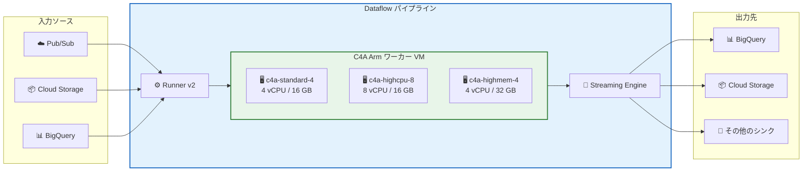

# Dataflow: C4A マシンシリーズ (Arm) サポート GA

**リリース日**: 2026-02-27
**サービス**: Dataflow, Compute Engine
**機能**: C4A マシンシリーズ (Arm プロセッサ) サポートの一般提供
**ステータス**: GA (一般提供)

📊 [このアップデートのインフォグラフィックを見る](https://takech9203.github.io/google-cloud-news-summary/20260227-dataflow-c4a-arm.html)

## 概要

Dataflow における C4A マシンシリーズ (Arm プロセッサ) のサポートが一般提供 (GA) となった。C4A は Google 独自の Axion プロセッサ (Arm Neoverse V2 ベース) を搭載した初の Arm ベース VM シリーズであり、電力効率に最適化された Arm アーキテクチャにより、多くのワークロードでコストパフォーマンスの向上が期待できる。

今回の GA により、Dataflow ユーザーはバッチジョブとストリーミングジョブの両方で C4A マシンタイプをワーカー VM として本番環境で利用できるようになった。C4A は最大 72 vCPU、576 GB の DDR5 メモリを提供し、Titanium インフラストラクチャによる最大 100 Gbps のネットワーク性能を実現する。Dataflow の料金はマシンタイプファミリーに依存しないため、Arm ベースの C4A を使用することで、同等の x86 ベースマシンと比較してコスト削減を達成できる可能性がある。

対象ユーザーは、データ処理パイプラインの実行コストを最適化したいデータエンジニア、大規模なバッチ処理やストリーミング処理を行う組織、および Arm アーキテクチャへの移行を検討しているチームである。

**アップデート前の課題**

- Dataflow で Arm VM を使用する場合、Tau T2A マシンシリーズ (Ampere Altra プロセッサ、最大 48 vCPU) のみが利用可能であり、より高性能な Arm プロセッサの選択肢がなかった
- T2A は最大 48 vCPU・192 GB メモリまでの構成に限定されており、大規模ワークロードへの対応に制約があった
- Google Axion プロセッサの性能優位性 (Neoverse V2、DDR5 メモリ、Titanium ベースのネットワーキング) を Dataflow パイプラインで活用できなかった

**アップデート後の改善**

- C4A マシンシリーズが GA となり、最大 72 vCPU・576 GB DDR5 メモリの高性能 Arm VM を Dataflow で本番利用可能になった
- Google Axion プロセッサによる優れた電力効率とコストパフォーマンスをデータ処理パイプラインで活用できるようになった
- C4A の standard、highcpu、highmem の各マシンタイプから、ワークロードに最適な構成を選択できるようになった
- Titanium インフラストラクチャによる最大 100 Gbps (Tier_1) のネットワーク性能が利用可能になった

## アーキテクチャ図



Dataflow パイプラインで C4A Arm ワーカー VM を使用する際の全体的なアーキテクチャを示す。Runner v2 が必須であり、ストリーミングジョブでは Streaming Engine も併用する必要がある。

## サービスアップデートの詳細

### 主要機能

1. **C4A マシンタイプの Dataflow 対応**
   - C4A の standard (4 GB/vCPU)、highcpu (2 GB/vCPU)、highmem (8 GB/vCPU) をワーカー VM として使用可能
   - 1 vCPU から 72 vCPU まで幅広いサイズ構成をサポート
   - バッチジョブとストリーミングジョブの両方に対応

2. **Google Axion プロセッサの活用**
   - Arm Neoverse V2 ベースの Google Axion CPU を搭載
   - 各 vCPU がシングルコアにマッピング (SMT なし) され、一貫したパフォーマンスを提供
   - DDR5 メモリによる高帯域幅メモリアクセス

3. **マルチアーキテクチャコンテナサポート**
   - カスタムコンテナを Arm VM で使用する場合、マルチアーキテクチャイメージのビルドを推奨
   - Docker Buildx または Cloud Build を使用して linux/amd64 と linux/arm64 の両アーキテクチャ対応イメージを作成可能
   - Apache Beam SDK の公式イメージはマルチアーキテクチャに対応済み

## 技術仕様

### C4A マシンタイプ

| マシンタイプ | vCPU | メモリ | メモリ/vCPU |
|-------------|------|--------|------------|
| c4a-standard-1 | 1 | 4 GB | 4 GB |
| c4a-standard-4 | 4 | 16 GB | 4 GB |
| c4a-standard-8 | 8 | 32 GB | 4 GB |
| c4a-standard-16 | 16 | 64 GB | 4 GB |
| c4a-standard-32 | 32 | 128 GB | 4 GB |
| c4a-standard-48 | 48 | 192 GB | 4 GB |
| c4a-standard-72 | 72 | 288 GB | 4 GB |
| c4a-highcpu-* | 1-72 | 2 GB/vCPU | 2 GB |
| c4a-highmem-* | 1-72 | 8 GB/vCPU | 8 GB |

### 要件

| 項目 | 詳細 |
|------|------|
| Apache Beam SDK | Java / Python / Go SDK バージョン 2.50.0 以降 |
| Dataflow Runner | Runner v2 が必須 |
| ストリーミングジョブ | Streaming Engine が必須 |
| リージョン | C4A マシンが利用可能なリージョン・ゾーンを選択する必要がある |
| ディスク | Hyperdisk のみサポート (Persistent Disk は非対応) |
| ネットワーク | gVNIC インターフェースを使用 (最大 100 Gbps Tier_1) |

### 制限事項

| 制限 | 説明 |
|------|------|
| GPU | Arm VM では GPU を使用できない |
| Cloud Profiler | プロファイリングは非対応 |
| Dataflow Prime | Arm VM では Dataflow Prime を利用できない |
| Right fitting | 非対応 |
| Worker VM メトリクス | Cloud Monitoring エージェントからのワーカー VM メトリクス受信は非対応 |
| コンテナイメージの事前ビルド | 非対応 |

## 設定方法

### 前提条件

1. Apache Beam SDK バージョン 2.50.0 以降がインストールされていること
2. C4A マシンが利用可能なリージョンを使用すること
3. カスタムコンテナを使用する場合、マルチアーキテクチャイメージをビルドしていること

### 手順

#### ステップ 1: パイプラインオプションで C4A マシンタイプを指定

**Java:**
```bash
--workerMachineType=c4a-standard-4
```

**Python:**
```bash
--machine_type=c4a-standard-4
```

**Go:**
```bash
--worker_machine_type=c4a-standard-4
```

#### ステップ 2: Runner v2 を有効化 (必須)

```bash
--experiments=use_runner_v2
```

#### ステップ 3: ストリーミングジョブの場合、Streaming Engine を有効化

**Java (2.11.0 以降):**
```bash
--enableStreamingEngine
```

**Python / Go:**
```bash
# Python SDK 2.21.0+ / Go SDK 2.33.0+ ではデフォルトで有効
```

#### ステップ 4: マルチアーキテクチャコンテナのビルド (カスタムコンテナ使用時)

```bash
# Docker Buildx を使用した例
docker buildx create --driver=docker-container --use

docker buildx build \
  --platform=linux/amd64,linux/arm64 \
  -t REGISTRY/IMAGE:TAG \
  --push .
```

#### 実行例: バッチジョブ (Python)

```bash
python my_pipeline.py \
  --runner=DataflowRunner \
  --project=my-project \
  --region=us-west1 \
  --machine_type=c4a-standard-4 \
  --experiments=use_runner_v2 \
  --temp_location=gs://my-bucket/temp
```

#### 実行例: ストリーミングジョブ (Java)

```bash
mvn compile exec:java \
  -Dexec.mainClass=com.example.MyPipeline \
  -Dexec.args=" \
    --runner=DataflowRunner \
    --project=my-project \
    --region=us-west1 \
    --workerMachineType=c4a-standard-4 \
    --experiments=use_runner_v2 \
    --enableStreamingEngine"
```

## メリット

### ビジネス面

- **コスト削減**: Arm アーキテクチャの電力効率により、同等の x86 VM と比較してコストパフォーマンスが向上する。Dataflow の料金はマシンタイプファミリーに依存しないため、Arm の効率性がそのままコスト削減に直結する
- **スケーラビリティの向上**: 最大 72 vCPU・576 GB メモリの構成により、以前の T2A (最大 48 vCPU) と比較して大規模なワークロードに対応可能

### 技術面

- **パフォーマンスの一貫性**: C4A は各 vCPU がシングルコアにマッピング (SMT なし) されるため、コンピュート集約型ワークロードで安定したパフォーマンスを提供する
- **高帯域幅ネットワーク**: Titanium ベースの gVNIC により最大 100 Gbps (Tier_1) のネットワーク性能を実現し、大量データの入出力が求められるパイプラインに適している
- **DDR5 メモリ**: DDR5 メモリにより高い帯域幅と低いレイテンシを実現し、メモリ集約型のデータ処理に有利

## デメリット・制約事項

### 制限事項

- GPU が必要なワークロード (ML 推論の一部など) では Arm VM を使用できない
- Dataflow Prime と Arm VM の併用は非対応であり、Vertical Autoscaling などの Prime 専用機能は利用できない
- Cloud Profiler によるパイプラインプロファイリングが利用できず、パフォーマンス分析の手段が限定される
- Right fitting (リソースの自動最適化) が非対応

### 考慮すべき点

- カスタムコンテナを使用している場合、マルチアーキテクチャイメージへの移行が必要になる場合がある。既存の x86 専用コンテナはそのままでは動作しない
- C4A が利用可能なリージョン・ゾーンに制限があるため、データの所在地やレイテンシ要件を考慮してリージョンを選択する必要がある
- Runner v2 が必須であるため、Runner v1 に依存する既存パイプライン (一部のクラシックテンプレートなど) は対応が必要
- ネイティブライブラリやバイナリを使用する場合、Arm 互換のバージョンが必要

## ユースケース

### ユースケース 1: 大規模 ETL バッチ処理のコスト最適化

**シナリオ**: 毎日数 TB のデータを BigQuery に投入する ETL パイプラインを運用しており、コンピュートコストの削減が課題となっている。

**実装例**:
```bash
python etl_pipeline.py \
  --runner=DataflowRunner \
  --project=my-project \
  --region=us-west1 \
  --machine_type=c4a-standard-8 \
  --experiments=use_runner_v2 \
  --disk_size_gb=50 \
  --temp_location=gs://my-bucket/temp
```

**効果**: C4A の Arm プロセッサによる電力効率の向上と、Dataflow のマシンタイプ非依存の料金体系を組み合わせることで、同等の処理性能を維持しながらインフラコストを削減できる。

### ユースケース 2: リアルタイムストリーミングデータ処理

**シナリオ**: Pub/Sub からリアルタイムデータを受信し、変換・集計して BigQuery に書き込むストリーミングパイプラインを、高いコストパフォーマンスで運用したい。

**実装例**:
```bash
java -jar streaming_pipeline.jar \
  --runner=DataflowRunner \
  --project=my-project \
  --region=us-west1 \
  --workerMachineType=c4a-highcpu-4 \
  --experiments=use_runner_v2 \
  --enableStreamingEngine \
  --diskSizeGb=30
```

**効果**: Streaming Engine との組み合わせにより、ワーカー VM のリソース消費を最小化しつつ、C4A の highcpu タイプでコンピュート集約型のストリーミング処理を効率的に実行できる。

### ユースケース 3: ML データ前処理パイプライン

**シナリオ**: 画像やテキストデータの前処理を Dataflow で行い、ML トレーニング用のデータセットを準備している。大量のメモリを必要とする変換処理がある。

**効果**: c4a-highmem タイプ (8 GB/vCPU) を使用することで、メモリ集約型の前処理を効率的に実行できる。GPU が不要な前処理フェーズ (リサイズ、正規化、特徴抽出など) において、Arm の優れたコストパフォーマンスを活用できる。

## 料金

Dataflow の料金はマシンタイプファミリーに依存しない。C4A (Arm) を使用しても、x86 ベースのマシンと同じ Dataflow の料金体系が適用される。つまり、Arm プロセッサの効率性によるコストメリットを追加料金なしで享受できる。

### 料金構成要素

| リソース | 課金単位 |
|---------|---------|
| vCPU | vCPU 時間あたり |
| メモリ | GB 時間あたり |
| Streaming Engine | Streaming Engine Compute Unit あたり (ストリーミングジョブのみ) |
| Dataflow Shuffle | 処理データ GB あたり (バッチジョブ、使用時) |
| Persistent Disk | GB 時間あたり (使用時) |

最新の料金については [Dataflow 料金ページ](https://cloud.google.com/dataflow/pricing) を参照。Committed Use Discounts (CUD) による割引も適用可能。

## 利用可能リージョン

C4A マシンシリーズは多くのリージョンで利用可能であり、以下は主要なリージョンの一部である。

| リージョン | ロケーション |
|-----------|------------|
| us-west1 | The Dalles, Oregon |
| us-south1 | Dallas, Texas |
| us-west2 | Los Angeles, California |
| asia-east1 | Changhua County, Taiwan |
| asia-northeast1 | Tokyo, Japan |
| europe-west1 | St. Ghislain, Belgium |
| europe-west2 | London, England |
| europe-west3 | Frankfurt, Germany |
| europe-west4 | Eemshaven, Netherlands |
| europe-north1 | Hamina, Finland |
| europe-north2 | Stockholm, Sweden |
| europe-southwest1 | Madrid, Spain |
| europe-central2 | Warsaw, Poland |
| africa-south1 | Johannesburg, South Africa |

利用可能なゾーンの完全なリストは [Compute Engine リージョンとゾーン](https://cloud.google.com/compute/docs/regions-zones#available) を参照。Dataflow ジョブの実行には `--region` パラメータでリージョンを指定し、ゾーンの自動選択に任せることが推奨される。

## 関連サービス・機能

- **Compute Engine C4A マシンシリーズ**: Dataflow ワーカー VM の基盤となる Arm ベースのマシンシリーズ。Google Axion プロセッサを搭載
- **Dataflow Runner v2**: Arm VM の利用に必須のランタイム。カスタムコンテナのサポートやクロス言語変換などの機能を提供
- **Streaming Engine**: ストリーミングジョブで Arm VM を使用する際に必須。パイプライン実行を Dataflow サービスバックエンドにオフロード
- **Cloud Build**: マルチアーキテクチャコンテナイメージのビルドに使用可能。Docker Buildx と組み合わせて amd64/arm64 の両方に対応したイメージを作成
- **Artifact Registry**: カスタムコンテナイメージの保存・管理に使用
- **Tau T2A マシンシリーズ**: 従来から Dataflow でサポートされていた Arm VM (Ampere Altra プロセッサ、最大 48 vCPU)。C4A はこの上位互換として位置づけられる

## 参考リンク

- 📊 [インフォグラフィック](https://takech9203.github.io/google-cloud-news-summary/20260227-dataflow-c4a-arm.html)
- [公式リリースノート](https://cloud.google.com/release-notes#February_27_2026)
- [Use Arm VMs on Dataflow](https://cloud.google.com/dataflow/docs/guides/use-arm-vms)
- [C4A マシンシリーズ仕様](https://cloud.google.com/compute/docs/general-purpose-machines#c4a_series)
- [Arm VMs on Compute Engine](https://cloud.google.com/compute/docs/instances/arm-on-compute)
- [Dataflow ワーカー VM の設定](https://cloud.google.com/dataflow/docs/guides/configure-worker-vm)
- [マルチアーキテクチャコンテナイメージのビルド](https://cloud.google.com/dataflow/docs/guides/multi-architecture-container)
- [Dataflow 料金](https://cloud.google.com/dataflow/pricing)
- [利用可能なリージョンとゾーン](https://cloud.google.com/compute/docs/regions-zones#available)

## まとめ

Dataflow における C4A マシンシリーズ (Arm) サポートの GA は、データ処理パイプラインのコストパフォーマンス最適化において重要な選択肢を提供する。Google Axion プロセッサの電力効率と、Dataflow のマシンタイプ非依存の料金体系を組み合わせることで、既存パイプラインのコード変更を最小限に抑えながらインフラコストの削減が期待できる。GPU や Dataflow Prime が不要なバッチ・ストリーミングワークロードを運用しているユーザーは、まず開発・テスト環境で C4A の性能とコストを評価し、段階的に本番環境への適用を検討することを推奨する。

---

**タグ**: #Dataflow #ComputeEngine #C4A #Arm #GoogleAxion #GA #コスト最適化 #データ処理 #ApacheBeam #StreamingEngine
