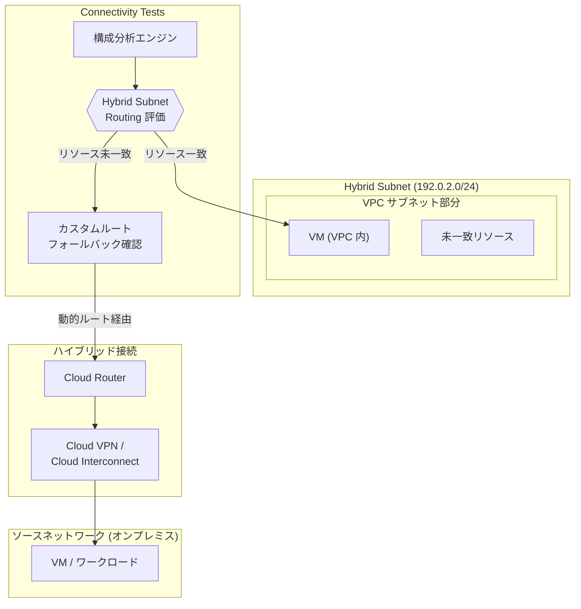

# Network Intelligence Center: Connectivity Tests - Hybrid Subnet Routing 評価サポート

**リリース日**: 2026-02-27
**サービス**: Network Intelligence Center, VPC
**機能**: Connectivity Tests - Hybrid Subnet Routing 評価
**ステータス**: Feature

:bar_chart: [このアップデートのインフォグラフィックを見る](https://takech9203.github.io/google-cloud-news-summary/20260227-network-intelligence-center-connectivity-tests.html)

## 概要

Network Intelligence Center の Connectivity Tests が、VPC の Hybrid Subnet Routing の評価に対応した。Hybrid Subnet は、オンプレミスネットワーク (ソースネットワーク) と VPC サブネットを組み合わせて単一の論理サブネットを構成する機能で、ワークロードの移行時に IP アドレスを変更せずにオンプレミスと Google Cloud 間の内部接続を維持できる。今回のアップデートにより、Connectivity Tests はこの Hybrid Subnet のルーティング動作をシミュレーションし、VPC 内のリソースに一致しないパケット (unmatched resources) のルーティング経路も含めて評価できるようになった。

この機能は、Hybrid Subnets を使用してオンプレミスから Google Cloud へワークロードを移行している、または移行を計画しているネットワーク管理者やクラウドアーキテクトを対象としている。移行中のハイブリッド環境におけるルーティングの正当性を事前に検証できるため、ネットワーク障害のリスクを大幅に低減できる。

**アップデート前の課題**

Hybrid Subnets を使用した移行環境において、ルーティングの検証には以下の課題があった。

- Connectivity Tests は Hybrid Subnet のルーティングロジックを理解しておらず、ハイブリッドサブネット内のパケット転送パスを正確にシミュレーションできなかった
- VPC サブネット内でリソースに一致しない宛先 (停止中の VM やソースネットワーク側のワークロード) に対するルーティング動作を Connectivity Tests で検証できなかった
- Hybrid Subnet 固有のルーティングプロセス (カスタムルートへのフォールバック) を手動で確認する必要があり、構成ミスの検出が困難だった

**アップデート後の改善**

今回のアップデートにより以下が可能になった。

- Connectivity Tests で Hybrid Subnet Routing の転送パスを正確にシミュレーションできるようになった
- VPC サブネット内のリソースに一致しないパケットの特別なルーティングプロセス (unmatched resources routing) を評価できるようになった
- Hybrid Subnet のリージョン制約やカスタムルートのフォールバック動作を含めた、エンドツーエンドの接続性検証が可能になった

## アーキテクチャ図



Connectivity Tests がパケットの宛先を評価し、VPC サブネット内のリソースに一致する場合はローカルのハイブリッドサブネットルートを使用し、一致しない場合はカスタム動的・静的ルートへのフォールバックプロセスを評価する。

## サービスアップデートの詳細

### 主要機能

1. **Hybrid Subnet Routing の評価**
   - Connectivity Tests が Hybrid Subnet のルーティングロジックを完全にシミュレーションし、パケットの転送パスを正確に評価する
   - VPC サブネット内のローカルハイブリッドサブネットルートによる配信判定をサポート

2. **Unmatched Resources のルーティング評価**
   - パケットの宛先が VPC サブネット内の稼働中の VM や内部転送ルールに関連付けられていない場合の特別なルーティングプロセスを評価する
   - Google Cloud が使用するフォールバックプロセス (ポリシーベースルート、サブネットルート、タグ付きスタティックルートの除外後にカスタムルートを評価) をシミュレーションする

3. **リージョン制約の検証**
   - Hybrid Subnet ではネクストホップがサブネットと同一リージョンにある必要があり、異なるリージョンのネクストホップはパケットドロップとなる
   - Connectivity Tests がこのリージョン制約を検証し、構成ミスを検出する

## 技術仕様

### Hybrid Subnet Routing の動作モデル

| 項目 | 詳細 |
|------|------|
| パケット宛先が VPC 内リソースに一致 | ローカルハイブリッドサブネットルートで配信 |
| パケット宛先が VPC 内リソースに未一致 | カスタムルート (動的/静的) へフォールバック |
| フォールバック時の除外ルート | ポリシーベースルート、サブネットルート、タグ付きスタティックルート、ハイブリッドサブネットより広い宛先のルート |
| リージョン制約 | ネクストホップは Hybrid Subnet と同一リージョン必須 |
| 異なるリージョンのネクストホップ | パケットドロップ (ICMP type 3, code 0) |
| サポートする IP バージョン | IPv4 のみ (IPv6 は非対応) |

### Unmatched Resources のルーティングプロセス

```
1. Hybrid Subnet を含む VPC ネットワークを特定
   - 同一 VPC の場合: ローカルサブネットルート
   - VPC ピアリングの場合: ピアリングサブネットルート

2. VPC ネットワークの全ルートから以下を除外:
   - ポリシーベースルート
   - サブネットルート
   - ネットワークタグ付きスタティックルート
   - Hybrid Subnet より広い宛先のルート

3. 最も具体的な宛先のマッチング → 優先カテゴリの選択

4. ルーティング判定:
   - ルートが見つかり、ネクストホップが同一リージョン → パケット配信
   - 複数ルートが見つかる → ECMP で分散
   - ルートなし or ネクストホップが異なるリージョン → パケットドロップ
```

## 設定方法

### 前提条件

1. Network Intelligence Center API (`networkmanagement.googleapis.com`) が有効であること
2. `networkmanagement.connectivitytests.create` 権限を持つ IAM ロール (例: `roles/networkmanagement.admin`)
3. Hybrid Subnets が構成済みの VPC ネットワーク

### 手順

#### ステップ 1: Connectivity Test の作成 (gcloud)

```bash
gcloud network-management connectivity-tests create TEST_NAME \
    --source-instance=SOURCE_VM \
    --source-network=projects/PROJECT_ID/global/networks/VPC_NAME \
    --destination-ip-address=DEST_IP \
    --destination-network=projects/PROJECT_ID/global/networks/VPC_NAME \
    --protocol=TCP \
    --destination-port=80
```

宛先 IP アドレスに Hybrid Subnet 内のアドレスを指定することで、Hybrid Subnet Routing の評価が自動的に実行される。

#### ステップ 2: テスト結果の確認

```bash
gcloud network-management connectivity-tests describe TEST_NAME \
    --format="yaml(reachabilityDetails)"
```

テスト結果にはパケットの転送パスが表示され、Hybrid Subnet のルーティングロジックに基づいた判定結果 (配信またはドロップ) を確認できる。

## メリット

### ビジネス面

- **移行リスクの低減**: オンプレミスから Google Cloud への移行中、Hybrid Subnet のルーティング構成を事前に検証できるため、移行に伴うダウンタイムやネットワーク障害のリスクを低減できる
- **トラブルシューティング時間の短縮**: 移行中のルーティング問題を Connectivity Tests で迅速に特定でき、問題解決にかかる時間を短縮できる

### 技術面

- **エンドツーエンドの可視性**: Hybrid Subnet の複雑なルーティングロジック (リソース一致判定、カスタムルートへのフォールバック、リージョン制約) をシミュレーションし、パケットの転送パスを可視化できる
- **構成検証の自動化**: Hybrid Subnet の構成ミス (例: ネクストホップが異なるリージョンに配置されている) を Connectivity Tests が自動検出できる

## デメリット・制約事項

### 制限事項

- Hybrid Subnets 自体が Preview ステータスであり、本番環境での利用にはリスクが伴う
- Connectivity Tests はオンプレミスネットワーク側の構成 (ルートやファイアウォールルール) を検証できない。Google Cloud 内の構成のみが検証対象となる
- IPv6 トラフィックの Hybrid Subnet Routing には対応していない

### 考慮すべき点

- Hybrid Subnet の VPC サブネット、Cloud Router、HA VPN トンネル / VLAN アタッチメントはすべて同一リージョンに配置する必要がある
- VPC ネットワークあたりの Hybrid Subnet 数は 25 以下が推奨される (ハードリミットではないが、超過すると接続性や安定性の問題が発生する可能性がある)
- NCC (Network Connectivity Center) は Hybrid Subnets と完全には互換性がなく、接続スポークからハイブリッドサブネットの IP アドレス範囲へのトラフィックはルーティング動作が予測不能になる場合がある

## ユースケース

### ユースケース 1: オンプレミスから Google Cloud への段階的なワークロード移行

**シナリオ**: 企業がオンプレミスデータセンターから Google Cloud へワークロードを段階的に移行している。IP アドレスを変更せずに、一部の VM をオンプレミスに残しながら他の VM を VPC に移行している。

**実装例**:
```bash
# ソースネットワーク側の VM から VPC 内の移行済み VM への接続性テスト
gcloud network-management connectivity-tests create migration-test-01 \
    --source-ip-address=192.0.2.10 \
    --source-network=projects/my-project/global/networks/hybrid-vpc \
    --destination-ip-address=192.0.2.50 \
    --destination-network=projects/my-project/global/networks/hybrid-vpc \
    --protocol=TCP \
    --destination-port=443

# VPC 内 VM からソースネットワーク上のまだ移行していないワークロードへの接続性テスト
gcloud network-management connectivity-tests create migration-test-02 \
    --source-instance=projects/my-project/zones/us-central1-a/instances/migrated-vm \
    --destination-ip-address=192.0.2.100 \
    --destination-network=projects/my-project/global/networks/hybrid-vpc \
    --protocol=TCP \
    --destination-port=8080
```

**効果**: 移行のフェーズごとにルーティング構成を検証し、VPC に移行した VM とオンプレミスに残る VM の間の接続性を確認できる。Unmatched resources のルーティングが正しく動作していることを事前に確認することで、移行フェーズ間のダウンタイムを防止できる。

### ユースケース 2: Hybrid Subnet のリージョン制約違反の検出

**シナリオ**: 複数リージョンに展開されたネットワークで、Cloud Router や VPN トンネルの配置が Hybrid Subnet と異なるリージョンになっている構成ミスを検出する。

**効果**: Connectivity Tests が異なるリージョンのネクストホップによるパケットドロップを事前に検出し、移行前に構成を修正できる。グローバルダイナミックルーティングモードが有効であっても、Hybrid Subnet ではリージョンが異なるとパケットがドロップされるため、この検証は特に重要である。

## 料金

Connectivity Tests の利用料金については、公式ドキュメントを参照のこと。Network Intelligence Center の各モジュールの料金体系は以下の通り。

- Hybrid Subnets 自体の追加料金はなし。ただし、VPC 側のリソースとネットワークトラフィックに対する通常の課金が発生する
- Connectivity Tests の実行に伴う費用については、[Network Intelligence Center の料金ページ](https://cloud.google.com/network-intelligence-center/pricing)を参照

## 関連サービス・機能

- **[Hybrid Subnets](/vpc/docs/hybrid-subnets)**: オンプレミスネットワークと VPC サブネットを組み合わせて単一の論理サブネットを構成するプレビュー機能。今回の Connectivity Tests アップデートの評価対象
- **[Cloud Router](/network-connectivity/docs/router/concepts/overview)**: Hybrid Subnet のソースネットワークへの動的ルートを学習し、unmatched resources のルーティングに使用される
- **[Cloud VPN](/network-connectivity/docs/vpn/concepts/overview) / [Cloud Interconnect](/network-connectivity/docs/interconnect/concepts/overview)**: Hybrid Subnet のソースネットワークと VPC を接続するハイブリッド接続サービス
- **[Network Analyzer](/network-intelligence-center/docs/network-analyzer/overview)**: VPC ネットワーク構成を自動的に監視し、ミスコンフィギュレーションを検出する Network Intelligence Center のモジュール
- **[VPC Network Peering](/vpc/docs/vpc-peering)**: Hybrid Subnet を含む VPC ネットワークをピアリングで接続し、ピアネットワークからハイブリッドサブネット内の宛先に到達可能にする

## 参考リンク

- :bar_chart: [インフォグラフィック](https://takech9203.github.io/google-cloud-news-summary/20260227-network-intelligence-center-connectivity-tests.html)
- [公式リリースノート](https://cloud.google.com/release-notes#February_27_2026)
- [Connectivity Tests 概要ドキュメント](https://cloud.google.com/network-intelligence-center/docs/connectivity-tests/concepts/overview)
- [Hybrid Subnets ドキュメント](https://cloud.google.com/vpc/docs/hybrid-subnets)
- [Hybrid Subnet Routing](https://cloud.google.com/vpc/docs/hybrid-subnets#routing)
- [Unmatched Resources in Hybrid Subnets](https://cloud.google.com/vpc/docs/routes#hybrid-subnet-no-match)
- [Network Intelligence Center 料金ページ](https://cloud.google.com/network-intelligence-center/pricing)

## まとめ

今回のアップデートにより、Connectivity Tests が Hybrid Subnet Routing を評価できるようになり、オンプレミスから Google Cloud への移行中のネットワーク構成検証が大幅に強化された。特に、VPC 内のリソースに一致しないパケットの特別なルーティングプロセス (unmatched resources routing) をシミュレーションできるようになったことで、移行フェーズごとの接続性を事前に確認し、構成ミスによるネットワーク障害を防止できる。Hybrid Subnets を使用して段階的なワークロード移行を計画または実行している組織は、Connectivity Tests を活用してルーティング構成の妥当性を継続的に検証することが推奨される。

---

**タグ**: #NetworkIntelligenceCenter #ConnectivityTests #HybridSubnets #VPC #Routing #Migration #HybridCloud #Networking
