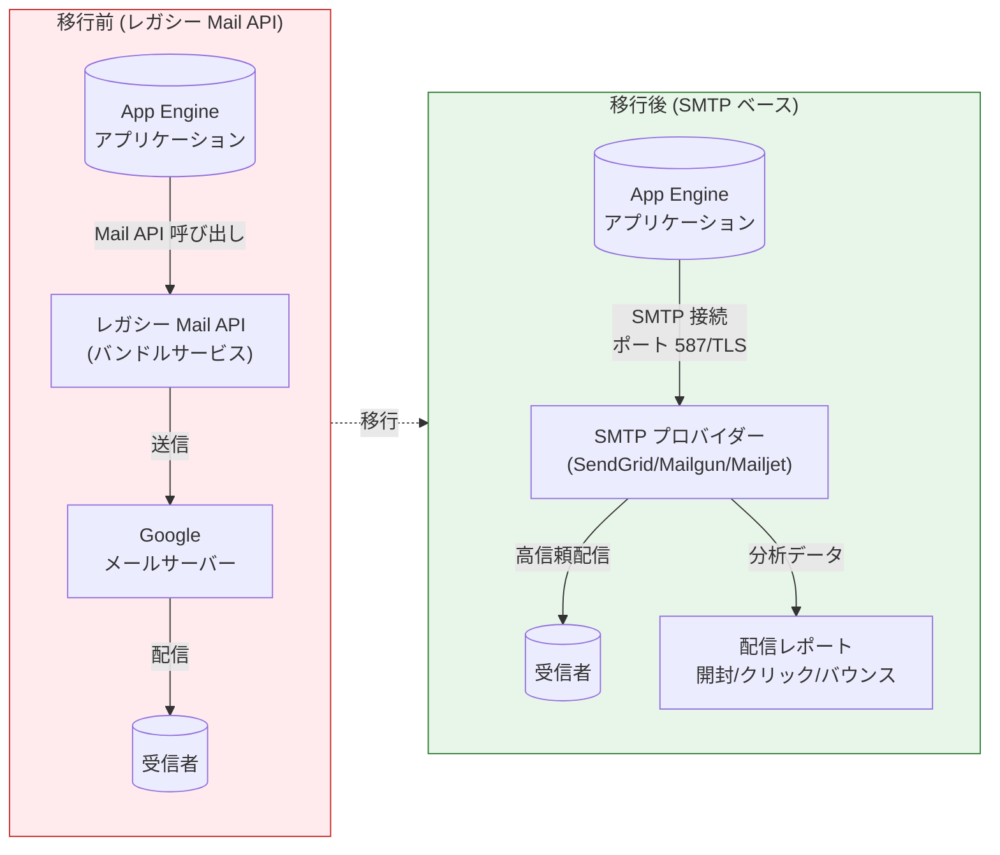

# App Engine Standard Environment: レガシー Mail API から SMTP ベースメールサービスへの移行サポートが GA

**リリース日**: 2026-03-02

**サービス**: App Engine Standard Environment (Java / Python)

**機能**: レガシー Mail API から SMTP ベースのメールサービスへの移行サポート

**ステータス**: General Availability (GA)

[このアップデートのインフォグラフィックを見る](https://takech9203.github.io/google-cloud-news-summary/20260302-app-engine-mail-api-smtp-migration-ga.html)

## 概要

App Engine Standard Environment において、レガシー Mail API から SMTP ベースのサードパーティメールサービス (SendGrid、Mailgun、Mailjet など) への移行サポートが General Availability (GA) となった。本アップデートは Java と Python の両ランタイムに適用される。

App Engine のレガシー Mail API は第一世代ランタイム (Python 2、Java 8 など) 時代から提供されてきたバンドルサービスの一つだが、機能面やメール配信品質に制限があった。今回の GA リリースにより、SMTP ベースの標準的なメールサービスへの移行パスが正式にサポートされ、環境変数の設定のみでシームレスに SMTP プロバイダーへ切り替えが可能になった。これにより、メール配信の信頼性向上、詳細な分析レポートへのアクセス、送信者レピュテーションの完全な制御が実現される。

本アップデートの対象ユーザーは、App Engine Standard Environment 上でレガシー Mail API を使用してメール送信を行っている Java および Python アプリケーションの開発者・運用者である。特に、レガシーバンドルサービスからの移行を計画している組織にとって重要なマイルストーンとなる。

**アップデート前の課題**

レガシー Mail API を使用している環境では、以下の課題が存在していた。

- レガシー Mail API はスパムとしてマークされるリスクが高く、メール配信の信頼性が低かった
- メールの開封率、クリック率、バウンス率などの詳細な分析レポートにアクセスできなかった
- 送信者レピュテーションやメール認証を自分で制御できなかった
- 日次送信数の上限が低く、A/B テスト、セグメンテーション、テンプレーティングなどの高度な機能が利用できなかった
- SMTP への移行パスが Preview 段階であり、本番環境での利用にリスクがあった

**アップデート後の改善**

今回の GA リリースにより、以下の改善が実現された。

- SMTP ベースのサービスにより、スパム判定が減少しメール配信の信頼性が大幅に向上した
- SendGrid、Mailgun、Mailjet などのプロバイダーが提供する詳細な分析レポート (開封、クリック、バウンス) にアクセス可能になった
- 送信者レピュテーションとメール認証を完全に制御できるようになった
- 日次送信制限が緩和され、A/B テスト、セグメンテーション、テンプレーティングなどの高度な機能が利用可能になった
- GA ステータスとなったことで、本番環境での利用が正式にサポートされ、SLA の対象となった

## アーキテクチャ図



レガシー Mail API を使用した従来のメール送信フローから、SMTP ベースのサードパーティプロバイダーを経由する新しいフローへの移行を示している。移行後は詳細な配信分析レポートも利用可能となる。

## サービスアップデートの詳細

### 主要機能

1. **環境変数ベースの SMTP 設定**
   - `APPENGINE_USE_SMTP_MAIL_SERVICE` を `true` に設定するだけで SMTP サービスが有効化される
   - SMTP ホスト、ポート、認証情報、TLS 設定を環境変数で管理
   - 既存のメール送信コードを変更せずにバックエンドのみを切り替え可能

2. **複数 SMTP プロバイダーのサポート**
   - SendGrid、Mailgun、Mailjet など標準的な SMTP プロバイダーに対応
   - SMTP プロトコルに準拠した任意のサードパーティプロバイダーを利用可能
   - プロバイダー固有の高度な機能 (A/B テスト、セグメンテーションなど) も活用可能

3. **Java / Python 両ランタイム対応**
   - Java: `appengine-web.xml` に環境変数を設定
   - Python: `app.yaml` に環境変数を設定
   - 管理者メール送信 (`send_mail_to_admins()`) 用の `APPENGINE_ADMIN_EMAIL_RECIPIENTS` 設定もサポート (Python)

4. **Secret Manager 連携の推奨**
   - SMTP パスワードや API キーの安全な管理に Secret Manager の利用が推奨されている
   - 設定ファイルへの直接記載を避け、セキュリティリスクを低減

## 技術仕様

### SMTP 環境変数

| 環境変数名 | 説明 | 例 |
|------|------|------|
| `APPENGINE_USE_SMTP_MAIL_SERVICE` | SMTP サービスの有効化スイッチ | `true` |
| `APPENGINE_SMTP_HOST` | SMTP サーバーアドレス | `smtp.sendgrid.net` |
| `APPENGINE_SMTP_PORT` | SMTP ポート番号 (TLS 推奨) | `587` |
| `APPENGINE_SMTP_USER` | SMTP ログインユーザー名 | `apikey` |
| `APPENGINE_SMTP_PASSWORD` | パスワードまたは API キー | Secret Manager 推奨 |
| `APPENGINE_SMTP_USE_TLS` | TLS の有効化 | `true` |
| `APPENGINE_ADMIN_EMAIL_RECIPIENTS` | 管理者メールの宛先 (Python のみ) | `admin@example.com` |

### 対応プロバイダー比較

| プロバイダー | SMTP ホスト | 特徴 |
|------|------|------|
| SendGrid | `smtp.sendgrid.net` | 大規模配信に強い、詳細な分析機能 |
| Mailgun | `smtp.mailgun.org` | API ファースト設計、開発者向け |
| Mailjet | `in-v3.mailjet.com` | リアルタイム監視、EU データセンター |

## 設定方法

### 前提条件

1. SMTP プロバイダー (SendGrid、Mailgun、Mailjet のいずれか) のアカウントが作成済みであること
2. SMTP 認証情報 (ホスト、ポート、ユーザー名、パスワード/API キー) を取得済みであること
3. 送信者ドメインまたはメールアドレスの認証 (DNS CNAME レコードの設定) が完了していること

### 手順

#### ステップ 1: SMTP プロバイダーのセットアップ

選択したプロバイダーでアカウントを作成し、以下の情報を取得する。

- SMTP ホストアドレス (例: `smtp.sendgrid.net`)
- ポート番号 (TLS 接続には `587` を推奨)
- SMTP ログインユーザー名
- パスワードまたは API キー

#### ステップ 2: 送信者 ID の認証

DNS プロバイダーの管理ページで、メールサービスプロバイダーから提供された CNAME レコードを追加する。

```
# DNS レコードの追加例 (プロバイダーにより異なる)
# Name/Host フィールド: プロバイダーが指定するホスト値
# Points/Value フィールド: プロバイダーが指定する値
```

DNS の変更が反映されるまで数時間かかる場合がある。認証に失敗した場合はしばらく待ってから再試行する。

#### ステップ 3: アプリケーションの設定 (Python)

`app.yaml` に SMTP 環境変数を追加する。

```yaml
runtime: python312  # サポートされている Python ランタイムバージョン

env_variables:
  # SMTP サービスの有効化
  APPENGINE_USE_SMTP_MAIL_SERVICE: "true"
  # SMTP サーバー設定
  APPENGINE_SMTP_HOST: "smtp.sendgrid.net"
  APPENGINE_SMTP_PORT: "587"
  APPENGINE_SMTP_USER: "apikey"
  APPENGINE_SMTP_PASSWORD: "YOUR_API_KEY"  # Secret Manager の利用を推奨
  APPENGINE_SMTP_USE_TLS: "true"
  # 管理者メール送信用 (send_mail_to_admins() を使用する場合)
  APPENGINE_ADMIN_EMAIL_RECIPIENTS: "admin@example.com,another-admin@example.com"
```

SDK を最新バージョンに更新する。

```bash
pip install --upgrade appengine-python-standard
pip freeze > requirements.txt
```

#### ステップ 4: アプリケーションの設定 (Java)

`pom.xml` に App Engine SDK の依存関係を追加する。

```xml
<dependency>
  <groupId>com.google.appengine</groupId>
  <artifactId>appengine-api-1.0-sdk</artifactId>
  <version>2.0.39-beta</version>
</dependency>
```

`appengine-web.xml` に SMTP 環境変数を追加する。

```xml
<appengine-web-app xmlns="http://appengine.google.com/ns/1.0">
  <runtime>java21</runtime>
  <service>default</service>
  <threadsafe>true</threadsafe>
  <app-engine-apis>true</app-engine-apis>
  <env-variables>
    <env-var name="APPENGINE_USE_SMTP_MAIL_SERVICE" value="true" />
    <env-var name="APPENGINE_SMTP_HOST" value="smtp.sendgrid.net" />
    <env-var name="APPENGINE_SMTP_PORT" value="587" />
    <env-var name="APPENGINE_SMTP_USER" value="apikey" />
    <env-var name="APPENGINE_SMTP_PASSWORD" value="YOUR_API_KEY" />
    <env-var name="APPENGINE_SMTP_USE_TLS" value="true" />
  </env-variables>
</appengine-web-app>
```

#### ステップ 5: デプロイとテスト

```bash
# Python の場合
gcloud app deploy

# Java の場合
mvn package appengine:deploy
```

デプロイ後、以下を確認する。
1. アプリケーションのメール送信機能をトリガーする
2. Cloud Logging の Logs Explorer でエラーがないことを確認する
3. SMTP プロバイダーのダッシュボードで配信ステータス (Processed / Delivered) を確認する

## メリット

### ビジネス面

- **メール到達率の向上**: SMTP ベースのサービスはスパム判定されにくく、重要な通知メールが確実に届く
- **詳細な分析**: 開封率、クリック率、バウンス率などの詳細なメトリクスにより、メールコミュニケーションの効果を測定可能
- **高度なマーケティング機能**: A/B テスト、セグメンテーション、テンプレーティングなどプロバイダーの高度な機能を活用可能

### 技術面

- **標準プロトコルの採用**: SMTP は業界標準のプロトコルであり、ベンダーロックインを回避できる
- **設定の簡便さ**: 環境変数の追加のみでメールバックエンドを切り替え可能で、アプリケーションコードの変更が不要
- **セキュリティ強化**: Secret Manager との連携により、認証情報を安全に管理。TLS 暗号化による通信の保護
- **GA による安定性**: Preview から GA に昇格したことで、本番環境での利用が正式にサポートされ、信頼性が保証される

## デメリット・制約事項

### 制限事項

- 本移行ガイドは送信メール (アウトバウンド) のみを対象としており、受信メール (インバウンド) のサードパーティ代替手段への移行手順は含まれていない
- SMTP プロバイダーのアカウント作成と送信者認証 (DNS レコード設定) が別途必要
- DNS の変更反映には数時間かかる場合がある

### 考慮すべき点

- SMTP プロバイダーの選定にあたっては、配信量、料金体系、サポートリージョン、コンプライアンス要件を比較検討する必要がある
- API キーやパスワードの管理には Secret Manager の利用が強く推奨される。`app.yaml` や `appengine-web.xml` への直接記載はセキュリティリスクとなる
- レガシー Mail API の `send_mail_to_admins()` 機能を使用している場合は、Python では `APPENGINE_ADMIN_EMAIL_RECIPIENTS` 環境変数で管理者メールアドレスを明示的に設定する必要がある
- Google Cloud はレガシーバンドルサービスからの移行を推奨しており、将来的なレガシー Mail API の廃止に備えて早期の移行を検討すべきである

## ユースケース

### ユースケース 1: トランザクションメールの移行

**シナリオ**: EC サイトの注文確認メール、パスワードリセットメールなど、レガシー Mail API を使用して送信していたトランザクションメールを SMTP ベースのサービスに移行する。

**実装例 (Python)**:
```yaml
# app.yaml
runtime: python312
env_variables:
  APPENGINE_USE_SMTP_MAIL_SERVICE: "true"
  APPENGINE_SMTP_HOST: "smtp.sendgrid.net"
  APPENGINE_SMTP_PORT: "587"
  APPENGINE_SMTP_USER: "apikey"
  APPENGINE_SMTP_PASSWORD: "SG.xxxxx"  # Secret Manager 推奨
  APPENGINE_SMTP_USE_TLS: "true"
```

**効果**: メール到達率が向上し、注文確認メールの未着による問い合わせが減少する。SendGrid のダッシュボードでリアルタイムに配信状況を監視できる。

### ユースケース 2: レガシーランタイムからの段階的移行

**シナリオ**: Python 2 / Java 8 のレガシーランタイムから第二世代ランタイムへの移行プロジェクトにおいて、Mail API を含むバンドルサービスの移行を段階的に進める。

**効果**: SMTP への移行はアプリケーションコードの変更が不要なため、ランタイム移行とは独立して進められる。移行リスクを分散し、段階的なモダナイゼーションが可能になる。

## 料金

SMTP への移行自体に App Engine 側での追加料金は発生しない。ただし、選択する SMTP プロバイダーの料金体系に従った課金が発生する。

### 主要プロバイダーの料金例

| プロバイダー | 無料枠 | 有料プラン開始価格 (概算) |
|--------|-----------------|-----------------|
| SendGrid | 100 通/日 | $19.95/月 (50,000 通) |
| Mailgun | 100 通/日 (Flex プラン) | $35/月 (50,000 通) |
| Mailjet | 200 通/日 (6,000 通/月) | $17/月 (15,000 通) |

App Engine Standard Environment 自体の料金は従来通りインスタンス時間ベースであり、無料枠 (F1 インスタンスで 28 時間/日) が提供されている。

## 利用可能リージョン

App Engine Standard Environment がサポートしている全リージョンで利用可能。SMTP プロバイダーへの接続はインターネット経由のため、リージョンによる制限はない。詳細は [App Engine のロケーション](https://cloud.google.com/appengine/docs/standard/locations) を参照。

## 関連サービス・機能

- **[Secret Manager](https://cloud.google.com/secret-manager)**: SMTP 認証情報 (API キー、パスワード) の安全な保管と取得に使用が推奨される
- **[Cloud Logging](https://cloud.google.com/logging)**: SMTP 接続や API 呼び出しに関するエラーログの確認に使用
- **[App Engine Migration Center](https://cloud.google.com/appengine/migration-center)**: レガシーバンドルサービス全体の移行ガイドを提供。Mail 以外にも Memcache、Blobstore、Task Queue などの移行パスが用意されている
- **[Cloud Run](https://cloud.google.com/run)**: Google Cloud が推奨する次世代のアプリケーションホスティングプラットフォーム。App Engine からの移行先としても検討可能

## 参考リンク

- [インフォグラフィック](https://takech9203.github.io/google-cloud-news-summary/20260302-app-engine-mail-api-smtp-migration-ga.html)
- [公式リリースノート](https://docs.cloud.google.com/release-notes#March_02_2026)
- [移行ガイド (Java)](https://docs.cloud.google.com/appengine/migration-center/standard/java/mail-to-smtp)
- [移行ガイド (Python)](https://docs.cloud.google.com/appengine/migration-center/standard/python/mail-to-smtp)
- [レガシーバンドルサービスの概要](https://cloud.google.com/appengine/docs/standard/bundled-services-overview)
- [レガシーバンドルサービスからの移行ガイド](https://cloud.google.com/appengine/migration-center/standard/services/migrating-services)
- [App Engine 料金ページ](https://cloud.google.com/appengine/pricing)
- [Secret Manager クイックスタート](https://cloud.google.com/secret-manager/docs/create-secret-quickstart)

## まとめ

App Engine Standard Environment のレガシー Mail API から SMTP ベースメールサービスへの移行サポートが GA となったことで、メール配信の信頼性向上、詳細な分析、高度なメール機能の利用が本番環境で正式にサポートされた。レガシー Mail API を使用中のアプリケーション開発者は、環境変数の設定のみで SendGrid、Mailgun、Mailjet などの SMTP プロバイダーに切り替えが可能であるため、レガシーバンドルサービスからの移行計画の一環として早期の対応を推奨する。

---

**タグ**: #AppEngine #Mail #SMTP #Migration #GA #Java #Python #SendGrid #Mailgun #Mailjet #LegacyBundledServices
